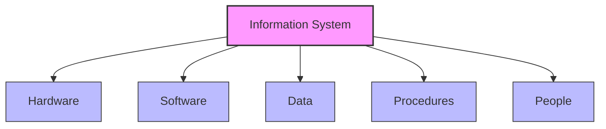
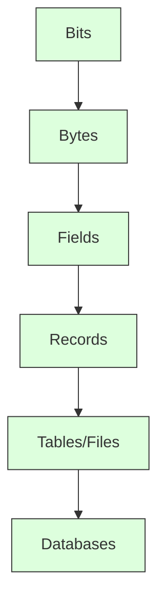
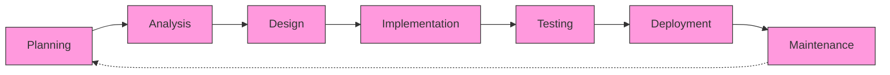

# Information Systems Overview

## Introduction

Information systems (IS) are integrated sets of components that collect, process, store, and distribute information to support decision-making, coordination, control, and analysis within an organization. In today's digital world, information systems form the backbone of virtually every modern business and organization.

Whether you're checking your bank account online, ordering food through an app, or collaborating on a document with colleagues, you're interacting with information systems. Understanding how these systems work is essential for anyone entering the field of programming or information technology.

## Core Components of Information Systems

Information systems consist of five main components that work together:



### 1. Hardware

Hardware refers to the physical components of an information system:

- **Computers**: Desktops, laptops, servers, and mainframes
- **Peripheral devices**: Printers, scanners, and external storage
- **Networking equipment**: Routers, switches, and cables

For example, a university's registration system runs on servers housed in a data center, with students accessing it through various devices like laptops or smartphones.

### 2. Software

Software consists of programs that control and coordinate the hardware components:

- **System software**: Operating systems (Windows, macOS, Linux), utilities, device drivers
- **Application software**: Word processors, spreadsheets, accounting programs, custom applications
- **Middleware**: Software that connects different applications and systems

Here's a simple example of how software might interact with hardware:

```javascript
// Example of JavaScript code that might be part of a web-based information system
function fetchUserData(userId) {
  return fetch(`https://api.example.com/users/${userId}`)
    .then(response => response.json())
    .then(data => {
      console.log("User data retrieved:", data);
      return data;
    })
    .catch(error => {
      console.error("Error fetching user data:", error);
    });
}

// Usage
fetchUserData(12345).then(userData => {
  displayUserProfile(userData);
});
```

### 3. Data

Data is the raw material that information systems transform into useful information:

- **Structured data**: Organized in databases with defined relationships
- **Unstructured data**: Emails, documents, videos, social media posts
- **Metadata**: Data about data (file size, creation date, author)

Data typically follows a hierarchy:



Here's an example of how data might be structured in a database table:

```sql
-- Example of SQL to create a simple table in a database
CREATE TABLE customers (
  customer_id INT PRIMARY KEY,
  first_name VARCHAR(50),
  last_name VARCHAR(50),
  email VARCHAR(100) UNIQUE,
  registration_date DATE,
  membership_level VARCHAR(20)
);

-- Example of inserting data into the table
INSERT INTO customers VALUES (
  1001, 
  'John', 
  'Smith', 
  'john.smith@example.com', 
  '2023-01-15', 
  'Premium'
);
```

### 4. Procedures

Procedures are the rules, policies, and instructions for using the information system:

- User manuals and documentation
- Business processes and workflows
- Data entry and validation rules
- Security protocols and access control policies

For example, a procedure might define how customer data should be collected, validated, and stored in a retail information system.

### 5. People

People are the most important component of any information system:

- **End users**: Those who use the system to perform tasks
- **System analysts**: Professionals who design and implement systems
- **Developers**: Programmers who create software components
- **System administrators**: Personnel who maintain and support the system

## Types of Information Systems

Information systems come in various types, each serving different organizational needs:

### Transaction Processing Systems (TPS)

These systems handle day-to-day operational data processing and maintain records of business transactions.

**Example**: A point-of-sale (POS) system in a retail store processes sales transactions, updates inventory, and records customer information.

```javascript
// Simplified example of a transaction processing function
function processSaleTransaction(items, paymentMethod, customerId) {
  // Validate items in stock
  if (!checkInventory(items)) {
    return { success: false, message: "Some items are out of stock" };
  }
  
  // Process payment
  const paymentResult = processPayment(calculateTotal(items), paymentMethod);
  if (!paymentResult.success) {
    return { success: false, message: "Payment failed" };
  }
  
  // Update inventory
  updateInventory(items);
  
  // Record transaction in database
  const transactionId = recordTransaction(items, paymentMethod, customerId);
  
  // Generate receipt
  const receipt = generateReceipt(transactionId, items, paymentResult);
  
  return { 
    success: true, 
    transactionId: transactionId,
    receipt: receipt 
  };
}
```

### Management Information Systems (MIS)

MIS transform data from TPS into reports for monitoring, controlling, and decision-making by management.

**Example**: Monthly sales reports that compare current performance against targets and historical data.

### Decision Support Systems (DSS)

DSS assist management in making semi-structured decisions by analyzing available data and suggesting alternatives.

**Example**: A supply chain optimization system that suggests the best distribution routes based on various factors like cost, distance, and delivery time.

### Executive Information Systems (EIS)

EIS provide high-level, strategic information to top management in an accessible format.

**Example**: Dashboards showing key performance indicators (KPIs) across different business units.

```javascript
// Example of code that might be used to generate KPI data for an EIS
function generateExecutiveDashboard(timeframe) {
  const dashboard = {
    salesMetrics: {},
    financialMetrics: {},
    operationalMetrics: {},
    customerMetrics: {}
  };
  
  // Gather sales metrics
  dashboard.salesMetrics = {
    totalRevenue: calculateRevenue(timeframe),
    salesByRegion: getRegionalSales(timeframe),
    topProducts: getTopSellingProducts(timeframe, 5),
    salesGrowth: calculateSalesGrowth(timeframe)
  };
  
  // Gather financial metrics
  dashboard.financialMetrics = {
    grossProfit: calculateGrossProfit(timeframe),
    netProfit: calculateNetProfit(timeframe),
    cashFlow: getCashFlowAnalysis(timeframe),
    expenseBreakdown: getExpenseCategories(timeframe)
  };
  
  // Additional metrics calculation...
  
  return dashboard;
}
```

### Expert Systems

Expert systems capture and apply the knowledge of human experts to solve specific problems.

**Example**: A medical diagnosis system that suggests possible conditions based on symptoms and patient history.

### Knowledge Management Systems

These systems collect, organize, and share organizational knowledge and expertise.

**Example**: A corporate wiki that contains best practices, procedures, and institutional knowledge.

## The System Development Life Cycle (SDLC)

Information systems are typically developed following a structured approach called the System Development Life Cycle (SDLC):



1. **Planning**: Define project scope, objectives, and constraints
2. **Analysis**: Gather requirements and understand user needs
3. **Design**: Create technical specifications for the system
4. **Implementation**: Develop the software and hardware components
5. **Testing**: Verify that the system works as expected
6. **Deployment**: Roll out the system to users
7. **Maintenance**: Update and improve the system throughout its lifecycle

## Real-World Applications

Let's explore some practical examples of information systems in different domains:

### E-commerce Systems

Amazon's platform is a sophisticated information system that integrates:
- Product catalog databases
- Order processing systems
- Inventory management
- Recommendation engines
- Payment processing
- Customer relationship management

All these components work together to provide a seamless shopping experience.

### Healthcare Information Systems

Modern hospitals use integrated information systems that include:
- Electronic Health Records (EHR)
- Laboratory Information Systems
- Pharmacy Management Systems
- Appointment Scheduling
- Billing and Insurance Processing

These systems improve patient care by providing accurate information at the point of need.

### Banking Systems

Banking information systems handle:
- Account management
- Transaction processing
- Loan approval workflows
- Investment tracking
- Fraud detection
- Regulatory compliance

These systems must maintain high security and availability standards due to the sensitive nature of financial data.

## Challenges in Information Systems

Despite their benefits, information systems face several challenges:

### Security

Information systems are prime targets for cyberattacks:

```javascript
// Example of basic security implementation (simplified)
function authenticateUser(username, password) {
  // Never store passwords in plain text in a real system
  const hashedPassword = hashPassword(password);
  
  // Check against stored credentials
  return database.query(
    "SELECT * FROM users WHERE username = ? AND password_hash = ?",
    [username, hashedPassword]
  ).then(result => {
    if (result.length > 0) {
      // Generate session token
      const token = generateSecureToken();
      
      // Log successful login attempt
      logActivity(username, "login", "success");
      
      return { authenticated: true, token: token };
    } else {
      // Log failed login attempt
      logActivity(username, "login", "failure");
      
      return { authenticated: false };
    }
  });
}
```

### Integration

Organizations often have multiple systems that need to work together:

- Legacy systems may use outdated technologies
- Different departments may use separate systems
- External partners may have incompatible systems

### Data Quality

Information systems are only as good as the data they contain:

- Data entry errors
- Duplicate records
- Inconsistent formats
- Outdated information

### Scalability

As organizations grow, their information systems must scale to handle increased:

- User load
- Transaction volume
- Data storage requirements

## Future Trends

The field of information systems continues to evolve with emerging technologies:

### Artificial Intelligence and Machine Learning

AI is transforming information systems by:
- Automating routine tasks
- Providing predictive analytics
- Enhancing decision support
- Improving user interfaces through natural language processing

### Cloud Computing

Cloud-based information systems offer:
- Reduced infrastructure costs
- Scalability on demand
- Global accessibility
- Built-in redundancy and disaster recovery

### Internet of Things (IoT)

IoT expands information systems beyond traditional computing devices:
- Connected sensors and devices
- Real-time data collection
- Automated responses to environmental changes

### Blockchain

Blockchain technology is being integrated into information systems for:
- Secure transactions
- Transparent supply chains
- Immutable record-keeping

## Summary

Information systems are essential components of modern organizations, combining hardware, software, data, procedures, and people to collect, process, store, and distribute information. They come in various types, each serving different organizational needs, from handling day-to-day transactions to supporting strategic decision-making.

The development of information systems follows a structured approach known as the System Development Life Cycle, which ensures that systems meet user requirements and organizational objectives. While information systems offer numerous benefits, they also face challenges related to security, integration, data quality, and scalability.

As technology continues to evolve, information systems will incorporate emerging trends like artificial intelligence, cloud computing, Internet of Things, and blockchain, further transforming how organizations operate and compete in the digital economy.

## Additional Resources

To deepen your understanding of information systems, consider exploring:

1. **Online Courses**: Platforms like Coursera, edX, and Khan Academy offer courses on information systems fundamentals.

2. **Books**:
   - "Fundamentals of Information Systems" by Ralph Stair and George Reynolds
   - "Management Information Systems: Managing the Digital Firm" by Kenneth Laudon and Jane Laudon

3. **Practice Exercises**:
   - Design a simple information system for a small business
   - Analyze an existing information system you use regularly
   - Create a data flow diagram for a common process like online shopping

## Practice Exercises

1. **Conceptual Understanding**:
   - Identify the five components of an information system in a system you use regularly (e.g., a banking app).
   - Classify the following systems: a hospital patient management system, a stock trading platform, a university course registration system.

2. **Technical Exercise**:
   - Design a simple database schema for a library management system with tables for books, members, and loans.
   - Create a flowchart for a basic e-commerce checkout process.

3. **Analytical Challenge**:
   - Analyze a well-known information system failure case study (e.g., Healthcare.gov initial launch).
   - Identify potential security vulnerabilities in a hypothetical online banking system.