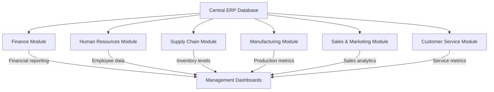
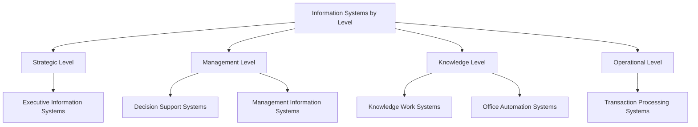
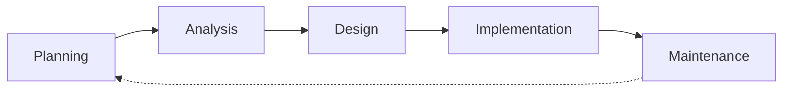

# Types of Information Systems

## Introduction

Information systems (IS) are integrated sets of components that collect, process, store, and distribute information to support decision-making, coordination, control, analysis, and visualization in an organization. Understanding the different types of information systems is crucial for any programmer or IT professional as it provides context for software development projects and helps align technical solutions with business needs.

In this guide, we'll explore the major categories of information systems, their purposes, components, and real-world applications. Whether you're designing databases, developing applications, or simply trying to understand how your code fits into the bigger organizational picture, this knowledge will prove invaluable.

## Common Types of Information Systems

### 1. Transaction Processing Systems (TPS)

Transaction Processing Systems are the fundamental operational systems that serve the operational level of an organization. They perform and record daily routine transactions necessary to conduct business.

#### Key Characteristics:
- Process high volumes of routine transactions
- Produce detailed operational data
- Serve as the backbone for higher-level systems
- Require high availability and reliability
- Focus on data accuracy and integrity

#### Real-World Example:
A point-of-sale (POS) system at a retail store processes customer purchases, updates inventory, and records sales data. Each transaction must be accurate, reliable, and processed quickly.

```javascript
// Example: Simple JavaScript snippet representing a transaction in a POS system
function processTransaction(items, paymentMethod) {
  // Calculate total
  let total = items.reduce((sum, item) => sum + item.price * item.quantity, 0);
  
  // Apply taxes
  let tax = total * 0.08; // 8% tax rate
  let grandTotal = total + tax;
  
  // Record transaction
  const transaction = {
    id: generateTransactionId(),
    timestamp: new Date(),
    items: items,
    subtotal: total,
    tax: tax,
    grandTotal: grandTotal,
    paymentMethod: paymentMethod,
    status: 'completed'
  };
  
  // Update inventory and financial records
  updateInventory(items);
  recordSale(transaction);
  
  return transaction;
}

// Sample input
const cartItems = [
  { id: 'P001', name: 'Keyboard', price: 49.99, quantity: 1 },
  { id: 'P002', name: 'Mouse', price: 29.99, quantity: 2 }
];

// Sample output
// {
//   id: 'T12345',
//   timestamp: '2025-03-18T10:30:45.123Z',
//   items: [
//     { id: 'P001', name: 'Keyboard', price: 49.99, quantity: 1 },
//     { id: 'P002', name: 'Mouse', price: 29.99, quantity: 2 }
//   ],
//   subtotal: 109.97,
//   tax: 8.80,
//   grandTotal: 118.77,
//   paymentMethod: 'credit',
//   status: 'completed'
// }
```

### 2. Management Information Systems (MIS)

Management Information Systems serve the management level of an organization, providing managers with reports and access to the organization's current performance and historical records.

#### Key Characteristics:
- Generate periodic reports
- Support structured decision-making
- Primarily use internal data sources
- Focus on summarization and comparison
- Provide medium to long-term insights

#### Real-World Example:
A sales management system that provides weekly and monthly sales reports by region, product category, and sales representative, helping managers track performance against targets.

```python
# Example: Python function for generating a basic sales report
def generate_sales_report(sales_data, period="weekly", region=None):
    """
    Generate sales report based on period and optional region filter
    
    Parameters:
    sales_data (list): List of sales transaction records
    period (str): "daily", "weekly", "monthly", or "quarterly"
    region (str): Optional region filter
    
    Returns:
    dict: Sales report with aggregated metrics
    """
    # Filter by region if specified
    if region:
        filtered_data = [sale for sale in sales_data if sale['region'] == region]
    else:
        filtered_data = sales_data
    
    # Group and aggregate data by appropriate time period
    report = {
        'period': period,
        'region': region if region else 'All Regions',
        'total_sales': sum(sale['amount'] for sale in filtered_data),
        'average_order_value': sum(sale['amount'] for sale in filtered_data) / len(filtered_data) if filtered_data else 0,
        'top_products': get_top_products(filtered_data, limit=5),
        'sales_by_rep': get_sales_by_rep(filtered_data)
    }
    
    return report

# Sample input: List of sales transactions
# Sample output: Organized report with aggregated metrics
```

### 3. Decision Support Systems (DSS)

Decision Support Systems assist management in making semi-structured or unstructured business decisions. They combine data, sophisticated analytical models, and user-friendly interfaces.

#### Key Characteristics:
- Support complex problem-solving
- Offer interactive analysis and modeling
- Allow "what-if" scenario planning
- Combine internal and external data sources
- Adapt to changing user needs

#### Real-World Example:
A financial planning DSS that helps investment analysts evaluate different investment scenarios based on various economic factors, risk profiles, and market conditions.

```python
# Example: Simple Python DSS for investment portfolio analysis
def analyze_portfolio_scenario(investments, market_conditions, risk_tolerance):
    """
    Analyze investment portfolio under different market scenarios
    
    Parameters:
    investments (dict): Current investment allocation
    market_conditions (str): "bull", "bear", or "stable"
    risk_tolerance (float): Risk tolerance factor (0.0-1.0)
    
    Returns:
    dict: Projected portfolio performance
    """
    # Define market condition factors
    market_factors = {
        "bull": {"stocks": 0.12, "bonds": 0.05, "cash": 0.02, "volatility": 0.18},
        "bear": {"stocks": -0.08, "bonds": 0.03, "cash": 0.01, "volatility": 0.22},
        "stable": {"stocks": 0.07, "bonds": 0.04, "cash": 0.02, "volatility": 0.10}
    }
    
    factors = market_factors[market_conditions]
    
    # Calculate expected returns and risk
    expected_return = (
        factors["stocks"] * investments["stocks"] +
        factors["bonds"] * investments["bonds"] +
        factors["cash"] * investments["cash"]
    )
    
    portfolio_risk = factors["volatility"] * (
        (investments["stocks"] * 1.2) + 
        (investments["bonds"] * 0.8) + 
        (investments["cash"] * 0.2)
    )
    
    # Adjust based on risk tolerance
    risk_adjusted_return = expected_return * (1 - (portfolio_risk * (1 - risk_tolerance)))
    
    return {
        "scenario": market_conditions,
        "expected_return": expected_return,
        "portfolio_risk": portfolio_risk,
        "risk_adjusted_return": risk_adjusted_return,
        "recommendation": generate_recommendation(risk_adjusted_return, risk_tolerance, market_conditions)
    }

# Sample input:
# investments = {"stocks": 0.6, "bonds": 0.3, "cash": 0.1}
# market_conditions = "bull"
# risk_tolerance = 0.7

# Sample output:
# {
#   "scenario": "bull",
#   "expected_return": 0.089,
#   "portfolio_risk": 0.1584,
#   "risk_adjusted_return": 0.0841,
#   "recommendation": "Maintain current allocation with slight increase in stocks."
# }
```

### 4. Executive Information Systems (EIS)

Executive Information Systems serve the strategic level of management, providing senior executives with data and tools to make strategic decisions.

#### Key Characteristics:
- Present highly summarized data
- Offer drill-down capabilities
- Include external data sources
- Feature visual dashboards and reports
- Focus on trends and forecasts

#### Real-World Example:
A corporate performance dashboard providing CEOs and executives with KPIs across all business units, market trends, competitor analysis, and strategic goal tracking.

```javascript
// Example: Dashboard data preparation for an EIS
function prepareExecutiveDashboard(businessUnits, timeframe = 'quarterly') {
  const dashboard = {
    companyOverview: {
      revenue: calculateTotalRevenue(businessUnits),
      profitMargin: calculateAverageProfitMargin(businessUnits),
      marketShare: calculateMarketShare(businessUnits),
      yearOverYearGrowth: calculateYoYGrowth(businessUnits, timeframe)
    },
    businessUnitPerformance: businessUnits.map(unit => ({
      name: unit.name,
      revenueContribution: unit.revenue / calculateTotalRevenue(businessUnits),
      performanceVsTarget: unit.actualPerformance / unit.targetPerformance,
      keyMetrics: unit.keyMetrics
    })),
    marketAnalysis: {
      trends: getMarketTrends(timeframe),
      competitorBenchmark: benchmarkAgainstCompetitors(businessUnits),
      opportunities: identifyOpportunities(businessUnits, getMarketTrends(timeframe))
    },
    strategicInitiatives: getStrategicInitiativesStatus()
  };
  
  return dashboard;
}
```

### 5. Enterprise Resource Planning (ERP) Systems

Enterprise Resource Planning systems are integrated systems that manage all aspects of a business across departments and functions.

#### Key Characteristics:
- Integrate business processes
- Maintain a centralized database
- Enable real-time data sharing
- Standardize operations
- Provide cross-functional insights

#### Real-World Example:
SAP and Oracle ERP systems used by large corporations to integrate finance, HR, manufacturing, supply chain, and customer relationship processes.



### 6. Customer Relationship Management (CRM) Systems

Customer Relationship Management systems focus on managing an organization's interactions with current and potential customers.

#### Key Characteristics:
- Track customer interactions
- Manage sales pipelines
- Support marketing campaigns
- Enhance customer service
- Analyze customer data

#### Real-World Example:
Salesforce CRM allowing sales teams to track leads, opportunities, and customer communications while marketing teams use the same system to manage campaigns and measure effectiveness.

```javascript
// Example: Simple customer interaction tracking in a CRM
class CustomerInteraction {
  constructor(customerId, type, channel, content, timestamp = new Date()) {
    this.customerId = customerId;
    this.type = type; // email, call, meeting, social, support
    this.channel = channel;
    this.content = content;
    this.timestamp = timestamp;
    this.followUpRequired = false;
    this.followUpDate = null;
    this.resolved = false;
  }
  
  requireFollowUp(date) {
    this.followUpRequired = true;
    this.followUpDate = date;
  }
  
  markResolved() {
    this.resolved = true;
  }
  
  toJSON() {
    return {
      customerId: this.customerId,
      type: this.type,
      channel: this.channel,
      content: this.content,
      timestamp: this.timestamp,
      followUpRequired: this.followUpRequired,
      followUpDate: this.followUpDate,
      resolved: this.resolved
    };
  }
}

// Usage in a CRM system
function recordCustomerInteraction(customer, interactionType, channel, content) {
  const interaction = new CustomerInteraction(
    customer.id,
    interactionType,
    channel,
    content
  );
  
  // Store in CRM database
  database.interactions.add(interaction);
  
  // Update customer record with last contact
  customer.lastContactDate = interaction.timestamp;
  customer.lastContactChannel = interaction.channel;
  database.customers.update(customer);
  
  // Trigger any necessary workflows
  if (interactionType === 'complaint') {
    triggerEscalationWorkflow(interaction, customer);
  }
  
  return interaction;
}
```

### 7. Supply Chain Management (SCM) Systems

Supply Chain Management systems coordinate the movement of products and services from suppliers to customers.

#### Key Characteristics:
- Track inventory and logistics
- Manage supplier relationships
- Forecast demand
- Optimize distribution
- Enhance collaboration

#### Real-World Example:
A manufacturing company's SCM system that tracks raw materials from suppliers, manages production scheduling, monitors inventory levels, and coordinates product distribution to retailers.

```python
# Example: Basic inventory management in an SCM system
class InventoryItem:
    def __init__(self, item_id, name, category, unit_cost, reorder_point, reorder_quantity):
        self.item_id = item_id
        self.name = name
        self.category = category
        self.unit_cost = unit_cost
        self.quantity_on_hand = 0
        self.quantity_on_order = 0
        self.reorder_point = reorder_point
        self.reorder_quantity = reorder_quantity
        self.suppliers = []
    
    def add_supplier(self, supplier, lead_time, preference_rank=1):
        self.suppliers.append({
            "supplier": supplier,
            "lead_time": lead_time,  # in days
            "preference_rank": preference_rank
        })
        self.suppliers.sort(key=lambda x: x["preference_rank"])
    
    def needs_reorder(self):
        return (self.quantity_on_hand + self.quantity_on_order) <= self.reorder_point
    
    def create_purchase_order(self):
        if not self.needs_reorder() or not self.suppliers:
            return None
        
        preferred_supplier = self.suppliers[0]["supplier"]
        lead_time = self.suppliers[0]["lead_time"]
        
        po = {
            "item_id": self.item_id,
            "supplier": preferred_supplier,
            "quantity": self.reorder_quantity,
            "expected_delivery": datetime.now() + timedelta(days=lead_time),
            "status": "pending"
        }
        
        self.quantity_on_order += self.reorder_quantity
        return po
```

### 8. Knowledge Management Systems (KMS)

Knowledge Management Systems support the creation, capture, storage, and sharing of knowledge and information within an organization.

#### Key Characteristics:
- Capture organizational knowledge
- Facilitate collaboration
- Support content management
- Enable knowledge discovery
- Preserve institutional memory

#### Real-World Example:
A corporate wiki or knowledge base that allows employees to document processes, share best practices, and search for solutions to common problems.

```javascript
// Example: Basic knowledge base article in a KMS
class KnowledgeArticle {
  constructor(title, content, author) {
    this.id = generateUniqueId();
    this.title = title;
    this.content = content;
    this.author = author;
    this.createdDate = new Date();
    this.lastUpdated = new Date();
    this.tags = [];
    this.categories = [];
    this.views = 0;
    this.helpfulVotes = 0;
    this.unhelpfulVotes = 0;
    this.relatedArticles = [];
  }
  
  addTag(tag) {
    if (!this.tags.includes(tag)) {
      this.tags.push(tag);
    }
  }
  
  addCategory(category) {
    if (!this.categories.includes(category)) {
      this.categories.push(category);
    }
  }
  
  updateContent(newContent, editor) {
    // Store previous version in history
    this.history = this.history || [];
    this.history.push({
      content: this.content,
      lastUpdated: this.lastUpdated,
      editor: this.lastEditor
    });
    
    // Update with new content
    this.content = newContent;
    this.lastUpdated = new Date();
    this.lastEditor = editor;
  }
  
  recordView() {
    this.views++;
  }
  
  vote(helpful) {
    if (helpful) {
      this.helpfulVotes++;
    } else {
      this.unhelpfulVotes++;
    }
  }
  
  get helpfulnessScore() {
    const total = this.helpfulVotes + this.unhelpfulVotes;
    return total > 0 ? (this.helpfulVotes / total) : 0;
  }
}
```

## Different Perspectives on Information Systems

Information systems can also be categorized based on organizational level, functional area, or support provided:

### By Organizational Level



1. **Strategic Level Systems** - Support senior management in long-term planning decisions
2. **Management Level Systems** - Support middle managers in tactical decisions
3. **Knowledge Level Systems** - Support knowledge workers in data analysis and document creation
4. **Operational Level Systems** - Support daily operational activities and transactions

### By Functional Area

1. **Accounting IS** - Manage financial transactions and reporting
2. **Finance IS** - Support financial analysis and portfolio management
3. **Human Resources IS** - Manage employee records and HR processes
4. **Marketing IS** - Support market analysis and campaign management
5. **Production/Operations IS** - Support manufacturing and operations processes

### By Type of Support Provided

1. **Office Automation Systems** - Support day-to-day office activities
2. **Communication Systems** - Facilitate communication and collaboration
3. **Business Intelligence Systems** - Support data analysis and insights
4. **Expert Systems** - Provide domain-specific knowledge and recommendations

## Information Systems Development

Developing information systems typically follows a systematic approach:

1. **Systems Planning** - Identify needs and establish feasibility
2. **Systems Analysis** - Gather requirements and model current/desired system
3. **Systems Design** - Create detailed specifications for the new system
4. **Systems Implementation** - Build, test, and deploy the system
5. **Systems Maintenance** - Monitor, evaluate, and enhance the system



## Integration of Information Systems

Modern organizations rarely have standalone information systems. Instead, they integrate multiple systems to create a comprehensive information architecture:

- **Vertical Integration** - Connecting systems across different organizational levels
- **Horizontal Integration** - Connecting systems across different functional areas
- **Enterprise Application Integration (EAI)** - Using middleware to connect disparate systems
- **Service-Oriented Architecture (SOA)** - Building systems as collections of interoperable services

## Real-World Applications

Let's explore how different information systems work together in a typical e-commerce business:

1. **Transaction Processing Systems (TPS)** process customer orders, manage inventory, and handle payments.

2. **Customer Relationship Management (CRM)** tracks customer data, purchase history, and support interactions.

3. **Supply Chain Management (SCM)** manages relationships with suppliers, tracks shipments, and monitors inventory levels.

4. **Management Information Systems (MIS)** generate reports on sales, inventory, and customer trends for managers.

5. **Decision Support Systems (DSS)** help marketing managers determine pricing strategies and product promotions.

6. **Enterprise Resource Planning (ERP)** integrates all these systems to provide a complete view of the business.

Here's a simplified example of how these systems might interact when a customer places an order:

```javascript
// Example: E-commerce order flow across multiple information systems
function processCustomerOrder(order, customer) {
  // TPS: Process the transaction
  const transaction = transactionSystem.createOrder({
    customerId: customer.id,
    items: order.items,
    paymentDetails: order.payment,
    shippingAddress: order.shippingAddress
  });
  
  // Update inventory in real-time
  inventorySystem.decrementStock(order.items);
  
  // CRM: Update customer information
  crmSystem.recordPurchase(customer.id, transaction.id, order.items);
  
  // SCM: Check inventory levels and reorder if necessary
  const lowStockItems = inventorySystem.checkReorderLevels();
  if (lowStockItems.length > 0) {
    scmSystem.createPurchaseOrders(lowStockItems);
  }
  
  // ERP: Update financial records
  erpSystem.recordSale({
    transactionId: transaction.id,
    revenue: transaction.total,
    cost: calculateCost(order.items),
    date: transaction.timestamp
  });
  
  // MIS: This data will appear in management reports
  
  // DSS: This purchase data feeds into analytics for future decision making
  
  return {
    orderId: transaction.id,
    status: 'confirmed',
    estimatedDelivery: calculateEstimatedDelivery(order.shippingAddress, order.items)
  };
}
```

## Emerging Trends in Information Systems

Several technological trends are shaping the future of information systems:

1. **Cloud Computing** - Moving from on-premises systems to cloud-based solutions
2. **Big Data Analytics** - Processing and analyzing large volumes of structured and unstructured data
3. **Artificial Intelligence and Machine Learning** - Enhancing systems with predictive capabilities and automation
4. **Internet of Things (IoT)** - Connecting physical devices to information systems
5. **Blockchain** - Providing secure, transparent transaction records
6. **Mobile Computing** - Accessing information systems through mobile devices
7. **Edge Computing** - Processing data closer to where it's generated

## Summary

Information systems are the backbone of modern organizations, supporting everything from daily transactions to strategic decision-making. The different types of information systems—TPS, MIS, DSS, EIS, ERP, CRM, SCM, and KMS—serve different organizational needs and levels.

Understanding these systems helps developers create solutions that meet business requirements and integrate effectively with existing infrastructure. As technology evolves, information systems continue to transform, offering new opportunities for innovation and competitive advantage.

## Exercises and Learning Activities

1. **Analysis Exercise**: Identify the different types of information systems used in a company you're familiar with. How do they support the organization's operations and decision-making?

2. **Design Challenge**: Design a simple Transaction Processing System for a small online store. What data would it collect? What reports would it generate?

3. **Integration Project**: Create a basic prototype that demonstrates how a CRM system might integrate with an ERP system. What data would flow between them?

4. **Case Study**: Research how a specific company (e.g., Amazon, Walmart, or a local business) uses information systems to gain competitive advantage.

5. **Future Trends**: Explore how emerging technologies like AI or blockchain might transform a specific type of information system in the next five years.

## Additional Resources

- **Books**: "Management Information Systems" by Kenneth Laudon and Jane Laudon
- **Online Courses**: Look for courses on information systems on platforms like Coursera, edX, or Udemy
- **Professional Organizations**: Association for Information Systems (AIS)
- **Academic Journals**: MIS Quarterly, Journal of Management Information Systems