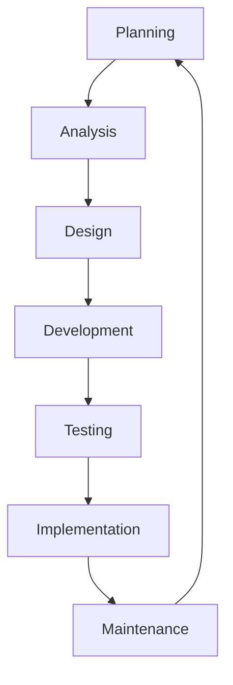
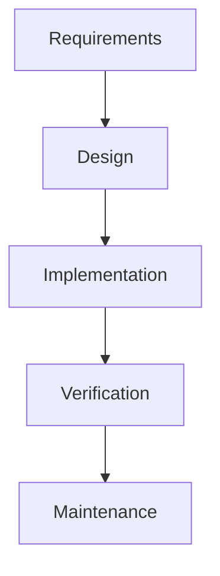
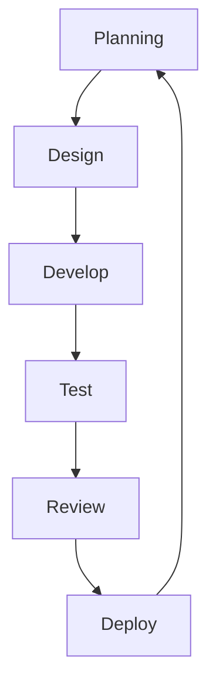

# Information Systems Development

## Introduction

Information Systems Development is the structured process of creating, implementing, and maintaining computer-based information systems that support business operations and decision-making. It bridges the gap between business needs and technological solutions, transforming requirements into functional systems that store, process, and deliver information.

For beginners entering the world of programming, understanding information systems development provides essential context about how individual coding tasks fit into larger organizational goals and processes.

## What is an Information System?

Before diving into development, let's clarify what an information system actually is:

An information system is a coordinated network of components that work together to collect, process, store, and disseminate information to support decision-making, coordination, control, analysis, and visualization in an organization.

These components include:

- **Hardware**: Physical devices (computers, servers, networks)
- **Software**: Programs and applications
- **Data**: Raw facts and figures
- **Procedures**: Documented processes and instructions
- **People**: Users, developers, and stakeholders
- **Communication networks**: Systems that connect components

## The Systems Development Life Cycle (SDLC)

Information systems development typically follows a structured approach called the Systems Development Life Cycle (SDLC). This provides a framework to ensure that development projects deliver quality systems that meet requirements on time and within budget.



Let's examine each phase:

### 1. Planning

This initial phase involves:
- Identifying the need for a new or improved system
- Defining project scope and objectives
- Conducting feasibility studies (technical, economic, operational)
- Allocating resources (time, budget, personnel)
- Creating a project plan

**Example**: A retail company wants to replace its outdated inventory management system. During planning, they determine the project will take 6 months, require 4 developers, and cost approximately $200,000.

### 2. Analysis

The analysis phase focuses on:
- Gathering detailed requirements from stakeholders
- Documenting business processes and data flows
- Identifying system constraints and limitations
- Creating use cases and user stories

**Code Example**: Documenting a use case in pseudocode

```
USE CASE: Process Customer Order
ACTOR: Sales Representative
PRECONDITION: Customer has selected items to purchase
MAIN FLOW:
1. System displays order form
2. Sales rep enters customer information
3. Sales rep enters product IDs and quantities
4. System validates inventory availability
5. System calculates total price including taxes
6. Sales rep confirms order
7. System generates order confirmation
POSTCONDITION: Order is recorded in database
```

### 3. Design

During design, the team creates:
- System architecture (hardware, software, network infrastructure)
- Database schema and data models
- User interface designs and prototypes
- Business logic and processing algorithms
- Security controls and measures

**Example**: A database schema for the inventory system

```sql
CREATE TABLE products (
    product_id INT PRIMARY KEY,
    name VARCHAR(100) NOT NULL,
    description TEXT,
    unit_price DECIMAL(10,2) NOT NULL,
    quantity_in_stock INT NOT NULL
);

CREATE TABLE orders (
    order_id INT PRIMARY KEY,
    customer_id INT NOT NULL,
    order_date DATETIME NOT NULL,
    total_amount DECIMAL(10,2) NOT NULL,
    FOREIGN KEY (customer_id) REFERENCES customers(customer_id)
);
```

### 4. Development

The development phase involves:
- Writing code according to design specifications
- Building databases and configuring environments
- Creating user interfaces
- Developing APIs and integration points
- Implementing business logic

**Code Example**: A simple inventory management function in JavaScript

```javascript
function updateInventory(productId, quantitySold) {
  try {
    // Get current inventory level
    const product = database.getProduct(productId);
    
    // Check if enough inventory exists
    if (product.quantityInStock < quantitySold) {
      throw new Error('Insufficient inventory');
    }
    
    // Update inventory level
    const newQuantity = product.quantityInStock - quantitySold;
    database.updateProduct(productId, { quantityInStock: newQuantity });
    
    // Log the transaction
    logTransaction(productId, quantitySold, 'sale');
    
    return { success: true, message: 'Inventory updated' };
  } catch (error) {
    return { success: false, message: error.message };
  }
}
```

### 5. Testing

The testing phase includes:
- Unit testing of individual components
- Integration testing of multiple components
- System testing of the entire application
- Performance testing under various loads
- User acceptance testing (UAT) with actual users

**Code Example**: A unit test for the inventory function using Jest

```javascript
test('updateInventory reduces stock correctly', () => {
  // Setup test data
  const testProductId = 123;
  const initialQuantity = 50;
  const quantitySold = 5;
  
  // Mock database functions
  database.getProduct = jest.fn().mockReturnValue({
    productId: testProductId,
    quantityInStock: initialQuantity
  });
  database.updateProduct = jest.fn();
  logTransaction = jest.fn();
  
  // Call function
  const result = updateInventory(testProductId, quantitySold);
  
  // Assert results
  expect(result.success).toBe(true);
  expect(database.updateProduct).toHaveBeenCalledWith(
    testProductId, 
    { quantityInStock: initialQuantity - quantitySold }
  );
  expect(logTransaction).toHaveBeenCalled();
});
```

### 6. Implementation

Implementation involves:
- Deploying the system to production environments
- Data migration from legacy systems
- User training and documentation
- Transitioning from old to new systems (cutover)
- Performance monitoring and initial support

**Example**: Implementation strategies include:

- **Big bang**: Complete replacement of old system at once
- **Phased**: Gradual implementation of modules over time
- **Parallel**: Running both systems simultaneously until the new system proves reliable

### 7. Maintenance

The maintenance phase is ongoing and includes:
- Corrective maintenance (fixing bugs)
- Adaptive maintenance (adjusting to changing environments)
- Perfective maintenance (improving performance)
- Preventive maintenance (avoiding future problems)
- Enhancing features based on user feedback

## Development Methodologies

Various methodologies guide the information systems development process:

### Waterfall Model

The traditional approach follows a linear, sequential process where each phase must be completed before the next begins.



**Characteristics**:
- Well-documented
- Structured approach
- Easy to understand and manage
- Less flexible to changes

**Best for**: Projects with well-defined, stable requirements that are unlikely to change significantly.

### Agile Development

Agile emphasizes iterative development, collaboration, and adaptability to changing requirements.



**Characteristics**:
- Iterative and incremental
- Frequent deliverables
- Customer collaboration
- Responsive to change

**Code Example**: A user story in Agile format

```
As a warehouse manager,
I want to receive notifications when inventory drops below reorder points,
So that I can ensure we don't run out of stock.
```

**Best for**: Projects with evolving requirements or where regular feedback is valuable.

### DevOps

DevOps combines development and operations to improve collaboration and productivity.

**Characteristics**:
- Continuous integration and delivery
- Automated testing and deployment
- Collaborative environment
- Shorter development cycles

**Example**: A simple CI/CD pipeline configuration

```yaml
pipeline:
  build:
    image: node:14
    commands:
      - npm install
      - npm run build
  
  test:
    image: node:14
    commands:
      - npm run test
  
  deploy:
    image: plugins/s3
    bucket: my-app-bucket
    acl: public-read
    source: dist/**/*
    when:
      branch: main
```

## Tools and Technologies

Information systems development relies on various tools:

### Modeling and Design Tools
- UML (Unified Modeling Language) tools
- Wireframing and prototyping tools
- Database design tools

### Development Environments
- Integrated Development Environments (IDEs)
- Code editors
- Version control systems (Git, SVN)

### Project Management Tools
- Issue tracking systems
- Kanban boards
- Gantt charts

### Testing Tools
- Unit testing frameworks
- Integration testing tools
- Load testing software

## Real-World Applications

### Case Study: E-commerce Platform Development

A clothing retailer wants to expand their business online. The information systems development process might look like:

1. **Planning**: Define objectives (increase sales by 30%, reach new markets), budget ($100,000), and timeline (9 months).

2. **Analysis**: Gather requirements (product catalog, shopping cart, payment processing, order fulfillment).

3. **Design**: Create database schema, user interface mockups, and system architecture diagrams.

4. **Development**: Build the e-commerce platform using React for the frontend and Node.js for the backend.

5. **Testing**: Conduct usability testing with potential customers, load testing to ensure the site can handle peak traffic.

6. **Implementation**: Launch the site, migrate product data, train staff on order fulfillment procedures.

7. **Maintenance**: Monitor performance, fix bugs, add features based on customer feedback.

### Case Study: Healthcare Management System

A hospital needs to modernize patient record management:

1. **Planning**: Define scope (patient records, appointment scheduling, billing), budget ($500,000), timeline (18 months).

2. **Analysis**: Interview doctors, nurses, and administrators to understand workflows and pain points.

3. **Design**: Create data models ensuring HIPAA compliance, design user interfaces for different roles.

4. **Development**: Build the system using a secure framework with proper authentication and authorization.

5. **Testing**: Ensure data integrity, security, and compliance with healthcare regulations.

6. **Implementation**: Roll out department by department, with comprehensive training for staff.

7. **Maintenance**: Regular security audits, updates to comply with changing regulations, performance optimizations.

## Challenges in Information Systems Development

### Technical Challenges
- Ensuring scalability and performance
- Maintaining security and data privacy
- Integration with existing systems
- Keeping up with rapidly evolving technologies

### Management Challenges
- Managing scope creep
- Meeting deadlines and budget constraints
- Balancing stakeholder expectations
- Ensuring quality while managing constraints

### People Challenges
- Resistance to change from users
- Communication between technical and non-technical stakeholders
- Building systems that meet diverse user needs
- Training and knowledge transfer

## Best Practices

1. **Involve stakeholders throughout the process**
   - Regular communication
   - Feedback at each stage
   - Clear requirements documentation

2. **Focus on quality from the start**
   - Implement coding standards
   - Use code reviews
   - Automate testing where possible

3. **Document thoroughly**
   - System architecture
   - Code documentation
   - User manuals
   - Process documentation

4. **Plan for the future**
   - Build scalable systems
   - Design with maintenance in mind
   - Consider future integration needs

5. **Prioritize security**
   - Implement security by design
   - Regular security testing
   - Follow industry best practices

## Summary

Information Systems Development is a structured approach to creating technological solutions that meet business needs. By following established methodologies and best practices, developers can create systems that are reliable, maintainable, and effective.

As a beginner in programming, understanding the big picture of information systems development helps you see how your coding skills contribute to solving real-world problems and creating value for organizations.

## Additional Resources

### Books
- "Systems Analysis and Design" by Kenneth E. Kendall and Julie E. Kendall
- "Software Engineering: A Practitioner's Approach" by Roger S. Pressman
- "The Mythical Man-Month" by Frederick P. Brooks Jr.

### Online Courses
- Introduction to Systems Analysis and Design
- Software Development Lifecycle
- Agile Development Fundamentals

## Exercises

1. **Analyze an Existing System**
   Identify an information system you use regularly (e.g., banking app, school registration system). Document its features, user interface, and potential improvements.

2. **Create a Simple System Design**
   Design a small information system for a fictional business (e.g., library management, restaurant ordering). Create user stories, a basic database schema, and simple interface mockups.

3. **Compare Methodologies**
   For a given project scenario, explain which development methodology you would choose and why. Compare the advantages and disadvantages of your chosen approach versus alternatives.

4. **Requirements Gathering Practice**
   Interview a friend or family member who needs a simple information system (e.g., personal budget tracker, hobby inventory system). Document their requirements and create a simple specification document.