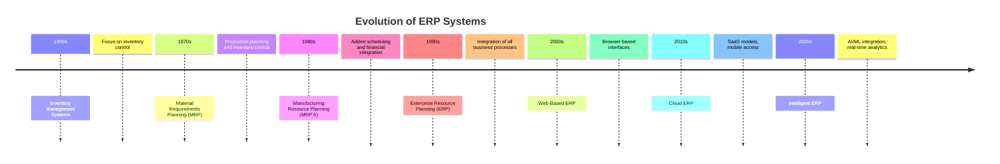

# Enterprise Resource Planning (ERP)

## Introduction

Enterprise Resource Planning (ERP) represents one of the most significant developments in business information systems over the past few decades. At its core, an ERP system is a comprehensive software solution that integrates and manages all essential business processes across an organization through a single, unified database.

Think of ERP as the digital nervous system of a modern business—connecting everything from inventory management and order processing to human resources and financial accounting. This integration enables real-time data sharing across departments, eliminates information silos, and provides a "single source of truth" for business operations.

## What is an ERP System?

An ERP system is a suite of integrated applications that organizations use to collect, store, manage, and interpret data from many business activities. These activities typically include:

- Financial management and accounting
- Supply chain operations
- Manufacturing and production planning
- Human resources and payroll
- Customer relationship management
- Inventory management
- Procurement

Unlike standalone software applications that focus on specific business functions, ERP systems bring these processes together into a cohesive whole, allowing for seamless data flow across the organization.

## The Evolution of ERP

ERP systems have evolved significantly over time:



## Core Components of an ERP System

Modern ERP systems typically consist of several integrated modules, each handling specific business functions:

### 1. Financial Management

The financial module is often considered the backbone of an ERP system. It manages the organization's financial resources and provides tools for:

- General ledger accounting
- Accounts payable and receivable
- Fixed asset management
- Financial reporting and analysis
- Budget management
- Tax compliance

### 2. Human Resources Management

The HR module handles all employee-related processes:

- Personnel administration
- Payroll processing
- Talent management
- Time and attendance tracking
- Benefits administration
- Performance evaluation
- Recruitment and onboarding

### 3. Supply Chain Management

This module optimizes the flow of products and services:

- Procurement and purchasing
- Inventory management
- Warehouse management
- Logistics and distribution
- Supplier relationship management
- Demand planning

### 4. Manufacturing

For manufacturing businesses, this module helps plan and execute production:

- Production planning
- Material requirements planning
- Shop floor management
- Quality control
- Manufacturing execution
- Product lifecycle management

### 5. Customer Relationship Management

The CRM component manages customer interactions:

- Sales automation
- Marketing campaign management
- Customer service and support
- Customer data management
- Customer analytics

## ERP Implementation Approaches

Organizations typically consider several approaches when implementing ERP systems:

### On-Premises vs. Cloud-Based ERP

**On-Premises ERP:**
- Software installed locally on company's hardware and servers
- High upfront costs but long-term ownership
- Organization maintains and services the hardware infrastructure
- Customization options are extensive but can be complex
- Data security is managed internally

**Cloud-Based ERP:**
- Software accessed through the internet (Software as a Service)
- Subscription-based pricing model
- Provider handles maintenance, updates, and infrastructure
- Generally faster implementation and lower initial investment
- Automatic updates and reduced IT burden

### Implementation Strategies

1. **Big Bang** - Implementing the entire ERP system across the organization at once
2. **Phased Rollout** - Implementing different modules or at different locations over time
3. **Parallel Adoption** - Running old and new systems simultaneously until transition is complete

## ERP Database Schema Example

Below is a simplified example of how tables in an ERP database might be structured, with primary keys (PK) and foreign keys (FK) noted:

```sql
-- Customers Table
CREATE TABLE Customers (
    CustomerID INT PRIMARY KEY,
    CustomerName VARCHAR(100),
    ContactPerson VARCHAR(100),
    Email VARCHAR(100),
    Phone VARCHAR(20),
    Address VARCHAR(200),
    CreditLimit DECIMAL(10,2)
);

-- Products Table
CREATE TABLE Products (
    ProductID INT PRIMARY KEY,
    ProductName VARCHAR(100),
    Description TEXT,
    UnitPrice DECIMAL(10,2),
    QuantityInStock INT,
    ReorderLevel INT,
    CategoryID INT
);

-- Orders Table
CREATE TABLE Orders (
    OrderID INT PRIMARY KEY,
    CustomerID INT,
    OrderDate DATETIME,
    RequiredDate DATETIME,
    ShippedDate DATETIME,
    Status VARCHAR(50),
    TotalAmount DECIMAL(10,2),
    FOREIGN KEY (CustomerID) REFERENCES Customers(CustomerID)
);

-- Order Details Table
CREATE TABLE OrderDetails (
    OrderDetailID INT PRIMARY KEY,
    OrderID INT,
    ProductID INT,
    Quantity INT,
    UnitPrice DECIMAL(10,2),
    Discount DECIMAL(5,2),
    FOREIGN KEY (OrderID) REFERENCES Orders(OrderID),
    FOREIGN KEY (ProductID) REFERENCES Products(ProductID)
);

-- Employees Table
CREATE TABLE Employees (
    EmployeeID INT PRIMARY KEY,
    FirstName VARCHAR(50),
    LastName VARCHAR(50),
    Title VARCHAR(100),
    HireDate DATETIME,
    Department VARCHAR(50),
    Salary DECIMAL(10,2),
    ManagerID INT,
    FOREIGN KEY (ManagerID) REFERENCES Employees(EmployeeID)
);
```

## Developing an ERP System Integration

Here's a simple Node.js example showing how you might interact with an ERP system using an API:

```javascript
// Import required modules
const axios = require('axios');
const express = require('express');
const app = express();

app.use(express.json());

// Configuration for ERP API connection
const ERP_API_URL = 'https://your-erp-system-api.com';
const API_KEY = 'your_api_key';

// Function to fetch customer information from ERP
async function getCustomerInfo(customerId) {
  try {
    const response = await axios.get(`${ERP_API_URL}/customers/${customerId}`, {
      headers: {
        'Authorization': `Bearer ${API_KEY}`,
        'Content-Type': 'application/json'
      }
    });
    
    return response.data;
  } catch (error) {
    console.error('Error fetching customer data:', error.message);
    throw error;
  }
}

// Function to create a new sales order in the ERP system
async function createSalesOrder(orderData) {
  try {
    const response = await axios.post(`${ERP_API_URL}/orders`, orderData, {
      headers: {
        'Authorization': `Bearer ${API_KEY}`,
        'Content-Type': 'application/json'
      }
    });
    
    return response.data;
  } catch (error) {
    console.error('Error creating sales order:', error.message);
    throw error;
  }
}

// API endpoint to check inventory levels
app.get('/api/inventory/:productId', async (req, res) => {
  try {
    const productId = req.params.productId;
    const response = await axios.get(`${ERP_API_URL}/inventory/${productId}`, {
      headers: {
        'Authorization': `Bearer ${API_KEY}`,
        'Content-Type': 'application/json'
      }
    });
    
    res.json(response.data);
  } catch (error) {
    res.status(500).json({ error: error.message });
  }
});

// Start the server
const PORT = process.env.PORT || 3000;
app.listen(PORT, () => {
  console.log(`Server running on port ${PORT}`);
});
```

## Real-World ERP Implementation Example

### Case Study: Manufacturing Company

A medium-sized manufacturing company with 500 employees implemented an ERP system to address these challenges:

- Disparate systems for inventory, manufacturing, and accounting
- Manual data entry leading to errors and delays
- Limited visibility into production status
- Difficulty in forecasting material requirements
- Slow financial reporting

#### Implementation Process:

1. **Planning (3 months)**
   - Requirements gathering
   - ERP vendor selection
   - Implementation team formation

2. **Data Preparation (2 months)**
   - Data cleaning and standardization
   - Master data preparation

3. **Configuration (4 months)**
   - System configuration
   - Business process redesign
   - Integration setup

4. **Testing (2 months)**
   - Unit testing
   - Integration testing
   - User acceptance testing

5. **Training (1 month)**
   - User training
   - Administrator training
   - Documentation

6. **Go-Live and Support (2 months)**
   - Phased implementation
   - Post-implementation support

#### Results:

- 30% reduction in inventory holding costs
- 25% improvement in production throughput
- 40% faster financial close process
- 50% reduction in manual data entry
- Real-time visibility into operations
- Improved forecasting accuracy

## Benefits and Challenges of ERP Systems

### Benefits:

1. **Process Integration** - Eliminates information silos and connects business processes
2. **Data Centralization** - Creates a single source of truth for enterprise data
3. **Improved Efficiency** - Automates routine tasks and streamlines workflows
4. **Enhanced Reporting** - Provides real-time analytics and comprehensive reporting
5. **Better Compliance** - Helps meet regulatory requirements through standardized processes
6. **Scalability** - Supports business growth with flexible system expansion

### Challenges:

1. **High Implementation Costs** - Significant investment in software, hardware, and consulting
2. **Complexity** - Steep learning curve and complex configuration
3. **Customization Limitations** - Changes to core functionality can be difficult
4. **Change Management** - Resistance from employees accustomed to legacy systems
5. **Integration Issues** - Challenges connecting with existing systems
6. **Time-Intensive** - Implementation can take months or years

## Popular ERP Systems

Several major ERP systems dominate the market:

- **SAP S/4HANA** - Feature-rich system for large enterprises
- **Oracle NetSuite** - Cloud-based ERP for mid-sized companies
- **Microsoft Dynamics 365** - Integrates with Microsoft ecosystem
- **Odoo** - Open-source ERP with modular approach
- **Sage Intacct** - Financial-focused ERP system

## ERP System Selection Criteria

When selecting an ERP system, organizations should consider:

1. **Business Requirements** - Does it address specific business needs?
2. **Total Cost of Ownership** - Initial and ongoing costs
3. **Scalability** - Can it grow with the organization?
4. **Implementation Time** - How long until the system is operational?
5. **Industry Specificity** - Does it have features for your industry?
6. **Integration Capabilities** - How well does it connect with other systems?
7. **User Experience** - Is the interface intuitive and user-friendly?
8. **Vendor Reputation** - Support quality and long-term viability

## Future Trends in ERP

The ERP landscape continues to evolve with emerging technologies:

1. **AI and Machine Learning** - Predictive analytics and intelligent automation
2. **IoT Integration** - Real-time data from connected devices
3. **Mobile ERP** - Access to ERP functionality from anywhere
4. **Low-Code Development** - Simplified customization without extensive coding
5. **Two-Tier ERP** - Using different ERP systems at corporate and subsidiary levels
6. **Embedded Analytics** - Built-in business intelligence tools
7. **Blockchain** - Enhanced security and supply chain transparency

## Summary

Enterprise Resource Planning systems represent a fundamental shift in how organizations manage their information and operations. By integrating disparate business functions into a unified system, ERP enables better decision-making, improves efficiency, and provides a comprehensive view of the business.

While implementing an ERP system presents significant challenges in terms of cost, complexity, and change management, the potential benefits—including improved data accuracy, streamlined processes, and enhanced reporting capabilities—can transform an organization's operations and competitiveness.

For organizations considering ERP implementation, careful planning, thorough requirements analysis, and strategic change management are essential for success.

## Exercises

1. **Requirement Analysis**: Create a requirements document for an ERP system for a fictional small retail business with two physical locations and an online store.

2. **Process Mapping**: Draw a flowchart showing how a customer order would be processed through different ERP modules from initial order to fulfillment and accounting.

3. **Comparison Exercise**: Research and compare two different ERP systems (e.g., SAP vs. Oracle NetSuite), highlighting key differences and which business scenarios each might be better suited for.

4. **ROI Calculation**: Create a simple spreadsheet model to calculate the potential return on investment for an ERP implementation, considering costs (software, hardware, implementation, training) and benefits (efficiency gains, error reduction, improved decision-making).

5. **Integration Planning**: Design an integration strategy for connecting an ERP system with an existing e-commerce platform, outlining data flows and synchronization requirements.

## Additional Resources

- **Books**:
  - "Modern ERP: Select, Implement, and Use Today's Advanced Business Systems" by Marianne Bradford
  - "Concepts in Enterprise Resource Planning" by Ellen Monk and Bret Wagner

- **Online Courses**:
  - Introduction to ERP Systems on Coursera
  - SAP Fundamentals on Udemy
  - Microsoft Dynamics 365 training on Microsoft Learn

- **Professional Organizations**:
  - American Production and Inventory Control Society (APICS)
  - Association for Information Systems (AIS)