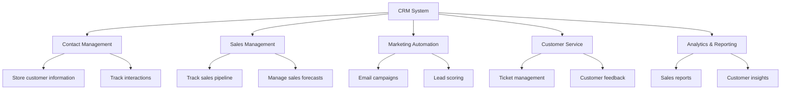

# Customer Relationship Management

## Introduction

Customer Relationship Management (CRM) is a technology-driven approach that helps businesses manage and analyze customer interactions throughout the customer lifecycle. The goal of CRM is to improve business relationships with customers, assist in customer retention, and drive sales growth. CRM systems compile data from various communication channels including a company's website, telephone, email, live chat, marketing materials, and social media.

In today's competitive business environment, understanding and implementing effective CRM strategies is crucial for business success. This guide will introduce you to the fundamental concepts of CRM systems, their components, and how they integrate with other information systems.

## What is a CRM System?

A CRM system helps companies stay connected to customers, streamline processes, and improve profitability. At its core, CRM is a database that stores customer and prospect information in one central location, making it accessible to authorized users across an organization.

### Key Functions of CRM Systems



## Types of CRM Systems

### Operational CRM
Operational CRM focuses on automating and improving customer-facing processes such as sales, marketing, and service. It provides a complete view of each customer's interactions with the company.

### Analytical CRM
Analytical CRM focuses on analyzing customer data to improve business decision-making. It uses techniques such as data mining, correlation, and pattern recognition to analyze customer data.

### Collaborative CRM
Collaborative CRM facilitates interactions with customers across all departments within an organization. It enables better communication and sharing of customer information.

### Strategic CRM
Strategic CRM focuses on developing a customer-centric business culture to win and keep customers by creating and delivering better value than competitors.

## Core Components of a CRM System

### Contact Management
Contact management is the foundation of any CRM system. It stores detailed information about customers and prospects including:

- Personal details (name, email, phone)
- Company information
- Communication history
- Purchase history
- Social media profiles
- Customer preferences

Here's a simple example of how contact data might be structured in a JavaScript object:

```javascript
const customerContact = {
  id: "CUS1001",
  personalInfo: {
    firstName: "John",
    lastName: "Doe",
    email: "john.doe@example.com",
    phone: "+1 (555) 123-4567"
  },
  companyInfo: {
    name: "Acme Corporation",
    position: "IT Manager",
    industry: "Manufacturing"
  },
  interactions: [
    {
      date: "2023-01-15",
      type: "Email",
      summary: "Inquiry about enterprise software solutions"
    },
    {
      date: "2023-01-20",
      type: "Phone Call",
      summary: "Discussed specific requirements and budget constraints"
    }
  ],
  purchases: [
    {
      date: "2023-02-10",
      product: "CRM Basic Package",
      amount: 1200.00
    }
  ]
};
```

### Sales Management
Sales management features help sales teams track leads, manage opportunities, and monitor sales pipelines. Key functionality includes:

- Lead tracking
- Opportunity management
- Sales forecasting
- Quote and proposal generation
- Territory management

### Marketing Automation
Marketing automation tools help businesses effectively market on multiple channels and automate repetitive tasks:

- Email campaign management
- Lead scoring and nurturing
- Social media marketing
- Marketing analytics
- Campaign ROI tracking

### Customer Service
Customer service features help support teams deliver excellent service:

- Ticket management
- Knowledge base
- Service level agreement (SLA) tracking
- Customer self-service portals
- Chat integrations

### Reporting and Analytics
CRM systems provide powerful reporting tools to analyze performance and customer data:

- Sales performance reports
- Customer segmentation
- Trend analysis
- Predictive analytics
- Custom dashboards

## Database Design for CRM Systems

A properly designed database is crucial for a CRM system. Below is a simplified example of how tables in a CRM database might be structured:

```sql
-- Customers table
CREATE TABLE Customers (
    CustomerID INT PRIMARY KEY,
    FirstName VARCHAR(50),
    LastName VARCHAR(50),
    Email VARCHAR(100),
    Phone VARCHAR(20),
    CompanyName VARCHAR(100),
    CreatedDate DATETIME
);

-- Interactions table
CREATE TABLE Interactions (
    InteractionID INT PRIMARY KEY,
    CustomerID INT,
    InteractionType VARCHAR(50),
    Description TEXT,
    Date DATETIME,
    EmployeeID INT,
    FOREIGN KEY (CustomerID) REFERENCES Customers(CustomerID)
);

-- Opportunities table
CREATE TABLE Opportunities (
    OpportunityID INT PRIMARY KEY,
    CustomerID INT,
    Name VARCHAR(100),
    Stage VARCHAR(50),
    Amount DECIMAL(10,2),
    ExpectedCloseDate DATETIME,
    Probability INT,
    FOREIGN KEY (CustomerID) REFERENCES Customers(CustomerID)
);
```

## Implementing a Simple CRM Feature

Let's build a simple customer search function in JavaScript that might be used in a CRM system:

```javascript
// Sample customer data array
const customers = [
  { id: 1, name: "John Doe", email: "john@example.com", purchases: 5, totalSpent: 1250 },
  { id: 2, name: "Jane Smith", email: "jane@example.com", purchases: 3, totalSpent: 890 },
  { id: 3, name: "Robert Johnson", email: "robert@example.com", purchases: 10, totalSpent: 4500 },
  { id: 4, name: "Sarah Williams", email: "sarah@example.com", purchases: 1, totalSpent: 150 }
];

// Search function that can filter by name, email, or minimum purchases
function searchCustomers(searchTerm, minPurchases = 0) {
  searchTerm = searchTerm.toLowerCase();
  
  return customers.filter(customer => {
    // Check if search term matches name or email
    const nameMatch = customer.name.toLowerCase().includes(searchTerm);
    const emailMatch = customer.email.toLowerCase().includes(searchTerm);
    
    // Check if customer meets minimum purchase requirement
    const purchaseMatch = customer.purchases >= minPurchases;
    
    return (nameMatch || emailMatch) && purchaseMatch;
  });
}

// Example usage
const results = searchCustomers("john", 2);
console.log("Search results:", results);

/* Output:
Search results: [
  { id: 1, name: "John Doe", email: "john@example.com", purchases: 5, totalSpent: 1250 }
]
*/

// Another example with different parameters
const highValueCustomers = searchCustomers("", 5);
console.log("High-value customers:", highValueCustomers);

/* Output:
High-value customers: [
  { id: 1, name: "John Doe", email: "john@example.com", purchases: 5, totalSpent: 1250 },
  { id: 3, name: "Robert Johnson", email: "robert@example.com", purchases: 10, totalSpent: 4500 }
]
*/
```

## Integration with Other Information Systems

CRM systems don't exist in isolation. They integrate with other business systems to provide a complete view of customer interactions and business operations:

### ERP Integration
Integration with Enterprise Resource Planning (ERP) systems allows for seamless data flow between customer-facing operations and back-office functions.

```javascript
// Example of a function that might be used to sync customer data between CRM and ERP
async function syncCustomerWithERP(customerId) {
  try {
    // 1. Retrieve customer data from CRM
    const customerData = await getCRMCustomerData(customerId);
    
    // 2. Format data for ERP system
    const erpCustomerData = {
      customer_id: customerData.id,
      name: `${customerData.firstName} ${customerData.lastName}`,
      billing_address: customerData.billingAddress,
      tax_id: customerData.taxIdentifier,
      payment_terms: customerData.paymentTerms
    };
    
    // 3. Send data to ERP system API
    const response = await sendToERPSystem(erpCustomerData);
    
    // 4. Log the result
    console.log(`Customer ${customerId} synced with ERP system. Status: ${response.status}`);
    return response;
  } catch (error) {
    console.error(`Error syncing customer ${customerId} with ERP:`, error);
    throw error;
  }
}
```

### E-commerce Integration
CRM systems often integrate with e-commerce platforms to track online purchases and customer behavior.

### Email and Communication Tools
Integration with email systems, VoIP (Voice over Internet Protocol) systems, and chat platforms ensures all customer communications are tracked in one place.

### Marketing Automation Platforms
CRM systems connect with marketing automation platforms to provide a complete view of marketing efforts and lead generation.

## Real-World CRM Implementation Example

Let's look at how a fictional online bookstore might implement a CRM system:

**Business Requirements:**
- Track customer reading preferences
- Recommend books based on past purchases
- Alert customers about new releases from favorite authors
- Manage loyalty program
- Handle customer service inquiries

**CRM Implementation:**

1. **Contact Management:** Store customer profiles with reading preferences and purchase history

2. **Segmentation Example:**
```javascript
// Function to segment customers by reading preferences
function segmentCustomersByGenre() {
  const genreSegments = {};
  
  customers.forEach(customer => {
    const favoriteGenre = getFavoriteGenre(customer.id);
    
    if (!genreSegments[favoriteGenre]) {
      genreSegments[favoriteGenre] = [];
    }
    
    genreSegments[favoriteGenre].push(customer);
  });
  
  return genreSegments;
}

// Function to get a customer's favorite genre based on purchase history
function getFavoriteGenre(customerId) {
  const purchaseHistory = getPurchaseHistory(customerId);
  
  const genreCounts = {};
  let maxCount = 0;
  let favoriteGenre = "Unknown";
  
  purchaseHistory.forEach(purchase => {
    if (!genreCounts[purchase.genre]) {
      genreCounts[purchase.genre] = 0;
    }
    
    genreCounts[purchase.genre]++;
    
    if (genreCounts[purchase.genre] > maxCount) {
      maxCount = genreCounts[purchase.genre];
      favoriteGenre = purchase.genre;
    }
  });
  
  return favoriteGenre;
}
```

3. **Marketing Automation:** Send automated emails when new books are released in a customer's preferred genre

4. **Loyalty Program Management:** Track points and reward levels

5. **Customer Service:** Handle returns, inquiries, and special orders

## Best Practices for CRM Implementation

1. **Define Clear Objectives:** Clearly define what you want to achieve with your CRM system.

2. **Focus on Data Quality:** Ensure data is accurate, complete, and regularly updated.

3. **User Training:** Provide comprehensive training for all users.

4. **Start Small:** Begin with core functionality and expand over time.

5. **Regular Reviews:** Constantly evaluate and improve your CRM processes.

## Common CRM Challenges and Solutions

### Data Quality Issues
**Solution:** Implement data validation rules, regular data cleaning processes, and user training.

### Low User Adoption
**Solution:** Provide proper training, showcase benefits, and make the system user-friendly.

### Integration Problems
**Solution:** Plan integrations carefully, use middleware when necessary, and consider API capabilities.

### Measuring ROI
**Solution:** Define clear metrics before implementation and track them consistently.

## Summary

Customer Relationship Management systems are powerful tools that help businesses manage customer relationships, streamline processes, and drive growth. In this guide, we've covered the fundamental concepts of CRM systems, including:

- The definition and importance of CRM
- Types of CRM systems
- Core components and functionality
- Database design considerations
- Integration with other business systems
- Real-world implementation example
- Best practices and common challenges

Understanding CRM concepts is crucial for anyone working in business information systems, as these systems form the backbone of customer-facing operations in modern organizations.

## Exercises

1. **Conceptual Exercise:** Identify a business and describe how each type of CRM (operational, analytical, collaborative, strategic) might benefit their operations.

2. **Coding Exercise:** Expand the customer search function we created to include filtering by date of last purchase and total spent.

3. **Design Exercise:** Create a database schema for a CRM system that would be used by a healthcare provider.

4. **Integration Exercise:** Describe how a CRM system might integrate with a shipping and logistics system for an e-commerce business.

5. **Analysis Exercise:** Research a CRM implementation failure case study. Identify what went wrong and how it could have been prevented.

## Additional Resources

- [CRM Software Development](https://www.softermii.com/blog/how-to-develop-crm-software) - Comprehensive guide on CRM development
- [MDN Web Docs](https://developer.mozilla.org) - Great resource for JavaScript and web development
- [SQL Tutorial](https://www.w3schools.com/sql/) - Learn more about SQL for database management
- Online courses on platforms like Coursera, Udemy, and edX that focus on CRM strategies and implementation