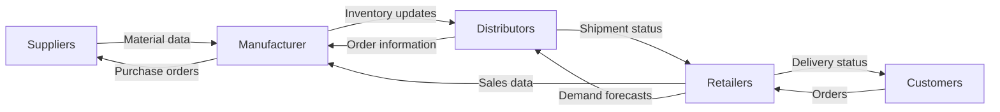

# Supply Chain Management

## Introduction

Supply Chain Management (SCM) represents one of the most critical applications of information systems in business today. A supply chain encompasses all activities, organizations, and processes involved in transforming raw materials into final products delivered to customers. Modern supply chains are complex networks spanning multiple organizations, geographic regions, and information systems.

In this guide, we'll explore how information systems enable effective supply chain management, examine key concepts, and learn how programmers develop solutions that help businesses coordinate their supply chains efficiently.

## What is Supply Chain Management?

Supply Chain Management refers to the coordination and optimization of all activities involved in producing and delivering goods and services, including:

- Sourcing raw materials
- Manufacturing and production
- Inventory management
- Warehousing and storage
- Transportation and logistics
- Distribution and delivery
- Customer service

Information systems play a crucial role in connecting these activities, facilitating communication between supply chain partners, and enabling data-driven decision making.

## Supply Chain Information Flow

Information flows are just as important as physical product flows in modern supply chains. Let's visualize a basic supply chain information flow:



## Key SCM Information Systems

### Enterprise Resource Planning (ERP)

ERP systems serve as the backbone of supply chain management, integrating various business processes and functions into a single unified system.

```javascript
// Example of a simple ERP inventory transaction
function updateInventory(productId, quantity, transactionType) {
  try {
    // Connect to database
    const db = connectToDatabase();
    
    // Begin transaction
    db.beginTransaction();
    
    // Update inventory table
    if (transactionType === 'receipt') {
      db.execute(`
        UPDATE inventory 
        SET quantity = quantity + ${quantity} 
        WHERE product_id = ${productId}
      `);
      
      // Log receipt
      db.execute(`
        INSERT INTO inventory_transactions 
        (product_id, quantity, transaction_type, transaction_date) 
        VALUES (${productId}, ${quantity}, 'receipt', NOW())
      `);
    } else if (transactionType === 'shipment') {
      // Check if sufficient inventory exists
      const currentQty = db.query(`
        SELECT quantity FROM inventory WHERE product_id = ${productId}
      `);
      
      if (currentQty < quantity) {
        throw new Error('Insufficient inventory');
      }
      
      db.execute(`
        UPDATE inventory 
        SET quantity = quantity - ${quantity} 
        WHERE product_id = ${productId}
      `);
      
      // Log shipment
      db.execute(`
        INSERT INTO inventory_transactions 
        (product_id, quantity, transaction_type, transaction_date) 
        VALUES (${productId}, ${quantity}, 'shipment', NOW())
      `);
    }
    
    // Commit transaction
    db.commitTransaction();
    
    return {
      success: true,
      message: `Inventory updated successfully. Transaction type: ${transactionType}`
    };
  } catch (error) {
    db.rollbackTransaction();
    return {
      success: false,
      message: `Error updating inventory: ${error.message}`
    };
  }
}

// Example Usage:
// Input
const result = updateInventory(1001, 50, 'receipt');
// Output
// { 
//   success: true, 
//   message: "Inventory updated successfully. Transaction type: receipt" 
// }
```

### Warehouse Management Systems (WMS)

WMS software helps optimize warehouse operations including receiving, storage, picking, packing, and shipping.

```python
# Example of a simple warehouse location assignment algorithm
def assign_storage_location(product_id, quantity, warehouse_id):
    """
    Assigns the optimal storage location for a product in a warehouse
    based on product characteristics and warehouse zones.
    
    Args:
        product_id (int): Unique identifier for the product
        quantity (int): Quantity to be stored
        warehouse_id (int): Identifier for the warehouse
        
    Returns:
        dict: Storage location information
    """
    # Get product details
    product = database.get_product(product_id)
    
    # Get warehouse layout and available locations
    warehouse = database.get_warehouse(warehouse_id)
    available_locations = warehouse.get_available_locations()
    
    # Filter locations based on product requirements
    suitable_locations = []
    for location in available_locations:
        if (location.capacity >= quantity and
            location.zone_type == product.required_zone_type and
            location.temperature_range.contains(product.required_temperature)):
            suitable_locations.append(location)
    
    if not suitable_locations:
        return {"success": False, "message": "No suitable location found"}
    
    # Sort by optimization criteria (e.g., proximity to shipping dock)
    suitable_locations.sort(key=lambda x: x.distance_to_shipping)
    
    # Select best location
    best_location = suitable_locations[0]
    
    # Reserve the location
    database.reserve_location(best_location.id, product_id, quantity)
    
    return {
        "success": True,
        "location_id": best_location.id,
        "zone": best_location.zone,
        "aisle": best_location.aisle,
        "rack": best_location.rack,
        "bin": best_location.bin
    }

# Example Usage:
# Input
result = assign_storage_location(1001, 50, 5)
# Output
# {
#   "success": True,
#   "location_id": 243,
#   "zone": "A",
#   "aisle": 12,
#   "rack": 3,
#   "bin": 7
# }
```

### Transportation Management Systems (TMS)

TMS applications optimize the movement of goods, handling route planning, carrier selection, and shipment tracking.

```javascript
// Example of a simple route optimization function
function optimizeDeliveryRoute(deliveryLocations, startingPoint, maxStops) {
  // Use a nearest neighbor algorithm for route optimization
  let route = [startingPoint];
  let currentLocation = startingPoint;
  let remainingLocations = [...deliveryLocations];
  
  // Continue until we've visited all locations or reached max stops
  while (remainingLocations.length > 0 && route.length <= maxStops) {
    // Find nearest location to current position
    let nearestLocation = null;
    let shortestDistance = Infinity;
    
    for (const location of remainingLocations) {
      const distance = calculateDistance(currentLocation, location);
      if (distance < shortestDistance) {
        shortestDistance = distance;
        nearestLocation = location;
      }
    }
    
    // Add nearest location to route
    route.push(nearestLocation);
    currentLocation = nearestLocation;
    
    // Remove from remaining locations
    remainingLocations = remainingLocations.filter(
      loc => loc.id !== nearestLocation.id
    );
  }
  
  // Calculate total distance and estimated time
  const totalDistance = calculateTotalRouteDistance(route);
  const estimatedTime = estimateRouteTime(totalDistance, route.length);
  
  return {
    route: route,
    totalStops: route.length - 1, // Excluding starting point
    totalDistance: totalDistance,
    estimatedTime: estimatedTime,
    unservicedLocations: remainingLocations
  };
}

// Helper function to calculate distance between two points
function calculateDistance(point1, point2) {
  // Using Haversine formula for geographic coordinates
  // (simplified for illustration purposes)
  const latDiff = point2.latitude - point1.latitude;
  const lonDiff = point2.longitude - point1.longitude;
  return Math.sqrt(latDiff * latDiff + lonDiff * lonDiff) * 111.32; // km
}

// Example Usage:
// Input
const deliveryPoints = [
  { id: 1, name: "Store A", latitude: 40.7128, longitude: -74.0060 },
  { id: 2, name: "Store B", latitude: 40.7282, longitude: -73.9942 },
  { id: 3, name: "Store C", latitude: 40.7648, longitude: -73.9808 }
];

const warehouse = { id: 0, name: "Warehouse", latitude: 40.7421, longitude: -73.9914 };

const result = optimizeDeliveryRoute(deliveryPoints, warehouse, 3);
// Output
// {
//   route: [
//     { id: 0, name: "Warehouse", latitude: 40.7421, longitude: -73.9914 },
//     { id: 2, name: "Store B", latitude: 40.7282, longitude: -73.9942 },
//     { id: 1, name: "Store A", latitude: 40.7128, longitude: -74.0060 },
//     { id: 3, name: "Store C", latitude: 40.7648, longitude: -73.9808 }
//   ],
//   totalStops: 3,
//   totalDistance: 12.6,
//   estimatedTime: "1 hour 15 minutes",
//   unservicedLocations: []
// }
```

### Supplier Relationship Management (SRM)

SRM systems help organizations manage relationships with suppliers, including performance evaluation, contract management, and collaboration.

```python
# Example of a supplier evaluation system
class SupplierEvaluationSystem:
    def __init__(self, db_connection):
        self.db = db_connection
        self.evaluation_criteria = {
            'delivery_time': {'weight': 0.25, 'target': 'minimize'},
            'quality_score': {'weight': 0.30, 'target': 'maximize'},
            'price_competitiveness': {'weight': 0.25, 'target': 'minimize'},
            'communication': {'weight': 0.10, 'target': 'maximize'},
            'compliance': {'weight': 0.10, 'target': 'maximize'}
        }
    
    def evaluate_supplier(self, supplier_id, time_period):
        """
        Evaluates a supplier based on performance metrics
        
        Args:
            supplier_id (int): The unique identifier for the supplier
            time_period (str): Time period for evaluation (e.g., 'Q1_2023')
            
        Returns:
            dict: Evaluation results including overall score and recommendations
        """
        # Retrieve performance data from database
        performance_data = self.db.get_supplier_performance(supplier_id, time_period)
        
        if not performance_data:
            return {"error": "No performance data available for this period"}
        
        # Calculate scores for each criterion
        scores = {}
        for criterion, config in self.evaluation_criteria.items():
            raw_value = performance_data.get(criterion, 0)
            
            # Normalize the score between 0-100
            # Higher is better for all metrics after normalization
            if config['target'] == 'minimize':
                # For metrics like cost or delivery time, lower is better
                # Using an inverse scoring where 100 is perfect (e.g., immediate delivery)
                benchmark = performance_data.get(f"{criterion}_benchmark", 1)
                if raw_value <= benchmark:
                    normalized_score = 100  # Meeting or exceeding benchmark gets full score
                else:
                    # Score decreases as the value increases above benchmark
                    normalized_score = max(0, 100 - ((raw_value / benchmark - 1) * 100))
            else:
                # For metrics like quality, higher is better
                benchmark = performance_data.get(f"{criterion}_benchmark", 100)
                normalized_score = min(100, (raw_value / benchmark) * 100)
            
            scores[criterion] = normalized_score
        
        # Calculate weighted overall score
        overall_score = sum(
            scores[criterion] * config['weight'] 
            for criterion, config in self.evaluation_criteria.items()
        )
        
        # Generate recommendations
        recommendations = self._generate_recommendations(scores, overall_score)
        
        return {
            "supplier_id": supplier_id,
            "time_period": time_period,
            "overall_score": round(overall_score, 2),
            "detailed_scores": {k: round(v, 2) for k, v in scores.items()},
            "performance_category": self._get_performance_category(overall_score),
            "recommendations": recommendations
        }
    
    def _get_performance_category(self, score):
        if score >= 90:
            return "Preferred Supplier"
        elif score >= 75:
            return "Approved Supplier"
        elif score >= 60:
            return "Conditional Supplier"
        else:
            return "Probationary Supplier"
    
    def _generate_recommendations(self, scores, overall_score):
        recommendations = []
        
        # Identify the weakest areas
        weak_areas = sorted(scores.items(), key=lambda x: x[1])[:2]
        
        for area, score in weak_areas:
            if score < 70:
                if area == "delivery_time":
                    recommendations.append(
                        "Implement stricter delivery schedule monitoring"
                    )
                elif area == "quality_score":
                    recommendations.append(
                        "Request quality improvement plan and increase inspection frequency"
                    )
                elif area == "price_competitiveness":
                    recommendations.append(
                        "Schedule price negotiation meeting and cost analysis review"
                    )
                elif area == "communication":
                    recommendations.append(
                        "Establish regular status update meetings and communication protocols"
                    )
                elif area == "compliance":
                    recommendations.append(
                        "Provide compliance training and documentation requirements"
                    )
        
        if overall_score < 60:
            recommendations.append("Consider supplier replacement if no improvement within 90 days")
        
        return recommendations

# Example Usage:
# Input
evaluation_system = SupplierEvaluationSystem(database_connection)
result = evaluation_system.evaluate_supplier(12345, "Q2_2023")
# Output
# {
#   "supplier_id": 12345,
#   "time_period": "Q2_2023",
#   "overall_score": 78.35,
#   "detailed_scores": {
#     "delivery_time": 82.50,
#     "quality_score": 90.00,
#     "price_competitiveness": 65.75,
#     "communication": 85.00,
#     "compliance": 70.00
#   },
#   "performance_category": "Approved Supplier",
#   "recommendations": [
#     "Schedule price negotiation meeting and cost analysis review",
#     "Provide compliance training and documentation requirements"
#   ]
# }
```

## Supply Chain Data Analytics and Visualization

Modern supply chains generate enormous amounts of data. Analytics tools help transform this data into actionable insights.

```javascript
// Example of a simple demand forecasting function
function forecastDemand(productId, historicalData, forecastPeriods) {
  // Implementation of a simple moving average forecast
  
  // Validate input
  if (!historicalData || historicalData.length < 3) {
    return {
      success: false,
      message: "Insufficient historical data for forecasting"
    };
  }
  
  // Extract sales quantities
  const salesData = historicalData.map(period => period.quantity);
  
  // Calculate moving averages
  const movingAverageValues = [];
  const windowSize = 3; // Using 3-period moving average
  
  for (let i = windowSize - 1; i < salesData.length; i++) {
    let sum = 0;
    for (let j = 0; j < windowSize; j++) {
      sum += salesData[i - j];
    }
    movingAverageValues.push(sum / windowSize);
  }
  
  // Calculate forecast for requested periods
  const lastAverage = movingAverageValues[movingAverageValues.length - 1];
  
  // Calculate trend
  const trend = calculateTrend(movingAverageValues);
  
  // Generate forecast for requested periods
  const forecast = [];
  for (let i = 1; i <= forecastPeriods; i++) {
    forecast.push({
      period: `Period ${historicalData.length + i}`,
      forecastQuantity: Math.round(lastAverage + (trend * i)),
      confidence: calculateConfidence(trend, i)
    });
  }
  
  return {
    success: true,
    productId: productId,
    historicalPeriods: historicalData.length,
    movingAverageValues: movingAverageValues.map(val => Math.round(val)),
    detectedTrend: trend > 0 ? "Upward" : trend < 0 ? "Downward" : "Stable",
    forecast: forecast
  };
}

// Helper function to calculate trend
function calculateTrend(data) {
  if (data.length < 2) return 0;
  
  // Simple linear regression slope
  let sumX = 0, sumY = 0, sumXY = 0, sumXX = 0;
  for (let i = 0; i < data.length; i++) {
    sumX += i;
    sumY += data[i];
    sumXY += i * data[i];
    sumXX += i * i;
  }
  
  const n = data.length;
  const slope = (n * sumXY - sumX * sumY) / (n * sumXX - sumX * sumX);
  return slope;
}

// Helper function to estimate confidence
function calculateConfidence(trend, periodsAhead) {
  // Simplified confidence calculation
  // Confidence decreases as we forecast further into the future
  // and is affected by the strength of the trend
  const trendImpact = Math.abs(trend) > 5 ? 0.1 : 0.05;
  return Math.max(0.5, 0.9 - (periodsAhead * 0.05) - trendImpact);
}

// Example Usage:
// Input
const historicalData = [
  { period: "Period 1", quantity: 100 },
  { period: "Period 2", quantity: 110 },
  { period: "Period 3", quantity: 105 },
  { period: "Period 4", quantity: 115 },
  { period: "Period 5", quantity: 120 },
  { period: "Period 6", quantity: 125 }
];

const result = forecastDemand(1001, historicalData, 3);
// Output
// {
//   success: true,
//   productId: 1001,
//   historicalPeriods: 6,
//   movingAverageValues: [105, 110, 113, 120],
//   detectedTrend: "Upward",
//   forecast: [
//     { period: "Period 7", forecastQuantity: 125, confidence: 0.85 },
//     { period: "Period 8", forecastQuantity: 130, confidence: 0.8 },
//     { period: "Period 9", forecastQuantity: 135, confidence: 0.75 }
//   ]
// }
```

## Supply Chain Automation

Automation eliminates manual processes in the supply chain, reducing errors and increasing efficiency. Let's explore a simple inventory reordering system:

```python
# Automated inventory reordering system
class InventoryReorderSystem:
    def __init__(self, database_connection):
        self.db = database_connection
    
    def check_inventory_levels(self):
        """
        Checks inventory levels against reorder points and
        automatically generates purchase orders when needed
        
        Returns:
            list: Generated purchase orders
        """
        # Get items that need reordering
        items_to_reorder = self.db.execute_query("""
            SELECT 
                product_id, 
                product_name,
                current_quantity, 
                reorder_point,
                reorder_quantity,
                preferred_supplier_id
            FROM 
                inventory
            WHERE 
                current_quantity <= reorder_point
                AND reorder_status != 'pending'
        """)
        
        purchase_orders = []
        
        # Group items by supplier
        supplier_orders = {}
        for item in items_to_reorder:
            supplier_id = item['preferred_supplier_id']
            if supplier_id not in supplier_orders:
                supplier_orders[supplier_id] = []
            supplier_orders[supplier_id].append(item)
        
        # Generate purchase orders for each supplier
        for supplier_id, items in supplier_orders.items():
            # Get supplier details
            supplier = self.db.get_supplier(supplier_id)
            
            # Create purchase order
            po_number = self.generate_po_number()
            po_date = self.get_current_date()
            
            # Calculate expected delivery date based on supplier lead time
            expected_delivery = self.calculate_delivery_date(
                po_date, supplier['lead_time_days']
            )
            
            # Create PO header
            po = {
                'po_number': po_number,
                'supplier_id': supplier_id,
                'supplier_name': supplier['name'],
                'order_date': po_date,
                'expected_delivery': expected_delivery,
                'status': 'created',
                'items': []
            }
            
            # Add items to PO
            total_value = 0
            for item in items:
                # Get current price from supplier price list
                price = self.db.get_supplier_price(
                    supplier_id, item['product_id']
                )
                
                line_total = price * item['reorder_quantity']
                total_value += line_total
                
                po['items'].append({
                    'product_id': item['product_id'],
                    'product_name': item['product_name'],
                    'quantity': item['reorder_quantity'],
                    'unit_price': price,
                    'line_total': line_total
                })
                
                # Update reorder status in inventory
                self.db.update_reorder_status(
                    item['product_id'], 'pending', po_number
                )
            
            po['total_value'] = total_value
            
            # Save PO to database
            self.db.save_purchase_order(po)
            
            # Send PO to supplier (via API or email)
            self.send_purchase_order(po, supplier['contact_email'])
            
            purchase_orders.append(po)
        
        return purchase_orders
    
    def generate_po_number(self):
        # Generate a unique PO number
        return f"PO-{self.get_current_date('%Y%m%d')}-{self.db.get_next_po_sequence()}"
    
    def get_current_date(self, format_str=None):
        from datetime import datetime
        date = datetime.now()
        if format_str:
            return date.strftime(format_str)
        return date
    
    def calculate_delivery_date(self, order_date, lead_time_days):
        from datetime import timedelta
        return order_date + timedelta(days=lead_time_days)
    
    def send_purchase_order(self, po, supplier_email):
        # Code to format and send PO to supplier
        # This could use email, API, or other communication methods
        print(f"Purchase order {po['po_number']} sent to {supplier_email}")
        return True

# Example Usage:
# Input
reorder_system = InventoryReorderSystem(database_connection)
purchase_orders = reorder_system.check_inventory_levels()
# Output
# [
#   {
#     "po_number": "PO-20230915-10001",
#     "supplier_id": 5001,
#     "supplier_name": "ABC Materials",
#     "order_date": "2023-09-15T10:30:00",
#     "expected_delivery": "2023-09-20T10:30:00",
#     "status": "created",
#     "items": [
#       {
#         "product_id": 1001,
#         "product_name": "Widget A",
#         "quantity": 500,
#         "unit_price": 2.50,
#         "line_total": 1250.00
#       },
#       {
#         "product_id": 1002,
#         "product_name": "Widget B",
#         "quantity": 300,
#         "unit_price": 3.75,
#         "line_total": 1125.00
#       }
#     ],
#     "total_value": 2375.00
#   },
#   {
#     "po_number": "PO-20230915-10002",
#     "supplier_id": 5002,
#     "supplier_name": "XYZ Components",
#     "order_date": "2023-09-15T10:30:00",
#     "expected_delivery": "2023-09-22T10:30:00",
#     "status": "created",
#     "items": [
#       {
#         "product_id": 2001,
#         "product_name": "Component X",
#         "quantity": 1000,
#         "unit_price": 0.75,
#         "line_total": 750.00
#       }
#     ],
#     "total_value": 750.00
#   }
# ]
```

## Blockchain in Supply Chain

Blockchain technology is increasingly being applied to supply chains to improve transparency, traceability, and security.

```javascript
// Example of a simple supply chain blockchain implementation
class SupplyChainBlock {
  constructor(timestamp, transactions, previousHash = '') {
    this.timestamp = timestamp;
    this.transactions = transactions;
    this.previousHash = previousHash;
    this.hash = this.calculateHash();
    this.nonce = 0;
  }

  calculateHash() {
    // In a real implementation, use a cryptographic hash function
    return `${this.previousHash}${this.timestamp}${JSON.stringify(this.transactions)}${this.nonce}`;
  }

  mineBlock(difficulty) {
    // Simple proof of work implementation
    const target = Array(difficulty + 1).join('0');
    
    while (this.hash.substring(0, difficulty) !== target) {
      this.nonce++;
      this.hash = this.calculateHash();
    }
    
    console.log(`Block mined: ${this.hash}`);
  }
}

class SupplyChainTransaction {
  constructor(
    productId, 
    fromEntity, 
    toEntity, 
    quantity, 
    transactionType, 
    metadata = {}
  ) {
    this.productId = productId;
    this.fromEntity = fromEntity;
    this.toEntity = toEntity;
    this.quantity = quantity;
    this.transactionType = transactionType; // e.g., 'raw_material', 'manufacture', 'ship'
    this.timestamp = Date.now();
    this.metadata = metadata;
    this.signature = '';
  }

  calculateHash() {
    return `${this.fromEntity}${this.toEntity}${this.productId}${this.quantity}${this.timestamp}`;
  }

  signTransaction(signingKey) {
    // In a real implementation, use proper digital signatures
    this.signature = `signed-${this.calculateHash()}-${signingKey}`;
  }

  isValid() {
    if (!this.signature || this.signature.length === 0) {
      return false;
    }
    
    // In a real implementation, verify signature cryptographically
    return true;
  }
}

class SupplyChainBlockchain {
  constructor() {
    this.chain = [this.createGenesisBlock()];
    this.difficulty = 2;
    this.pendingTransactions = [];
  }

  createGenesisBlock() {
    return new SupplyChainBlock(Date.now(), [], "0");
  }

  getLatestBlock() {
    return this.chain[this.chain.length - 1];
  }

  minePendingTransactions(miningRewardAddress) {
    const block = new SupplyChainBlock(
      Date.now(), 
      this.pendingTransactions,
      this.getLatestBlock().hash
    );
    
    block.mineBlock(this.difficulty);
    
    console.log('Block successfully mined!');
    this.chain.push(block);
    
    // Reset pending transactions and create mining reward
    this.pendingTransactions = [
      new SupplyChainTransaction(
        null, 
        "SYSTEM", 
        miningRewardAddress, 
        100, 
        "mining_reward"
      )
    ];
  }

  addTransaction(transaction) {
    // Verify transaction
    if (!transaction.fromEntity || !transaction.toEntity) {
      throw new Error('Transaction must include from and to addresses');
    }
    
    if (!transaction.isValid()) {
      throw new Error('Cannot add invalid transaction to chain');
    }
    
    this.pendingTransactions.push(transaction);
  }

  getProductHistory(productId) {
    const history = [];
    
    for (const block of this.chain) {
      for (const trans of block.transactions) {
        if (trans.productId === productId) {
          history.push({
            timestamp: trans.timestamp,
            fromEntity: trans.fromEntity,
            toEntity: trans.toEntity,
            quantity: trans.quantity,
            transactionType: trans.transactionType,
            metadata: trans.metadata,
            blockHash: block.hash
          });
        }
      }
    }
    
    return history;
  }

  isChainValid() {
    for (let i = 1; i < this.chain.length; i++) {
      const currentBlock = this.chain[i];
      const previousBlock = this.chain[i - 1];
      
      // Verify current block's hash
      if (currentBlock.hash !== currentBlock.calculateHash()) {
        return false;
      }
      
      // Compare current block's previousHash with actual previous block's hash
      if (currentBlock.previousHash !== previousBlock.hash) {
        return false;
      }
    }
    
    return true;
  }
}

// Example Usage:
// Set up blockchain
const supplyChain = new SupplyChainBlockchain();

// Create entities
const supplier = "SupplierA";
const manufacturer = "ManufacturerB";
const distributor = "DistributorC";
const retailer = "RetailerD";

// Create and add transactions
const rawMaterialTransaction = new SupplyChainTransaction(
  "RM001",
  supplier,
  manufacturer,
  1000,
  "raw_material_transfer",
  {
    material_name: "Aluminum",
    quality_grade: "A",
    batch_number: "BAT20230915001"
  }
);
rawMaterialTransaction.signTransaction("supplierPrivateKey");
supplyChain.addTransaction(rawMaterialTransaction);

// Mine block with transaction
supplyChain.minePendingTransactions(miner);

// Create manufacturing transaction
const manufacturingTransaction = new SupplyChainTransaction(
  "PROD001",
  manufacturer,
  manufacturer,
  500,
  "production",
  {
    raw_materials_used: ["RM001"],
    manufacturing_date: "2023-09-16",
    quality_check_passed: true,
    batch_number: "PROD20230916001"
  }
);
manufacturingTransaction.signTransaction("manufacturerPrivateKey");
supplyChain