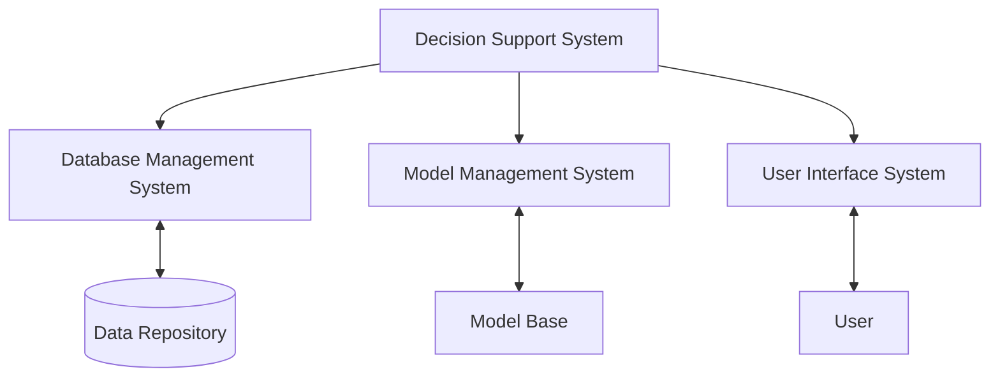

# Decision Support Systems

## Introduction

Decision Support Systems (DSS) are specialized information systems designed to assist humans in making complex decisions. Unlike traditional information systems that focus primarily on data processing, DSS emphasize supporting decision-making processes by providing relevant information, analytical tools, and modeling capabilities.

In today's data-driven world, organizations face increasingly complex decisions that require processing large volumes of information. Decision Support Systems bridge the gap between raw data and actionable insights, enabling decision-makers to make more informed, effective, and timely decisions.

## Core Components of Decision Support Systems

A typical Decision Support System consists of three fundamental components:



### 1. Database Management System (DBMS)

The DBMS component manages the data necessary for decision-making. It provides mechanisms for:

- Data storage and retrieval
- Data security and integrity
- Integration of internal and external data sources

For example, a simple DBMS might store sales data in a structured format:

```javascript
// Example of sales data structure in a DSS database
const salesData = [
  {
    region: "North",
    quarter: "Q1",
    year: 2024,
    product: "Laptop Pro",
    units: 1250,
    revenue: 1250000
  },
  {
    region: "South",
    quarter: "Q1",
    year: 2024,
    product: "Laptop Basic",
    units: 2100,
    revenue: 1470000
  }
  // More records...
];
```

### 2. Model Management System

The model management component contains mathematical and analytical models that transform data into useful information. These may include:

- Statistical models
- Optimization algorithms
- Simulation models
- Machine learning algorithms

Here's a simple example of a decision model using JavaScript:

```javascript
// Simple sales forecasting model for a DSS
function forecastSales(historicalData, growthRate) {
  const forecast = [];
  
  for (let i = 0; i < historicalData.length; i++) {
    const projectedSales = historicalData[i].sales * (1 + growthRate);
    forecast.push({
      period: historicalData[i].period + 1,
      sales: projectedSales,
      growth: growthRate * 100 + "%"
    });
  }
  
  return forecast;
}

// Example usage
const historicalData = [
  { period: 1, sales: 120000 },
  { period: 2, sales: 145000 },
  { period: 3, sales: 160000 }
];

const projectedGrowthRate = 0.05; // 5%
const nextYearForecast = forecastSales(historicalData, projectedGrowthRate);
console.log(nextYearForecast);

/* Output:
[
  { period: 2, sales: 126000, growth: "5%" },
  { period: 3, sales: 152250, growth: "5%" },
  { period: 4, sales: 168000, growth: "5%" }
]
*/
```

### 3. User Interface System

The user interface enables interaction between the decision-maker and the DSS. A well-designed interface should:

- Present information clearly and intuitively
- Allow users to manipulate models and parameters
- Visualize data and results effectively
- Adapt to different user expertise levels

Modern DSS interfaces often utilize dashboards, interactive charts, and customizable views to enhance usability.

## Types of Decision Support Systems

Decision Support Systems can be classified into several categories based on their functionality and focus:

### 1. Data-Driven DSS

These systems focus on accessing and manipulating large data sets, often using database queries, data warehousing, and OLAP (Online Analytical Processing) technologies.

```javascript
// Example of a data query in a data-driven DSS
function analyzeProductPerformance(database, region, timeframe) {
  // Query the database for product sales in the specified region and timeframe
  const productData = database.query(`
    SELECT product, SUM(units) as totalUnits, SUM(revenue) as totalRevenue
    FROM sales
    WHERE region = '${region}' AND date BETWEEN '${timeframe.startDate}' AND '${timeframe.endDate}'
    GROUP BY product
    ORDER BY totalRevenue DESC
  `);
  
  return productData;
}

// Example output:
// [
//   { product: "Laptop Pro", totalUnits: 3450, totalRevenue: 3450000 },
//   { product: "Laptop Basic", totalUnits: 5200, totalRevenue: 3640000 },
//   ...
// ]
```

### 2. Model-Driven DSS

These systems utilize mathematical and analytical models to provide decision support. They often incorporate optimization, simulation, and financial models.

```javascript
// Example of an inventory optimization model in a model-driven DSS
function optimizeInventory(product, demandRate, holdingCost, orderCost) {
  // Economic Order Quantity (EOQ) model
  const economicOrderQuantity = Math.sqrt((2 * demandRate * orderCost) / holdingCost);
  const ordersPerYear = demandRate / economicOrderQuantity;
  const totalAnnualCost = (holdingCost * economicOrderQuantity / 2) + (orderCost * ordersPerYear);
  
  return {
    product: product,
    economicOrderQuantity: Math.round(economicOrderQuantity),
    ordersPerYear: ordersPerYear.toFixed(2),
    totalAnnualCost: totalAnnualCost.toFixed(2)
  };
}

// Example usage
const laptopInventoryStrategy = optimizeInventory("Laptop Pro", 5000, 10, 150);
console.log(laptopInventoryStrategy);

/* Output:
{
  product: "Laptop Pro",
  economicOrderQuantity: 122,
  ordersPerYear: "40.98",
  totalAnnualCost: "6147.54"
}
*/
```

### 3. Knowledge-Driven DSS

Also known as expert systems, these DSS incorporate specialized knowledge and expertise in specific domains to provide recommendations.

```javascript
// Example of a simple rule-based expert system for loan approval
function evaluateLoanApplication(application) {
  let score = 0;
  let feedback = [];
  
  // Credit score evaluation
  if (application.creditScore >= 750) {
    score += 30;
  } else if (application.creditScore >= 650) {
    score += 20;
  } else if (application.creditScore >= 550) {
    score += 10;
    feedback.push("Credit score is moderate.");
  } else {
    feedback.push("Credit score is below our threshold.");
  }
  
  // Debt-to-income ratio evaluation
  if (application.debtToIncomeRatio <= 0.25) {
    score += 30;
  } else if (application.debtToIncomeRatio <= 0.35) {
    score += 20;
  } else if (application.debtToIncomeRatio <= 0.45) {
    score += 10;
    feedback.push("Debt-to-income ratio is higher than preferred.");
  } else {
    feedback.push("Debt-to-income ratio exceeds our guidelines.");
  }
  
  // Employment history evaluation
  if (application.yearsEmployed >= 5) {
    score += 20;
  } else if (application.yearsEmployed >= 2) {
    score += 10;
  } else {
    feedback.push("Employment history is limited.");
  }
  
  // Decision logic
  let decision;
  if (score >= 60) {
    decision = "Approved";
  } else if (score >= 40) {
    decision = "Manual Review Required";
  } else {
    decision = "Denied";
  }
  
  return {
    applicant: application.name,
    score: score,
    decision: decision,
    feedback: feedback
  };
}

// Example usage
const applicant = {
  name: "John Doe",
  creditScore: 695,
  debtToIncomeRatio: 0.3,
  yearsEmployed: 4
};

const loanEvaluation = evaluateLoanApplication(applicant);
console.log(loanEvaluation);

/* Output:
{
  applicant: "John Doe",
  score: 50,
  decision: "Manual Review Required",
  feedback: []
}
*/
```

### 4. Communication-Driven DSS

These systems facilitate collaborative decision-making through communication technologies such as video conferencing, chat, and shared workspaces.

### 5. Document-Driven DSS

These systems manage, retrieve, and manipulate unstructured information in a variety of electronic formats (documents, images, videos).

## Decision Support System Development Process

Building an effective DSS follows a systematic development process:


1. **Requirements Analysis**: Identify the decision problems, stakeholders, and information needs.
2. **System Design**: Design the data structures, models, and user interfaces.
3. **Implementation**: Develop the DSS components and integrate them.
4. **Testing**: Validate the accuracy, usability, and performance of the system.
5. **Deployment**: Install the system and train users.
6. **Maintenance & Evolution**: Update and enhance the system based on user feedback and changing requirements.

## Real-World Applications of Decision Support Systems

Decision Support Systems are used across various domains and industries. Here are some practical examples:

### 1. Healthcare

In healthcare, DSS systems help physicians diagnose diseases, plan treatments, and manage hospital resources.

```javascript
// Example of a simple medical diagnostic DSS
function evaluateSymptoms(patientSymptoms) {
  const possibleDiagnoses = [];
  
  // Check for flu
  const fluSymptoms = ["fever", "cough", "fatigue", "body aches"];
  const fluMatchCount = patientSymptoms.filter(symptom => 
    fluSymptoms.includes(symptom.toLowerCase())
  ).length;
  
  if (fluMatchCount >= 3) {
    possibleDiagnoses.push({
      condition: "Influenza",
      probability: (fluMatchCount / fluSymptoms.length) * 100,
      recommendedTests: ["Rapid Influenza Diagnostic Test"]
    });
  }
  
  // Check for allergic reaction
  const allergySymptoms = ["rash", "itching", "swelling", "sneezing"];
  const allergyMatchCount = patientSymptoms.filter(symptom => 
    allergySymptoms.includes(symptom.toLowerCase())
  ).length;
  
  if (allergyMatchCount >= 2) {
    possibleDiagnoses.push({
      condition: "Allergic Reaction",
      probability: (allergyMatchCount / allergySymptoms.length) * 100,
      recommendedTests: ["Skin Prick Test", "Blood Test for IgE Antibodies"]
    });
  }
  
  return possibleDiagnoses;
}

// Example usage
const patientCase = ["Fever", "Cough", "Fatigue", "Headache"];
const diagnosticResults = evaluateSymptoms(patientCase);
console.log(diagnosticResults);

/* Output:
[
  {
    condition: "Influenza",
    probability: 75,
    recommendedTests: ["Rapid Influenza Diagnostic Test"]
  }
]
*/
```

### 2. Financial Services

Banks and investment firms use DSS for portfolio management, credit scoring, and risk assessment.

```javascript
// Simple investment portfolio optimization DSS
function optimizePortfolio(investmentAmount, riskTolerance) {
  let allocation = {};
  
  // Allocation based on risk tolerance (simplified model)
  if (riskTolerance === "low") {
    allocation = {
      bonds: 0.60,
      bluechipStocks: 0.25,
      indexFunds: 0.10,
      cash: 0.05
    };
  } else if (riskTolerance === "medium") {
    allocation = {
      bonds: 0.40,
      bluechipStocks: 0.30,
      indexFunds: 0.20,
      growthStocks: 0.10
    };
  } else if (riskTolerance === "high") {
    allocation = {
      bonds: 0.20,
      bluechipStocks: 0.25,
      indexFunds: 0.25,
      growthStocks: 0.20,
      emergingMarkets: 0.10
    };
  }
  
  // Calculate actual amounts
  const portfolioAllocation = {};
  for (const [assetClass, percentage] of Object.entries(allocation)) {
    portfolioAllocation[assetClass] = investmentAmount * percentage;
  }
  
  return {
    riskProfile: riskTolerance,
    totalInvestment: investmentAmount,
    allocation: portfolioAllocation
  };
}

// Example usage
const portfolio = optimizePortfolio(100000, "medium");
console.log(portfolio);

/* Output:
{
  riskProfile: "medium",
  totalInvestment: 100000,
  allocation: {
    bonds: 40000,
    bluechipStocks: 30000,
    indexFunds: 20000,
    growthStocks: 10000
  }
}
*/
```

### 3. Supply Chain Management

DSS helps organizations optimize inventory levels, plan distribution routes, and manage supplier relationships.

```javascript
// Example of a logistics route optimization DSS
function optimizeDeliveryRoute(warehouse, deliveryLocations) {
  // This is a simplified version of a route optimization algorithm
  // In real systems, this would use more complex algorithms like
  // genetic algorithms or simulated annealing
  
  let route = [];
  let remainingLocations = [...deliveryLocations];
  let currentLocation = warehouse;
  
  // Simple greedy algorithm - always go to the nearest location next
  while (remainingLocations.length > 0) {
    // Find nearest location to current position
    let nearestIndex = 0;
    let shortestDistance = calculateDistance(
      currentLocation, 
      remainingLocations[0]
    );
    
    for (let i = 1; i < remainingLocations.length; i++) {
      const distance = calculateDistance(
        currentLocation, 
        remainingLocations[i]
      );
      
      if (distance < shortestDistance) {
        nearestIndex = i;
        shortestDistance = distance;
      }
    }
    
    // Add nearest location to route
    const nextLocation = remainingLocations[nearestIndex];
    route.push({
      from: {
        name: currentLocation.name,
        coordinates: [currentLocation.lat, currentLocation.lng]
      },
      to: {
        name: nextLocation.name,
        coordinates: [nextLocation.lat, nextLocation.lng]
      },
      distance: shortestDistance,
      estimatedTime: Math.round(shortestDistance / 50 * 60) // minutes at 50 km/h
    });
    
    // Update current location and remove from remaining locations
    currentLocation = nextLocation;
    remainingLocations.splice(nearestIndex, 1);
  }
  
  // Calculate total distance and time
  const totalDistance = route.reduce((sum, segment) => sum + segment.distance, 0);
  const totalTime = route.reduce((sum, segment) => sum + segment.estimatedTime, 0);
  
  return {
    warehouse: warehouse.name,
    deliverySequence: route.map(r => r.to.name),
    totalDistance: totalDistance.toFixed(2) + " km",
    estimatedDuration: Math.floor(totalTime / 60) + "h " + (totalTime % 60) + "m",
    routeDetails: route
  };
}

function calculateDistance(point1, point2) {
  // Simple Euclidean distance calculation
  // (In a real system, you'd use a more accurate method)
  const latDiff = point1.lat - point2.lat;
  const lngDiff = point1.lng - point2.lng;
  return Math.sqrt(latDiff * latDiff + lngDiff * lngDiff) * 111; // Approx km
}

// Example usage
const warehouseLocation = {
  name: "Central Warehouse",
  lat: 34.052235,
  lng: -118.243683
};

const deliveryPoints = [
  { name: "Customer A", lat: 34.052800, lng: -118.256322 },
  { name: "Customer B", lat: 34.036407, lng: -118.267404 },
  { name: "Customer C", lat: 34.059466, lng: -118.235830 }
];

const deliveryPlan = optimizeDeliveryRoute(warehouseLocation, deliveryPoints);
console.log(deliveryPlan);

/* Output example (values will vary):
{
  warehouse: "Central Warehouse",
  deliverySequence: ["Customer C", "Customer A", "Customer B"],
  totalDistance: "5.83 km",
  estimatedDuration: "0h 7m",
  routeDetails: [...]
}
*/
```

### 4. Marketing and Sales

Marketing departments utilize DSS to analyze customer behavior, optimize pricing strategies, and target promotional campaigns.

## Implementing a Simple DSS in JavaScript

Let's build a simple Decision Support System for product pricing using JavaScript. This example incorporates data management, modeling, and a basic user interface concept:

```javascript
// Simple Product Pricing DSS
class ProductPricingDSS {
  constructor(productData, marketData) {
    this.products = productData;
    this.marketData = marketData;
  }
  
  // Database component: Retrieve product information
  getProductInfo(productId) {
    return this.products.find(p => p.id === productId);
  }
  
  // Model component: Calculate optimal price based on various factors
  calculateOptimalPrice(productId, strategy) {
    const product = this.getProductInfo(productId);
    if (!product) return null;
    
    const marketInfo = this.marketData.find(m => m.category === product.category);
    if (!marketInfo) return null;
    
    let optimalPrice;
    let reasoning = [];
    
    // Base production cost
    const baseCost = product.manufacturingCost + product.overheadCost;
    reasoning.push(`Base cost: $${baseCost} (Manufacturing: $${product.manufacturingCost} + Overhead: $${product.overheadCost})`);
    
    // Different pricing strategies
    switch (strategy) {
      case "cost-plus":
        // Simple markup based on costs
        const markup = product.category === "luxury" ? 2.5 : 1.5; // 150% or 250% markup
        optimalPrice = baseCost * markup;
        reasoning.push(`Applied ${(markup-1)*100}% markup (${product.category} category)`);
        break;
        
      case "value-based":
        // Price based on perceived customer value
        const valueMultiplier = marketInfo.customerValuePerception;
        optimalPrice = baseCost * valueMultiplier;
        reasoning.push(`Applied value multiplier of ${valueMultiplier} based on customer perception`);
        
        // Adjust for brand positioning
        if (product.brandStrength === "strong") {
          optimalPrice *= 1.2;
          reasoning.push("Applied 20% premium for strong brand positioning");
        }
        break;
        
      case "competitive":
        // Price based on competitor pricing
        optimalPrice = marketInfo.averageCompetitorPrice;
        reasoning.push(`Starting with average competitor price: $${optimalPrice}`);
        
        // Adjust based on product differentiation
        if (product.differentiationLevel === "high") {
          optimalPrice *= 1.15;
          reasoning.push("Applied 15% premium for high product differentiation");
        } else if (product.differentiationLevel === "low") {
          optimalPrice *= 0.95;
          reasoning.push("Applied 5% discount due to low product differentiation");
        }
        break;
        
      default:
        optimalPrice = baseCost * 1.5; // Default markup
        reasoning.push("Applied default 50% markup");
    }
    
    // Ensure minimum profit margin
    const minimumPrice = baseCost * 1.1; // At least 10% profit
    if (optimalPrice < minimumPrice) {
      optimalPrice = minimumPrice;
      reasoning.push(`Adjusted to minimum viable price of $${minimumPrice.toFixed(2)} to ensure 10% profit margin`);
    }
    
    return {
      productId: product.id,
      productName: product.name,
      category: product.category,
      currentPrice: product.currentPrice,
      recommendedPrice: optimalPrice.toFixed(2),
      pricingStrategy: strategy,
      pricingReasoning: reasoning,
      potentialRevenue: (optimalPrice * product.estimatedDemand).toFixed(2),
      profitMargin: ((optimalPrice - baseCost) / optimalPrice * 100).toFixed(2) + "%"
    };
  }
  
  // Compare different pricing strategies
  compareStrategies(productId) {
    const strategies = ["cost-plus", "value-based", "competitive"];
    return strategies.map(strategy => this.calculateOptimalPrice(productId, strategy));
  }
}

// Example data
const productData = [
  {
    id: "P001",
    name: "Premium Headphones",
    category: "electronics",
    manufacturingCost: 45.00,
    overheadCost: 15.00,
    currentPrice: 129.99,
    brandStrength: "strong",
    differentiationLevel: "high",
    estimatedDemand: 5000
  },
  {
    id: "P002",
    name: "Basic Headphones",
    category: "electronics",
    manufacturingCost: 20.00,
    overheadCost: 10.00,
    currentPrice: 49.99,
    brandStrength: "weak",
    differentiationLevel: "low",
    estimatedDemand: 12000
  }
];

const marketData = [
  {
    category: "electronics",
    customerValuePerception: 2.2,
    averageCompetitorPrice: 89.99,
    marketGrowthRate: 0.05
  }
];

// Initialize the DSS
const pricingDSS = new ProductPricingDSS(productData, marketData);

// Example usage
const productToAnalyze = "P001";
const pricingAnalysis = pricingDSS.compareStrategies(productToAnalyze);
console.log(pricingAnalysis);

/* Output example:
[
  {
    productId: "P001",
    productName: "Premium Headphones",
    category: "electronics",
    currentPrice: 129.99,
    recommendedPrice: "150.00",
    pricingStrategy: "cost-plus",
    pricingReasoning: [
      "Base cost: $60 (Manufacturing: $45 + Overhead: $15)",
      "Applied 150% markup (electronics category)"
    ],
    potentialRevenue: "750000.00",
    profitMargin: "60.00%"
  },
  {
    productId: "P001",
    productName: "Premium Headphones",
    category: "electronics",
    currentPrice: 129.99,
    recommendedPrice: "158.40",
    pricingStrategy: "value-based",
    pricingReasoning: [
      "Base cost: $60 (Manufacturing: $45 + Overhead: $15)",
      "Applied value multiplier of 2.2 based on customer perception",
      "Applied 20% premium for strong brand positioning"
    ],
    potentialRevenue: "792000.00",
    profitMargin: "62.12%"
  },
  {
    productId: "P001",
    productName: "Premium Headphones",
    category: "electronics",
    currentPrice: 129.99,
    recommendedPrice: "103.49",
    pricingStrategy: "competitive",
    pricingReasoning: [
      "Base cost: $60 (Manufacturing: $45 + Overhead: $15)",
      "Starting with average competitor price: $89.99",
      "Applied 15% premium for high product differentiation"
    ],
    potentialRevenue: "517450.00",
    profitMargin: "42.02%"
  }
]
*/
```

This example demonstrates a basic DSS that helps pricing managers make data-driven decisions about product pricing. The system analyzes costs, market conditions, and competitive factors to recommend optimal pricing strategies.

## Benefits and Limitations of Decision Support Systems

### Benefits

1. **Improved Decision Quality**: DSS provides access to more information and analytical tools, leading to better-informed decisions.
2. **Increased Efficiency**: Automating routine analytical tasks saves time and resources.
3. **Enhanced Communication**: DSS facilitates sharing insights and reasoning among stakeholders.
4. **Organizational Learning**: The system can capture decision-making knowledge and build institutional memory.

### Limitations

1. **Data Quality Issues**: The quality of DSS output depends on the quality of input data ("garbage in, garbage out").
2. **Model Limitations**: Models are simplifications of reality and may not capture all relevant factors.
3. **Implementation Challenges**: Building effective DSS requires technical expertise and domain knowledge.
4. **User Adoption**: Users may resist using DSS if they don't understand or trust the system.

## Future Trends in Decision Support Systems

The field of Decision Support Systems continues to evolve with emerging technologies:

1. **Artificial Intelligence and Machine Learning**: AI-powered DSS can learn from past decisions and adapt their models accordingly.
2. **Big Data Analytics**: Modern DSS increasingly incorporates techniques for analyzing large, complex datasets.
3. **Mobile DSS**: Decision support tools are becoming available on mobile devices, enabling decision-making anywhere.
4. **Cloud-Based DSS**: Cloud computing provides scalable resources for data-intensive decision support applications.
5. **Collaborative DSS**: Enhanced tools for group decision-making across distributed teams.

## Summary

Decision Support Systems are specialized information systems designed to assist humans in making complex decisions by providing relevant information, analytical tools, and modeling capabilities. Key components include database management systems, model management systems, and user interfaces.

DSS comes in various types, including data-driven, model-driven, knowledge-driven, communication-driven, and document-driven systems. These systems find applications across numerous domains, from healthcare and finance to supply chain management and marketing.

While DSS offers significant benefits in terms of decision quality, efficiency, and organizational learning, it also faces challenges related to data quality, model limitations, and user adoption.

As technology continues to advance, Decision Support Systems are evolving to incorporate artificial intelligence, big data analytics, mobile access, cloud computing, and enhanced collaboration capabilities.

## Practice Exercises

1. **Data Analysis Exercise**: Using the product pricing DSS example provided in this tutorial, modify the code to include seasonal factors in the pricing model.

2. **Model Development**: Create a simple DSS for academic course selection that helps students choose courses based on their interests, career goals, and prerequisites.

3. **Real-World Application Analysis**: Research and analyze a real-world DSS implementation in an industry of your choice. Identify its components, benefits, and limitations.

4. **Design Exercise**: Design a decision support dashboard for a small e-commerce business to help the owner track key performance indicators and make inventory decisions.

## Additional Resources

- **Books**:
  - "Decision Support Systems and Intelligent Systems" by Efraim Turban
  - "Decision Support and Business Intelligence Systems" by Ephraim R. McLean and Efraim Turban

- **Online Courses**:
  - Data Science for Business Decision Making
  - Business Intelligence and Data Analytics

- **Tools**:
  - Tableau (for data visualization and analysis)
  - Power BI (for business intelligence dashboards)
  - R and Python (for custom DSS development)

- **Communities**:
  - Data Science Stack Exchange
  - Business Intelligence Stack Exchange