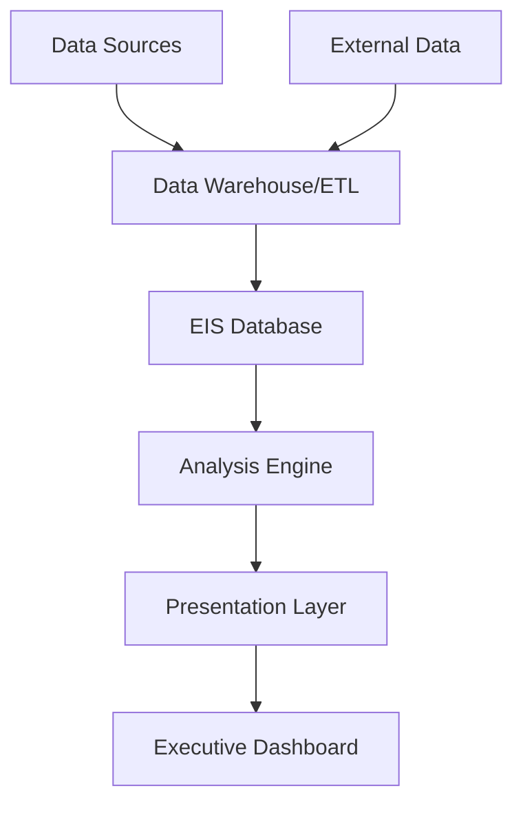

# Executive Information Systems

## Introduction

Executive Information Systems (EIS) are specialized information systems designed to facilitate decision-making processes for executives and senior managers within an organization. Unlike traditional management information systems that cater to operational and tactical levels, EIS focuses on strategic decision-making by providing easy access to critical internal and external information relevant to meeting an organization's strategic goals.

EIS emerged in the late 1980s as computing technology advanced enough to deliver real-time data analysis capabilities to executive leadership. These systems represent a pinnacle in the hierarchy of business information systems, sitting above operational and management-level systems to serve the unique needs of top decision-makers.

## Key Characteristics of Executive Information Systems

EIS platforms are distinguished by several key characteristics that make them valuable tools for executive decision-making:

1. **Executive-Focused Design**: Tailored specifically for top-level executives rather than operational managers
2. **Drill-Down Capability**: Ability to navigate from high-level summaries to detailed information
3. **Status Tracking**: Real-time monitoring of key performance indicators (KPIs)
4. **Trend Analysis**: Historical data comparison and pattern identification
5. **Exception Reporting**: Automatic highlighting of unusual or critical situations
6. **External Data Integration**: Incorporation of market data, competitor information, and industry trends
7. **Intuitive Interface**: Easy-to-use, often graphical interfaces requiring minimal training

## Architecture of an Executive Information System

An effective EIS typically consists of several interconnected components working together to deliver actionable insights to executives.



### 1. Data Sources

EIS draws data from multiple internal systems including:

- Enterprise Resource Planning (ERP) systems
- Customer Relationship Management (CRM) platforms
- Financial management systems
- Human resources databases
- Production management systems

### 2. Data Warehouse

Raw data from various sources is cleaned, transformed, and stored in a centralized data warehouse using Extract, Transform, Load (ETL) processes.

```javascript
// Example ETL process pseudocode
function extractTransformLoad() {
  // Extract data from multiple sources
  const salesData = extractFromDatabase('sales_db');
  const customerData = extractFromCRM('crm_system');
  const marketData = extractFromAPI('market_api');
  
  // Transform data to consistent format
  const transformedData = transform([salesData, customerData, marketData]);
  
  // Load into data warehouse
  loadToWarehouse(transformedData, 'executive_warehouse');
  
  console.log('ETL process completed successfully');
}
```

### 3. Analysis Engine

The analysis engine applies business intelligence techniques to process the stored data:

- Multidimensional analysis (OLAP)
- Statistical analysis
- Data mining
- Predictive modeling

### 4. Presentation Layer

This component transforms complex data analysis into intuitive visualizations:

- Dashboards with KPI indicators
- Interactive charts and graphs
- Heat maps and geographic representations
- Trend lines and forecasts

## Implementing an Executive Information System

Implementing an effective EIS requires careful planning and execution following these key steps:

### 1. Requirements Analysis

Begin by identifying the specific information needs of executives:

- Which KPIs are critical to monitor?
- What strategic decisions need to be supported?
- What information gaps exist in current reporting?

### 2. Data Source Identification

Map all required data sources and assess data quality:

```javascript
// Example data source mapping
const dataSources = [
  {
    name: 'Sales Database',
    type: 'SQL Server',
    updateFrequency: 'Hourly',
    keyMetrics: ['Revenue', 'Units Sold', 'Customer Acquisition Cost'],
    qualityIssues: ['Occasional duplicate entries', 'Time zone inconsistencies']
  },
  {
    name: 'Customer Feedback System',
    type: 'NoSQL Database',
    updateFrequency: 'Real-time',
    keyMetrics: ['Customer Satisfaction Score', 'Net Promoter Score'],
    qualityIssues: ['Unstructured data format', 'Varying response rates']
  }
];
```

### 3. Dashboard Design

Create mockups of executive dashboards with appropriate visualizations:

- Focus on clarity and immediate insight
- Apply data visualization best practices
- Include drill-down capabilities
- Ensure mobile accessibility

### 4. System Integration

Develop the necessary connections between source systems and the EIS:

- Design and implement ETL processes
- Create data warehouse schema
- Establish refresh schedules
- Configure security parameters

### 5. Deployment and Training

Roll out the system with appropriate executive training:

- Provide guided walkthroughs
- Create quick reference materials
- Establish support channels
- Gather feedback for improvements

## Real-World Applications of EIS

### Case 1: Retail Chain Dashboard

A retail chain's EIS might feature a dashboard showing:

```javascript
// Sample dashboard configuration
const retailDashboard = {
  title: 'Executive Retail Performance Overview',
  refreshRate: '15 minutes',
  primaryMetrics: [
    {
      name: 'Same Store Sales Growth',
      visualization: 'Trend Line',
      comparison: 'Year-over-Year',
      alertThreshold: '-2%'
    },
    {
      name: 'Inventory Turnover',
      visualization: 'Gauge Chart',
      target: '12 turns/year',
      current: '10.8 turns/year'
    },
    {
      name: 'Customer Satisfaction',
      visualization: 'Heatmap by Region',
      scale: [0, 100]
    }
  ],
  drillDownOptions: ['Store', 'Product Category', 'Time Period']
};
```

This dashboard allows retail executives to quickly identify underperforming regions, inventory issues, or customer satisfaction problems that require strategic intervention.

### Case 2: Manufacturing Executive System

A manufacturing company's EIS might focus on production efficiency, quality metrics, and supply chain performance:

- **Production Efficiency Dashboard**: Visual representation of OEE (Overall Equipment Effectiveness) across plants
- **Quality Control Metrics**: Defect rates with automatic alerts for unusual patterns
- **Supply Chain Risk Monitor**: Real-time view of potential disruptions and inventory impacts

### Case 3: Healthcare Executive Dashboard

Healthcare executives use EIS to monitor critical metrics across their organization:

- **Patient Satisfaction Trends**: Aggregated survey results with benchmarking
- **Resource Utilization**: Bed occupancy rates, staff allocation effectiveness
- **Financial Performance**: Revenue cycle metrics, payer mix analysis, expense trends

## Benefits and Limitations

### Key Benefits

1. **Improved Decision-Making**: Faster access to relevant information enables more timely and informed decisions
2. **Competitive Advantage**: Better market awareness and ability to respond to changes quickly
3. **Efficiency Gains**: Reduced time spent gathering and analyzing information
4. **Strategic Alignment**: Easier tracking of strategic objectives and progress
5. **Information Democracy**: Greater transparency of organizational performance across leadership

### Limitations

1. **Implementation Cost**: Significant investment in technology and integration
2. **Data Quality Dependencies**: System effectiveness relies on accurate source data
3. **Change Management Challenges**: Executives must adapt to new decision-making processes
4. **Information Overload Risk**: Poorly designed systems can overwhelm rather than clarify
5. **Maintenance Requirements**: Ongoing updates and adjustments needed as business evolves

## Future Trends in Executive Information Systems

Several emerging technologies are reshaping the future of EIS:

### 1. Artificial Intelligence Integration

Modern EIS increasingly incorporates AI to provide:

- Anomaly detection in business metrics
- Natural language processing for report generation
- Predictive analytics for forecasting
- Prescriptive recommendations for decision-making

```javascript
// Example of AI-enhanced anomaly detection
function detectAnomalies(timeSeriesData) {
  // Calculate moving average and standard deviation
  const movingStats = calculateMovingStatistics(timeSeriesData, 30);
  
  // Identify points outside 3 standard deviations
  const anomalies = timeSeriesData.filter((point, index) => {
    return Math.abs(point - movingStats.average[index]) > 
           (3 * movingStats.stdDev[index]);
  });
  
  // Generate executive notifications for anomalies
  if (anomalies.length > 0) {
    notifyExecutives({
      title: 'Anomalies Detected',
      metrics: 'Sales Performance',
      anomalyCount: anomalies.length,
      significance: calculateImpact(anomalies)
    });
  }
  
  return anomalies;
}
```

### 2. Voice-Activated Interfaces

Voice-based EIS interactions allow executives to:

- Request specific metrics through natural language
- Receive verbal summaries of key performance indicators
- Issue commands for deeper analysis without touching a device

### 3. Augmented Reality Visualizations

AR technology is beginning to transform how executives interact with data:

- 3D visualizations of complex data relationships
- Spatial arrangement of information for intuitive understanding
- Interactive exploration of business scenarios

### 4. Real-Time External Data Integration

Modern EIS systems are increasingly incorporating external data streams:

- Social media sentiment analysis
- Competitor pricing and promotion monitoring
- Regulatory change tracking
- Market trend identification

## Summary

Executive Information Systems represent specialized tools designed to meet the unique information needs of organizational leaders. By consolidating critical data from various sources, applying advanced analytics, and presenting insights through intuitive visualizations, EIS empowers executives to make better-informed strategic decisions.

As technology continues to evolve, EIS platforms are incorporating artificial intelligence, voice interfaces, and augmented reality to deliver even more powerful decision support capabilities. The most effective implementations carefully balance technological sophistication with simplicity of use, ensuring executives receive actionable insights without information overload.

## Exercises

1. **Design Exercise**: Sketch an executive dashboard for a company in an industry of your choice. What key metrics would you include and why?

2. **Analysis Challenge**: Identify three external data sources that would be valuable to integrate into an EIS for a retail company. Explain how each would inform executive decision-making.

3. **Implementation Planning**: Create a high-level project plan for implementing an EIS in a medium-sized organization, including key milestones and potential challenges.

4. **Evaluation Framework**: Develop criteria for measuring the success of an EIS implementation. How would you determine if the system is delivering value to executives?

5. **Future Technology Research**: Investigate an emerging technology not mentioned in this article that could enhance executive information systems. Write a brief explanation of how it could be applied.

## Additional Resources

- **Books**:
  - "Decision Support and Business Intelligence Systems" by Efraim Turban
  - "Information Dashboard Design" by Stephen Few
  - "Competing on Analytics" by Thomas H. Davenport

- **Online Courses**:
  - Data Visualization for Executives
  - Business Intelligence Fundamentals
  - Strategic Decision-Making with Data

- **Communities**:
  - Business Intelligence Professionals Network
  - Data Visualization Society
  - Chief Information Officers Forum