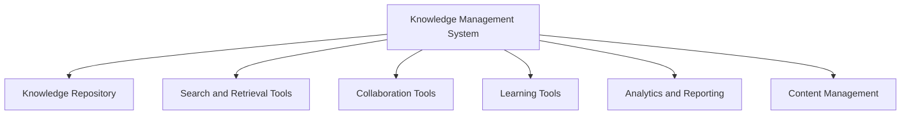

# Knowledge Management Systems

## Introduction

Knowledge Management Systems (KMS) are specialized software tools designed to create, organize, store, share, and utilize knowledge within organizations. In today's information-driven world, knowledge is a critical asset that needs to be effectively managed to drive innovation, improve decision-making, and maintain competitive advantage.

Think of a Knowledge Management System as a digital brain for your organization - it captures what everyone knows, makes it searchable, and ensures that valuable insights aren't lost when people leave or switch roles.

## What is Knowledge Management?

Before diving into the systems, let's understand what knowledge management actually means.

Knowledge management is the process of capturing, distributing, and effectively using knowledge. It involves:

1. **Knowledge Creation**: Generating new ideas, insights, and understanding
2. **Knowledge Acquisition**: Obtaining knowledge from external sources
3. **Knowledge Storage**: Preserving knowledge in a retrievable format
4. **Knowledge Sharing**: Distributing knowledge to those who need it
5. **Knowledge Application**: Using knowledge to solve problems and make decisions

## Types of Knowledge

In knowledge management, we typically categorize knowledge into two main types:

### Explicit Knowledge

This is formal, codified knowledge that can be easily documented, organized, and transferred. Examples include:
- Instruction manuals
- Research papers
- Databases
- Process documentation
- Training materials

### Tacit Knowledge

This is personal, experience-based knowledge that is difficult to formalize and communicate. Examples include:
- Personal insights
- Intuition
- Professional expertise
- Mental models
- Know-how gained through experience

A good Knowledge Management System aims to capture both types, though tacit knowledge presents a greater challenge.

## Components of a Knowledge Management System

A comprehensive KMS typically includes the following components:



Let's explore each of these components:

1. **Knowledge Repository**: A centralized database where knowledge is stored
2. **Search and Retrieval Tools**: Systems that help users find relevant information
3. **Collaboration Tools**: Features that enable knowledge sharing and co-creation
4. **Learning Tools**: Resources that help users learn from the stored knowledge
5. **Analytics and Reporting**: Capabilities to measure knowledge usage and effectiveness
6. **Content Management**: Tools to create, update, and organize knowledge assets

## Building a Simple Knowledge Management System

Let's implement a basic Knowledge Management System using JavaScript. We'll create a simple application that allows users to:
- Add knowledge items
- Search for knowledge
- Tag and categorize information
- Share knowledge with others

### Step 1: Define Knowledge Item Structure

First, let's define what a knowledge item looks like:

```javascript
class KnowledgeItem {
  constructor(title, content, author, tags, category) {
    this.id = Date.now(); // Simple unique ID
    this.title = title;
    this.content = content;
    this.author = author;
    this.tags = tags; // Array of string tags
    this.category = category;
    this.dateCreated = new Date();
    this.dateModified = new Date();
    this.views = 0;
    this.likes = 0;
  }
}
```

### Step 2: Create the Knowledge Repository

Now, let's implement a simple repository to store and retrieve knowledge items:

```javascript
class KnowledgeRepository {
  constructor() {
    this.items = [];
  }
  
  addItem(knowledgeItem) {
    this.items.push(knowledgeItem);
    return knowledgeItem.id;
  }
  
  getItemById(id) {
    const item = this.items.find(item => item.id === id);
    if (item) {
      item.views += 1; // Increment view count
      return item;
    }
    return null;
  }
  
  searchItems(query) {
    query = query.toLowerCase();
    return this.items.filter(item => 
      item.title.toLowerCase().includes(query) || 
      item.content.toLowerCase().includes(query) ||
      item.tags.some(tag => tag.toLowerCase().includes(query))
    );
  }
  
  getItemsByCategory(category) {
    return this.items.filter(item => item.category === category);
  }
  
  getItemsByTag(tag) {
    return this.items.filter(item => item.tags.includes(tag));
  }
  
  updateItem(id, updates) {
    const itemIndex = this.items.findIndex(item => item.id === id);
    if (itemIndex >= 0) {
      this.items[itemIndex] = {...this.items[itemIndex], ...updates, dateModified: new Date()};
      return true;
    }
    return false;
  }
  
  deleteItem(id) {
    const initialLength = this.items.length;
    this.items = this.items.filter(item => item.id !== id);
    return this.items.length !== initialLength;
  }
}
```

### Step 3: Implement User Interface Functions

Let's add some functions that would connect to a user interface:

```javascript
class KnowledgeManagementSystem {
  constructor() {
    this.repository = new KnowledgeRepository();
    this.activeUsers = [];
  }
  
  createKnowledgeItem(title, content, author, tags, category) {
    const newItem = new KnowledgeItem(title, content, author, tags, category);
    const id = this.repository.addItem(newItem);
    console.log(`New knowledge item created with ID: ${id}`);
    return id;
  }
  
  searchKnowledge(query) {
    const results = this.repository.searchItems(query);
    console.log(`Found ${results.length} items matching query: "${query}"`);
    return results;
  }
  
  likeKnowledgeItem(id) {
    const item = this.repository.getItemById(id);
    if (item) {
      item.likes += 1;
      this.repository.updateItem(id, {likes: item.likes});
      console.log(`Item ${id} now has ${item.likes} likes`);
      return true;
    }
    console.log(`Item ${id} not found`);
    return false;
  }
  
  getMostPopularItems(limit = 10) {
    return [...this.repository.items]
      .sort((a, b) => (b.views + b.likes) - (a.views + a.likes))
      .slice(0, limit);
  }
  
  getRecentItems(limit = 10) {
    return [...this.repository.items]
      .sort((a, b) => b.dateCreated - a.dateCreated)
      .slice(0, limit);
  }
}
```

### Step 4: Usage Example

Here's how you might use this simple Knowledge Management System:

```javascript
// Initialize the KMS
const kms = new KnowledgeManagementSystem();

// Add some knowledge items
const javascriptBasicsId = kms.createKnowledgeItem(
  "JavaScript Basics", 
  "JavaScript is a programming language that adds interactivity to your website...",
  "John Doe",
  ["javascript", "programming", "web development"],
  "Programming Languages"
);

const htmlGuideId = kms.createKnowledgeItem(
  "HTML Complete Guide", 
  "HTML (HyperText Markup Language) is the standard markup language for documents...",
  "Jane Smith",
  ["html", "web development", "markup"],
  "Web Development"
);

// Search for knowledge
const searchResults = kms.searchKnowledge("javascript");
console.log(searchResults);
// Output: Array containing the JavaScript Basics item

// Like an item
kms.likeKnowledgeItem(javascriptBasicsId);

// Get popular items
const popularItems = kms.getMostPopularItems(5);
console.log(popularItems);
// Output: Array of items sorted by popularity (views + likes)
```

## Real-World Applications of Knowledge Management Systems

Knowledge Management Systems are used across various industries and contexts:

### Corporate Environment

- **Employee Onboarding**: New hires can quickly access company procedures, policies, and best practices
- **Problem Solving**: Employees can find solutions to common problems without reinventing the wheel
- **Expertise Location**: Identify subject matter experts within the organization

### Tech Support

- **Troubleshooting Databases**: Support agents can access solutions to common technical issues
- **Self-Service Portals**: Customers can find answers without contacting support

### Software Development

- **Code Repositories**: Store and share code snippets and programming solutions
- **Documentation**: Maintain up-to-date documentation on APIs, libraries, and frameworks
- **Best Practices**: Share coding standards and design patterns

### Healthcare

- **Medical Knowledge Base**: Store treatment protocols and medical research
- **Patient Care Management**: Track patient history and treatment plans

## Implementing a Knowledge Management System: Best Practices

When building or selecting a Knowledge Management System, consider these best practices:

1. **Focus on User Experience**: Make it easy for users to contribute and find knowledge
2. **Implement Robust Search**: Ensure your search functionality is powerful and intuitive
3. **Encourage Collaboration**: Build features that promote knowledge sharing
4. **Maintain Currency**: Establish processes to update and verify information regularly
5. **Measure Usage**: Track how knowledge is being used to identify valuable content
6. **Integrate with Existing Systems**: Connect with tools your team already uses
7. **Balance Structure and Flexibility**: Provide enough structure for organization while allowing for flexibility in knowledge capture

## Advanced KMS Features

As your Knowledge Management System matures, consider implementing these advanced features:

### AI-Enhanced Knowledge Discovery

Modern KMS platforms often incorporate machine learning to improve search and recommendations:

```javascript
// Pseudo-code for an AI recommendation system
class AIRecommendationEngine {
  constructor(knowledgeRepository) {
    this.repository = knowledgeRepository;
    this.userBehaviorData = {};
  }
  
  trackUserInteraction(userId, itemId, interactionType) {
    if (!this.userBehaviorData[userId]) {
      this.userBehaviorData[userId] = [];
    }
    
    this.userBehaviorData[userId].push({
      itemId,
      interactionType,
      timestamp: Date.now()
    });
  }
  
  getPersonalizedRecommendations(userId, limit = 5) {
    // In a real system, this would use machine learning algorithms
    // This is a simplified example based on user's past interactions
    
    const userInteractions = this.userBehaviorData[userId] || [];
    
    // Get the categories and tags this user has shown interest in
    const interestCategories = new Set();
    const interestTags = new Set();
    
    userInteractions.forEach(interaction => {
      const item = this.repository.getItemById(interaction.itemId);
      if (item) {
        interestCategories.add(item.category);
        item.tags.forEach(tag => interestTags.add(tag));
      }
    });
    
    // Find items matching these interests that the user hasn't viewed
    const viewedItemIds = new Set(
      userInteractions
        .filter(i => i.interactionType === 'view')
        .map(i => i.itemId)
    );
    
    const recommendations = this.repository.items.filter(item => 
      !viewedItemIds.has(item.id) && (
        interestCategories.has(item.category) ||
        item.tags.some(tag => interestTags.has(tag))
      )
    );
    
    // Sort by relevance (here simplified as matching tag count)
    recommendations.sort((a, b) => {
      const aRelevance = a.tags.filter(tag => interestTags.has(tag)).length;
      const bRelevance = b.tags.filter(tag => interestTags.has(tag)).length;
      return bRelevance - aRelevance;
    });
    
    return recommendations.slice(0, limit);
  }
}
```

### Knowledge Visualization

Visualizing relationships between knowledge items can help users discover connections:

```javascript
// Pseudo-code for knowledge graph visualization
class KnowledgeGraph {
  constructor(knowledgeRepository) {
    this.repository = knowledgeRepository;
    this.graph = {
      nodes: [],
      edges: []
    };
  }
  
  buildGraph() {
    // Create nodes for each knowledge item
    this.repository.items.forEach(item => {
      this.graph.nodes.push({
        id: item.id,
        label: item.title,
        type: 'knowledge',
        category: item.category
      });
      
      // Create nodes for each tag and category if they don't exist
      item.tags.forEach(tag => {
        if (!this.graph.nodes.some(node => node.id === `tag-${tag}`)) {
          this.graph.nodes.push({
            id: `tag-${tag}`,
            label: tag,
            type: 'tag'
          });
        }
        
        // Create edges between items and tags
        this.graph.edges.push({
          source: item.id,
          target: `tag-${tag}`,
          type: 'has-tag'
        });
      });
      
      if (!this.graph.nodes.some(node => node.id === `category-${item.category}`)) {
        this.graph.nodes.push({
          id: `category-${item.category}`,
          label: item.category,
          type: 'category'
        });
      }
      
      // Create edge between item and category
      this.graph.edges.push({
        source: item.id,
        target: `category-${item.category}`,
        type: 'belongs-to'
      });
    });
    
    // Find related items based on shared tags
    this.repository.items.forEach(itemA => {
      this.repository.items.forEach(itemB => {
        if (itemA.id !== itemB.id) {
          const sharedTags = itemA.tags.filter(tag => itemB.tags.includes(tag));
          if (sharedTags.length > 0) {
            this.graph.edges.push({
              source: itemA.id,
              target: itemB.id,
              type: 'related',
              weight: sharedTags.length
            });
          }
        }
      });
    });
    
    return this.graph;
  }
  
  getRelatedItems(itemId, depth = 1) {
    // Implementation would traverse the graph to find related items
    // at the specified depth level
    // This is a simplified placeholder
    const relatedIds = new Set();
    
    const addRelated = (id, currentDepth) => {
      if (currentDepth > depth) return;
      
      const edges = this.graph.edges.filter(edge => 
        (edge.source === id || edge.target === id) && 
        edge.type === 'related'
      );
      
      edges.forEach(edge => {
        const relatedId = edge.source === id ? edge.target : edge.source;
        if (relatedId !== itemId && !relatedIds.has(relatedId)) {
          relatedIds.add(relatedId);
          addRelated(relatedId, currentDepth + 1);
        }
      });
    };
    
    addRelated(itemId, 1);
    
    return Array.from(relatedIds).map(id => 
      this.repository.getItemById(id)
    ).filter(item => item !== null);
  }
}
```

## Challenges in Knowledge Management

While Knowledge Management Systems offer numerous benefits, they also come with challenges:

1. **User Adoption**: Getting employees to consistently use and contribute to the system
2. **Knowledge Quality**: Ensuring information is accurate, relevant, and up-to-date
3. **Information Overload**: Managing large volumes of information effectively
4. **Tacit Knowledge Capture**: Converting implicit knowledge into explicit documentation
5. **Security and Access Control**: Balancing sharing with proper access restrictions
6. **Measuring ROI**: Quantifying the benefits of knowledge management

## Summary

Knowledge Management Systems are powerful tools for capturing, organizing, and sharing valuable organizational knowledge. By implementing a well-designed KMS, organizations can:

- Preserve institutional knowledge
- Improve decision-making
- Enhance collaboration
- Accelerate innovation
- Reduce redundant work
- Enable faster employee onboarding

As information continues to grow exponentially, effective knowledge management becomes not just advantageous but essential for organizational success.

## Exercises

1. **Basic KMS Implementation**: Extend the example code to include user authentication and access control.
2. **Knowledge Taxonomy**: Design a categorization system for a KMS in a domain of your choice.
3. **UI Prototype**: Sketch a user interface for a Knowledge Management System focusing on ease of use.
4. **Knowledge Capture Process**: Develop a process to systematically capture tacit knowledge from experts.
5. **Metrics Design**: Create metrics to evaluate the effectiveness of a Knowledge Management System.

## Additional Resources

- **Books**:
  - "Knowledge Management Systems: Theory and Practice" by Stuart Barnes
  - "The Knowledge Management Toolkit" by Amrit Tiwana

- **Online Courses**:
  - Knowledge Management Fundamentals
  - Information Architecture and Organization

- **Technologies**:
  - Document Management Systems
  - Enterprise Wikis
  - Content Management Systems
  - Collaboration Platforms