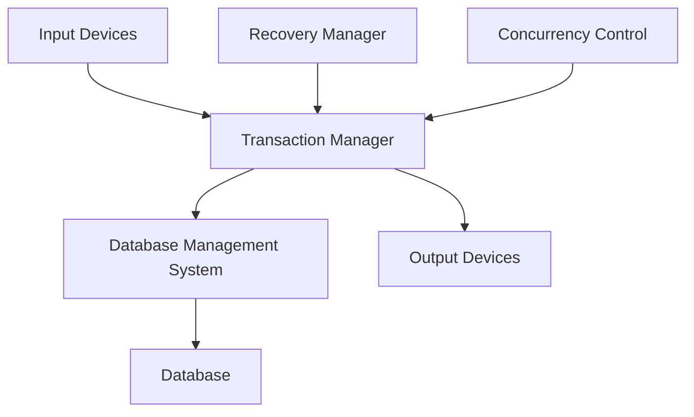
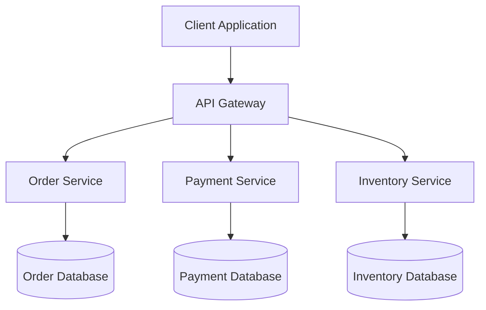

# Transaction Processing Systems

## Introduction

Transaction Processing Systems (TPS) are specialized information systems designed to process and record day-to-day business transactions. These systems form the backbone of many critical business operations, from banking and e-commerce to inventory management and airline reservations. In this guide, we'll explore what makes transaction processing systems unique, how they work, and why they're essential for many applications.

## What is a Transaction?

Before diving into transaction processing systems, let's understand what a transaction is in the context of information systems:

A **transaction** is a logical unit of work that must be either completely processed or completely canceled. It represents a sequence of operations that transforms data from one consistent state to another.

For example, when you transfer money from one bank account to another, the complete transaction includes:
1. Verifying you have sufficient funds
2. Deducting money from your account
3. Adding money to the recipient's account
4. Recording the transaction details

Either all of these steps must succeed, or none should take effect.

## ACID Properties of Transactions

Transaction Processing Systems implement ACID properties to ensure data integrity and reliability:

- **Atomicity**: A transaction is treated as a single, indivisible unit that either succeeds completely or fails completely.
- **Consistency**: A transaction transforms the database from one valid state to another, maintaining all defined rules and constraints.
- **Isolation**: Concurrent transactions execute as if they were running sequentially, without interference.
- **Durability**: Once a transaction is committed, its effects persist even in the event of a system failure.

## Components of a Transaction Processing System

A typical TPS consists of several key components:



1. **Input Sources**: Terminals, web forms, mobile apps, or IoT devices where transactions originate
2. **Transaction Manager**: Software that coordinates transaction execution and ensures ACID properties
3. **Database Management System (DBMS)**: Stores and retrieves data
4. **Recovery Manager**: Handles system failures and ensures durability
5. **Concurrency Control**: Manages simultaneous transactions to ensure isolation
6. **Output Devices**: Reports, receipts, notifications, or displays showing transaction results

## Implementing a Simple Transaction System

Let's look at a basic example of implementing transaction processing in a Python application using a SQL database:

```python
import sqlite3

def transfer_funds(connection, from_account, to_account, amount):
    try:
        # Start transaction
        cursor = connection.cursor()
        
        # Check sufficient funds
        cursor.execute("SELECT balance FROM accounts WHERE account_id = ?", (from_account,))
        from_balance = cursor.fetchone()[0]
        
        if from_balance < amount:
            print("Insufficient funds")
            return False
        
        # Deduct from sender
        cursor.execute(
            "UPDATE accounts SET balance = balance - ? WHERE account_id = ?", 
            (amount, from_account)
        )
        
        # Add to recipient
        cursor.execute(
            "UPDATE accounts SET balance = balance + ? WHERE account_id = ?", 
            (amount, to_account)
        )
        
        # Record the transaction
        cursor.execute(
            "INSERT INTO transactions (from_account, to_account, amount) VALUES (?, ?, ?)",
            (from_account, to_account, amount)
        )
        
        # Commit transaction
        connection.commit()
        print("Transfer successful")
        return True
        
    except Exception as e:
        # Roll back on error
        connection.rollback()
        print(f"Transfer failed: {e}")
        return False

# Example usage
connection = sqlite3.connect('bank.db')

# Create tables if they don't exist
connection.execute('''
CREATE TABLE IF NOT EXISTS accounts 
(account_id TEXT PRIMARY KEY, balance REAL)
''')

connection.execute('''
CREATE TABLE IF NOT EXISTS transactions
(id INTEGER PRIMARY KEY AUTOINCREMENT, 
from_account TEXT, to_account TEXT, 
amount REAL, timestamp DATETIME DEFAULT CURRENT_TIMESTAMP)
''')

# Initialize sample accounts
connection.execute("INSERT OR IGNORE INTO accounts VALUES ('A001', 1000.0)")
connection.execute("INSERT OR IGNORE INTO accounts VALUES ('B001', 500.0)")
connection.commit()

# Execute a transfer
transfer_funds(connection, 'A001', 'B001', 200.0)

# Check the results
cursor = connection.cursor()
cursor.execute("SELECT * FROM accounts")
print("Account balances after transfer:")
for account in cursor.fetchall():
    print(account)

connection.close()
```

**Output:**
```
Transfer successful
Account balances after transfer:
('A001', 800.0)
('B001', 700.0)
```

In this example:
- We define a `transfer_funds` function that implements a complete transaction
- The transaction is atomic - it either completes fully or rolls back entirely
- We maintain consistency by checking for sufficient funds before proceeding
- The SQLite connection handles isolation between concurrent transactions
- The commit operation ensures durability

## Concurrency Control in Transaction Processing

When multiple transactions execute simultaneously, problems can arise:

1. **Lost Update**: One transaction overwrites changes made by another
2. **Dirty Read**: Reading uncommitted data from another transaction
3. **Non-repeatable Read**: Getting different results from the same query within a transaction
4. **Phantom Read**: New rows appear in a result set when a query is rerun

Transaction Processing Systems implement various techniques to address these issues:

- **Locking**: Restricting access to data items while they're being modified
- **Timestamp Ordering**: Assigning timestamps to transactions and processing them in order
- **Optimistic Concurrency Control**: Allowing transactions to proceed and checking for conflicts before commit
- **Multiversion Concurrency Control (MVCC)**: Maintaining multiple versions of data items

Here's a simplified example of implementing locking in a Python application:

```python
import threading
import time

class Account:
    def __init__(self, account_id, balance):
        self.account_id = account_id
        self.balance = balance
        self.lock = threading.Lock()
    
    def withdraw(self, amount):
        with self.lock:
            if self.balance >= amount:
                time.sleep(0.1)  # Simulate processing time
                self.balance -= amount
                return True
            return False
    
    def deposit(self, amount):
        with self.lock:
            time.sleep(0.1)  # Simulate processing time
            self.balance += amount
            return True

def transfer(from_account, to_account, amount):
    print(f"Transferring {amount} from {from_account.account_id} to {to_account.account_id}")
    if from_account.withdraw(amount):
        to_account.deposit(amount)
        print(f"Transfer complete. {from_account.account_id}: {from_account.balance}, {to_account.account_id}: {to_account.balance}")
        return True
    else:
        print("Transfer failed: insufficient funds")
        return False

# Create accounts
account1 = Account("A001", 1000)
account2 = Account("B001", 500)

# Create multiple concurrent transfers
threads = []
for i in range(5):
    # Alternate direction of transfers
    if i % 2 == 0:
        t = threading.Thread(target=transfer, args=(account1, account2, 100))
    else:
        t = threading.Thread(target=transfer, args=(account2, account1, 50))
    threads.append(t)

# Start all threads
for t in threads:
    t.start()

# Wait for all threads to complete
for t in threads:
    t.join()

print(f"Final balances: {account1.account_id}: {account1.balance}, {account2.account_id}: {account2.balance}")
```

**Output:**
```
Transferring 100 from A001 to B001
Transferring 50 from B001 to A001
Transferring 100 from A001 to B001
Transferring 50 from B001 to A001
Transferring 100 from A001 to B001
Transfer complete. A001: 900, B001: 600
Transfer complete. B001: 550, A001: 950
Transfer complete. A001: 850, B001: 650
Transfer complete. B001: 600, A001: 900
Transfer complete. A001: 800, B001: 700
Final balances: A001: 800, B001: 700
```

In this example, we use locks to ensure that only one thread can modify an account at a time, preventing concurrency issues.

## Real-World Applications of Transaction Processing Systems

Transaction Processing Systems are pervasive in our daily lives:

### 1. Banking Systems
Banks process millions of transactions daily - transfers, deposits, withdrawals, and payments. Each must be atomic and durable to prevent financial discrepancies.

### 2. E-commerce Platforms
When you place an order online, the system must:
- Check inventory availability
- Process payment
- Update inventory
- Create shipping orders
- Send confirmation emails

All these steps must succeed together or fail together.

### 3. Airline Reservation Systems
These systems manage seat inventory, bookings, and payments from multiple users simultaneously while preventing double-bookings.

### 4. Point of Sale (POS) Systems
Retail stores process sales transactions, update inventory, and manage customer loyalty programs through TPS.

### 5. Enterprise Resource Planning (ERP) Systems
ERP systems integrate transaction processing across departments like sales, inventory, accounting, and human resources.

## Performance Considerations

Transaction Processing Systems often need to handle high volumes of transactions with minimal latency. Key performance considerations include:

1. **Transaction Throughput**: Number of transactions processed per second
2. **Response Time**: Time from transaction submission to completion
3. **Recovery Time**: Time to restore system after failure
4. **Scalability**: Ability to handle increasing transaction volumes

## Distributed Transaction Processing

Modern applications often span multiple services and databases, requiring distributed transaction processing:



Two common approaches for handling distributed transactions are:

1. **Two-Phase Commit (2PC)**:
   - Prepare phase: All participants vote to commit or abort
   - Commit phase: If all vote to commit, coordinator tells all to commit

2. **Saga Pattern**:
   - Break transaction into smaller local transactions
   - For each local transaction, define a compensating transaction to undo changes
   - If any step fails, execute compensating transactions to restore consistency

## Summary

Transaction Processing Systems are fundamental components in many business applications, ensuring data integrity through ACID properties. They protect against concurrent access issues, system failures, and provide a reliable foundation for business operations.

Key takeaways:
- Transactions are logical units of work that must completely succeed or completely fail
- ACID properties ensure reliability and data integrity
- Concurrency control mechanisms prevent interference between simultaneous transactions
- Transaction systems must be designed for performance, scalability, and fault tolerance
- Distributed transactions require special patterns and protocols

## Exercises

1. Design a simple inventory management system that uses transactions to process product sales and restocking.
2. Implement a banking application that handles concurrent transfers between accounts while preventing race conditions.
3. Research how a real e-commerce platform implements transaction processing across multiple services.
4. Compare the performance of different concurrency control mechanisms in a high-volume transaction environment.
5. Implement the Saga pattern for a distributed transaction spanning three different microservices.

## Further Reading

- Database Management Systems textbooks
- Design Patterns for Transaction Processing
- Microservice Architecture and patterns for distributed systems
- Performance tuning for database transactions
- Recovery mechanisms in enterprise database systems