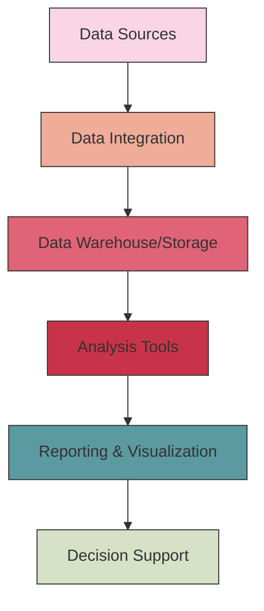

# Business Intelligence

## Introduction

Business Intelligence (BI) refers to the technologies, applications, strategies, and practices used to collect, analyze, integrate, and present business information. The primary goal of BI is to support better business decision-making by providing actionable insights derived from data.

In today's data-driven world, organizations generate vast amounts of information from various sources such as sales transactions, customer interactions, and operational processes. Business Intelligence helps transform this raw data into meaningful insights that can drive strategic decisions and create competitive advantages.

## What is Business Intelligence?

Business Intelligence encompasses a range of processes and technologies that convert raw data into meaningful and useful information for business analysis purposes. BI systems combine data gathering, data storage, and knowledge management with analytical tools to present complex internal and competitive information to planners and decision-makers.

### Key Components of Business Intelligence

Business Intelligence systems typically consist of several key components:



1. **Data Sources**: Various internal and external systems that generate data, including transaction processing systems, customer relationship management (CRM) systems, and external market data.

2. **Data Integration**: Processes like Extract, Transform, Load (ETL) that collect data from multiple sources, transform it into a consistent format, and load it into a data storage system.

3. **Data Warehouse/Storage**: A central repository for integrated data from multiple sources, designed for query and analysis.

4. **Analysis Tools**: Software applications that process data using various analytical techniques to identify patterns, trends, and insights.

5. **Reporting & Visualization**: Methods to present data in visual formats such as dashboards, charts, and reports to make information easily understandable.

6. **Decision Support**: The ultimate goal - providing actionable insights that support business decisions.

## Business Intelligence Tools and Technologies

Several tools and technologies are commonly used in Business Intelligence:

### Data Warehousing

A data warehouse is a central repository of integrated data from multiple sources. It is designed to support analytical reporting and decision-making.

```javascript
// Simplified example of a SQL query to create a dimension table in a data warehouse
CREATE TABLE DimCustomer (
  CustomerKey INT PRIMARY KEY,
  CustomerID VARCHAR(10),
  CustomerName VARCHAR(100),
  Address VARCHAR(200),
  City VARCHAR(50),
  State VARCHAR(50),
  ZipCode VARCHAR(10),
  Country VARCHAR(50)
);
```

### OLAP (Online Analytical Processing)

OLAP tools enable users to analyze multidimensional data from multiple perspectives. They facilitate complex calculations, trend analyses, and sophisticated data modeling.

```sql
-- Example OLAP query to analyze sales by product, region, and time
SELECT 
  product.category,
  region.name,
  time.quarter,
  SUM(sales.amount) as total_sales
FROM sales
JOIN product ON sales.product_id = product.id
JOIN region ON sales.region_id = region.id
JOIN time ON sales.time_id = time.id
GROUP BY product.category, region.name, time.quarter
ORDER BY total_sales DESC;
```

### Data Mining

Data mining involves discovering patterns in large data sets using methods at the intersection of machine learning, statistics, and database systems.

```python
# Simple example of data mining using Python and scikit-learn
import pandas as pd
from sklearn.cluster import KMeans

# Load customer data
customer_data = pd.read_csv('customer_data.csv')

# Select features for clustering
features = customer_data[['annual_income', 'spending_score']]

# Apply K-means clustering
kmeans = KMeans(n_clusters=5, random_state=42)
customer_data['cluster'] = kmeans.fit_predict(features)

# Analyze the clusters
cluster_analysis = customer_data.groupby('cluster').mean()
print(cluster_analysis)
```

### Dashboards and Visualization

Dashboards provide visual representations of data to help users quickly understand complex information and make decisions.

```javascript
// Example using a JavaScript visualization library like D3.js
// This would create a simple bar chart for sales data
const svg = d3.select("#sales-chart")
  .append("svg")
  .attr("width", width)
  .attr("height", height);

svg.selectAll("rect")
  .data(salesData)
  .enter()
  .append("rect")
  .attr("x", (d, i) => i * 70)
  .attr("y", d => height - 10 * d.value)
  .attr("width", 65)
  .attr("height", d => d.value * 10)
  .attr("fill", "steelblue");
```

## The Business Intelligence Process

The BI process typically follows these steps:

1. **Identify Business Questions**: Determine what questions need answers and what decisions need to be made.

2. **Data Collection**: Gather relevant data from various sources.

3. **Data Processing**: Clean, transform, and model the data to make it suitable for analysis.

4. **Data Analysis**: Apply analytical techniques to discover patterns, trends, and insights.

5. **Data Visualization**: Present the findings in visual formats that are easy to understand.

6. **Decision Making**: Use the insights to make informed business decisions.

7. **Measure Outcomes**: Evaluate the results of the decisions and refine the process.

## Real-World Applications of Business Intelligence

### Sales and Marketing

BI helps sales and marketing teams by:
- Identifying buying patterns and customer preferences
- Segmenting customers for targeted marketing
- Analyzing campaign effectiveness
- Forecasting sales trends

**Example**: A retail company uses BI to analyze customer purchase history, identifying that customers who buy product A have a 70% likelihood of buying product B within 30 days. This insight allows for targeted marketing campaigns.

```sql
-- Query to identify product associations
SELECT 
  p1.product_name as initial_purchase,
  p2.product_name as subsequent_purchase,
  COUNT(*) as frequency,
  AVG(DATEDIFF(day, o1.order_date, o2.order_date)) as avg_days_between
FROM orders o1
JOIN order_items oi1 ON o1.order_id = oi1.order_id
JOIN products p1 ON oi1.product_id = p1.product_id
JOIN orders o2 ON o1.customer_id = o2.customer_id AND o2.order_date > o1.order_date
JOIN order_items oi2 ON o2.order_id = oi2.order_id
JOIN products p2 ON oi2.product_id = p2.product_id
WHERE DATEDIFF(day, o1.order_date, o2.order_date) <= 30
GROUP BY p1.product_name, p2.product_name
ORDER BY frequency DESC;
```

### Financial Analysis

In finance, BI applications include:
- Budget analysis and planning
- Profitability analysis
- Financial performance monitoring
- Risk management

**Example**: A financial institution uses BI dashboards to monitor real-time metrics like liquidity ratios, outstanding loans, and investment performance, allowing executives to make timely decisions.

### Operations Management

For operations, BI helps with:
- Supply chain optimization
- Inventory management
- Process efficiency analysis
- Quality control

**Example**: A manufacturing company uses BI to analyze production line data, identifying bottlenecks that are causing delays. By addressing these issues, they improve efficiency by 15%.

### Human Resources

BI in HR includes:
- Workforce analytics
- Recruitment effectiveness
- Employee performance analysis
- Retention strategies

**Example**: An HR department uses BI to identify factors that correlate with employee retention, discovering that employees who participate in training programs have a 30% lower turnover rate.

## Setting up a Basic BI Environment

For beginners, here's a simplified approach to setting up a basic BI environment:

### 1. Define Your Objectives

Start by clearly defining what business questions you want to answer with BI.

### 2. Choose Appropriate Tools

For beginners, consider user-friendly tools like:
- Microsoft Power BI
- Tableau Public
- Google Data Studio
- Python with libraries like Pandas, Matplotlib, and Seaborn

### 3. Prepare Your Data

```python
# Example of basic data preparation with Python
import pandas as pd

# Load the data
data = pd.read_csv('sales_data.csv')

# Clean the data
data = data.dropna()  # Remove rows with missing values
data['date'] = pd.to_datetime(data['date'])  # Convert string to datetime
data['revenue'] = data['quantity'] * data['price']  # Create calculated field

# Aggregate the data
monthly_sales = data.groupby(data['date'].dt.to_period('M')).agg({
    'revenue': 'sum',
    'quantity': 'sum',
    'order_id': 'count'
}).rename(columns={'order_id': 'order_count'})

print(monthly_sales.head())
```

### 4. Create Basic Visualizations

```python
# Creating basic visualizations with Matplotlib
import matplotlib.pyplot as plt

# Plot monthly revenue
plt.figure(figsize=(12, 6))
plt.plot(monthly_sales.index.astype(str), monthly_sales['revenue'], marker='o')
plt.title('Monthly Revenue')
plt.xlabel('Month')
plt.ylabel('Revenue ($)')
plt.xticks(rotation=45)
plt.tight_layout()
plt.grid(True, linestyle='--', alpha=0.7)
plt.show()
```

### 5. Implement a Dashboard

While code examples for complete dashboards would be extensive, you can use tools like Power BI, Tableau, or Python libraries like Dash or Streamlit to create interactive dashboards.

## Challenges in Business Intelligence

Implementing BI solutions comes with several challenges:

1. **Data Quality Issues**: Inconsistent, incomplete, or inaccurate data can lead to misleading insights.

2. **Integration Complexity**: Combining data from disparate sources with different formats and structures can be challenging.

3. **User Adoption**: Resistance to new tools and processes can hinder BI implementation.

4. **Security and Privacy Concerns**: Ensuring data security while maintaining accessibility requires careful planning.

5. **Scalability**: As data volumes grow, BI systems need to scale accordingly.

## Future Trends in Business Intelligence

The field of Business Intelligence continues to evolve with emerging trends:

1. **Artificial Intelligence and Machine Learning**: AI-enhanced BI tools can automatically identify patterns and provide predictive insights.

2. **Self-Service BI**: Non-technical users can create their own reports and analyses without IT assistance.

3. **Real-Time Analytics**: Processing data as it's generated allows for immediate insights and actions.

4. **Augmented Analytics**: AI-driven automation of data preparation, insight generation, and explanation.

5. **Mobile BI**: Access to BI tools and dashboards on mobile devices for decision-making on the go.

## Summary

Business Intelligence represents a crucial component of modern information systems, enabling organizations to transform raw data into actionable insights. By implementing BI solutions, businesses can make more informed decisions, identify new opportunities, optimize operations, and gain competitive advantages.

The BI process involves gathering data from various sources, processing and analyzing it using specialized tools, and presenting insights through visualizations and dashboards. While implementing BI comes with challenges like data quality issues and integration complexity, the benefits—improved decision-making, increased efficiency, and better business outcomes—make it a worthwhile investment.

As technology continues to evolve, Business Intelligence will increasingly incorporate AI, machine learning, and real-time analytics, making it even more powerful and accessible to organizations of all sizes.

## Exercises for Practice

1. **Basic Data Analysis**: Using a sample dataset (e.g., company sales data), practice basic data cleaning and analysis using Excel or Python.

2. **Dashboard Creation**: Create a simple dashboard using a free tool like Power BI Desktop or Google Data Studio that displays key metrics from a sample dataset.

3. **Business Case Study**: Identify a business problem that could be solved with BI. Outline the data needed, analysis approach, and expected insights.

4. **ETL Process Design**: Design a simple ETL process to extract data from a CSV file, transform it (e.g., calculate new metrics), and load it into a database.

5. **KPI Definition**: For a specific business department (sales, marketing, operations), define 5-10 key performance indicators (KPIs) that would be valuable to track in a BI system.