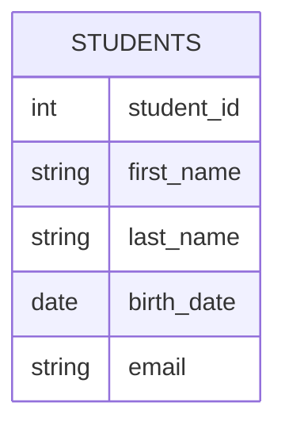
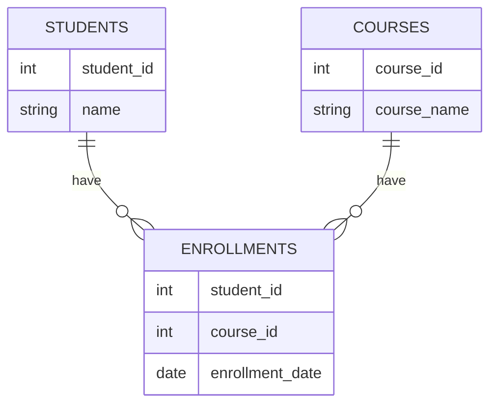

# SQL Introduction

## What is SQL?

SQL (Structured Query Language) is a specialized programming language designed for managing and manipulating relational databases. Unlike general-purpose programming languages like Python or JavaScript, SQL focuses specifically on working with data stored in table-based database systems.

SQL allows you to:
- Create and modify database structures
- Insert, update, and delete data
- Query and retrieve specific information
- Set permissions and access controls

Whether you're building a simple web application or analyzing large datasets, understanding SQL is an essential skill for any programmer working with data.

## Why Learn SQL?

In today's data-driven world, SQL remains one of the most valuable skills you can learn:

1. **Universal Language**: Most relational database systems (MySQL, PostgreSQL, SQL Server, Oracle) use SQL as their primary language.
2. **High Demand**: SQL consistently ranks among the most in-demand technical skills by employers.
3. **Data Analysis**: SQL is a fundamental tool for data analysis and business intelligence.
4. **Complementary Skill**: SQL works alongside programming languages to build full-stack applications.
5. **Long-Standing Technology**: Despite being developed in the 1970s, SQL continues to be relevant and widely used.

## Relational Database Basics

Before diving into SQL syntax, let's understand the foundation of relational databases:

### Tables

Data in relational databases is organized in tables (also called relations). Each table consists of:

- **Rows** (records): Individual entries in the table
- **Columns** (fields): Categories of information

Here's a visual representation of a simple `students` table:



### Primary Keys

Each table typically has a **primary key** - a column or set of columns that uniquely identifies each row. In the `students` table above, `student_id` would be the primary key.

### Relationships

The "relational" in relational databases comes from the ability to create relationships between tables using keys:



## Getting Started with SQL

Let's explore the basic SQL commands you'll use most frequently:

### CREATE TABLE: Defining Database Structure

To create a new table, you use the `CREATE TABLE` statement:

```sql
CREATE TABLE students (
    student_id INT PRIMARY KEY,
    first_name VARCHAR(50) NOT NULL,
    last_name VARCHAR(50) NOT NULL,
    birth_date DATE,
    email VARCHAR(100) UNIQUE
);
```

This statement:
- Creates a table named `students`
- Defines 5 columns with specific data types
- Sets `student_id` as the primary key
- Makes `first_name` and `last_name` required fields
- Ensures `email` values are unique

### INSERT: Adding Data

To add records to a table, use the `INSERT INTO` statement:

```sql
INSERT INTO students (student_id, first_name, last_name, birth_date, email)
VALUES (1, 'John', 'Doe', '2000-05-15', 'john.doe@example.com');
```

You can insert multiple rows at once:

```sql
INSERT INTO students (student_id, first_name, last_name, birth_date, email)
VALUES 
    (2, 'Jane', 'Smith', '2001-03-20', 'jane.smith@example.com'),
    (3, 'Michael', 'Johnson', '1999-11-08', 'michael.j@example.com');
```

### SELECT: Querying Data

The most common SQL operation is retrieving data using the `SELECT` statement:

```sql
SELECT * FROM students;
```

The output would look like:

| student_id | first_name | last_name | birth_date | email |
|------------|------------|-----------|------------|-------|
| 1 | John | Doe | 2000-05-15 | john.doe@example.com |
| 2 | Jane | Smith | 2001-03-20 | jane.smith@example.com |
| 3 | Michael | Johnson | 1999-11-08 | michael.j@example.com |

You can select specific columns:

```sql
SELECT first_name, last_name FROM students;
```

Output:

| first_name | last_name |
|------------|-----------|
| John | Doe |
| Jane | Smith |
| Michael | Johnson |

### WHERE Clause: Filtering Data

The `WHERE` clause allows you to filter results based on specific conditions:

```sql
SELECT * FROM students 
WHERE birth_date >= '2000-01-01';
```

This will only return students born on or after January 1, 2000:

| student_id | first_name | last_name | birth_date | email |
|------------|------------|-----------|------------|-------|
| 1 | John | Doe | 2000-05-15 | john.doe@example.com |
| 2 | Jane | Smith | 2001-03-20 | jane.smith@example.com |

### UPDATE: Modifying Data

To change existing data, use the `UPDATE` statement:

```sql
UPDATE students
SET email = 'john.doe.updated@example.com'
WHERE student_id = 1;
```

Always include a `WHERE` clause with `UPDATE` statements to avoid changing all records!

### DELETE: Removing Data

To delete records, use the `DELETE FROM` statement:

```sql
DELETE FROM students
WHERE student_id = 3;
```

Again, always include a `WHERE` clause with `DELETE` statements to avoid deleting all records!

## Real-World Application: Building a Simple Course Registration System

Let's see how SQL can be used in a real application scenario - a course registration system for a school.

First, we'll need to create our tables:

```sql
-- Create the students table
CREATE TABLE students (
    student_id INT PRIMARY KEY,
    first_name VARCHAR(50) NOT NULL,
    last_name VARCHAR(50) NOT NULL,
    email VARCHAR(100) UNIQUE
);

-- Create the courses table
CREATE TABLE courses (
    course_id INT PRIMARY KEY,
    course_name VARCHAR(100) NOT NULL,
    department VARCHAR(50),
    credits INT
);

-- Create the enrollments table to track which students are in which courses
CREATE TABLE enrollments (
    enrollment_id INT PRIMARY KEY,
    student_id INT,
    course_id INT,
    enrollment_date DATE,
    FOREIGN KEY (student_id) REFERENCES students(student_id),
    FOREIGN KEY (course_id) REFERENCES courses(course_id)
);
```

Now let's insert some sample data:

```sql
-- Add students
INSERT INTO students (student_id, first_name, last_name, email)
VALUES 
    (1, 'John', 'Doe', 'john.doe@school.edu'),
    (2, 'Jane', 'Smith', 'jane.smith@school.edu'),
    (3, 'Michael', 'Johnson', 'michael.j@school.edu');

-- Add courses
INSERT INTO courses (course_id, course_name, department, credits)
VALUES 
    (101, 'Introduction to Programming', 'Computer Science', 3),
    (102, 'Database Fundamentals', 'Computer Science', 4),
    (201, 'Web Development', 'Information Technology', 3);

-- Enroll students in courses
INSERT INTO enrollments (enrollment_id, student_id, course_id, enrollment_date)
VALUES 
    (1, 1, 101, '2023-08-15'),
    (2, 1, 102, '2023-08-15'),
    (3, 2, 101, '2023-08-16'),
    (4, 3, 201, '2023-08-14'),
    (5, 2, 201, '2023-08-17');
```

With our database set up, we can now perform various operations:

### 1. Find all courses a student is enrolled in

```sql
SELECT c.course_name, c.department, c.credits
FROM courses c
JOIN enrollments e ON c.course_id = e.course_id
WHERE e.student_id = 1;
```

Output:

| course_name | department | credits |
|-------------|------------|---------|
| Introduction to Programming | Computer Science | 3 |
| Database Fundamentals | Computer Science | 4 |

### 2. Count how many students are enrolled in each course

```sql
SELECT c.course_name, COUNT(e.student_id) AS student_count
FROM courses c
LEFT JOIN enrollments e ON c.course_id = e.course_id
GROUP BY c.course_name;
```

Output:

| course_name | student_count |
|-------------|---------------|
| Introduction to Programming | 2 |
| Database Fundamentals | 1 |
| Web Development | 2 |

### 3. Find students not enrolled in any course

```sql
SELECT s.first_name, s.last_name
FROM students s
LEFT JOIN enrollments e ON s.student_id = e.student_id
WHERE e.enrollment_id IS NULL;
```

This would return any students who haven't enrolled in any courses (none in our example).

## SQL Syntax Overview

To summarize what we've learned, here are the core SQL commands:

1. **Data Definition Language (DDL)**:
   - `CREATE` - Create database objects (tables, views, etc.)
   - `ALTER` - Modify the structure of database objects
   - `DROP` - Delete database objects
   - `TRUNCATE` - Remove all records from a table

2. **Data Manipulation Language (DML)**:
   - `SELECT` - Query data from tables
   - `INSERT` - Add new records
   - `UPDATE` - Modify existing records
   - `DELETE` - Remove records

3. **Data Control Language (DCL)**:
   - `GRANT` - Give privileges to users
   - `REVOKE` - Take away privileges

4. **Transaction Control**:
   - `COMMIT` - Save changes
   - `ROLLBACK` - Undo changes
   - `SAVEPOINT` - Create points to roll back to

## Summary

In this introduction to SQL, we've:
- Learned what SQL is and why it's important
- Explored the basic structure of relational databases
- Covered essential SQL commands for creating tables and manipulating data
- Worked through a real-world example of a course registration system

SQL's power comes from its ability to:
- Handle large volumes of data efficiently
- Provide a standardized way to work with relational databases
- Allow complex data operations with relatively simple syntax
- Enable data integrity through constraints and relationships

## Practice Exercises

To reinforce your SQL knowledge, try these exercises:

1. Create a table for tracking book inventory with columns for ID, title, author, publication year, and price.
2. Insert at least 5 book records into your table.
3. Write a query to find all books published after 2000.
4. Update the price of a specific book.
5. Write a query to find the average publication year of all books.

## Additional Resources

To continue your SQL learning journey:

- **SQL Practice Websites**:
  - [SQLZoo](https://sqlzoo.net/): Interactive SQL tutorials
  - [LeetCode SQL Questions](https://leetcode.com/problemset/database/): Practice with real-world problems

- **Database Management Systems to Try**:
  - SQLite: Lightweight, file-based database
  - MySQL: Popular open-source database
  - PostgreSQL: Advanced open-source database

- **Next Steps**:
  - Learn about database normalization
  - Explore more complex queries with JOINs
  - Study database indexes and performance optimization