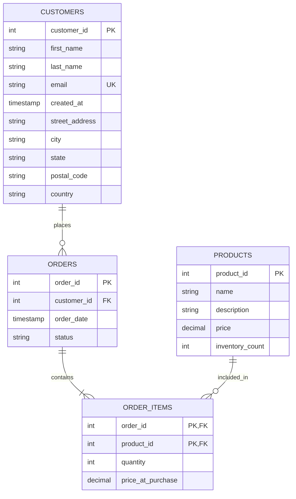

# Data Definition Language (DDL)

## Introduction

Data Definition Language (DDL) is a subset of SQL used to define and manage the structure of database objects. Unlike Data Manipulation Language (DML) which handles data operations, DDL focuses on creating, modifying, and removing database structures such as tables, indexes, and constraints.

DDL commands form the foundation of database design, allowing you to establish the blueprint for how your data will be organized and stored. Understanding DDL is essential for any database developer or administrator.

## Core DDL Commands

The primary DDL commands you'll use are:

- `CREATE` - Creates new database objects
- `ALTER` - Modifies existing database objects
- `DROP` - Removes database objects
- `TRUNCATE` - Removes all records from a table, but keeps the table structure
- `RENAME` - Changes the name of an object

Let's explore each of these commands in detail.

## CREATE Command

The `CREATE` command allows you to create new database objects. The most common use is creating tables, but it's also used for databases, views, indexes, and more.

### Creating a Database

```sql
CREATE DATABASE ecommerce;
```

This command creates a new database named "ecommerce".

### Creating a Table

```sql
CREATE TABLE customers (
  customer_id INT PRIMARY KEY,
  first_name VARCHAR(50) NOT NULL,
  last_name VARCHAR(50) NOT NULL,
  email VARCHAR(100) UNIQUE,
  phone VARCHAR(20),
  registration_date DATE DEFAULT CURRENT_DATE
);
```

This creates a table named "customers" with several columns:
- `customer_id` - An integer serving as the primary key
- `first_name` and `last_name` - Required text fields
- `email` - A unique text field
- `phone` - An optional text field
- `registration_date` - A date field with a default value of the current date

### Table Constraints

When creating tables, you can apply various constraints:

1. **PRIMARY KEY** - Uniquely identifies each record in a table
2. **FOREIGN KEY** - Maintains referential integrity by ensuring values in one table match values in another
3. **NOT NULL** - Ensures a column cannot have NULL values
4. **UNIQUE** - Ensures all values in a column are different
5. **CHECK** - Ensures values in a column meet a specific condition
6. **DEFAULT** - Sets a default value for a column

### Example with Multiple Constraints

```sql
CREATE TABLE orders (
  order_id INT PRIMARY KEY,
  customer_id INT NOT NULL,
  order_date TIMESTAMP DEFAULT CURRENT_TIMESTAMP,
  total_amount DECIMAL(10,2) CHECK (total_amount > 0),
  FOREIGN KEY (customer_id) REFERENCES customers(customer_id)
);
```

This creates an "orders" table that:
- Has `order_id` as its primary key
- Includes a foreign key reference to the customers table
- Sets a default timestamp for `order_date`
- Ensures `total_amount` is always positive using a CHECK constraint

### Creating an Index

Indexes improve query performance by enabling faster data retrieval:

```sql
CREATE INDEX idx_customer_email ON customers(email);
```

This creates an index on the email column of the customers table.

## ALTER Command

The `ALTER` command modifies existing database objects.

### Adding a Column

```sql
ALTER TABLE customers ADD address VARCHAR(200);
```

This adds an "address" column to the customers table.

### Modifying a Column

```sql
ALTER TABLE customers MODIFY email VARCHAR(150) NOT NULL;
```

This changes the email column to be non-nullable and increases its maximum length.

### Adding a Constraint

```sql
ALTER TABLE customers ADD CONSTRAINT chk_phone_format CHECK (phone LIKE '+%');
```

This adds a check constraint ensuring phone numbers start with a plus sign.

### Removing a Column

```sql
ALTER TABLE customers DROP COLUMN phone;
```

This removes the phone column from the customers table.

## DROP Command

The `DROP` command removes database objects.

### Dropping a Table

```sql
DROP TABLE customers;
```

This completely removes the customers table and all its data.

### Conditional Drop

```sql
DROP TABLE IF EXISTS temp_customers;
```

This drops the temp_customers table only if it exists, preventing errors if it doesn't.

### Dropping a Database

```sql
DROP DATABASE old_ecommerce;
```

This removes the entire old_ecommerce database.

## TRUNCATE Command

The `TRUNCATE` command quickly removes all records from a table:

```sql
TRUNCATE TABLE order_history;
```

This deletes all data from order_history but keeps the table structure intact. TRUNCATE is faster than DELETE because it doesn't log individual row deletions.

## RENAME Command

The `RENAME` command changes the name of database objects:

```sql
ALTER TABLE customers RENAME TO users;
```

This renames the customers table to users.

## Practical Examples

Let's look at some real-world applications of DDL commands.

### Example 1: Setting Up an E-commerce Database

```sql
-- Create the database
CREATE DATABASE ecommerce;

-- Use the database
USE ecommerce;

-- Create customers table
CREATE TABLE customers (
  customer_id INT AUTO_INCREMENT PRIMARY KEY,
  first_name VARCHAR(50) NOT NULL,
  last_name VARCHAR(50) NOT NULL,
  email VARCHAR(100) UNIQUE NOT NULL,
  created_at TIMESTAMP DEFAULT CURRENT_TIMESTAMP
);

-- Create products table
CREATE TABLE products (
  product_id INT AUTO_INCREMENT PRIMARY KEY,
  name VARCHAR(100) NOT NULL,
  description TEXT,
  price DECIMAL(10,2) NOT NULL CHECK (price > 0),
  inventory_count INT NOT NULL DEFAULT 0
);

-- Create orders table
CREATE TABLE orders (
  order_id INT AUTO_INCREMENT PRIMARY KEY,
  customer_id INT NOT NULL,
  order_date TIMESTAMP DEFAULT CURRENT_TIMESTAMP,
  status VARCHAR(20) DEFAULT 'pending',
  FOREIGN KEY (customer_id) REFERENCES customers(customer_id)
);

-- Create order_items junction table
CREATE TABLE order_items (
  order_id INT,
  product_id INT,
  quantity INT NOT NULL CHECK (quantity > 0),
  price_at_purchase DECIMAL(10,2) NOT NULL,
  PRIMARY KEY (order_id, product_id),
  FOREIGN KEY (order_id) REFERENCES orders(order_id),
  FOREIGN KEY (product_id) REFERENCES products(product_id)
);
```

This example demonstrates creating a simple e-commerce database with related tables and appropriate constraints.

### Example 2: Database Schema Evolution

```sql
-- Add new columns for customer address
ALTER TABLE customers
ADD street_address VARCHAR(100),
ADD city VARCHAR(50),
ADD state VARCHAR(20),
ADD postal_code VARCHAR(20),
ADD country VARCHAR(50) DEFAULT 'USA';

-- Create an index for improved search performance
CREATE INDEX idx_product_name ON products(name);

-- Add a new status constraint
ALTER TABLE orders
ADD CONSTRAINT chk_valid_status 
CHECK (status IN ('pending', 'processing', 'shipped', 'delivered', 'cancelled'));

-- Rename a table as business terminology changes
ALTER TABLE order_items RENAME TO line_items;
```

This example shows how a database structure might evolve over time as business requirements change.

## Database Schema Visualization

You can visualize the relationships between tables using an entity-relationship diagram:



## Best Practices for DDL

1. **Plan Before Execution**: Design your database schema thoroughly before implementing it, as structural changes become more difficult after data is loaded.

2. **Use Meaningful Names**: Choose descriptive names for tables and columns that reflect their purpose.

3. **Apply Appropriate Constraints**: Use constraints to enforce data integrity and business rules.

4. **Consider Performance**: Add indexes to columns frequently used in WHERE clauses and joins, but don't over-index as it impacts write performance.

5. **Script Your Changes**: Keep DDL scripts in version control to track database evolution and enable repeatable deployments.

6. **Test in Development**: Always test structural changes in development environments before applying them to production.

7. **Backup Before Changes**: Always back up your database before making structural changes.

## Summary

Data Definition Language (DDL) provides the commands necessary to define and manage the structure of your database:

- `CREATE` establishes new database objects
- `ALTER` modifies existing structures
- `DROP` removes objects completely
- `TRUNCATE` quickly removes all data while preserving structure
- `RENAME` changes object names

Mastering DDL is fundamental to effective database design and management. With these commands, you can build robust database schemas that properly model your business domain and enforce data integrity.

## Practice Exercises

1. Create a `students` table with fields for student ID, name, email, major, and enrollment date.

2. Add a `graduation_date` column to the students table.

3. Create an `courses` table and establish a many-to-many relationship with students using an enrollment junction table.

4. Add appropriate constraints to ensure data integrity throughout your schema.

5. Create a database for a library system with tables for books, authors, patrons, and loans.

## Additional Resources

- [SQL DDL Reference on W3Schools](https://www.w3schools.com/sql/sql_create_db.asp)
- [PostgreSQL Documentation on DDL](https://www.postgresql.org/docs/current/ddl.html)
- [MySQL DDL Statements](https://dev.mysql.com/doc/refman/8.0/en/sql-data-definition-statements.html)