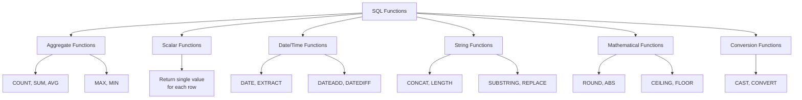

# SQL Functions

## Introduction

SQL functions are pre-defined operations that perform calculations on data and return a result. They are essential tools that help transform, format, manipulate, and analyze data within your database queries. SQL functions allow you to perform complex calculations with minimal code, making your queries more efficient and powerful.

Think of SQL functions as built-in tools that take some input (often column values), process it according to specific rules, and return an output. These functions can handle various data types, including numbers, strings, dates, and more.

## Types of SQL Functions

SQL functions can be broadly categorized into several types:



Let's explore each type in detail.

## Aggregate Functions

Aggregate functions perform calculations on a set of rows and return a single value. These are commonly used with the `GROUP BY` clause.

### Common Aggregate Functions

| Function | Description | Example |
|----------|-------------|---------|
| `COUNT()` | Counts the number of rows | `COUNT(*)` |
| `SUM()` | Calculates the sum of values | `SUM(salary)` |
| `AVG()` | Calculates the average value | `AVG(score)` |
| `MAX()` | Returns the maximum value | `MAX(price)` |
| `MIN()` | Returns the minimum value | `MIN(age)` |

### Example: Using Aggregate Functions

```sql
-- Find the average salary by department
SELECT 
    department_id,
    COUNT(employee_id) AS employee_count,
    AVG(salary) AS average_salary,
    MAX(salary) AS highest_salary,
    MIN(salary) AS lowest_salary,
    SUM(salary) AS total_salary_expense
FROM employees
GROUP BY department_id;
```

Output:
```
department_id | employee_count | average_salary | highest_salary | lowest_salary | total_salary_expense
--------------+----------------+----------------+----------------+---------------+---------------------
1             | 10             | 65000.00       | 95000.00       | 45000.00      | 650000.00
2             | 15             | 72000.00       | 120000.00      | 48000.00      | 1080000.00
3             | 7              | 58000.00       | 88000.00       | 42000.00      | 406000.00
```

## Scalar Functions

Unlike aggregate functions that operate on multiple rows, scalar functions operate on each row individually and return a single value for each row.

### String Functions

String functions manipulate text data.

| Function | Description | Example |
|----------|-------------|---------|
| `CONCAT()` | Combines strings | `CONCAT(first_name, ' ', last_name)` |
| `LENGTH()` | Returns string length | `LENGTH(product_name)` |
| `UPPER()` | Converts to uppercase | `UPPER(email)` |
| `LOWER()` | Converts to lowercase | `LOWER(username)` |
| `SUBSTRING()` | Extracts part of a string | `SUBSTRING(description, 1, 100)` |
| `REPLACE()` | Replaces occurrences in a string | `REPLACE(phone, '-', '')` |

### Example: Using String Functions

```sql
-- Format customer data
SELECT
    customer_id,
    UPPER(CONCAT(first_name, ' ', last_name)) AS customer_name,
    LENGTH(email) AS email_length,
    REPLACE(phone, '-', '') AS formatted_phone,
    SUBSTRING(address, 1, 20) || '...' AS short_address
FROM customers;
```

Output:
```
customer_id | customer_name   | email_length | formatted_phone | short_address
------------+-----------------+--------------+-----------------+------------------
1           | JOHN DOE        | 15           | 5551234567      | 123 Main St...
2           | SARAH SMITH     | 21           | 5559876543      | 456 Oak Ave...
3           | MICHAEL JOHNSON | 24           | 5554567890      | 789 Pine Rd...
```

### Date and Time Functions

Date and time functions help you work with temporal data.

| Function | Description | Example |
|----------|-------------|---------|
| `CURRENT_DATE` | Returns current date | `CURRENT_DATE` |
| `CURRENT_TIME` | Returns current time | `CURRENT_TIME` |
| `EXTRACT()` | Extracts part of a date | `EXTRACT(YEAR FROM order_date)` |
| `DATE_PART()` | Gets specific part of date | `DATE_PART('month', event_date)` |
| `DATEADD()` | Adds interval to date | `DATEADD(day, 30, start_date)` |
| `DATEDIFF()` | Finds difference between dates | `DATEDIFF(day, order_date, ship_date)` |

Note: Syntax may vary slightly between different database systems.

### Example: Using Date Functions

```sql
-- Analyze order timing
SELECT
    order_id,
    order_date,
    EXTRACT(YEAR FROM order_date) AS order_year,
    EXTRACT(MONTH FROM order_date) AS order_month,
    EXTRACT(DAY FROM order_date) AS order_day,
    DATEDIFF(day, order_date, ship_date) AS days_to_ship
FROM orders
WHERE EXTRACT(YEAR FROM order_date) = 2023;
```

Output:
```
order_id | order_date  | order_year | order_month | order_day | days_to_ship
---------+-------------+------------+-------------+-----------+--------------
1001     | 2023-03-15  | 2023       | 3           | 15        | 2
1002     | 2023-03-16  | 2023       | 3           | 16        | 1
1003     | 2023-03-18  | 2023       | 3           | 18        | 3
```

### Mathematical Functions

Mathematical functions perform calculations on numeric data.

| Function | Description | Example |
|----------|-------------|---------|
| `ROUND()` | Rounds a number | `ROUND(price, 2)` |
| `CEIL()` | Rounds up to nearest integer | `CEIL(measurement)` |
| `FLOOR()` | Rounds down to nearest integer | `FLOOR(measurement)` |
| `ABS()` | Returns absolute value | `ABS(temperature)` |
| `POWER()` | Raises to specified power | `POWER(base, 2)` |
| `SQRT()` | Calculates square root | `SQRT(area)` |

### Example: Using Mathematical Functions

```sql
-- Calculate pricing and dimensions
SELECT
    product_id,
    product_name,
    price,
    ROUND(price * 0.9, 2) AS discounted_price,
    CEIL(weight) AS shipping_weight,
    FLOOR(length * width) AS approximate_area,
    POWER(width, 2) AS squared_width,
    SQRT(area) AS side_length
FROM products;
```

Output:
```
product_id | product_name | price  | discounted_price | shipping_weight | approximate_area | squared_width | side_length
-----------+--------------+--------+------------------+-----------------+------------------+---------------+-------------
101        | Laptop       | 899.99 | 809.99           | 3               | 120              | 144           | 11.45
102        | Smartphone   | 699.50 | 629.55           | 1               | 12               | 9             | 3.61
103        | Tablet       | 349.99 | 314.99           | 2               | 48               | 36            | 7.07
```

### Conversion Functions

Conversion functions transform data from one type to another.

| Function | Description | Example |
|----------|-------------|---------|
| `CAST()` | Converts data type | `CAST(price AS INT)` |
| `CONVERT()` | Converts data type (SQL Server) | `CONVERT(DECIMAL(10,2), value)` |
| `TO_CHAR()` | Converts to string with format | `TO_CHAR(order_date, 'YYYY-MM-DD')` |
| `TO_DATE()` | Converts string to date | `TO_DATE('2023-03-15', 'YYYY-MM-DD')` |

### Example: Using Conversion Functions

```sql
-- Convert data types
SELECT
    order_id,
    CAST(amount AS INT) AS rounded_amount,
    TO_CHAR(order_date, 'MM/DD/YYYY') AS formatted_date,
    CAST(is_priority AS VARCHAR) AS priority_flag
FROM orders;
```

Output:
```
order_id | rounded_amount | formatted_date | priority_flag
---------+----------------+----------------+--------------
1001     | 125            | 03/15/2023     | true
1002     | 89             | 03/16/2023     | false
1003     | 210            | 03/18/2023     | true
```

## User-Defined Functions

Many database systems allow you to create your own functions using SQL or procedural languages. These are called User-Defined Functions (UDFs).

```sql
-- Creating a simple user-defined function (PostgreSQL syntax)
CREATE OR REPLACE FUNCTION calculate_discount(price NUMERIC, discount_rate NUMERIC)
RETURNS NUMERIC AS $$
BEGIN
    RETURN ROUND(price * (1 - discount_rate / 100), 2);
END;
$$ LANGUAGE plpgsql;

-- Using the user-defined function
SELECT
    product_id,
    product_name,
    price,
    calculate_discount(price, 15) AS discounted_price
FROM products;
```

Output:
```
product_id | product_name | price  | discounted_price
-----------+--------------+--------+------------------
101        | Laptop       | 899.99 | 764.99
102        | Smartphone   | 699.50 | 594.58
103        | Tablet       | 349.99 | 297.49
```

## Real-World Applications

### Data Analysis

```sql
-- Sales analysis by region and quarter
SELECT
    region,
    EXTRACT(QUARTER FROM sale_date) AS quarter,
    COUNT(*) AS num_sales,
    ROUND(AVG(amount), 2) AS avg_sale_amount,
    SUM(amount) AS total_revenue,
    MAX(amount) AS largest_sale
FROM sales
WHERE EXTRACT(YEAR FROM sale_date) = 2023
GROUP BY region, EXTRACT(QUARTER FROM sale_date)
ORDER BY region, quarter;
```

### Customer Communication

```sql
-- Generate personalized email greeting
SELECT
    customer_id,
    email,
    CONCAT('Dear ', 
           CASE 
               WHEN title IS NOT NULL THEN CONCAT(title, ' ') 
               ELSE '' 
           END,
           last_name,
           ',') AS email_greeting,
    TO_CHAR(last_purchase_date, 'Month DD, YYYY') AS formatted_last_purchase
FROM customers
WHERE DATEDIFF(day, last_purchase_date, CURRENT_DATE) <= 30;
```

### Financial Calculations

```sql
-- Calculate compound interest on investments
SELECT
    investment_id,
    principal_amount,
    interest_rate,
    years,
    ROUND(principal_amount * POWER((1 + interest_rate/100), years), 2) AS future_value,
    TO_CHAR(start_date, 'YYYY-MM-DD') AS start_date,
    TO_CHAR(DATEADD(year, years, start_date), 'YYYY-MM-DD') AS maturity_date
FROM investments;
```

## Database-Specific Functions

Different database systems may have their own specialized functions. Here are some examples:

### MySQL

```sql
-- Using GROUP_CONCAT (MySQL specific)
SELECT
    category_id,
    category_name,
    GROUP_CONCAT(product_name SEPARATOR ', ') AS products_in_category
FROM categories c
JOIN products p ON c.category_id = p.category_id
GROUP BY category_id, category_name;
```

### PostgreSQL

```sql
-- Using array_agg (PostgreSQL specific)
SELECT
    department_id,
    department_name,
    array_agg(employee_name) AS employees
FROM departments d
JOIN employees e ON d.department_id = e.department_id
GROUP BY department_id, department_name;
```

### SQL Server

```sql
-- Using STUFF and FOR XML PATH (SQL Server specific)
SELECT
    category_id,
    category_name,
    STUFF((
        SELECT ', ' + product_name
        FROM products p
        WHERE p.category_id = c.category_id
        FOR XML PATH('')
    ), 1, 2, '') AS products_in_category
FROM categories c;
```

## Best Practices

1. **Choose the right function**: Use the most appropriate function for your task to optimize performance.
2. **Consider indexing**: Functions in WHERE clauses can prevent the use of indexes. Consider this in your query design.
3. **Handle NULL values**: Most functions return NULL if any input is NULL. Use COALESCE() or ISNULL() to provide default values.
4. **Be aware of type conversion**: Implicit type conversions can lead to unexpected results. Use explicit CAST when needed.
5. **Test with sample data**: Always test your functions with representative data to ensure they work as expected.

## Summary

SQL functions are powerful tools that allow you to transform, analyze, and format data within your queries. They range from simple mathematical calculations to complex string manipulations and date operations. Understanding these functions is essential for writing efficient and effective SQL queries.

By using SQL functions properly, you can:
- Perform complex calculations and data transformations
- Format data for presentation
- Aggregate data for analysis
- Convert between different data types
- Create custom logic with user-defined functions

As you continue your SQL journey, mastering these functions will significantly enhance your ability to work with data in powerful ways.

## Practice Exercises

1. Write a query to find the average product price by category, rounded to 2 decimal places.
2. Create a query that concatenates customer first and last names, and transforms the result to uppercase.
3. Write a query to find how many days have passed since each order was placed.
4. Create a query that extracts the year and month from a date column and counts the number of events per year-month.
5. Write a query using mathematical functions to calculate the area of a circle given a radius stored in a table.

## Additional Resources

- Explore your specific database's documentation for additional functions
- Practice with live examples on SQL learning platforms
- Try implementing these functions in your own database projects