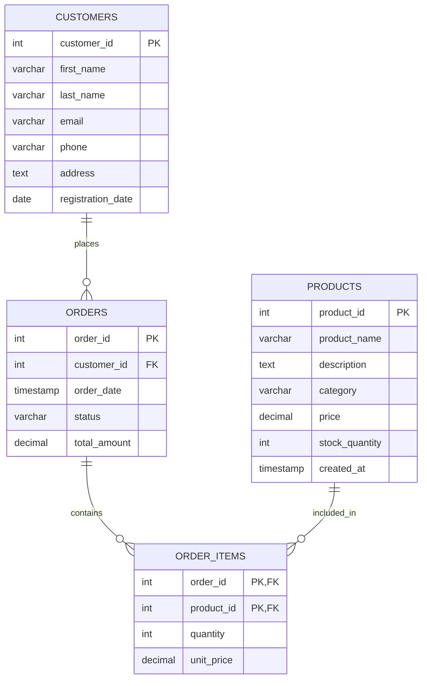

# Creating Tables in SQL

## Introduction

Tables are the fundamental building blocks of any relational database. They store your data in an organized manner using rows and columns, similar to spreadsheets. In SQL, creating well-structured tables is a critical skill that forms the foundation for all your database operations.

This guide will walk you through the process of creating tables in SQL, from understanding the basic syntax to implementing more advanced features like constraints and relationships.

## The CREATE TABLE Statement

The `CREATE TABLE` statement is used to define a new table in a database. The basic syntax is:

```sql
CREATE TABLE table_name (
    column1 datatype constraints,
    column2 datatype constraints,
    column3 datatype constraints,
    ...
);
```

Let's break down each component:

- `CREATE TABLE`: The SQL command that tells the database you want to create a new table
- `table_name`: The name you choose for your table
- `column1, column2, ...`: The names of the columns in your table
- `datatype`: The type of data each column will store
- `constraints`: Optional rules applied to the data in each column

## SQL Data Types

Each column in a table must have a specified data type that determines what kind of data it can store. Here are the most common SQL data types:

### Numeric Data Types

- `INT` or `INTEGER`: Whole numbers without decimals
- `DECIMAL(p,s)` or `NUMERIC(p,s)`: Precise numbers with decimals where `p` is the total number of digits and `s` is the number of digits after the decimal point
- `FLOAT`: Approximate numeric values with floating decimal points
- `MONEY`: Currency values

### String Data Types

- `CHAR(n)`: Fixed-length character string
- `VARCHAR(n)`: Variable-length character string with a maximum length of `n`
- `TEXT`: Variable-length character string with a large maximum size

### Date and Time Data Types

- `DATE`: Stores date values (YYYY-MM-DD)
- `TIME`: Stores time values (HH:MM:SS)
- `DATETIME` or `TIMESTAMP`: Stores both date and time values

### Other Data Types

- `BOOLEAN`: Stores TRUE or FALSE values
- `BINARY`: Stores binary data such as images or files
- `JSON`: Stores JSON (JavaScript Object Notation) data

## Creating a Simple Table

Let's create a simple table for storing information about books:

```sql
CREATE TABLE books (
    book_id INT,
    title VARCHAR(100),
    author VARCHAR(50),
    publication_date DATE,
    price DECIMAL(8,2),
    is_available BOOLEAN
);
```

This creates a table named "books" with columns for a book ID, title, author, publication date, price, and availability status.

## Constraints

Constraints are rules applied to columns that help maintain data integrity. Here are the primary constraints:

### PRIMARY KEY

A PRIMARY KEY uniquely identifies each record in a table and cannot contain NULL values.

```sql
CREATE TABLE customers (
    customer_id INT PRIMARY KEY,
    first_name VARCHAR(50),
    last_name VARCHAR(50),
    email VARCHAR(100)
);
```

### FOREIGN KEY

A FOREIGN KEY establishes a relationship between tables by referencing the PRIMARY KEY of another table.

```sql
CREATE TABLE orders (
    order_id INT PRIMARY KEY,
    order_date DATE,
    customer_id INT,
    total_amount DECIMAL(10,2),
    FOREIGN KEY (customer_id) REFERENCES customers(customer_id)
);
```

### NOT NULL

The NOT NULL constraint ensures that a column cannot have a NULL (empty) value.

```sql
CREATE TABLE employees (
    employee_id INT PRIMARY KEY,
    first_name VARCHAR(50) NOT NULL,
    last_name VARCHAR(50) NOT NULL,
    hire_date DATE,
    salary DECIMAL(10,2)
);
```

### UNIQUE

The UNIQUE constraint ensures that all values in a column are unique.

```sql
CREATE TABLE users (
    user_id INT PRIMARY KEY,
    username VARCHAR(50) UNIQUE,
    password VARCHAR(100),
    email VARCHAR(100) UNIQUE
);
```

### DEFAULT

The DEFAULT constraint provides a default value for a column when no value is specified.

```sql
CREATE TABLE products (
    product_id INT PRIMARY KEY,
    product_name VARCHAR(100),
    unit_price DECIMAL(10,2),
    in_stock BOOLEAN DEFAULT TRUE,
    created_at TIMESTAMP DEFAULT CURRENT_TIMESTAMP
);
```

### CHECK

The CHECK constraint ensures that values in a column satisfy a specific condition.

```sql
CREATE TABLE students (
    student_id INT PRIMARY KEY,
    first_name VARCHAR(50),
    last_name VARCHAR(50),
    age INT CHECK (age >= 18),
    gpa DECIMAL(3,2) CHECK (gpa >= 0.0 AND gpa <= 4.0)
);
```

## Comprehensive Example: Online Store Database

Let's create a more complex example for an online store database with multiple tables and relationships:

```sql
-- Products table
CREATE TABLE products (
    product_id INT PRIMARY KEY,
    product_name VARCHAR(100) NOT NULL,
    description TEXT,
    category VARCHAR(50),
    price DECIMAL(10,2) NOT NULL CHECK (price > 0),
    stock_quantity INT DEFAULT 0,
    created_at TIMESTAMP DEFAULT CURRENT_TIMESTAMP
);

-- Customers table
CREATE TABLE customers (
    customer_id INT PRIMARY KEY,
    first_name VARCHAR(50) NOT NULL,
    last_name VARCHAR(50) NOT NULL,
    email VARCHAR(100) UNIQUE NOT NULL,
    phone VARCHAR(20),
    address TEXT,
    registration_date DATE DEFAULT CURRENT_DATE
);

-- Orders table
CREATE TABLE orders (
    order_id INT PRIMARY KEY,
    customer_id INT NOT NULL,
    order_date TIMESTAMP DEFAULT CURRENT_TIMESTAMP,
    status VARCHAR(20) DEFAULT 'Pending',
    total_amount DECIMAL(12,2),
    FOREIGN KEY (customer_id) REFERENCES customers(customer_id)
);

-- Order items table (junction table for orders and products)
CREATE TABLE order_items (
    order_id INT,
    product_id INT,
    quantity INT NOT NULL CHECK (quantity > 0),
    unit_price DECIMAL(10,2) NOT NULL,
    PRIMARY KEY (order_id, product_id),
    FOREIGN KEY (order_id) REFERENCES orders(order_id),
    FOREIGN KEY (product_id) REFERENCES products(product_id)
);
```

This example showcases a more realistic scenario with multiple tables, various constraints, and relationships between tables.

## Database Schema Visualization

Here's a visual representation of the above database schema:



## Best Practices for Creating Tables

1. **Choose meaningful table and column names**
   - Use clear, descriptive names
   - Follow a consistent naming convention (e.g., snake_case or camelCase)

2. **Use appropriate data types**
   - Select the most efficient data type for each column
   - Don't use VARCHAR for dates or numbers

3. **Define PRIMARY KEYs for all tables**
   - Every table should have a unique identifier

4. **Use constraints to enforce data integrity**
   - NOT NULL for required fields
   - UNIQUE for values that should not duplicate
   - CHECK for validating data ranges or patterns

5. **Design with normalization in mind**
   - Avoid data redundancy
   - Organize related data across multiple tables with proper relationships

6. **Document your schema**
   - Add comments to explain complex structures or business rules
   - Keep a schema diagram updated

7. **Consider performance**
   - Plan for indexes on frequently queried columns
   - Be mindful of the impact of constraints on write operations

## Common Mistakes to Avoid

- **Creating tables without PRIMARY KEYs**: Always define a primary key for uniqueness.
- **Improper data types**: Using TEXT for short strings or INT for boolean values wastes space.
- **No data validation**: Missing constraints like NOT NULL or CHECK can lead to data integrity issues.
- **Ignoring relationships**: Failing to define FOREIGN KEYs makes it difficult to maintain data consistency.
- **Overly complex table designs**: Keep tables focused on a single entity or concept.

## Practical Exercise: Creating Your Own Database

Try creating a database for a library management system with the following tables:
1. `books` - Store information about books
2. `authors` - Store author details
3. `members` - Store library member information
4. `loans` - Track which books are borrowed by which members

Think about:
- What columns should each table have?
- What data types are appropriate?
- What constraints will maintain data integrity?
- How should the tables relate to each other?

## Summary

Creating tables is the foundation of database design in SQL. In this guide, you've learned:

- The basic syntax of the CREATE TABLE statement
- Various data types available in SQL
- How to implement constraints to maintain data integrity
- How to establish relationships between tables using FOREIGN KEYs
- Best practices for designing efficient and maintainable database schemas

With these skills, you can now design and implement database structures that effectively store and organize your data while ensuring its integrity and accessibility.

## Additional Resources

- SQL documentation for your specific database system (MySQL, PostgreSQL, SQL Server, etc.)
- Database normalization techniques
- Index design strategies
- Database modeling tools
- Advanced constraints and table partitioning

Continue practicing by creating tables for different scenarios and expanding on the examples provided in this guide.