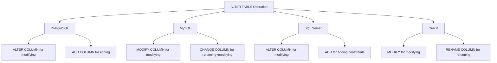

# Altering Tables in SQL

## Introduction

After creating tables in a database, you'll often need to modify their structure as your application evolves. The `ALTER TABLE` statement in SQL allows you to make changes to existing tables without having to delete and recreate them. This ability to modify table structures is crucial for database maintenance and evolution.

In this tutorial, we'll explore how to:
- Add new columns to a table
- Modify existing columns
- Drop columns
- Rename tables and columns
- Add and remove constraints

## Basic Syntax

The general syntax for altering tables follows this pattern:

```sql
ALTER TABLE table_name
action;
```

Where `action` is the specific modification you want to make to the table structure.

## Adding Columns

One of the most common table alterations is adding a new column to an existing table.

### Syntax

```sql
ALTER TABLE table_name
ADD column_name data_type [constraints];
```

### Example

Let's say we have a `customers` table and want to add a column for storing the customer's date of birth:

```sql
-- Original table structure
CREATE TABLE customers (
    customer_id INT PRIMARY KEY,
    first_name VARCHAR(50),
    last_name VARCHAR(50),
    email VARCHAR(100)
);

-- Adding a new column
ALTER TABLE customers
ADD date_of_birth DATE;
```

After executing this command, the `customers` table will now have a new column named `date_of_birth` with the data type `DATE`.

### Adding Multiple Columns

You can add multiple columns in a single `ALTER TABLE` statement:

```sql
ALTER TABLE customers
ADD phone_number VARCHAR(20),
ADD registration_date DATE DEFAULT CURRENT_DATE,
ADD loyalty_points INT DEFAULT 0;
```

## Modifying Columns

When you need to change a column's data type, constraints, or default values, you can use the `ALTER COLUMN` or `MODIFY COLUMN` clause (syntax varies by database system).

### Syntax (PostgreSQL, SQL Server)

```sql
ALTER TABLE table_name
ALTER COLUMN column_name TYPE new_data_type [constraints];
```

### Syntax (MySQL, Oracle)

```sql
ALTER TABLE table_name
MODIFY COLUMN column_name new_data_type [constraints];
```

### Example

Let's modify the `email` column to increase its maximum length:

```sql
-- PostgreSQL, SQL Server
ALTER TABLE customers
ALTER COLUMN email TYPE VARCHAR(150);

-- MySQL, Oracle
ALTER TABLE customers
MODIFY COLUMN email VARCHAR(150);
```

## Dropping Columns

If a column is no longer needed, you can remove it from the table.

### Syntax

```sql
ALTER TABLE table_name
DROP COLUMN column_name;
```

### Example

Let's remove a column that we no longer need:

```sql
ALTER TABLE customers
DROP COLUMN loyalty_points;
```

### Warning

Be careful when dropping columns! This operation permanently deletes all data stored in that column. Make sure to back up your data before executing such commands in a production environment.

## Renaming Tables

You can rename an existing table using the `RENAME` clause.

### Syntax

```sql
-- Standard SQL
ALTER TABLE old_table_name
RENAME TO new_table_name;

-- Some databases use different syntax
RENAME TABLE old_table_name TO new_table_name; -- MySQL
```

### Example

```sql
ALTER TABLE customers
RENAME TO clients;
```

## Renaming Columns

Column names can also be changed if needed.

### Syntax (varies by database)

```sql
-- PostgreSQL, SQL Server
ALTER TABLE table_name
RENAME COLUMN old_column_name TO new_column_name;

-- MySQL
ALTER TABLE table_name
CHANGE COLUMN old_column_name new_column_name data_type [constraints];

-- Oracle
ALTER TABLE table_name
RENAME COLUMN old_column_name TO new_column_name;
```

### Example

```sql
-- PostgreSQL, SQL Server, Oracle
ALTER TABLE clients
RENAME COLUMN first_name TO given_name;

-- MySQL
ALTER TABLE clients
CHANGE COLUMN first_name given_name VARCHAR(50);
```

## Adding and Removing Constraints

Constraints can be added or removed to enforce data integrity rules.

### Adding a Constraint

```sql
-- Adding a NOT NULL constraint
ALTER TABLE clients
ALTER COLUMN email SET NOT NULL;

-- Adding a unique constraint
ALTER TABLE clients
ADD CONSTRAINT unique_email UNIQUE (email);

-- Adding a foreign key
ALTER TABLE orders
ADD CONSTRAINT fk_client
FOREIGN KEY (client_id) REFERENCES clients(customer_id);
```

### Removing a Constraint

```sql
-- Removing a constraint by name
ALTER TABLE clients
DROP CONSTRAINT unique_email;

-- Removing a NOT NULL constraint (PostgreSQL)
ALTER TABLE clients
ALTER COLUMN email DROP NOT NULL;
```

## Real-World Example: Evolving a Product Database

Let's look at a practical example of how you might alter a table as your application requirements change:

1. Initial product table:

```sql
CREATE TABLE products (
    product_id INT PRIMARY KEY,
    name VARCHAR(100) NOT NULL,
    price DECIMAL(10, 2) NOT NULL
);
```

2. After launching, you realize you need to track inventory:

```sql
-- Add inventory tracking
ALTER TABLE products
ADD stock_quantity INT DEFAULT 0 NOT NULL;
```

3. You decide to categorize products:

```sql
-- Add category
ALTER TABLE products 
ADD category_id INT;

-- Create categories table
CREATE TABLE categories (
    category_id INT PRIMARY KEY,
    category_name VARCHAR(50) NOT NULL
);

-- Add foreign key constraint
ALTER TABLE products
ADD CONSTRAINT fk_category
FOREIGN KEY (category_id) REFERENCES categories(category_id);
```

4. You want to track when products were added and last updated:

```sql
ALTER TABLE products
ADD created_at TIMESTAMP DEFAULT CURRENT_TIMESTAMP,
ADD updated_at TIMESTAMP DEFAULT CURRENT_TIMESTAMP;
```

5. You decide to rename the table to be more specific:

```sql
ALTER TABLE products
RENAME TO inventory_products;
```

This sequence demonstrates how a database schema evolves over time to meet changing business requirements.

## Database Differences

It's important to note that the syntax for `ALTER TABLE` can vary significantly between different database management systems.



Always refer to the documentation for your specific database system for the exact syntax.

## Best Practices

When altering tables, keep these best practices in mind:

1. **Back Up First**: Always back up your database before making structural changes.

2. **Test in Development**: Test your alterations in a development environment before applying them to production.

3. **Consider Downtime**: Some alterations (especially on large tables) might lock the table and cause downtime.

4. **Plan for Data Migration**: When changing column types, have a plan for converting existing data.

5. **Use Transactions**: Wrap complex alterations in transactions to ensure atomicity.

6. **Consider Performance**: Adding constraints or indexes to large tables can be time-consuming.

7. **Documentation**: Keep your database schema changes documented.

## Summary

The `ALTER TABLE` statement is a powerful tool for adapting your database schema to changing requirements. It allows you to:

- Add, modify, and drop columns
- Rename tables and columns
- Add and remove constraints
- Manage foreign key relationships

Understanding how to properly alter tables is essential for effective database management and maintenance.

## Exercises

1. Create a `users` table with columns for `user_id`, `username`, and `email`.
2. Alter the table to add columns for `first_name` and `last_name`.
3. Add a unique constraint to the `email` column.
4. Modify the `username` column to make it NOT NULL.
5. Add a column for `last_login` with a timestamp data type.
6. Rename the table to `app_users`.
7. Drop the `last_login` column.

## Further Reading

- Explore more about database normalization
- Learn about database migration strategies
- Understand how to manage table alterations in large production databases
- Study database version control techniques