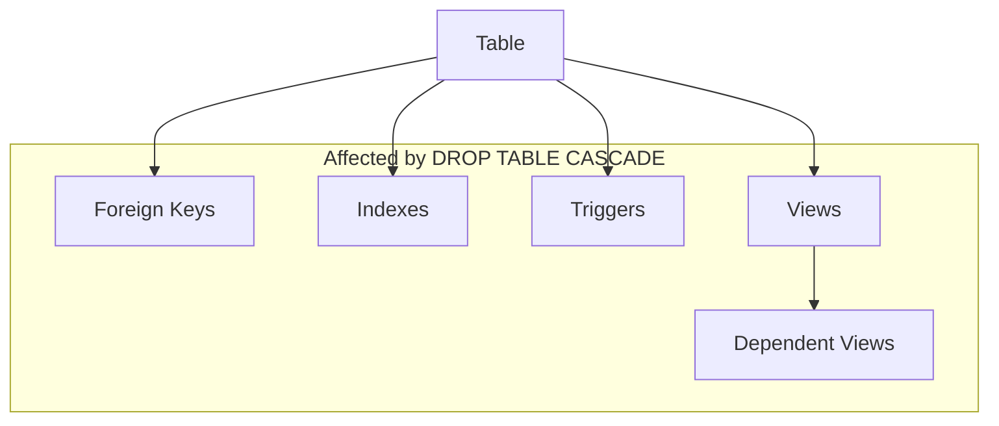

# Dropping Database Objects

## Introduction

In database management, creating structures to store and organize data is only part of the lifecycle. Often, you'll need to remove database objects that are no longer needed, outdated, or incorrectly structured. SQL provides the `DROP` statement for this purpose, allowing you to remove tables, views, indexes, and other database objects from your database schema.

This guide will teach you how to safely remove different types of database objects, the syntax variations across major database systems, and best practices to prevent accidental data loss.

## Understanding the DROP Statement

The `DROP` statement is a Data Definition Language (DDL) command that permanently removes objects from a database. Once executed, the object and all its data are deleted and cannot be recovered without a database backup.

### Basic Syntax

```sql
DROP object_type object_name;
```

Where:
- `object_type` specifies what you're removing (TABLE, VIEW, INDEX, etc.)
- `object_name` is the identifier of the specific object to remove

## Dropping Tables

Tables are the most common database objects you'll need to remove during database maintenance or restructuring.

### Basic Syntax

```sql
DROP TABLE table_name;
```

### Example: Dropping a Simple Table

```sql
-- First, let's create a sample table
CREATE TABLE old_customers (
    id INT PRIMARY KEY,
    name VARCHAR(100),
    email VARCHAR(100)
);

-- Now let's drop it
DROP TABLE old_customers;
```

When executed, this statement completely removes the `old_customers` table and all its data from the database.

### Adding Safety with IF EXISTS

To prevent errors when attempting to drop a table that doesn't exist, use the `IF EXISTS` clause:

```sql
DROP TABLE IF EXISTS old_customers;
```

This statement will:
- Drop the table if it exists
- Do nothing and continue execution (without error) if the table doesn't exist

## Dropping Multiple Tables

Some database systems allow dropping multiple tables in a single statement:

```sql
DROP TABLE table1, table2, table3;
```

For example:

```sql
DROP TABLE old_customers, archived_orders, temp_data;
```

## Handling Dependencies with CASCADE

When tables are referenced by foreign keys or other objects like views, dropping them may cause constraint violations. The `CASCADE` option forces the removal of dependent objects:

```sql
DROP TABLE parent_table CASCADE;
```

This will drop the table and all objects that depend on it. Without `CASCADE`, the drop operation would fail if dependencies exist.

### Example: Using CASCADE

```sql
-- Create parent and child tables
CREATE TABLE departments (
    dept_id INT PRIMARY KEY,
    dept_name VARCHAR(100)
);

CREATE TABLE employees (
    emp_id INT PRIMARY KEY,
    name VARCHAR(100),
    dept_id INT,
    FOREIGN KEY (dept_id) REFERENCES departments(dept_id)
);

-- This would fail without CASCADE due to the foreign key reference
DROP TABLE departments;

-- This succeeds by removing the constraint
DROP TABLE departments CASCADE;
```

:::caution
Using `CASCADE` can lead to unintended data loss as it removes all dependent objects. Use with extreme caution!
:::

## Dropping Other Database Objects

The `DROP` statement works with various database objects, each with slightly different syntax.

### Dropping Views

Views are virtual tables based on query results:

```sql
DROP VIEW view_name;
-- Or with safety check
DROP VIEW IF EXISTS view_name;
```

Example:

```sql
-- Create a view
CREATE VIEW active_customers AS
SELECT * FROM customers WHERE status = 'active';

-- Drop the view
DROP VIEW active_customers;
```

### Dropping Indexes

Indexes improve query performance but can be removed when no longer needed:

```sql
DROP INDEX index_name;
```

Example:

```sql
-- Create an index
CREATE INDEX idx_customer_email ON customers(email);

-- Drop the index
DROP INDEX idx_customer_email;
```

:::note
Index syntax varies significantly between database systems:

- **MySQL**: `DROP INDEX index_name ON table_name;`
- **PostgreSQL**: `DROP INDEX index_name;`
- **SQL Server**: `DROP INDEX table_name.index_name;`
- **Oracle**: `DROP INDEX index_name;`
:::

### Dropping Schemas

Schemas are containers for database objects:

```sql
DROP SCHEMA schema_name;
-- Or with CASCADE to remove all objects in the schema
DROP SCHEMA schema_name CASCADE;
```

### Dropping Sequences

Sequences generate unique numeric values:

```sql
DROP SEQUENCE sequence_name;
```

## Database-Specific Variations

### MySQL

MySQL has some specific behaviors when dropping tables:

```sql
-- Drop temporary table
DROP TEMPORARY TABLE temp_table;

-- Force drop even with errors
DROP TABLE temp_table RESTRICT;
```

### PostgreSQL

PostgreSQL offers additional options:

```sql
-- Remove a table and all its dependent objects
DROP TABLE table_name CASCADE;

-- Specify behavior when objects depend on the table
DROP TABLE table_name RESTRICT; -- Default: fails if dependencies exist
```

### SQL Server

SQL Server includes object ownership in its syntax:

```sql
DROP TABLE schema_name.table_name;
```

## Best Practices for Dropping Objects

1. **Always back up your database before dropping important objects**
2. **Use `IF EXISTS` to make scripts more resilient**
3. **Be extremely cautious with `CASCADE` options**
4. **Script and test drop operations in development environments first**
5. **Consider using transactions for complex operations**

```sql
-- Example using a transaction for safety
BEGIN TRANSACTION;
    DROP TABLE table1;
    DROP TABLE table2;
    -- If something goes wrong, you can ROLLBACK
COMMIT;
```

6. **Document database changes, including objects that are removed**

## Common Errors When Dropping Objects

### Object Does Not Exist

```
Error: Table 'database.table_name' doesn't exist
```

Solution: Use `IF EXISTS` clause or verify object name.

### Permission Denied

```
Error: Permission denied for relation table_name
```

Solution: Ensure your database user has proper permissions.

### Dependency Constraints

```
Error: Cannot drop table 'parent_table' referenced by a foreign key constraint
```

Solution: Either drop dependent objects first or use the `CASCADE` option.

## Visualization of Database Object Dependencies



## Real-World Applications

### Database Maintenance

Regularly removing unused tables and indexes improves database performance:

```sql
-- Drop tables older than a certain date
DROP TABLE IF EXISTS audit_logs_2020;
DROP TABLE IF EXISTS audit_logs_2021;
```

### Application Upgrades

During application upgrades, you might need to replace existing database structures:

```sql
-- Begin upgrade transaction
BEGIN TRANSACTION;
    -- Create backup of current table
    CREATE TABLE customers_backup AS SELECT * FROM customers;
    
    -- Drop old table
    DROP TABLE customers;
    
    -- Create new table with updated structure
    CREATE TABLE customers (
        id INT PRIMARY KEY,
        full_name VARCHAR(150), -- Changed from separate first/last name
        email VARCHAR(100),
        signup_date DATE,
        status VARCHAR(20)
    );
    
    -- Import data from backup
    INSERT INTO customers (id, full_name, email, signup_date, status)
    SELECT id, CONCAT(first_name, ' ', last_name), email, created_at, status
    FROM customers_backup;
COMMIT;
```

### Database Cleanup Scripts

Automated cleanup of temporary objects:

```sql
-- Clean up temporary tables
DROP TABLE IF EXISTS temp_import_data;
DROP TABLE IF EXISTS temp_calculation_results;
DROP TABLE IF EXISTS temp_report_staging;
```

## Summary

The `DROP` statement is a powerful tool for removing database objects that are no longer needed. Key points to remember:

- Use `DROP TABLE` to remove tables and their data permanently
- Add `IF EXISTS` to avoid errors when objects don't exist
- Use `CASCADE` carefully to remove dependent objects
- Different database systems have slight variations in syntax
- Always back up your database before dropping important objects
- Consider using transactions for complex operations

By understanding how to safely drop database objects, you can maintain a clean, efficient database structure while avoiding accidental data loss.

## Exercises

1. Write a SQL statement to drop a table named `outdated_products` only if it exists.
2. Create a script that safely drops a table and all its dependent objects.
3. Write SQL statements to drop a view named `customer_summary` and an index named `idx_order_date`.
4. Create a transaction that drops multiple related tables, with a comment explaining what each table was used for.
5. Research how to recover a table after it has been dropped in your specific database system (MySQL, PostgreSQL, etc.).

## Additional Resources

- Your database system's official documentation:
  - [MySQL DROP TABLE documentation](https://dev.mysql.com/doc/refman/8.0/en/drop-table.html)
  - [PostgreSQL DROP documentation](https://www.postgresql.org/docs/current/sql-droptable.html)
  - [SQL Server DROP TABLE documentation](https://docs.microsoft.com/en-us/sql/t-sql/statements/drop-table-transact-sql)
- Books on SQL database management
- Online courses on database administration