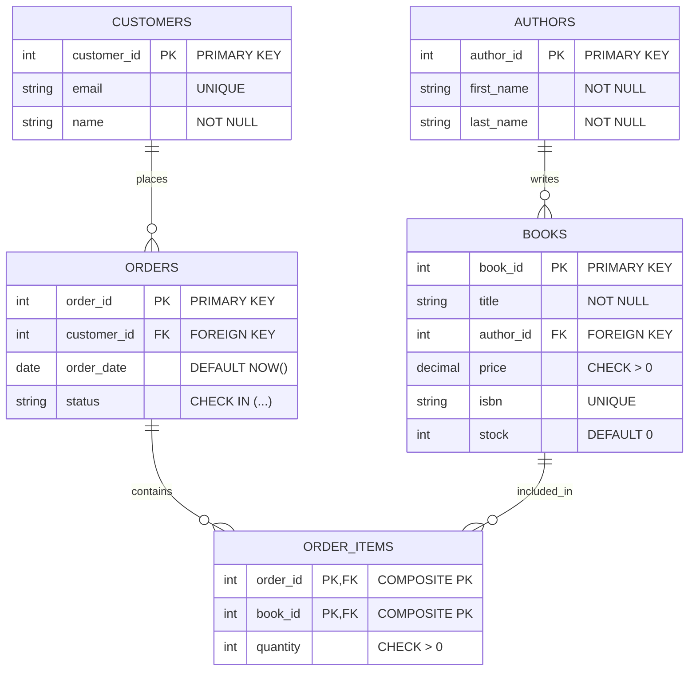

# Constraints in SQL

## Introduction

When building databases, ensuring data accuracy and reliability is crucial. SQL constraints are rules that enforce data integrity within your database tables. They act as safeguards, preventing invalid or inconsistent data from being entered into your tables. This helps maintain the reliability and integrity of your data throughout its lifecycle.

In this tutorial, we'll explore different types of SQL constraints, understand their purposes, and see how to implement them in real-world scenarios.

## What Are SQL Constraints?

Constraints in SQL are rules that define what data can be stored in a table. When you define a constraint, the database management system (DBMS) enforces these rules by automatically checking that all data modifications comply with them.

Think of constraints as the "guardrails" of your database that:
- Prevent invalid data entry
- Maintain relationships between tables
- Ensure consistency across your database

## Types of SQL Constraints

SQL provides several types of constraints, each serving a specific purpose in maintaining data integrity:

### 1. NOT NULL Constraint

The `NOT NULL` constraint ensures that a column cannot have a NULL value (empty value). This is useful when you need to ensure that a value is always provided.

```sql
CREATE TABLE students (
    student_id INT NOT NULL,
    first_name VARCHAR(50) NOT NULL,
    last_name VARCHAR(50) NOT NULL,
    email VARCHAR(100)
);
```

In this example, `student_id`, `first_name`, and `last_name` columns cannot be empty, but the `email` column can be NULL.

### 2. UNIQUE Constraint

The `UNIQUE` constraint ensures that all values in a column (or a set of columns) are different. This prevents duplicate values in the specified column(s).

```sql
CREATE TABLE users (
    user_id INT,
    username VARCHAR(50) UNIQUE,
    email VARCHAR(100) UNIQUE,
    password VARCHAR(100)
);
```

Here, both `username` and `email` must be unique across all records in the table.

You can also create a UNIQUE constraint across multiple columns:

```sql
CREATE TABLE product_inventory (
    product_id INT,
    warehouse_id INT,
    quantity INT,
    UNIQUE (product_id, warehouse_id)
);
```

This ensures that a particular product can only appear once for each warehouse.

### 3. PRIMARY KEY Constraint

The `PRIMARY KEY` constraint uniquely identifies each record in a table. A primary key must contain UNIQUE values and cannot contain NULL values. Each table should have only one primary key.

```sql
CREATE TABLE employees (
    employee_id INT PRIMARY KEY,
    first_name VARCHAR(50),
    last_name VARCHAR(50),
    hire_date DATE
);
```

In this example, `employee_id` is the primary key of the `employees` table.

A primary key can also consist of multiple columns (known as a composite primary key):

```sql
CREATE TABLE order_items (
    order_id INT,
    product_id INT,
    quantity INT,
    price DECIMAL(10,2),
    PRIMARY KEY (order_id, product_id)
);
```

This creates a composite primary key on the combination of `order_id` and `product_id`.

### 4. FOREIGN KEY Constraint

A `FOREIGN KEY` constraint creates a relationship between tables. It ensures that values in one table's column(s) match values in another table's column(s).

```sql
CREATE TABLE orders (
    order_id INT PRIMARY KEY,
    customer_id INT,
    order_date DATE,
    total_amount DECIMAL(10,2),
    FOREIGN KEY (customer_id) REFERENCES customers(customer_id)
);
```

This ensures that every `customer_id` in the `orders` table must exist in the `customers` table, preventing orders from being created for non-existent customers.

### 5. CHECK Constraint

The `CHECK` constraint ensures that all values in a column satisfy a specific condition.

```sql
CREATE TABLE products (
    product_id INT PRIMARY KEY,
    product_name VARCHAR(100),
    price DECIMAL(10,2) CHECK (price > 0),
    stock_quantity INT CHECK (stock_quantity >= 0)
);
```

Here, the `CHECK` constraints ensure that `price` is always greater than zero and `stock_quantity` is never negative.

### 6. DEFAULT Constraint

The `DEFAULT` constraint provides a default value for a column when no value is specified during an insert.

```sql
CREATE TABLE blog_posts (
    post_id INT PRIMARY KEY,
    title VARCHAR(200) NOT NULL,
    content TEXT,
    publication_date DATE DEFAULT CURRENT_DATE,
    views INT DEFAULT 0
);
```

In this example, if no value is provided for `publication_date`, it will default to the current date, and `views` will start at 0.

## Practical Examples

Let's see how constraints work together in a more comprehensive example. We'll design a simple online bookstore database:

```sql
-- Create Authors table
CREATE TABLE authors (
    author_id INT PRIMARY KEY,
    first_name VARCHAR(50) NOT NULL,
    last_name VARCHAR(50) NOT NULL,
    biography TEXT,
    birth_date DATE
);

-- Create Books table
CREATE TABLE books (
    book_id INT PRIMARY KEY,
    title VARCHAR(200) NOT NULL,
    author_id INT NOT NULL,
    price DECIMAL(10,2) CHECK (price > 0),
    publication_date DATE,
    isbn VARCHAR(13) UNIQUE,
    stock INT DEFAULT 0 CHECK (stock >= 0),
    FOREIGN KEY (author_id) REFERENCES authors(author_id)
);

-- Create Customers table
CREATE TABLE customers (
    customer_id INT PRIMARY KEY,
    email VARCHAR(100) NOT NULL UNIQUE,
    first_name VARCHAR(50) NOT NULL,
    last_name VARCHAR(50) NOT NULL,
    registration_date DATE DEFAULT CURRENT_DATE
);

-- Create Orders table
CREATE TABLE orders (
    order_id INT PRIMARY KEY,
    customer_id INT NOT NULL,
    order_date TIMESTAMP DEFAULT CURRENT_TIMESTAMP,
    status VARCHAR(20) CHECK (status IN ('pending', 'shipped', 'delivered', 'cancelled')),
    total_amount DECIMAL(10,2) DEFAULT 0,
    FOREIGN KEY (customer_id) REFERENCES customers(customer_id)
);

-- Create Order_Items table
CREATE TABLE order_items (
    order_id INT,
    book_id INT,
    quantity INT CHECK (quantity > 0),
    price_per_unit DECIMAL(10,2),
    PRIMARY KEY (order_id, book_id),
    FOREIGN KEY (order_id) REFERENCES orders(order_id),
    FOREIGN KEY (book_id) REFERENCES books(book_id)
);
```

In this bookstore database:
- `NOT NULL` ensures critical information is always provided
- `UNIQUE` prevents duplicate ISBN numbers for books and customer emails
- `PRIMARY KEY` uniquely identifies each record in all tables
- `FOREIGN KEY` maintains relationships between tables (books-authors, orders-customers, order_items-orders/books)
- `CHECK` ensures prices are positive, stock quantities aren't negative, and order status has valid values
- `DEFAULT` provides sensible default values for registration dates, order dates, and initial stock

## Adding, Modifying, and Dropping Constraints

### Adding Constraints to Existing Tables

You can add constraints to existing tables using the `ALTER TABLE` statement:

```sql
-- Add a UNIQUE constraint
ALTER TABLE students 
ADD CONSTRAINT unique_email UNIQUE (email);

-- Add a CHECK constraint
ALTER TABLE products
ADD CONSTRAINT valid_price CHECK (price > 0);

-- Add a FOREIGN KEY constraint
ALTER TABLE orders
ADD CONSTRAINT fk_customer FOREIGN KEY (customer_id) REFERENCES customers(customer_id);
```

### Modifying or Dropping Constraints

You can also modify or remove constraints from tables:

```sql
-- Drop a constraint
ALTER TABLE students
DROP CONSTRAINT unique_email;

-- Disable a foreign key constraint (temporarily)
ALTER TABLE orders
DISABLE CONSTRAINT fk_customer;

-- Enable a previously disabled constraint
ALTER TABLE orders
ENABLE CONSTRAINT fk_customer;
```

## Constraint Naming Conventions

It's a good practice to name your constraints explicitly. This makes them easier to reference later when you need to modify or drop them:

```sql
CREATE TABLE products (
    product_id INT,
    product_name VARCHAR(100),
    price DECIMAL(10,2),
    CONSTRAINT pk_product PRIMARY KEY (product_id),
    CONSTRAINT chk_price CHECK (price > 0)
);
```

## Constraint Visualization

Here's a diagram showing how different constraints work together in a database:



## Common Pitfalls and Best Practices

### Pitfalls to Avoid

1. **Overusing constraints**: Excessive constraints can make your database rigid and complicate data operations.
2. **Ignoring constraint performance impact**: Some constraints (especially complex CHECK constraints) can impact performance.
3. **Not planning for constraint violations**: Always plan how your application will handle constraint violations.

### Best Practices

1. **Use meaningful constraint names**: This makes database maintenance easier.
2. **Document your constraints**: Keep documentation about what each constraint is enforcing and why.
3. **Test constraint behavior**: Ensure constraints work as expected before deploying to production.
4. **Consider database-specific constraint features**: Different database systems might have unique constraint capabilities.

## Summary

SQL constraints are powerful tools for maintaining data integrity in your database. By implementing appropriate constraints, you can:

- Ensure data accuracy and consistency
- Prevent invalid data from entering your database
- Establish and maintain relationships between tables
- Automate validation rules directly at the database level

When designing databases, carefully consider which constraints are necessary to protect your data while maintaining the flexibility needed for your application.

## Practice Exercises

Try these exercises to reinforce your understanding of SQL constraints:

1. Create a `students` table with appropriate constraints for a school management system.
2. Design a database for a simple e-commerce platform with at least 3 tables and appropriate constraints.
3. Add constraints to an existing table using ALTER TABLE commands.
4. Create a table with a composite primary key and explain when this might be useful.
5. Write a CHECK constraint that validates an email address format using a simple pattern.

## Additional Resources

To deepen your understanding of SQL constraints, explore these topics:

- Transactions and constraint checking
- Deferred constraints
- Database-specific constraint implementations
- Performance considerations for constraints
- Domain and assertion constraints in SQL standards

With a solid understanding of SQL constraints, you're well on your way to building robust, error-resistant database applications!