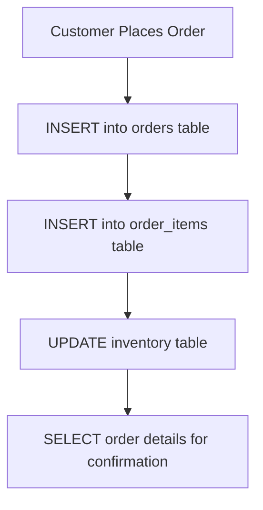

# Data Manipulation Language (DML)

## Introduction

Data Manipulation Language (DML) is a subset of SQL that allows you to manage and interact with the data stored in your database tables. While Data Definition Language (DDL) commands create and modify database structures, DML commands work with the actual data within those structures.

DML operations are what make databases truly useful in applications - they allow you to create, read, update, and delete data (often referred to as CRUD operations). These operations form the backbone of most database interactions in software applications.

## Core DML Commands

There are four primary DML commands in SQL:

1. `INSERT` - Adds new records to a table
2. `SELECT` - Retrieves data from one or more tables
3. `UPDATE` - Modifies existing records in a table
4. `DELETE` - Removes records from a table

Let's explore each of these commands in detail.

## The INSERT Command

The `INSERT` command adds new rows of data to a table. There are two main ways to use the `INSERT` statement:

### Basic Syntax

```sql
INSERT INTO table_name (column1, column2, column3, ...)
VALUES (value1, value2, value3, ...);
```

### Examples

Let's create a simple `students` table and add some data:

```sql
-- First, create a table (this is a DDL command)
CREATE TABLE students (
    student_id INTEGER PRIMARY KEY,
    first_name TEXT,
    last_name TEXT,
    age INTEGER,
    grade CHAR(1)
);

-- Now, insert a record (DML)
INSERT INTO students (student_id, first_name, last_name, age, grade)
VALUES (1, 'John', 'Smith', 18, 'A');
```

You can also insert multiple rows at once:

```sql
INSERT INTO students (student_id, first_name, last_name, age, grade)
VALUES 
    (2, 'Emma', 'Johnson', 17, 'B'),
    (3, 'Michael', 'Williams', 18, 'A'),
    (4, 'Sophia', 'Brown', 16, 'A');
```

If you're inserting values for every column in the table, you can omit the column names:

```sql
INSERT INTO students
VALUES (5, 'James', 'Davis', 17, 'C');
```

### Inserting Data from Another Table

You can also insert data using the results of a `SELECT` statement:

```sql
INSERT INTO honor_students (student_id, first_name, last_name)
SELECT student_id, first_name, last_name
FROM students
WHERE grade = 'A';
```

## The SELECT Command

The `SELECT` command retrieves data from tables. It's the most common and versatile DML command.

### Basic Syntax

```sql
SELECT column1, column2, ...
FROM table_name
WHERE condition;
```

### Examples

To retrieve all columns and rows from the students table:

```sql
SELECT * FROM students;
```

**Output:**
```
student_id | first_name | last_name | age | grade
-----------+------------+-----------+-----+------
1          | John       | Smith     | 18  | A
2          | Emma       | Johnson   | 17  | B
3          | Michael    | Williams  | 18  | A
4          | Sophia     | Brown     | 16  | A
5          | James      | Davis     | 17  | C
```

To retrieve specific columns:

```sql
SELECT first_name, last_name
FROM students;
```

**Output:**
```
first_name | last_name
-----------+----------
John       | Smith
Emma       | Johnson
Michael    | Williams
Sophia     | Brown
James      | Davis
```

To filter results with a `WHERE` clause:

```sql
SELECT first_name, last_name, grade
FROM students
WHERE age >= 18;
```

**Output:**
```
first_name | last_name | grade
-----------+-----------+------
John       | Smith     | A
Michael    | Williams  | A
```

### Using ORDER BY for Sorting

```sql
SELECT *
FROM students
ORDER BY last_name ASC;
```

**Output:**
```
student_id | first_name | last_name | age | grade
-----------+------------+-----------+-----+------
4          | Sophia     | Brown     | 16  | A
5          | James      | Davis     | 17  | C
2          | Emma       | Johnson   | 17  | B
1          | John       | Smith     | 18  | A
3          | Michael    | Williams  | 18  | A
```

### Using GROUP BY and Aggregate Functions

```sql
SELECT grade, COUNT(*) AS count
FROM students
GROUP BY grade;
```

**Output:**
```
grade | count
------+------
A     | 3
B     | 1
C     | 1
```

## The UPDATE Command

The `UPDATE` command modifies existing data in a table.

### Basic Syntax

```sql
UPDATE table_name
SET column1 = value1, column2 = value2, ...
WHERE condition;
```

### Examples

Update a single record:

```sql
UPDATE students
SET grade = 'A'
WHERE student_id = 2;
```

This would change Emma Johnson's grade from 'B' to 'A'.

Update multiple columns:

```sql
UPDATE students
SET age = 17, grade = 'B'
WHERE student_id = 1;
```

Caution: If you omit the `WHERE` clause, the update will apply to all rows:

```sql
-- This will set the grade to 'A' for ALL students
UPDATE students
SET grade = 'A';
```

## The DELETE Command

The `DELETE` command removes records from a table.

### Basic Syntax

```sql
DELETE FROM table_name
WHERE condition;
```

### Examples

Delete a specific record:

```sql
DELETE FROM students
WHERE student_id = 5;
```

This would remove James Davis from the table.

Delete multiple records based on a condition:

```sql
DELETE FROM students
WHERE grade = 'C';
```

Caution: Like `UPDATE`, if you omit the `WHERE` clause, all rows will be deleted:

```sql
-- This will delete ALL records from the students table
DELETE FROM students;
```

## Transactions with DML

When performing DML operations, especially in production environments, it's important to use transactions to ensure data integrity.

```sql
-- Start a transaction
BEGIN TRANSACTION;

-- Perform DML operations
INSERT INTO students (student_id, first_name, last_name, age, grade)
VALUES (6, 'Olivia', 'Wilson', 16, 'B');

UPDATE students
SET grade = 'A'
WHERE student_id = 6;

-- If everything worked as expected, commit the changes
COMMIT;

-- If something went wrong, you can roll back instead
-- ROLLBACK;
```

## Real-world Application: E-commerce Order System

Let's look at how DML operations might be used in a real e-commerce system:



Here's how the DML operations would work:

```sql
-- When a new order comes in
INSERT INTO orders (order_id, customer_id, order_date, status)
VALUES (1001, 500, '2023-09-15', 'pending');

-- Add items to the order
INSERT INTO order_items (order_id, product_id, quantity, price)
VALUES 
    (1001, 101, 2, 25.99),
    (1001, 103, 1, 49.99);

-- Update inventory
UPDATE products
SET stock_quantity = stock_quantity - 2
WHERE product_id = 101;

UPDATE products
SET stock_quantity = stock_quantity - 1
WHERE product_id = 103;

-- Retrieve order details for confirmation
SELECT o.order_id, o.order_date, c.customer_name, 
       p.product_name, oi.quantity, oi.price,
       (oi.quantity * oi.price) AS item_total
FROM orders o
JOIN customers c ON o.customer_id = c.customer_id
JOIN order_items oi ON o.order_id = oi.order_id
JOIN products p ON oi.product_id = p.product_id
WHERE o.order_id = 1001;
```

## Common DML Mistakes and Best Practices

1. **Missing WHERE clause**: Always double-check your `UPDATE` and `DELETE` statements to ensure they include a `WHERE` clause unless you intentionally want to affect all rows.

2. **Not validating input data**: When inserting or updating data, always validate that the data is in the correct format and meets any constraints.

3. **Not using transactions**: For operations that involve multiple related DML commands, use transactions to maintain data integrity.

4. **Inefficient queries**: Complex `SELECT` queries can significantly impact performance. Use indexes, limit the columns returned, and avoid unnecessary joins.

5. **Not handling NULL values properly**: Be careful when working with NULL values, as they require special operators like `IS NULL` instead of `= NULL`.

```sql
-- Incorrect way to find NULL values
SELECT * FROM students WHERE grade = NULL;  -- Won't work

-- Correct way
SELECT * FROM students WHERE grade IS NULL;
```

## Summary

Data Manipulation Language (DML) commands are essential for working with the data in your database:

- `INSERT` adds new records to tables
- `SELECT` retrieves data from tables
- `UPDATE` modifies existing records
- `DELETE` removes records from tables

These commands form the foundation of most database interactions in applications, enabling the create, read, update, and delete (CRUD) operations that power dynamic software.

## Exercises

1. Create a table called `employees` with columns for employee_id, name, department, and salary.
2. Insert at least 5 records into the `employees` table.
3. Write a query to select all employees in a specific department.
4. Update the salary of an employee.
5. Delete an employee from the table.
6. Write a query that groups employees by department and calculates the average salary for each department.

## Additional Resources

- [SQL Tutorial on W3Schools](https://www.w3schools.com/sql/)
- [PostgreSQL Documentation](https://www.postgresql.org/docs/)
- [MySQL Documentation](https://dev.mysql.com/doc/)
- [SQLite Documentation](https://www.sqlite.org/docs.html)