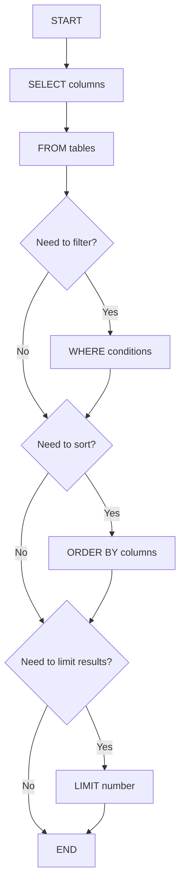

# Basic Queries in SQL

## Introduction

Structured Query Language (SQL) is the standard language for interacting with relational databases. At its core, SQL allows you to retrieve, manipulate, and manage data stored in database tables. The most fundamental operation in SQL is the query - a command that retrieves data from one or more tables.

In this tutorial, we'll explore the basics of SQL queries, focusing on the `SELECT` statement and its common clauses. By the end, you'll be able to write queries to extract precisely the data you need from a database.

## The SELECT Statement

The `SELECT` statement is the workhorse of SQL. It allows you to retrieve data from database tables. The most basic form of a `SELECT` statement looks like this:

```sql
SELECT column1, column2, ... 
FROM table_name;
```

Let's break down this syntax:
- `SELECT` specifies which columns you want to retrieve
- `FROM` specifies which table contains those columns

### Selecting All Columns

To retrieve all columns from a table, you can use the asterisk (`*`) wildcard:

```sql
SELECT * 
FROM customers;
```

**Output:**
```
id | first_name | last_name | email               | signup_date
---+------------+-----------+---------------------+------------
1  | John       | Doe       | john.doe@email.com  | 2023-01-15
2  | Jane       | Smith     | jane.s@email.com    | 2023-01-20
3  | Robert     | Johnson   | robert.j@email.com  | 2023-02-05
```

While convenient for exploration, selecting all columns in production code is generally not recommended as it:
- Returns unnecessary data
- Increases network load
- May expose sensitive information

### Selecting Specific Columns

Usually, you'll want to select only the columns you need:

```sql
SELECT first_name, last_name, email 
FROM customers;
```

**Output:**
```
first_name | last_name | email
-----------+-----------+---------------------
John       | Doe       | john.doe@email.com
Jane       | Smith     | jane.s@email.com
Robert     | Johnson   | robert.j@email.com
```

## Filtering Data with WHERE

The `WHERE` clause allows you to filter records based on a condition:

```sql
SELECT column1, column2, ... 
FROM table_name 
WHERE condition;
```

### Simple Comparisons

```sql
SELECT first_name, last_name 
FROM customers 
WHERE signup_date > '2023-01-18';
```

**Output:**
```
first_name | last_name
-----------+----------
Jane       | Smith
Robert     | Johnson
```

### Common Comparison Operators

| Operator | Description              |
|----------|--------------------------|
| `=`      | Equal to                 |
| `>`      | Greater than             |
| `<`      | Less than                |
| `>=`     | Greater than or equal to |
| `<=`     | Less than or equal to    |
| `<>`     | Not equal to             |
| `!=`     | Not equal to (alt)       |

### Using Logical Operators

You can combine multiple conditions using logical operators:

- `AND` - Both conditions must be true
- `OR` - At least one condition must be true
- `NOT` - Negates a condition

```sql
SELECT product_name, price, stock_quantity 
FROM products 
WHERE price < 20 AND stock_quantity > 0;
```

**Output:**
```
product_name      | price | stock_quantity
------------------+-------+---------------
Notebook          | 4.99  | 120
Ballpoint Pen     | 1.99  | 250
Sticky Notes      | 3.49  | 75
```

## Sorting Results with ORDER BY

The `ORDER BY` clause sorts the result set:

```sql
SELECT column1, column2, ... 
FROM table_name 
ORDER BY column1 [ASC|DESC], column2 [ASC|DESC], ...;
```

By default, `ORDER BY` sorts in ascending order (`ASC`). You can specify `DESC` for descending order:

```sql
SELECT product_name, price 
FROM products 
ORDER BY price DESC;
```

**Output:**
```
product_name      | price
------------------+-------
Premium Headphones| 89.99
Wireless Mouse    | 24.99
USB Flash Drive   | 15.99
Notebook          | 4.99
Ballpoint Pen     | 1.99
```

## Limiting Results with LIMIT

In many SQL implementations, you can use the `LIMIT` clause to restrict the number of rows returned:

```sql
SELECT column1, column2, ... 
FROM table_name 
LIMIT number;
```

This is particularly useful when working with large tables:

```sql
SELECT product_name, price 
FROM products 
ORDER BY price DESC 
LIMIT 3;
```

**Output:**
```
product_name      | price
------------------+-------
Premium Headphones| 89.99
Wireless Mouse    | 24.99
USB Flash Drive   | 15.99
```

Note: Some database systems like SQL Server use `TOP` instead of `LIMIT`, and Oracle uses `ROWNUM`.

## Working with NULL Values

`NULL` represents missing or unknown data in SQL. To check for `NULL` values, use the `IS NULL` or `IS NOT NULL` operators:

```sql
SELECT first_name, last_name, phone 
FROM customers 
WHERE phone IS NULL;
```

**Output:**
```
first_name | last_name | phone
-----------+-----------+------
Jane       | Smith     | NULL
```

## Column Aliases

You can rename columns in your result set using aliases:

```sql
SELECT 
  first_name AS "First Name", 
  last_name AS "Last Name" 
FROM customers;
```

**Output:**
```
First Name | Last Name
-----------+----------
John       | Doe
Jane       | Smith
Robert     | Johnson
```

## Distinct Values

To retrieve only unique values from a column:

```sql
SELECT DISTINCT category 
FROM products;
```

**Output:**
```
category
---------
Electronics
Office Supplies
Books
Kitchen
```

## Basic SQL Query Flow Diagram



## Real-World Example: E-Commerce Product Analysis

Let's assume we have an e-commerce database with tables for products, categories, and sales. Here's a practical example that combines what we've learned:

```sql
SELECT 
  p.product_id,
  p.product_name,
  c.category_name,
  p.price,
  p.stock_quantity
FROM 
  products p
JOIN 
  categories c ON p.category_id = c.category_id
WHERE 
  p.price < 50 
  AND p.stock_quantity > 0
ORDER BY 
  p.price DESC
LIMIT 5;
```

This query:
1. Selects product details and their categories
2. Joins the products and categories tables
3. Filters for in-stock products under $50
4. Orders results by price (highest first)
5. Shows only the top 5 results

**Output:**
```
product_id | product_name     | category_name   | price | stock_quantity
-----------+------------------+-----------------+-------+---------------
45         | Wireless Mouse   | Electronics     | 24.99 | 42
32         | USB Flash Drive  | Electronics     | 15.99 | 67
18         | Premium Notebook | Office Supplies | 12.99 | 89
22         | Desk Organizer   | Office Supplies | 9.99  | 34
10         | Notebook         | Office Supplies | 4.99  | 120
```

## Summary

In this tutorial, you've learned the fundamentals of SQL queries:

- Using `SELECT` to retrieve data from tables
- Filtering results with the `WHERE` clause
- Sorting data with `ORDER BY`
- Limiting results with `LIMIT`
- Handling `NULL` values
- Using column aliases
- Finding distinct values

These basic query operations form the foundation of SQL and will be used in nearly every interaction with a database. As you continue learning SQL, you'll build on these concepts to create more complex and powerful queries.

## Practice Exercises

To solidify your understanding of basic SQL queries, try these exercises:

1. Write a query to select all customers who signed up in February 2023.
2. Create a query to find the 3 most expensive products that are currently in stock.
3. Write a query to list all unique product categories ordered alphabetically.
4. Create a query to find all products with "phone" in their name, sorted by price from lowest to highest.
5. Write a query to find customers who have not provided a phone number.

## Additional Resources

- [SQL Formatter](https://www.sqlformat.org/) - A tool to format and beautify your SQL queries
- [SQL Fiddle](http://sqlfiddle.com/) - An online environment for testing SQL queries
- [W3Schools SQL Tutorial](https://www.w3schools.com/sql/) - Comprehensive SQL reference and practice
- [Mode Analytics SQL Tutorial](https://mode.com/sql-tutorial/) - Interactive SQL learning platform