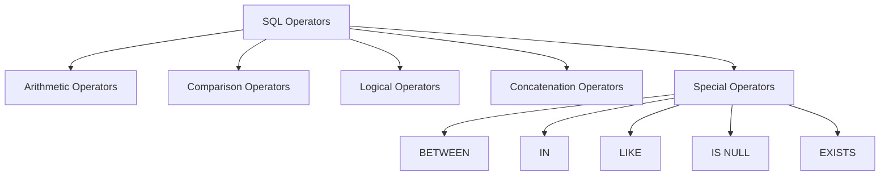

# SQL Operators

## Introduction

SQL (Structured Query Language) operators are special symbols or keywords that perform operations on values and columns in SQL statements. They are essential building blocks that allow you to manipulate data, filter results, and perform calculations in your database queries.

In this tutorial, we'll explore the various types of SQL operators and learn how to use them effectively in your database interactions.

## Types of SQL Operators

SQL operators can be broadly categorized into several types:



Let's explore each type in detail.

## Arithmetic Operators

Arithmetic operators allow you to perform mathematical calculations on numeric data.

| Operator | Description | Example |
|----------|-------------|---------|
| + | Addition | `SELECT price + tax FROM products;` |
| - | Subtraction | `SELECT price - discount FROM products;` |
| * | Multiplication | `SELECT quantity * price FROM order_items;` |
| / | Division | `SELECT total_amount / item_count FROM orders;` |
| % | Modulo (remainder) | `SELECT product_id % 2 FROM products;` |

### Example: Calculating Total Cost

```sql
SELECT 
    product_name,
    quantity,
    price,
    quantity * price AS total_cost
FROM 
    order_items
WHERE 
    order_id = 1001;
```

**Output:**
```
product_name    | quantity | price  | total_cost
----------------|----------|--------|------------
Laptop          | 2        | 999.99 | 1999.98
Mouse           | 3        | 24.99  | 74.97
Keyboard        | 1        | 49.99  | 49.99
```

## Comparison Operators

Comparison operators compare values and return a Boolean result (TRUE or FALSE). They are commonly used in WHERE clauses to filter data.

| Operator | Description | Example |
|----------|-------------|---------|
| `=` | Equal to | `SELECT * FROM employees WHERE department = 'Sales';` |
| `>` | Greater than | `SELECT * FROM products WHERE price > 100;` |
| `<` | Less than | `SELECT * FROM inventory WHERE stock < 10;` |
| `>=` | Greater than or equal to | `SELECT * FROM orders WHERE amount >= 1000;` |
| `<=` | Less than or equal to | `SELECT * FROM performance WHERE rating <= 3;` |
| `<>` or `!=` | Not equal to | `SELECT * FROM tasks WHERE status <> 'Completed';` |

### Example: Filtering Employees by Salary

```sql
SELECT 
    employee_id,
    first_name,
    last_name,
    salary
FROM 
    employees
WHERE 
    salary > 50000 AND department = 'IT';
```

**Output:**
```
employee_id | first_name | last_name | salary
------------|------------|-----------|--------
101         | John       | Smith     | 65000
105         | Sarah      | Johnson   | 72000
112         | Michael    | Brown     | 58000
```

## Logical Operators

Logical operators combine multiple conditions and return a Boolean result.

| Operator | Description | Example |
|----------|-------------|---------|
| AND | TRUE if all conditions are TRUE | `WHERE price > 100 AND category = 'Electronics'` |
| OR | TRUE if any condition is TRUE | `WHERE country = 'USA' OR country = 'Canada'` |
| NOT | Negates a condition | `WHERE NOT discontinued = 1` |

### Example: Complex Filtering

```sql
SELECT 
    product_name,
    price,
    category
FROM 
    products
WHERE 
    price > 50 AND (category = 'Electronics' OR category = 'Office Supplies')
    AND NOT discontinued;
```

**Output:**
```
product_name       | price  | category
-------------------|--------|------------------
Wireless Headphones| 79.99  | Electronics
External Hard Drive| 129.99 | Electronics
Office Chair       | 159.99 | Office Supplies
Drawing Tablet     | 199.99 | Electronics
```

## Concatenation Operators

The concatenation operator combines strings together.

In most SQL databases, the concatenation operator is `||`, but in SQL Server, it's `+`. MySQL uses the `CONCAT()` function.

### Example: Combining First and Last Names

```sql
-- Standard SQL or PostgreSQL
SELECT 
    first_name || ' ' || last_name AS full_name
FROM 
    employees;

-- SQL Server
SELECT 
    first_name + ' ' + last_name AS full_name
FROM 
    employees;

-- MySQL
SELECT 
    CONCAT(first_name, ' ', last_name) AS full_name
FROM 
    employees;
```

**Output:**
```
full_name
-----------------
John Smith
Sarah Johnson
Michael Brown
Lisa Davis
```

## Special Operators

### BETWEEN Operator

The BETWEEN operator selects values within a given range (inclusive).

```sql
SELECT 
    product_name,
    price
FROM 
    products
WHERE 
    price BETWEEN 50 AND 100;
```

**Output:**
```
product_name       | price
-------------------|-------
Wireless Headphones| 79.99
Mechanical Keyboard| 89.99
Gaming Mouse       | 59.99
External SSD       | 99.99
```

### IN Operator

The IN operator allows you to specify multiple values in a WHERE clause.

```sql
SELECT 
    employee_id,
    first_name,
    last_name,
    department
FROM 
    employees
WHERE 
    department IN ('Sales', 'Marketing', 'IT');
```

**Output:**
```
employee_id | first_name | last_name | department
------------|------------|-----------|------------
101         | John       | Smith     | IT
102         | Emily      | Wilson    | Marketing
103         | Robert     | Jones     | Sales
105         | Sarah      | Johnson   | IT
```

### LIKE Operator

The LIKE operator is used for pattern matching with wildcards.

- `%` represents zero, one, or multiple characters
- `_` represents a single character

```sql
SELECT 
    first_name,
    last_name,
    email
FROM 
    customers
WHERE 
    email LIKE '%gmail.com';
```

**Output:**
```
first_name | last_name | email
-----------|-----------|--------------------
David      | Johnson   | david.j@gmail.com
Maria      | Garcia    | maria84@gmail.com
Thomas     | Wilson    | tom.wilson@gmail.com
```

### IS NULL / IS NOT NULL Operators

These operators check if a value is NULL (or not NULL).

```sql
SELECT 
    customer_id,
    first_name,
    last_name,
    phone_number
FROM 
    customers
WHERE 
    phone_number IS NULL;
```

**Output:**
```
customer_id | first_name | last_name | phone_number
------------|------------|-----------|-------------
1005        | Jennifer   | Parker    | NULL
1008        | Michael    | Roberts   | NULL
1012        | Christine  | Lee       | NULL
```

### EXISTS Operator

The EXISTS operator tests for the existence of records in a subquery.

```sql
SELECT 
    department_name
FROM 
    departments d
WHERE 
    EXISTS (
        SELECT 1 
        FROM employees e 
        WHERE e.department_id = d.department_id 
        AND e.salary > 70000
    );
```

**Output:**
```
department_name
---------------
IT
Finance
Executive
```

## Practical Examples

### Example 1: Finding Products with Low Stock

This query helps identify products that need to be restocked:

```sql
SELECT 
    product_id,
    product_name,
    category,
    stock_quantity,
    reorder_level
FROM 
    inventory
WHERE 
    stock_quantity <= reorder_level
    AND NOT discontinued;
```

### Example 2: Calculating Discounted Prices

This query calculates sale prices with different discount rates based on product categories:

```sql
SELECT 
    product_name,
    category,
    price,
    CASE 
        WHEN category = 'Electronics' THEN price * 0.9
        WHEN category = 'Clothing' THEN price * 0.75
        ELSE price * 0.95
    END AS sale_price
FROM 
    products
WHERE 
    price > 20;
```

### Example 3: Finding Active Customers

This query identifies active customers who have placed orders in the last 90 days:

```sql
SELECT 
    c.customer_id,
    c.first_name || ' ' || c.last_name AS customer_name,
    COUNT(o.order_id) AS recent_orders
FROM 
    customers c
JOIN 
    orders o ON c.customer_id = o.customer_id
WHERE 
    o.order_date >= DATE_SUB(CURRENT_DATE, INTERVAL 90 DAY)
GROUP BY 
    c.customer_id, customer_name
HAVING 
    COUNT(o.order_id) > 0
ORDER BY 
    recent_orders DESC;
```

## Summary

SQL operators are fundamental components that enable you to manipulate and retrieve data from your databases effectively. In this tutorial, we've covered:

- **Arithmetic operators** for mathematical calculations
- **Comparison operators** for filtering data based on conditions
- **Logical operators** for combining multiple conditions
- **Concatenation operators** for combining strings
- **Special operators** like BETWEEN, IN, LIKE, and IS NULL for more complex filtering

Understanding these operators is essential for writing efficient and powerful SQL queries. As you become more familiar with them, you'll be able to create increasingly sophisticated database interactions.

## Practice Exercises

1. Write a query to find all products with a price between $50 and $100, sorted by price in descending order.
2. Create a query that lists customers whose first name starts with 'J' or last name contains 'son'.
3. Write a query to find all orders placed in the last 30 days with a total amount greater than $100.
4. Create a query that calculates the average price of products in each category, but only for categories with more than 5 products.

## Additional Resources

- [SQL Tutorial on W3Schools](https://www.w3schools.com/sql/)
- [PostgreSQL Documentation on Operators](https://www.postgresql.org/docs/current/functions.html)
- [MySQL Operator Reference](https://dev.mysql.com/doc/refman/8.0/en/non-typed-operators.html)
- [SQL Server Operators](https://learn.microsoft.com/en-us/sql/t-sql/language-elements/operators-transact-sql)