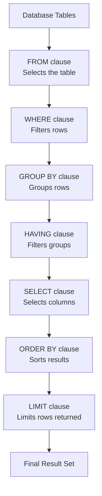

# SELECT Statement

## Introduction

The `SELECT` statement is the most fundamental command in SQL (Structured Query Language). It allows you to retrieve data from one or more tables in a database. Think of a database as a collection of tables, where each table is like a spreadsheet with rows and columns. The `SELECT` statement is your tool to ask questions about the data stored in these tables.

Whether you're building a web application, analyzing data, or managing information systems, mastering the `SELECT` statement is your first step toward becoming proficient in SQL.

## Basic Syntax

The most basic form of the `SELECT` statement looks like this:

```sql
SELECT column1, column2, ...
FROM table_name;
```

Let's break down the essential components:

- `SELECT`: The keyword that begins the query
- `column1, column2, ...`: The names of the columns you want to retrieve
- `FROM`: The keyword that specifies the source of the data
- `table_name`: The name of the table from which you want to retrieve data
- `;`: The semicolon that ends the SQL statement

## Simple SELECT Examples

### Example 1: Selecting Specific Columns

Let's say we have a table called `employees` with columns for employee information:

```sql
SELECT first_name, last_name, email
FROM employees;
```

**Output:**
```
first_name | last_name | email
-----------|-----------|-----------------------
John       | Smith     | john.smith@example.com
Maria      | Garcia    | maria.g@example.com
David      | Kim       | d.kim@example.com
Sarah      | Johnson   | sjohnson@example.com
```

This query retrieves only the first name, last name, and email columns for all employees.

### Example 2: Selecting All Columns

If you want to retrieve all columns from a table, you can use the asterisk `*` wildcard:

```sql
SELECT *
FROM employees;
```

**Output:**
```
id | first_name | last_name | email                  | hire_date  | department | salary
---|------------|-----------|------------------------|------------|------------|-------
1  | John       | Smith     | john.smith@example.com | 2020-03-15 | Sales      | 50000
2  | Maria      | Garcia    | maria.g@example.com    | 2019-06-22 | Marketing  | 52000
3  | David      | Kim       | d.kim@example.com      | 2021-01-10 | IT         | 65000
4  | Sarah      | Johnson   | sjohnson@example.com   | 2018-09-01 | HR         | 55000
```

While convenient for exploration, using `SELECT *` in production code is generally not recommended because:
- It retrieves more data than you might need, potentially affecting performance
- Your code might break if the table structure changes in the future

## Filtering Data with WHERE

Most of the time, you don't want to retrieve all rows from a table. The `WHERE` clause allows you to filter the results based on specific conditions:

```sql
SELECT column1, column2, ...
FROM table_name
WHERE condition;
```

### Example 3: Basic Filtering

Let's retrieve only the employees who work in the IT department:

```sql
SELECT first_name, last_name, salary
FROM employees
WHERE department = 'IT';
```

**Output:**
```
first_name | last_name | salary
-----------|-----------|-------
David      | Kim       | 65000
```

### Example 4: Multiple Conditions with AND/OR

You can combine multiple conditions using logical operators like `AND` and `OR`:

```sql
SELECT first_name, last_name, department, salary
FROM employees
WHERE department = 'Sales' OR department = 'Marketing'
  AND salary > 50000;
```

**Output:**
```
first_name | last_name | department | salary
-----------|-----------|------------|-------
Maria      | Garcia    | Marketing  | 52000
```

This query retrieves employees who either work in Sales OR work in Marketing AND have a salary greater than 50000.

## Sorting Results with ORDER BY

The `ORDER BY` clause allows you to sort your results based on one or more columns:

```sql
SELECT column1, column2, ...
FROM table_name
WHERE condition
ORDER BY column1 [ASC|DESC], column2 [ASC|DESC], ...;
```

- `ASC`: Ascending order (default if not specified)
- `DESC`: Descending order

### Example 5: Basic Sorting

Let's retrieve all employees sorted by their salary in descending order:

```sql
SELECT first_name, last_name, department, salary
FROM employees
ORDER BY salary DESC;
```

**Output:**
```
first_name | last_name | department | salary
-----------|-----------|------------|-------
David      | Kim       | IT         | 65000
Sarah      | Johnson   | HR         | 55000
Maria      | Garcia    | Marketing  | 52000
John       | Smith     | Sales      | 50000
```

### Example 6: Multiple Sort Criteria

You can sort by multiple columns. The secondary sort kicks in when there are ties in the primary sort:

```sql
SELECT first_name, last_name, department, salary
FROM employees
ORDER BY department ASC, salary DESC;
```

**Output:**
```
first_name | last_name | department | salary
-----------|-----------|------------|-------
Sarah      | Johnson   | HR         | 55000
David      | Kim       | IT         | 65000
Maria      | Garcia    | Marketing  | 52000
John       | Smith     | Sales      | 50000
```

This query first sorts by department alphabetically, then by salary in descending order within each department.

## Limiting Results with LIMIT

The `LIMIT` clause restricts the number of rows returned by your query. This is especially useful when working with large tables:

```sql
SELECT column1, column2, ...
FROM table_name
LIMIT number;
```

### Example 7: Basic LIMIT

Let's retrieve only the top 2 highest-paid employees:

```sql
SELECT first_name, last_name, salary
FROM employees
ORDER BY salary DESC
LIMIT 2;
```

**Output:**
```
first_name | last_name | salary
-----------|-----------|-------
David      | Kim       | 65000
Sarah      | Johnson   | 55000
```

## Removing Duplicates with DISTINCT

The `DISTINCT` keyword removes duplicate values from your result set:

```sql
SELECT DISTINCT column1, column2, ...
FROM table_name;
```

### Example 8: Using DISTINCT

Let's retrieve a list of all unique departments in our company:

```sql
SELECT DISTINCT department
FROM employees;
```

**Output:**
```
department
----------
Sales
Marketing
IT
HR
```

## Using Calculated Fields

You can perform calculations directly in your `SELECT` statement:

```sql
SELECT column1, column2, expression AS alias
FROM table_name;
```

### Example 9: Arithmetic Operations

Let's calculate a 10% bonus for each employee:

```sql
SELECT first_name, last_name, salary, salary * 0.1 AS bonus
FROM employees;
```

**Output:**
```
first_name | last_name | salary | bonus
-----------|-----------|--------|------
John       | Smith     | 50000  | 5000
Maria      | Garcia    | 52000  | 5200
David      | Kim       | 65000  | 6500
Sarah      | Johnson   | 55000  | 5500
```

### Example 10: String Concatenation

You can also combine string values:

```sql
SELECT first_name || ' ' || last_name AS full_name, email
FROM employees;
```

**Output (in SQLite, PostgreSQL):**
```
full_name      | email
---------------|------------------------
John Smith     | john.smith@example.com
Maria Garcia   | maria.g@example.com
David Kim      | d.kim@example.com
Sarah Johnson  | sjohnson@example.com
```

For MySQL, you would use the `CONCAT()` function instead:

```sql
SELECT CONCAT(first_name, ' ', last_name) AS full_name, email
FROM employees;
```

## Real-World Application: Building a Report

Let's combine several concepts to build a useful report for our company's HR department.

### Example 11: Department Salary Report

This report shows each department, the number of employees, and the average salary:

```sql
SELECT 
    department, 
    COUNT(*) AS employee_count,
    AVG(salary) AS average_salary,
    MIN(salary) AS lowest_salary,
    MAX(salary) AS highest_salary
FROM employees
GROUP BY department
ORDER BY average_salary DESC;
```

**Output:**
```
department | employee_count | average_salary | lowest_salary | highest_salary
-----------|----------------|----------------|---------------|---------------
IT         | 1              | 65000          | 65000         | 65000
HR         | 1              | 55000          | 55000         | 55000
Marketing  | 1              | 52000          | 52000         | 52000
Sales      | 1              | 50000          | 50000         | 50000
```

This shows the power of SQL when you start combining different clauses. Note that this example introduced the `GROUP BY` clause and aggregate functions like `COUNT()` and `AVG()`, which we'll explore in more detail in future lessons.

## Workflow Visualization

Here's a visual representation of how a SELECT query processes data:



## Summary

The `SELECT` statement is the foundation of SQL queries. In this tutorial, we've covered:

- Basic `SELECT` syntax to retrieve columns from a table
- Filtering data with the `WHERE` clause
- Sorting results with `ORDER BY`
- Limiting results with `LIMIT`
- Removing duplicates with `DISTINCT`
- Creating calculated fields
- Building a real-world report combining multiple features

With these fundamentals, you're now equipped to start retrieving and analyzing data from databases using SQL.

## Practice Exercises

1. Write a query to select all employees with a salary greater than 55000.
2. Write a query to find the average salary across all departments.
3. Write a query to list the full names and emails of employees hired in 2020 or later.
4. Write a query to find the department with the highest average salary.
5. Write a query to list all employees sorted by last name, and then by first name if there are duplicate last names.
