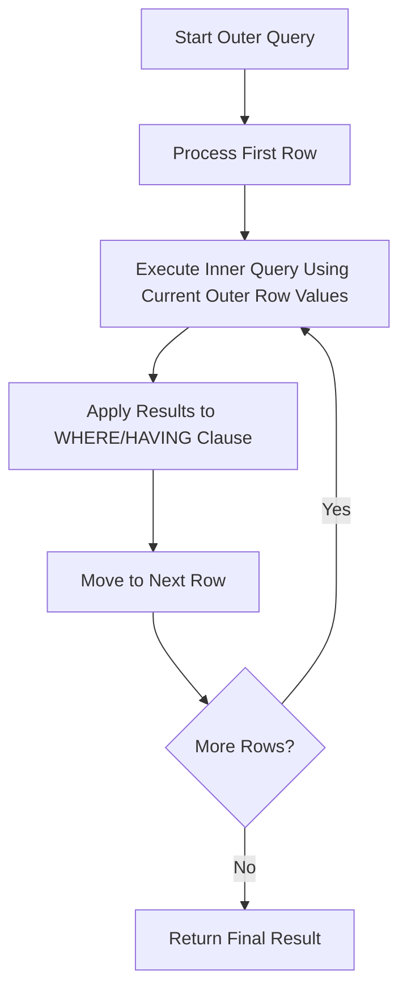

# Correlated Subqueries

## Introduction

When working with databases, you'll often need to write queries that depend on data from other parts of your database. Correlated subqueries are a powerful SQL technique that allows you to reference columns from the outer query within an inner query. Unlike regular subqueries that can be executed independently, correlated subqueries are dependent on the outer query and must be re-evaluated for each row processed by the outer query.

Think of correlated subqueries as a way to perform row-by-row processing in SQL, where each row in the outer query is analyzed in relation to other rows or tables.

## Basic Concept

A correlated subquery is a subquery that references columns from the outer query. This creates a dependency between the inner and outer queries, causing the inner query to execute once for each row processed by the outer query.

The basic structure looks like this:

```sql
SELECT column1, column2, ...
FROM table1 outer
WHERE column1 operator (
    SELECT column1, column2, ...
    FROM table2
    WHERE outer.column = table2.column
);
```

Notice the reference to `outer.column` in the inner query - this is what makes it "correlated" with the outer query.

## How Correlated Subqueries Work

Let's break down the execution process:



For each row in the outer query:
1. The database engine selects a row from the outer query
2. The inner query executes using values from the current outer query row
3. The result of the inner query is used to determine if the current outer row meets the conditions
4. The process repeats for each row in the outer table

## Common Use Cases

### 1. Finding Records with Related Data

One common use is to find records that have specific related records in another table.

For example, find all employees who manage at least one department:

```sql
SELECT employee_id, first_name, last_name
FROM employees emp
WHERE EXISTS (
    SELECT 1
    FROM departments dept
    WHERE dept.manager_id = emp.employee_id
);
```

### 2. Comparing Against Aggregates Within Groups

Correlated subqueries excel at comparing values against aggregates within groups.

For example, find employees who earn more than the average salary in their department:

```sql
SELECT employee_id, first_name, last_name, salary, department_id
FROM employees emp
WHERE salary > (
    SELECT AVG(salary)
    FROM employees
    WHERE department_id = emp.department_id
);
```

### 3. Updating Records Based on Related Data

Correlated subqueries can be used in UPDATE statements to modify data based on relationships.

```sql
UPDATE products p
SET price = price * 1.1
WHERE EXISTS (
    SELECT 1
    FROM order_items oi
    JOIN orders o ON oi.order_id = o.order_id
    WHERE oi.product_id = p.product_id
    AND o.order_date >= '2023-01-01'
);
```

This query increases the price by 10% for all products that were ordered since January 1, 2023.

## Real-World Example: E-commerce Database

Let's consider a practical example using an e-commerce database with tables for customers, orders, and products.

### Database Schema

```sql
CREATE TABLE customers (
    customer_id INT PRIMARY KEY,
    customer_name VARCHAR(100),
    email VARCHAR(100),
    signup_date DATE
);

CREATE TABLE orders (
    order_id INT PRIMARY KEY,
    customer_id INT,
    order_date DATE,
    total_amount DECIMAL(10,2),
    FOREIGN KEY (customer_id) REFERENCES customers(customer_id)
);

CREATE TABLE products (
    product_id INT PRIMARY KEY,
    product_name VARCHAR(100),
    category VARCHAR(50),
    price DECIMAL(10,2)
);

CREATE TABLE order_items (
    order_id INT,
    product_id INT,
    quantity INT,
    unit_price DECIMAL(10,2),
    PRIMARY KEY (order_id, product_id),
    FOREIGN KEY (order_id) REFERENCES orders(order_id),
    FOREIGN KEY (product_id) REFERENCES products(product_id)
);
```

### Example 1: Finding VIP Customers

Let's identify customers who have placed orders with a total value higher than the average order value:

```sql
SELECT c.customer_id, c.customer_name, o.order_id, o.total_amount
FROM customers c
JOIN orders o ON c.customer_id = o.customer_id
WHERE o.total_amount > (
    SELECT AVG(total_amount)
    FROM orders
    WHERE customer_id = c.customer_id
);
```

### Example 2: Identifying Popular Products

Find products that have been ordered more frequently than the average product in their category:

```sql
SELECT p.product_id, p.product_name, p.category,
    (SELECT COUNT(*) 
     FROM order_items oi 
     WHERE oi.product_id = p.product_id) AS order_count
FROM products p
WHERE (
    SELECT COUNT(*) 
    FROM order_items oi 
    WHERE oi.product_id = p.product_id
) > (
    SELECT AVG(product_order_count)
    FROM (
        SELECT COUNT(*) AS product_order_count
        FROM order_items oi
        JOIN products p2 ON oi.product_id = p2.product_id
        WHERE p2.category = p.category
        GROUP BY oi.product_id
    ) AS category_stats
);
```

### Example 3: Finding Customers with No Recent Orders

Identify customers who haven't placed an order in the last 90 days:

```sql
SELECT customer_id, customer_name, email
FROM customers c
WHERE NOT EXISTS (
    SELECT 1
    FROM orders o
    WHERE o.customer_id = c.customer_id
    AND o.order_date > CURRENT_DATE - INTERVAL '90' DAY
);
```

## Performance Considerations

Correlated subqueries can be powerful but may impact performance since the inner query runs once for each row processed by the outer query. Consider these best practices:

1. **Use indexes** on the columns referenced in the join conditions between the outer and inner queries
2. **Consider alternatives** like JOINs or window functions when possible
3. **Limit the scope** of the outer query if you only need to process a subset of rows
4. **Test performance** with EXPLAIN PLAN to understand how the database executes your query

Here's a comparison between a correlated subquery and an equivalent JOIN:

```sql
-- Correlated subquery
SELECT e.employee_id, e.first_name, e.last_name
FROM employees e
WHERE EXISTS (
    SELECT 1
    FROM departments d
    WHERE d.manager_id = e.employee_id
);

-- Equivalent JOIN
SELECT DISTINCT e.employee_id, e.first_name, e.last_name
FROM employees e
JOIN departments d ON d.manager_id = e.employee_id;
```

Both queries return the same result, but the JOIN approach might perform better in many database systems.

## Common Operators Used with Correlated Subqueries

Several operators are commonly used with correlated subqueries:

1. **EXISTS / NOT EXISTS**: Checks if the subquery returns any rows
2. **IN / NOT IN**: Compares a value to a set of values returned by the subquery
3. **ANY / SOME**: Returns true if any of the subquery values meet the condition
4. **ALL**: Returns true if all of the subquery values meet the condition
5. **Comparison operators** (`=`, `>`, `<`, etc.): When the subquery returns a single value

### Example with EXISTS:

```sql
SELECT product_name
FROM products p
WHERE EXISTS (
    SELECT 1
    FROM order_items oi
    WHERE oi.product_id = p.product_id
    AND oi.quantity > 10
);
```

This returns all products that have been ordered in quantities greater than 10 at least once.

## Summary

Correlated subqueries are a powerful SQL feature that allows you to:

- Reference outer query columns within an inner query
- Perform row-by-row analysis and comparisons
- Solve complex data problems that require contextual analysis
- Filter, update, or delete data based on related information

While they can impact performance compared to other SQL constructs, they provide a flexible way to express complex logic and are essential for certain types of queries that would be difficult to write otherwise.

## Exercises

To practice your understanding of correlated subqueries, try these exercises:

1. Write a query to find all products that have never been ordered.
2. Find customers who have placed orders for all products in a specific category.
3. Identify departments where all employees earn above the company's average salary.
4. Find the most expensive product in each category.
5. Identify customers who have spent more in the current year than they did in the previous year.

## Additional Resources

- [SQL Performance Tuning](https://use-the-index-luke.com/)
- [Advanced SQL on PostgreSQL](https://www.postgresql.org/docs/current/sql.html)
- [SQL Antipatterns](http://sql-antipatterns.com/)
- [Modern SQL](https://modern-sql.com/)