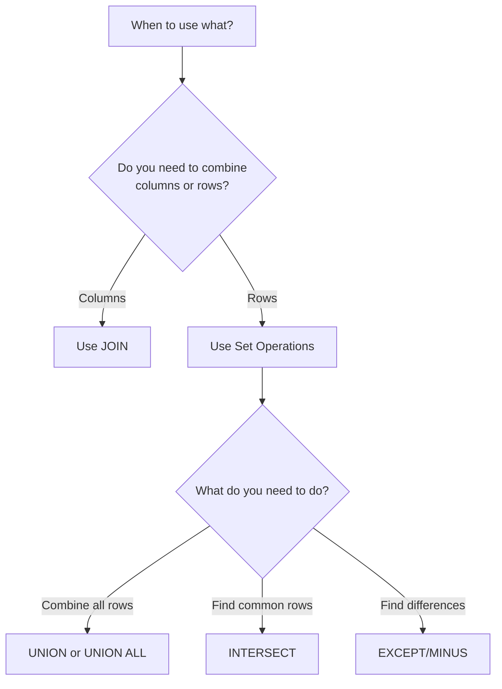

# Set Operations in SQL

## Introduction

When working with databases, you'll often need to combine or compare results from multiple queries. This is where SQL set operations come in handy. Set operations treat query results as mathematical sets, allowing you to merge, find commonalities, or identify differences between datasets.

In this tutorial, we'll explore the main set operations in SQL:

- **UNION**: Combines rows from two queries, removing duplicates
- **UNION ALL**: Combines rows from two queries, keeping all duplicates
- **INTERSECT**: Returns only rows that appear in both query results
- **EXCEPT** (also called **MINUS** in some databases): Returns rows from the first query that don't appear in the second

These operations are particularly useful when you need to:
- Combine related data from different tables
- Compare data between tables
- Create reports that aggregate information from multiple sources

## Prerequisites

Before diving in, you should have:
- Basic understanding of SQL `SELECT` statements
- Familiarity with database tables and relationships

## Important Rules for Set Operations

For set operations to work properly:

1. Both queries must return the same number of columns
2. Corresponding columns must have compatible data types
3. The column names from the first query will be used in the result set

Let's explore each set operation in detail.

## UNION and UNION ALL

### UNION

The `UNION` operator combines the results of two or more `SELECT` statements, removing any duplicate rows.

#### Syntax

```sql
SELECT column1, column2, ... FROM table1
UNION
SELECT column1, column2, ... FROM table2;
```

#### Example: Combining Customer Lists

Let's say we have two tables: `online_customers` and `in_store_customers`. We want a complete list of all customers without duplicates.

```sql
-- Table structure
CREATE TABLE online_customers (
    customer_id INT,
    name VARCHAR(100),
    email VARCHAR(100)
);

CREATE TABLE in_store_customers (
    customer_id INT,
    name VARCHAR(100),
    email VARCHAR(100)
);

-- Sample data
INSERT INTO online_customers VALUES
(1, 'John Smith', 'john@example.com'),
(2, 'Mary Johnson', 'mary@example.com'),
(3, 'Robert Brown', 'robert@example.com');

INSERT INTO in_store_customers VALUES
(3, 'Robert Brown', 'robert@example.com'),
(4, 'Sarah Wilson', 'sarah@example.com'),
(5, 'Michael Davis', 'michael@example.com');
```

Now, let's use `UNION` to get a complete list of unique customers:

```sql
SELECT customer_id, name, email FROM online_customers
UNION
SELECT customer_id, name, email FROM in_store_customers;
```

Result:

| customer_id | name | email |
|-------------|------|-------|
| 1 | John Smith | john@example.com |
| 2 | Mary Johnson | mary@example.com |
| 3 | Robert Brown | robert@example.com |
| 4 | Sarah Wilson | sarah@example.com |
| 5 | Michael Davis | michael@example.com |

Notice that Robert Brown appears only once in the result, even though he exists in both tables.

### UNION ALL

The `UNION ALL` operator also combines results from multiple queries but keeps all duplicate rows.

#### Syntax

```sql
SELECT column1, column2, ... FROM table1
UNION ALL
SELECT column1, column2, ... FROM table2;
```

Using our previous example:

```sql
SELECT customer_id, name, email FROM online_customers
UNION ALL
SELECT customer_id, name, email FROM in_store_customers;
```

Result:

| customer_id | name | email |
|-------------|------|-------|
| 1 | John Smith | john@example.com |
| 2 | Mary Johnson | mary@example.com |
| 3 | Robert Brown | robert@example.com |
| 3 | Robert Brown | robert@example.com |
| 4 | Sarah Wilson | sarah@example.com |
| 5 | Michael Davis | michael@example.com |

With `UNION ALL`, Robert Brown appears twice because he exists in both tables.

### When to Use UNION vs. UNION ALL

- Use `UNION` when you want to eliminate duplicates
- Use `UNION ALL` when:
  - You know there are no duplicates, or
  - You specifically want to keep duplicates, or
  - Performance matters (as `UNION ALL` is faster since it doesn't need to check for duplicates)

## INTERSECT

The `INTERSECT` operator returns only the rows that appear in the results of both queries.

#### Syntax

```sql
SELECT column1, column2, ... FROM table1
INTERSECT
SELECT column1, column2, ... FROM table2;
```

#### Example: Finding Customers Who Shop Both Online and In-Store

Using our previous tables, let's find customers who appear in both the online and in-store customer lists:

```sql
SELECT customer_id, name, email FROM online_customers
INTERSECT
SELECT customer_id, name, email FROM in_store_customers;
```

Result:

| customer_id | name | email |
|-------------|------|-------|
| 3 | Robert Brown | robert@example.com |

Only Robert Brown appears in both tables, so he's the only result.

## EXCEPT (or MINUS)

The `EXCEPT` operator (called `MINUS` in Oracle) returns rows from the first query that don't appear in the results of the second query.

#### Syntax

```sql
SELECT column1, column2, ... FROM table1
EXCEPT
SELECT column1, column2, ... FROM table2;
```

#### Example: Finding Online-Only Customers

Let's find customers who shop online but haven't made an in-store purchase:

```sql
SELECT customer_id, name, email FROM online_customers
EXCEPT
SELECT customer_id, name, email FROM in_store_customers;
```

Result:

| customer_id | name | email |
|-------------|------|-------|
| 1 | John Smith | john@example.com |
| 2 | Mary Johnson | mary@example.com |

This returns John Smith and Mary Johnson, who are online customers but not in-store customers.

## Real-World Applications

### Example 1: Employee Report Across Departments

Imagine you need to create a report showing all employees who work in either the IT or Sales departments, with no duplicates:

```sql
SELECT employee_id, first_name, last_name, 'IT' AS department
FROM employees
WHERE department_id = 10  -- Assuming 10 is the IT department ID

UNION

SELECT employee_id, first_name, last_name, 'Sales' AS department
FROM employees
WHERE department_id = 20;  -- Assuming 20 is the Sales department ID
```

### Example 2: Finding Products Not in Stock

To identify products that exist in your catalog but are not currently in stock:

```sql
SELECT product_id, product_name
FROM products

EXCEPT

SELECT i.product_id, p.product_name
FROM inventory i
JOIN products p ON i.product_id = p.product_id
WHERE i.quantity > 0;
```

### Example 3: Identifying Data Inconsistencies

To find customers who exist in your customer table but don't have any orders:

```sql
SELECT customer_id, name
FROM customers

EXCEPT

SELECT c.customer_id, c.name
FROM customers c
JOIN orders o ON c.customer_id = o.customer_id;
```

## Advanced Set Operations

### Combining Multiple Set Operations

You can chain multiple set operations:

```sql
(SELECT product_id FROM new_products
UNION
SELECT product_id FROM featured_products)

EXCEPT

SELECT product_id FROM discontinued_products;
```

This gives you all new or featured products that aren't discontinued.

### Using ORDER BY with Set Operations

The `ORDER BY` clause must be placed at the end of the last query:

```sql
SELECT customer_id, name FROM online_customers
UNION
SELECT customer_id, name FROM in_store_customers
ORDER BY name ASC;
```

### Using Column Aliases

When using set operations, column names from the first query are used in the result. You can use column aliases for clarity:

```sql
SELECT ID AS customer_id, full_name AS name FROM online_table
UNION
SELECT customer_num, customer_name FROM store_table;
```

The result will use column names `customer_id` and `name`.

## Common Errors and Troubleshooting

### Mismatched Column Count

If you get an error about the number of columns, make sure both queries have the same number of columns:

```sql
-- Error: The two queries have different numbers of columns
SELECT name, email FROM customers
UNION
SELECT name FROM employees;
```

Fix by adding a matching column:

```sql
SELECT name, email FROM customers
UNION
SELECT name, NULL AS email FROM employees;
```

### Incompatible Data Types

If you get a data type mismatch error, ensure that corresponding columns have compatible types:

```sql
-- Error: Incompatible data types
SELECT employee_id, hire_date FROM employees
UNION
SELECT customer_id, name FROM customers;
```

Fix by making the types compatible (using casting):

```sql
SELECT employee_id, CAST(hire_date AS VARCHAR) FROM employees
UNION
SELECT customer_id, name FROM customers;
```

## Database-Specific Variations

Different database systems might have variations in set operations:

- Oracle uses `MINUS` instead of `EXCEPT`
- Some databases like MySQL prior to version 8.0 only support `UNION` and `UNION ALL`, but not `INTERSECT` or `EXCEPT`
- Some databases support additional set operations like `INTERSECT ALL` and `EXCEPT ALL`

Always check your specific database's documentation for details.

## Set Operations vs. JOINs

It's important to understand when to use set operations versus JOINs:

- **JOINs**: Combine columns from different tables into a single result set
- **Set Operations**: Combine or compare rows from different query results



## Performance Considerations

1. `UNION ALL` is faster than `UNION` because it doesn't need to eliminate duplicates
2. Using indexes on the columns involved in set operations can improve performance
3. For large datasets, consider using temporary tables or CTEs (Common Table Expressions) before applying set operations

## Summary

Set operations in SQL allow you to manipulate the results of multiple queries as mathematical sets:

- `UNION` combines rows from two result sets, removing duplicates
- `UNION ALL` combines rows from two result sets, keeping all rows including duplicates
- `INTERSECT` returns only rows that appear in both result sets
- `EXCEPT` (or `MINUS`) returns rows from the first result set that don't appear in the second

These operations are powerful tools for combining and comparing data across different tables or query results. Understanding when and how to use them can significantly enhance your SQL toolkit and make complex data analysis tasks simpler.

## Exercises

To practice your understanding of set operations, try these exercises:

1. Create two tables with some overlapping data, then use each set operation to explore the relationships between them.
2. Write a query to find products that are both on sale and running low on inventory (less than 5 items).
3. Generate a list of customers who made purchases in 2022 but not in 2023.
4. Create a report showing employees who work in multiple departments.
5. Compare query performance between `UNION` and `UNION ALL` on a large dataset.

## Additional Resources

- Check your database's documentation for specific implementation details:
  - [MySQL Set Operations](https://dev.mysql.com/doc/)
  - [PostgreSQL Set Operations](https://www.postgresql.org/docs/)
  - [SQL Server Set Operations](https://docs.microsoft.com/en-us/sql/t-sql/)
  - [Oracle Set Operations](https://docs.oracle.com/en/database/)