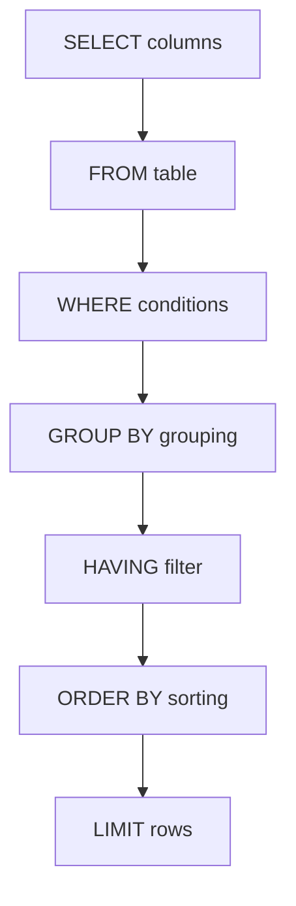

# ORDER BY Clause

## Introduction

When working with databases, retrieving data is only part of the story. Often, you'll want that data to be organized in a specific way - alphabetically, numerically, chronologically, or according to some other logical sequence. This is where the `ORDER BY` clause in SQL comes into play.

The `ORDER BY` clause allows you to sort the results of your SQL queries based on one or more columns. It's a powerful feature that helps make your data more organized, readable, and useful for analysis or presentation.

## Basic Syntax

The basic syntax of the `ORDER BY` clause is:

```sql
SELECT column1, column2, ...
FROM table_name
ORDER BY column1 [ASC|DESC], column2 [ASC|DESC], ...;
```

Where:
- `column1, column2, ...` are the columns you want to sort by
- `ASC` (ascending) sorts from smallest to largest or A to Z (this is the default if not specified)
- `DESC` (descending) sorts from largest to smallest or Z to A

## Simple Examples

Let's explore some simple examples using a hypothetical `employees` table:

```sql
SELECT * FROM employees ORDER BY last_name;
```

This query retrieves all columns from the `employees` table and sorts the results alphabetically by the `last_name` column in ascending order (A to Z), which is the default.

To sort in descending order (Z to A):

```sql
SELECT * FROM employees ORDER BY last_name DESC;
```

## Sorting by Multiple Columns

You can sort by multiple columns, creating a hierarchy of sorting rules:

```sql
SELECT * FROM employees 
ORDER BY department ASC, salary DESC;
```

In this example, the results will first be sorted by `department` in ascending order (alphabetically). Then, within each department, employees will be sorted by `salary` in descending order (highest to lowest).

This is particularly useful when you have duplicate values in the first sorting column and need a secondary rule to determine the order.

## Input and Output Example

Let's look at a concrete example with input data and the resulting output:

**Input: employees table**

| employee_id | first_name | last_name | department  | salary  |
|-------------|------------|-----------|-------------|---------|
| 1           | John       | Smith     | Sales       | 60000   |
| 2           | Jane       | Doe       | Marketing   | 65000   |
| 3           | Bob        | Johnson   | Engineering | 75000   |
| 4           | Alice      | Williams  | Sales       | 62000   |
| 5           | Charlie    | Brown     | Engineering | 78000   |
| 6           | Diana      | Miller    | Marketing   | 67000   |

**Query:**

```sql
SELECT employee_id, first_name, last_name, department, salary
FROM employees
ORDER BY department ASC, salary DESC;
```

**Output:**

| employee_id | first_name | last_name | department  | salary  |
|-------------|------------|-----------|-------------|---------|
| 5           | Charlie    | Brown     | Engineering | 78000   |
| 3           | Bob        | Johnson   | Engineering | 75000   |
| 6           | Diana      | Miller    | Marketing   | 67000   |
| 2           | Jane       | Doe       | Marketing   | 65000   |
| 4           | Alice      | Williams  | Sales       | 62000   |
| 1           | John       | Smith     | Sales       | 60000   |

As you can see, the results are grouped by department alphabetically (Engineering, Marketing, Sales), and within each department, employees are sorted by salary from highest to lowest.

## Ordering by Column Position

Instead of specifying column names, you can also order by column position:

```sql
SELECT employee_id, first_name, last_name, salary
FROM employees
ORDER BY 4 DESC;
```

In this example, `4` refers to the fourth column in the SELECT list, which is `salary`. The results will be sorted by salary in descending order.

**Note:** While ordering by column position works, it's generally considered better practice to use column names as they make your queries more readable and maintainable. If you change the order of columns in your SELECT statement, a query using positional ordering might no longer sort as expected.

## Ordering by Expressions

You can also order by expressions or calculations:

```sql
SELECT employee_id, first_name, last_name, salary, hire_date,
       DATEDIFF(CURRENT_DATE, hire_date) AS days_employed
FROM employees
ORDER BY DATEDIFF(CURRENT_DATE, hire_date) DESC;
```

This sorts employees by their length of employment (in days) in descending order, showing the most tenured employees first.

## Using ORDER BY with LIMIT

The `ORDER BY` clause is often used with the `LIMIT` clause to get specific subsets of sorted data:

```sql
SELECT employee_id, first_name, last_name, salary
FROM employees
ORDER BY salary DESC
LIMIT 5;
```

This query retrieves the top 5 highest-paid employees.

## NULL Values and ORDER BY

In SQL, NULL values are handled specially in sorting operations:
- In ascending (ASC) order, NULL values appear first
- In descending (DESC) order, NULL values appear last

If you want to change this behavior, you can use the `NULLS FIRST` or `NULLS LAST` clause in some database systems (like PostgreSQL):

```sql
-- PostgreSQL syntax
SELECT employee_id, first_name, last_name, commission
FROM employees
ORDER BY commission DESC NULLS LAST;
```

For database systems that don't support these clauses (like MySQL), you can use the `COALESCE` function or a `CASE` statement:

```sql
-- MySQL workaround
SELECT employee_id, first_name, last_name, commission
FROM employees
ORDER BY commission IS NULL, commission DESC;
```

## Real-World Applications

### E-commerce Product Listing

In an e-commerce application, you might want to display products in different ways:

```sql
-- Sort products by price (lowest to highest)
SELECT product_id, name, price, rating
FROM products
WHERE category = 'Electronics'
ORDER BY price ASC;

-- Sort products by customer rating (highest first)
SELECT product_id, name, price, rating
FROM products
WHERE category = 'Electronics'
ORDER BY rating DESC, price ASC;
```

The second query sorts products first by rating (highest first) and then by price (lowest first) for products with the same rating.

### Financial Reports

For financial analysis, sorting is crucial:

```sql
-- Find highest-revenue months
SELECT month, revenue, expenses, revenue - expenses AS profit
FROM monthly_financials
ORDER BY revenue DESC
LIMIT 3;

-- Find most profitable months
SELECT month, revenue, expenses, revenue - expenses AS profit
FROM monthly_financials
ORDER BY (revenue - expenses) DESC
LIMIT 3;
```

### Customer Analysis

When analyzing customer data:

```sql
-- Find most valuable customers (by total orders)
SELECT customer_id, first_name, last_name, COUNT(*) AS total_orders
FROM customers
JOIN orders ON customers.customer_id = orders.customer_id
GROUP BY customer_id, first_name, last_name
ORDER BY total_orders DESC
LIMIT 10;
```

## Common Mistakes and Best Practices

### Mistake 1: Forgetting that ORDER BY executes after SELECT

The `ORDER BY` clause can reference aliases created in the `SELECT` clause because `ORDER BY` is processed after `SELECT`:

```sql
SELECT employee_id, first_name, last_name, salary * 1.1 AS projected_salary
FROM employees
ORDER BY projected_salary DESC;
```

### Mistake 2: Performance concerns with large datasets

Sorting large datasets can be resource-intensive. Always consider:
- Using indexes on columns frequently used in `ORDER BY` clauses
- Limiting results when possible
- Monitoring query performance

### Best Practice: Be explicit about sort order

Always specify `ASC` or `DESC` even when using the default ascending order. This makes your queries more readable and prevents confusion:

```sql
-- More explicit and clear
SELECT * FROM employees ORDER BY hire_date ASC;

-- Less clear
SELECT * FROM employees ORDER BY hire_date;
```

## Database-Specific Considerations

Different database management systems might have slight variations in their implementation of the `ORDER BY` clause:

- **MySQL**: Supports ordering by aliases, expressions, and column positions
- **PostgreSQL**: Offers `NULLS FIRST` and `NULLS LAST` options
- **SQL Server**: Can use `COLLATE` to specify custom sorting rules for string data
- **Oracle**: Provides `NULLS FIRST` and `NULLS LAST` like PostgreSQL

Always consult your specific database documentation for detailed information.

## Visualizing the ORDER BY Process



This diagram shows where the `ORDER BY` clause fits in the SQL query execution sequence.

## Summary

The `ORDER BY` clause is a fundamental tool in SQL that allows you to control the order in which your query results are presented. Key points to remember:

- `ORDER BY` lets you sort query results based on one or more columns
- You can sort in ascending (`ASC`) or descending (`DESC`) order
- It's possible to sort by multiple columns, creating a hierarchy of sorting rules
- You can sort by column aliases, expressions, and column positions
- Different databases handle NULL values differently during sorting
- Adding proper indexes can improve performance for sorted queries on large datasets

Mastering the `ORDER BY` clause will significantly enhance your ability to present data in meaningful ways, making your database applications more user-friendly and your data analysis more effective.

## Practice Exercises

1. Given a `students` table with columns `student_id`, `name`, `grade`, and `age`, write a query to display students sorted by grade in ascending order, and within each grade, by age in descending order.

2. Using the `orders` table with columns `order_id`, `customer_id`, `order_date`, and `total_amount`, write a query to find the 5 most recent orders with the highest total amounts.

3. Write a query using the `products` table to list all products sorted by category alphabetically, and within each category, by price from highest to lowest.

## Additional Resources

- [SQL ORDER BY Documentation](https://www.w3schools.com/sql/sql_orderby.asp)
- [PostgreSQL ORDER BY Documentation](https://www.postgresql.org/docs/current/queries-order.html)
- [MySQL ORDER BY Documentation](https://dev.mysql.com/doc/refman/8.0/en/order-by-optimization.html)