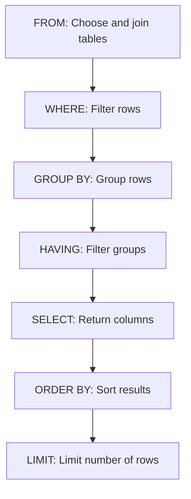

# The HAVING Clause in SQL

## Introduction

When working with SQL queries, you'll often need to analyze data at a summarized level rather than individual records. While the `GROUP BY` clause allows you to group records, you might need to filter these groups based on aggregate conditions. This is where the `HAVING` clause comes in.

The `HAVING` clause allows you to filter grouped data based on aggregate function results. It works similarly to the `WHERE` clause, but while `WHERE` filters individual rows before grouping, `HAVING` filters groups after the `GROUP BY` clause has been applied.

## Basic Syntax

```sql
SELECT column1, aggregate_function(column2)
FROM table_name
GROUP BY column1
HAVING condition;
```

## HAVING vs. WHERE: Understanding the Difference

One of the most common points of confusion for SQL beginners is understanding when to use `WHERE` and when to use `HAVING`. Let's clarify the key differences:

| WHERE | HAVING |
|-------|--------|
| Filters individual rows | Filters groups |
| Applied before grouping | Applied after grouping |
| Cannot use aggregate functions | Can use aggregate functions |
| Reduces the rows being grouped | Reduces the groups being returned |

## Simple HAVING Example

Let's look at a basic example using a `sales` table that contains information about product sales:

```sql
SELECT product_category, SUM(sales_amount) as total_sales
FROM sales
GROUP BY product_category
HAVING SUM(sales_amount) > 10000;
```

This query:
1. Groups sales by product category
2. Calculates the total sales for each category
3. Only shows categories with total sales exceeding $10,000

### Example Input Data (sales table)

| product_id | product_category | sales_amount | sale_date |
|------------|------------------|--------------|-----------|
| 1 | Electronics | 5000 | 2023-01-15 |
| 2 | Clothing | 2000 | 2023-01-16 |
| 3 | Electronics | 6000 | 2023-01-17 |
| 4 | Home & Garden | 3000 | 2023-01-18 |
| 5 | Clothing | 4000 | 2023-01-19 |
| 6 | Electronics | 4500 | 2023-01-20 |
| 7 | Home & Garden | 6500 | 2023-01-21 |

### Example Output

| product_category | total_sales |
|------------------|-------------|
| Electronics | 15500 |
| Home & Garden | 9500 |

Notice that Clothing isn't in the results because its total sales (6000) don't exceed the 10000 threshold we specified in the `HAVING` clause.

## Why HAVING is Necessary

You might wonder: "Why can't I just use `WHERE` with aggregate functions?" The reason is that `WHERE` operates on individual rows before any grouping occurs, while aggregations like `SUM()`, `AVG()`, etc. require grouping first.

This query would result in an error:

```sql
-- This will cause an error
SELECT product_category, SUM(sales_amount) as total_sales
FROM sales
WHERE SUM(sales_amount) > 10000  -- Error! Cannot use aggregate function in WHERE
GROUP BY product_category;
```

The correct approach is to use `HAVING`:

```sql
-- This is correct
SELECT product_category, SUM(sales_amount) as total_sales
FROM sales
GROUP BY product_category
HAVING SUM(sales_amount) > 10000;
```

## Multiple Conditions in HAVING

Just like with `WHERE`, you can use multiple conditions in your `HAVING` clause:

```sql
SELECT product_category, SUM(sales_amount) as total_sales, 
       COUNT(*) as number_of_sales
FROM sales
GROUP BY product_category
HAVING SUM(sales_amount) > 10000 AND COUNT(*) > 2;
```

This query returns product categories that have both:
- Total sales exceeding $10,000
- More than 2 sales transactions

## Using HAVING with Complex Queries

The `HAVING` clause can be combined with other SQL clauses to create powerful queries:

```sql
SELECT product_category, SUM(sales_amount) as total_sales
FROM sales
WHERE sale_date >= '2023-01-01'
GROUP BY product_category
HAVING SUM(sales_amount) > 10000
ORDER BY total_sales DESC
LIMIT 3;
```

This query:
1. Filters for sales after January 1, 2023 (using `WHERE`)
2. Groups by product category
3. Only includes categories with sales over $10,000 (using `HAVING`)
4. Sorts by total sales in descending order
5. Limits to the top 3 categories

## Real-world Applications

### Example 1: Finding Popular Products

Imagine you want to identify which products have been ordered more than 100 times:

```sql
SELECT product_name, COUNT(order_id) as order_count
FROM orders
GROUP BY product_name
HAVING COUNT(order_id) > 100
ORDER BY order_count DESC;
```

### Example 2: Identifying High-Value Customers

To find customers who have spent more than $5,000 in total and made at least 3 purchases:

```sql
SELECT customer_id, SUM(order_total) as total_spent, 
       COUNT(*) as number_of_orders
FROM orders
GROUP BY customer_id
HAVING SUM(order_total) > 5000 AND COUNT(*) >= 3
ORDER BY total_spent DESC;
```

### Example 3: Analyzing Website Traffic

For a website analytics table, to find pages that get more than 1,000 views on average per day:

```sql
SELECT page_url, AVG(daily_views) as average_views
FROM page_analytics
GROUP BY page_url
HAVING AVG(daily_views) > 1000
ORDER BY average_views DESC;
```

## Query Execution Order

To understand `HAVING` better, it's important to know the order in which SQL executes its clauses:



Note that `HAVING` comes after `GROUP BY` but before `SELECT`. This means you can filter based on aggregate functions even if they're not included in your final `SELECT` statement.

## Common Mistakes and How to Avoid Them

### Mistake 1: Using Column Aliases in HAVING

SQL processes the `HAVING` clause before it processes the `SELECT` clause, so you can't reference aliases created in `SELECT` within your `HAVING` clause:

```sql
-- This will cause an error
SELECT product_category, SUM(sales_amount) as total_sales
FROM sales
GROUP BY product_category
HAVING total_sales > 10000;  -- Error! Cannot use alias in HAVING
```

Instead, repeat the aggregate function:

```sql
-- This is correct
SELECT product_category, SUM(sales_amount) as total_sales
FROM sales
GROUP BY product_category
HAVING SUM(sales_amount) > 10000;
```

### Mistake 2: Using HAVING Without GROUP BY

While some database systems might allow it, using `HAVING` without a `GROUP BY` is generally not recommended as it can lead to confusing results:

```sql
-- Not recommended (though may work in some systems)
SELECT SUM(sales_amount) as total_sales
FROM sales
HAVING SUM(sales_amount) > 10000;
```

### Mistake 3: Using Non-Aggregate Columns in HAVING

Columns used in the `HAVING` clause should either be in the `GROUP BY` clause or be used within an aggregate function:

```sql
-- This will cause an error in most database systems
SELECT product_category, SUM(sales_amount) as total_sales
FROM sales
GROUP BY product_category
HAVING sales_amount > 1000;  -- Error! Individual column not in GROUP BY
```

## Summary

The `HAVING` clause is a powerful feature in SQL that allows you to filter grouped data based on aggregate conditions. While it shares similarities with the `WHERE` clause, remember these key points:

- Use `WHERE` to filter individual rows before grouping
- Use `HAVING` to filter groups after the `GROUP BY` clause
- `HAVING` can only use columns that appear in the `GROUP BY` clause or are used in aggregate functions
- The query execution order places `HAVING` after `GROUP BY` but before `SELECT`

Mastering the `HAVING` clause is essential for performing complex data analysis tasks in SQL, especially when working with large datasets that need to be summarized and filtered in specific ways.

## Exercises

1. Write a query to find departments where the average salary is greater than $75,000.
2. Create a query to identify products that have been sold more than 50 times in the last month.
3. Write a query to find customers who have placed orders totaling more than $1,000 and have ordered at least 5 different products.

## Additional Resources

- [SQL Aggregate Functions](https://www.w3schools.com/sql/sql_count_avg_sum.asp)
- [SQL GROUP BY](https://www.w3schools.com/sql/sql_groupby.asp)
- [SQL ORDER BY](https://www.w3schools.com/sql/sql_orderby.asp)