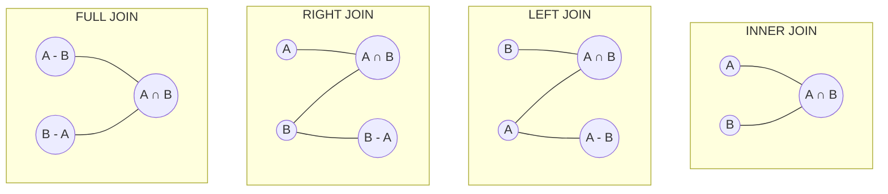

# JOIN Operations

## Introduction

When working with relational databases, data is typically spread across multiple tables to minimize redundancy and maintain data integrity. However, to get meaningful insights, you often need to combine or "join" data from these separate tables. This is where SQL JOIN operations come into play.

JOIN operations allow you to create a temporary combined view of data from two or more tables based on related columns. They are fundamental to the relational database model and are among the most powerful features of SQL.

## Understanding JOIN Operations

At its core, a JOIN operation creates a new result table by combining rows from two or more tables based on a related column between them. The relationship is typically defined using primary and foreign keys.

### Database Relationships

Before diving into JOIN types, let's understand the common relationships between tables:

- **One-to-One**: Each row in Table A relates to exactly one row in Table B
- **One-to-Many**: Each row in Table A relates to multiple rows in Table B
- **Many-to-Many**: Multiple rows in Table A relate to multiple rows in Table B

To illustrate JOIN operations, we'll use two simple tables:

```sql
-- Customers table
CREATE TABLE customers (
  customer_id INT PRIMARY KEY,
  first_name VARCHAR(50),
  last_name VARCHAR(50),
  email VARCHAR(100)
);

-- Orders table
CREATE TABLE orders (
  order_id INT PRIMARY KEY,
  customer_id INT,
  order_date DATE,
  total_amount DECIMAL(10,2),
  FOREIGN KEY (customer_id) REFERENCES customers(customer_id)
);
```

Let's populate these tables with some sample data:

```sql
-- Insert sample customers
INSERT INTO customers (customer_id, first_name, last_name, email)
VALUES 
  (1, 'John', 'Doe', 'john.doe@example.com'),
  (2, 'Jane', 'Smith', 'jane.smith@example.com'),
  (3, 'Bob', 'Johnson', 'bob.johnson@example.com');

-- Insert sample orders
INSERT INTO orders (order_id, customer_id, order_date, total_amount)
VALUES 
  (101, 1, '2023-01-15', 125.50),
  (102, 1, '2023-02-20', 89.99),
  (103, 2, '2023-01-10', 250.75),
  (104, NULL, '2023-03-05', 50.25);
```

## Types of JOIN Operations

SQL provides several types of JOIN operations, each serving a different purpose:

### 1. INNER JOIN

An INNER JOIN returns only the rows where there is a match in both tables based on the join condition.

```sql
SELECT customers.customer_id, first_name, last_name, order_id, order_date, total_amount
FROM customers
INNER JOIN orders ON customers.customer_id = orders.customer_id;
```

Result:

| customer_id | first_name | last_name | order_id | order_date | total_amount |
|-------------|------------|-----------|----------|------------|--------------|
| 1           | John       | Doe       | 101      | 2023-01-15 | 125.50       |
| 1           | John       | Doe       | 102      | 2023-02-20 | 89.99        |
| 2           | Jane       | Smith     | 103      | 2023-01-10 | 250.75       |

Note that Bob Johnson (customer_id = 3) doesn't appear in the result because he hasn't placed any orders.

### 2. LEFT JOIN (or LEFT OUTER JOIN)

A LEFT JOIN returns all rows from the left table and matching rows from the right table. If there's no match, NULL values are returned for columns from the right table.

```sql
SELECT customers.customer_id, first_name, last_name, order_id, order_date, total_amount
FROM customers
LEFT JOIN orders ON customers.customer_id = orders.customer_id;
```

Result:

| customer_id | first_name | last_name | order_id | order_date | total_amount |
|-------------|------------|-----------|----------|------------|--------------|
| 1           | John       | Doe       | 101      | 2023-01-15 | 125.50       |
| 1           | John       | Doe       | 102      | 2023-02-20 | 89.99        |
| 2           | Jane       | Smith     | 103      | 2023-01-10 | 250.75       |
| 3           | Bob        | Johnson   | NULL     | NULL       | NULL         |

Now Bob Johnson appears in the result with NULL values for the order details.

### 3. RIGHT JOIN (or RIGHT OUTER JOIN)

A RIGHT JOIN returns all rows from the right table and matching rows from the left table. If there's no match, NULL values are returned for columns from the left table.

```sql
SELECT customers.customer_id, first_name, last_name, order_id, order_date, total_amount
FROM customers
RIGHT JOIN orders ON customers.customer_id = orders.customer_id;
```

Result:

| customer_id | first_name | last_name | order_id | order_date | total_amount |
|-------------|------------|-----------|----------|------------|--------------|
| 1           | John       | Doe       | 101      | 2023-01-15 | 125.50       |
| 1           | John       | Doe       | 102      | 2023-02-20 | 89.99        |
| 2           | Jane       | Smith     | 103      | 2023-01-10 | 250.75       |
| NULL        | NULL       | NULL      | 104      | 2023-03-05 | 50.25        |

Notice that order 104 appears with NULL values for customer details because it doesn't have a customer_id.

### 4. FULL JOIN (or FULL OUTER JOIN)

A FULL JOIN returns all rows when there is a match in either the left or right table. If there's no match, NULL values are returned for columns from the table without a match.

```sql
SELECT customers.customer_id, first_name, last_name, order_id, order_date, total_amount
FROM customers
FULL JOIN orders ON customers.customer_id = orders.customer_id;
```

Result:

| customer_id | first_name | last_name | order_id | order_date | total_amount |
|-------------|------------|-----------|----------|------------|--------------|
| 1           | John       | Doe       | 101      | 2023-01-15 | 125.50       |
| 1           | John       | Doe       | 102      | 2023-02-20 | 89.99        |
| 2           | Jane       | Smith     | 103      | 2023-01-10 | 250.75       |
| 3           | Bob        | Johnson   | NULL     | NULL       | NULL         |
| NULL        | NULL       | NULL      | 104      | 2023-03-05 | 50.25        |

Both Bob Johnson and order 104 appear with NULL values for the corresponding missing details.

### 5. CROSS JOIN

A CROSS JOIN returns the Cartesian product of both tables, meaning each row from the first table is combined with each row from the second table. No join condition is specified.

```sql
SELECT customers.customer_id, first_name, orders.order_id
FROM customers
CROSS JOIN orders;
```

This would produce 12 rows (3 customers × 4 orders), showing all possible combinations.

### Visual Representation of JOINs

Here's a visual representation of how different JOIN types work:



## Practical Examples

### Example 1: Customer Order Analysis

Let's say we want to find out which customers spent the most money:

```sql
SELECT 
    c.customer_id,
    c.first_name,
    c.last_name,
    COUNT(o.order_id) AS total_orders,
    SUM(o.total_amount) AS total_spent
FROM customers c
LEFT JOIN orders o ON c.customer_id = o.customer_id
GROUP BY c.customer_id, c.first_name, c.last_name
ORDER BY total_spent DESC NULLS LAST;
```

Result:

| customer_id | first_name | last_name | total_orders | total_spent |
|-------------|------------|-----------|--------------|-------------|
| 1           | John       | Doe       | 2            | 215.49      |
| 2           | Jane       | Smith     | 1            | 250.75      |
| 3           | Bob        | Johnson   | 0            | NULL        |

### Example 2: Order Fulfillment Dashboard

For an e-commerce system with a more complex schema:

```sql
SELECT 
    o.order_id,
    c.first_name,
    c.last_name,
    p.product_name,
    oi.quantity,
    oi.unit_price,
    o.order_date,
    s.status_name
FROM orders o
INNER JOIN customers c ON o.customer_id = c.customer_id
INNER JOIN order_items oi ON o.order_id = oi.order_id
INNER JOIN products p ON oi.product_id = p.product_id
INNER JOIN order_status s ON o.status_id = s.status_id
WHERE o.order_date >= '2023-01-01'
ORDER BY o.order_date DESC;
```

This query joins multiple tables to create a comprehensive view of order information.

### Example 3: Finding Customers With No Orders

Using a LEFT JOIN to identify customers who haven't placed any orders:

```sql
SELECT 
    c.customer_id,
    c.first_name,
    c.last_name,
    c.email
FROM customers c
LEFT JOIN orders o ON c.customer_id = o.customer_id
WHERE o.order_id IS NULL;
```

Result:

| customer_id | first_name | last_name | email                    |
|-------------|------------|-----------|--------------------------|
| 3           | Bob        | Johnson   | bob.johnson@example.com  |

## JOIN Performance Considerations

When working with JOINs, especially on large tables, consider the following:

1. **Indexing**: Ensure that columns used in JOIN conditions are properly indexed.
2. **Join Order**: The order of tables in complex JOINs can affect performance.
3. **Join Selectivity**: Try to filter data before joining when possible.
4. **Avoid Unnecessary Columns**: Only SELECT the columns you need.

```sql
-- Poor performance (selecting all columns)
SELECT * FROM customers c
JOIN orders o ON c.customer_id = o.customer_id;

-- Better performance (selecting only needed columns)
SELECT c.customer_id, c.first_name, o.order_id, o.total_amount 
FROM customers c
JOIN orders o ON c.customer_id = o.customer_id;
```

## Common JOIN-Related Issues

### 1. Duplicate Rows

When joining tables with one-to-many relationships, you might get duplicate rows for the "one" side. Use DISTINCT or aggregate functions if needed:

```sql
SELECT DISTINCT c.customer_id, c.first_name, c.last_name
FROM customers c
JOIN orders o ON c.customer_id = o.customer_id;
```

### 2. NULL Values

Be careful when joining on columns that might contain NULL values, as NULL doesn't equal NULL in SQL. Consider using COALESCE or IS NULL checks:

```sql
SELECT *
FROM table_a a
JOIN table_b b ON COALESCE(a.nullable_column, '') = COALESCE(b.nullable_column, '');
```

## Summary

JOIN operations are essential for working with relational databases, allowing you to combine data from multiple tables into meaningful result sets. The main types of JOINs are:

- **INNER JOIN**: Returns rows when there is a match in both tables
- **LEFT JOIN**: Returns all rows from the left table and matching rows from the right table
- **RIGHT JOIN**: Returns all rows from the right table and matching rows from the left table
- **FULL JOIN**: Returns rows when there is a match in either table
- **CROSS JOIN**: Returns the Cartesian product of both tables

Understanding when and how to use each type of JOIN is crucial for effective database querying and data analysis.

## Exercises

1. Write a query to find all customers and their orders, including customers who haven't placed any orders.
2. Write a query to find all orders and their associated customers, including orders without customer information.
3. Create a query to calculate the average order amount for each customer.
4. Join three tables (customers, orders, and a new table "shipping_addresses") to get complete order information.
5. Find all customers who have placed more than one order.

## Additional Resources

- [SQL JOIN Syntax (W3Schools)](https://www.w3schools.com/sql/sql_join.asp)
- [SQL JOINs (PostgreSQL Documentation)](https://www.postgresql.org/docs/current/tutorial-join.html)
- [Visualizing SQL JOINs](https://joins.spathon.com/)