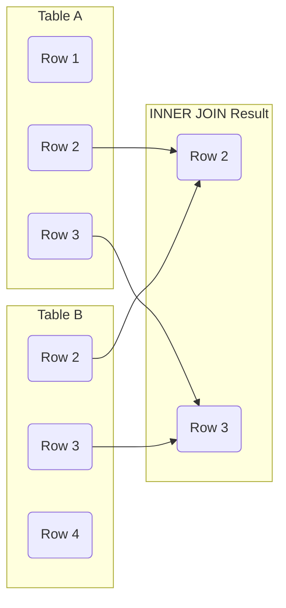

# Understanding INNER JOIN in SQL

## Introduction

In real-world applications, data is often distributed across multiple tables to minimize redundancy and improve data integrity. This process is known as **normalization**. However, when you need to retrieve related data from different tables, you'll need a way to combine or "join" these tables together. This is where SQL JOINs come into play, with INNER JOIN being the most commonly used type.

An **INNER JOIN** returns records that have matching values in both tables being joined. It's like finding the intersection between two sets - only records that exist in both tables (based on the specified condition) will appear in the results.

## Basic Syntax

The basic syntax of an INNER JOIN is:

```sql
SELECT columns
FROM table1
INNER JOIN table2
ON table1.column = table2.column;
```

Where:
- `columns` are the fields you want to retrieve
- `table1` and `table2` are the tables you want to join
- The `ON` clause specifies which columns to use for matching records

## How INNER JOIN Works

Let's visualize how INNER JOIN works using a simple diagram:



The diagram shows that only the matching rows (Row 2 and Row 3) from both tables appear in the INNER JOIN result. Rows that exist in only one table (Row 1 in Table A and Row 4 in Table B) are excluded from the result.

## Practical Example

Let's explore a practical example using two tables: `customers` and `orders`.

**Customers Table:**

| customer_id | customer_name | email                | city      |
|-------------|---------------|----------------------|-----------|
| 1           | John Smith    | john@example.com     | New York  |
| 2           | Mary Johnson  | mary@example.com     | Los Angeles |
| 3           | Robert Brown  | robert@example.com   | Chicago   |
| 4           | Patricia Davis| patricia@example.com | Houston   |

**Orders Table:**

| order_id | customer_id | order_date  | total_amount |
|----------|-------------|-------------|--------------|
| 101      | 1           | 2023-01-15  | 150.50       |
| 102      | 3           | 2023-01-20  | 275.00       |
| 103      | 1           | 2023-02-05  | 125.99       |
| 104      | 5           | 2023-02-10  | 89.99        |

To retrieve all orders with customer information, we can use an INNER JOIN:

```sql
SELECT 
    o.order_id,
    c.customer_name,
    c.email,
    o.order_date,
    o.total_amount
FROM 
    customers c
INNER JOIN 
    orders o
ON 
    c.customer_id = o.customer_id;
```

**Result:**

| order_id | customer_name | email            | order_date  | total_amount |
|----------|---------------|------------------|-------------|--------------|
| 101      | John Smith    | john@example.com | 2023-01-15  | 150.50       |
| 102      | Robert Brown  | robert@example.com | 2023-01-20  | 275.00       |
| 103      | John Smith    | john@example.com | 2023-02-05  | 125.99       |

Notice that:
1. The order with `order_id` 104 doesn't appear in the result because it has `customer_id` 5, which doesn't exist in the customers table.
2. Customer with `customer_id` 2 and 4 don't appear because they don't have any orders.
3. Customer with `customer_id` 1 appears twice because they have two orders.

## Using Table Aliases

In the previous example, we used table aliases (`c` for customers and `o` for orders) to make the query more readable. This is especially useful when:

1. Table names are long
2. You're joining multiple tables
3. Column names are ambiguous (same column name exists in multiple tables)

```sql
SELECT 
    o.order_id,
    c.customer_name,
    o.order_date
FROM 
    customers AS c
INNER JOIN 
    orders AS o
ON 
    c.customer_id = o.customer_id;
```

The `AS` keyword for aliases is optional and can be omitted.

## Joining Multiple Tables

You can extend INNER JOINs to connect more than two tables. Let's add a third table called `products` to our example:

**Products Table:**

| product_id | product_name     | price  | category    |
|------------|------------------|--------|------------|
| 1          | Laptop           | 899.99 | Electronics |
| 2          | Smartphone       | 499.99 | Electronics |
| 3          | Coffee Maker     | 79.99  | Appliances  |
| 4          | Wireless Earbuds | 129.99 | Electronics |

**Order_Items Table:**

| item_id | order_id | product_id | quantity | unit_price |
|---------|----------|------------|----------|------------|
| 1       | 101      | 1          | 1        | 899.99     |
| 2       | 101      | 4          | 1        | 129.99     |
| 3       | 102      | 2          | 1        | 499.99     |
| 4       | 103      | 3          | 1        | 79.99      |

To get a complete view of customers, their orders, and what products they purchased:

```sql
SELECT 
    c.customer_name,
    o.order_id,
    o.order_date,
    p.product_name,
    oi.quantity,
    oi.unit_price
FROM 
    customers c
INNER JOIN 
    orders o ON c.customer_id = o.customer_id
INNER JOIN 
    order_items oi ON o.order_id = oi.order_id
INNER JOIN 
    products p ON oi.product_id = p.product_id;
```

**Result:**

| customer_name | order_id | order_date  | product_name     | quantity | unit_price |
|---------------|----------|-------------|------------------|----------|------------|
| John Smith    | 101      | 2023-01-15  | Laptop           | 1        | 899.99     |
| John Smith    | 101      | 2023-01-15  | Wireless Earbuds | 1        | 129.99     |
| Robert Brown  | 102      | 2023-01-20  | Smartphone       | 1        | 499.99     |
| John Smith    | 103      | 2023-02-05  | Coffee Maker     | 1        | 79.99      |

## INNER JOIN with Additional Conditions

You can add more conditions to your INNER JOIN using the WHERE clause:

```sql
SELECT 
    c.customer_name,
    o.order_id,
    o.order_date,
    o.total_amount
FROM 
    customers c
INNER JOIN 
    orders o ON c.customer_id = o.customer_id
WHERE 
    o.total_amount > 100
    AND c.city = 'New York';
```

This query will return only orders with a total amount greater than $100 from customers located in New York.

## Common INNER JOIN Mistakes

### 1. Forgetting to Specify the Join Condition

Without the ON clause, SQL will perform a Cartesian product, combining every row from the first table with every row from the second table:

```sql
-- Incorrect: Missing ON clause
SELECT * FROM customers INNER JOIN orders;
```

### 2. Using the Wrong Join Columns

Make sure you're joining tables on columns that represent the same entity:

```sql
-- Incorrect: Joining unrelated columns
SELECT * FROM customers c
INNER JOIN orders o ON c.customer_id = o.order_id;
```

### 3. Not Qualifying Ambiguous Column Names

If both tables have columns with the same name, you need to specify which table's column you're referring to:

```sql
-- Incorrect: Ambiguous column reference
SELECT id, customer_name FROM customers
INNER JOIN orders ON customers.customer_id = orders.customer_id;

-- Correct: Qualified column names
SELECT customers.customer_id, customer_name FROM customers
INNER JOIN orders ON customers.customer_id = orders.customer_id;
```

## INNER JOIN vs Other Join Types

INNER JOIN returns only matching records between tables. Other join types include:

- **LEFT JOIN**: Returns all records from the left table and matching records from the right table
- **RIGHT JOIN**: Returns all records from the right table and matching records from the left table
- **FULL JOIN**: Returns all records when there's a match in either the left or right table

## Performance Considerations

When using INNER JOINs, keep these performance tips in mind:

1. **Indexes**: Ensure that columns used in join conditions are properly indexed
2. **Join Order**: For complex queries with multiple joins, the order can affect performance
3. **Select Only Needed Columns**: Avoid `SELECT *` and only request columns you need
4. **Use WHERE Clauses Early**: Filter data before joining to reduce the number of rows being processed

## Summary

The INNER JOIN is a fundamental SQL operation that allows you to combine related data from multiple tables based on a matching condition. Key points to remember:

1. INNER JOIN returns only rows that have matching values in both tables
2. Use the ON clause to specify the matching condition
3. You can join multiple tables in a single query
4. Table aliases make queries more readable, especially for complex joins
5. Additional filtering can be applied using the WHERE clause

By mastering INNER JOIN, you've taken a significant step in your SQL journey. This skill will allow you to work with relational databases effectively and extract meaningful insights from related data.

## Exercises

1. Create two sample tables and practice writing INNER JOIN queries.
2. Modify the examples above to use different conditions in the ON clause.
3. Write a query that joins three tables and includes sorting and filtering.
4. Compare the results of an INNER JOIN with a LEFT JOIN using the same tables.
5. Think about a real-world scenario where you would need to use INNER JOIN and design the database schema and queries for it.

## Additional Resources

- [W3Schools SQL INNER JOIN Tutorial](https://www.w3schools.com/sql/sql_join_inner.asp)
- [SQL JOIN Types Explained](https://www.sqltutorial.org/sql-join/)
- [Optimizing SQL Queries](https://use-the-index-luke.com/)