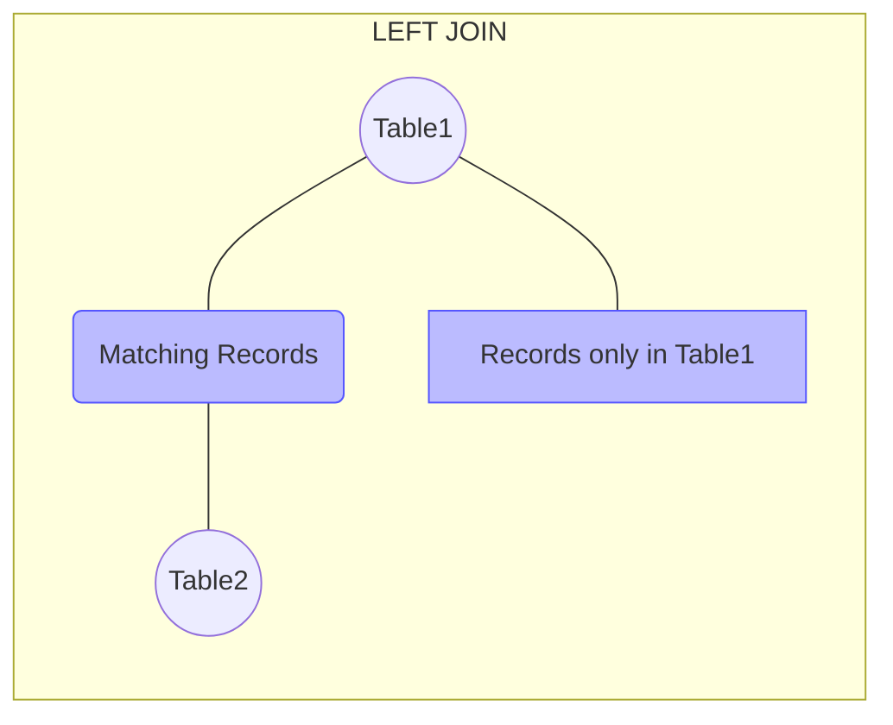
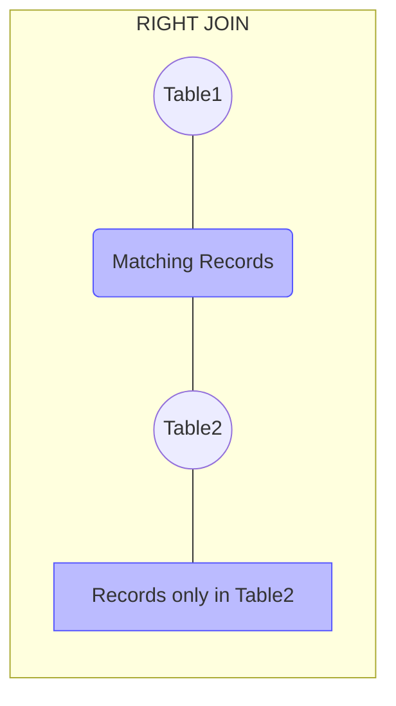
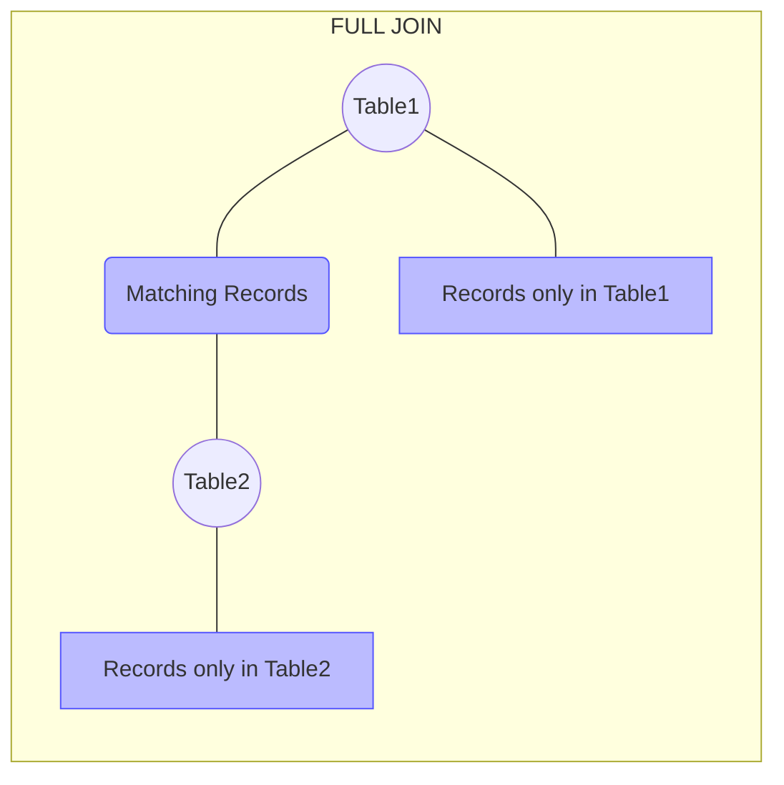

# OUTER JOIN

## Introduction

When working with relational databases, you'll often need to combine data from multiple tables. While the INNER JOIN operation returns only matching records between tables, there are scenarios where you need to retrieve all records from one or both tables, regardless of whether they have matching values. This is where OUTER JOIN operations become invaluable.

An OUTER JOIN returns all records from at least one of the tables in the join operation, including records that don't have matching values in the other table. This tutorial will guide you through the three types of OUTER JOINs: LEFT OUTER JOIN, RIGHT OUTER JOIN, and FULL OUTER JOIN.

## Types of OUTER JOINs

### LEFT OUTER JOIN

A LEFT OUTER JOIN (commonly shortened to LEFT JOIN) returns all records from the left table and only the matching records from the right table. If there's no match found in the right table, NULL values are returned for those columns.

#### Syntax

```sql
SELECT columns
FROM table1
LEFT JOIN table2
ON table1.column = table2.column;
```

#### Visual Representation



### RIGHT OUTER JOIN

A RIGHT OUTER JOIN (or RIGHT JOIN) returns all records from the right table and only the matching records from the left table. For non-matching records from the right table, NULL values are returned for the left table's columns.

#### Syntax

```sql
SELECT columns
FROM table1
RIGHT JOIN table2
ON table1.column = table2.column;
```

#### Visual Representation



### FULL OUTER JOIN

A FULL OUTER JOIN (or FULL JOIN) returns all records from both tables. For non-matching records, NULL values are returned for the columns of the table that doesn't have a match.

#### Syntax

```sql
SELECT columns
FROM table1
FULL JOIN table2
ON table1.column = table2.column;
```

#### Visual Representation



## Practical Examples

Let's create some example tables to demonstrate OUTER JOINs. We'll use a scenario with `employees` and `departments` tables.

### Example Tables

```sql
-- Create employees table
CREATE TABLE employees (
    employee_id INT PRIMARY KEY,
    name VARCHAR(100),
    department_id INT,
    salary DECIMAL(10, 2)
);

-- Create departments table
CREATE TABLE departments (
    department_id INT PRIMARY KEY,
    department_name VARCHAR(100),
    location VARCHAR(100)
);

-- Insert data into employees
INSERT INTO employees VALUES
(1, 'John Smith', 1, 60000),
(2, 'Jane Doe', 2, 75000),
(3, 'Mark Wilson', 1, 65000),
(4, 'Sarah Johnson', 3, 80000),
(5, 'Michael Brown', NULL, 55000);

-- Insert data into departments
INSERT INTO departments VALUES
(1, 'IT', 'New York'),
(2, 'HR', 'Chicago'),
(4, 'Finance', 'Boston'),
(5, 'Marketing', 'Los Angeles');
```

Notice that:
- Employee 'Michael Brown' doesn't have a department (NULL)
- Department 'Finance' doesn't have any employees
- Department 'Marketing' doesn't have any employees
- Department ID 3 (which employee 'Sarah Johnson' belongs to) doesn't exist

### LEFT JOIN Example

Let's find all employees and their department information (if available):

```sql
SELECT e.employee_id, e.name, e.salary, d.department_name, d.location
FROM employees e
LEFT JOIN departments d
ON e.department_id = d.department_id;
```

#### Result:

```
employee_id | name           | salary  | department_name | location
------------+----------------+---------+-----------------+----------
1           | John Smith     | 60000.00| IT              | New York
2           | Jane Doe       | 75000.00| HR              | Chicago
3           | Mark Wilson    | 65000.00| IT              | New York
4           | Sarah Johnson  | 80000.00| NULL            | NULL
5           | Michael Brown  | 55000.00| NULL            | NULL
```

Notice that Sarah Johnson and Michael Brown are included in the results even though they don't have matching departments. Their department columns contain NULL values.

### RIGHT JOIN Example

Let's find all departments and their employees (if any):

```sql
SELECT d.department_id, d.department_name, d.location, e.name, e.salary
FROM employees e
RIGHT JOIN departments d
ON e.department_id = d.department_id;
```

#### Result:

```
department_id | department_name | location      | name        | salary
--------------+-----------------+--------------+-------------+---------
1             | IT              | New York     | John Smith  | 60000.00
1             | IT              | New York     | Mark Wilson | 65000.00
2             | HR              | Chicago      | Jane Doe    | 75000.00
4             | Finance         | Boston       | NULL        | NULL
5             | Marketing       | Los Angeles  | NULL        | NULL
```

Notice that Finance and Marketing departments are included even though they don't have any employees. The employee columns contain NULL values for these departments.

### FULL JOIN Example

Let's retrieve all employees and departments, regardless of whether they have matches:

```sql
SELECT e.employee_id, e.name, d.department_id, d.department_name
FROM employees e
FULL JOIN departments d
ON e.department_id = d.department_id;
```

#### Result:

```
employee_id | name           | department_id | department_name
------------+----------------+--------------+----------------
1           | John Smith     | 1            | IT
2           | Jane Doe       | 2            | HR
3           | Mark Wilson    | 1            | IT
4           | Sarah Johnson  | NULL         | NULL
5           | Michael Brown  | NULL         | NULL
NULL        | NULL           | 4            | Finance
NULL        | NULL           | 5            | Marketing
```

This result includes all records from both tables, with NULL values where there's no match.

## Real-World Applications

### 1. Finding Missing Data

OUTER JOINs are excellent for identifying missing or orphaned records in your database.

```sql
-- Find employees without a department
SELECT e.employee_id, e.name, e.department_id
FROM employees e
LEFT JOIN departments d ON e.department_id = d.department_id
WHERE d.department_id IS NULL;

-- Find departments without employees
SELECT d.department_id, d.department_name
FROM employees e
RIGHT JOIN departments d ON e.department_id = d.department_id
WHERE e.employee_id IS NULL;
```

### 2. Comprehensive Reports

When generating reports, you often need to include all records from a primary table even if related information is missing.

```sql
-- Generate a report of all employees with their department details (if available)
SELECT 
    e.employee_id,
    e.name,
    COALESCE(d.department_name, 'Unassigned') AS department,
    e.salary,
    COALESCE(d.location, 'N/A') AS location
FROM employees e
LEFT JOIN departments d ON e.department_id = d.department_id
ORDER BY e.employee_id;
```

### 3. Data Migration and Validation

When migrating data between systems, OUTER JOINs help validate data integrity by identifying mismatches.

```sql
-- Compare employee records between old and new systems
SELECT 
    old.employee_id,
    old.name AS old_name,
    new.name AS new_name,
    CASE 
        WHEN new.employee_id IS NULL THEN 'Missing in new system'
        WHEN old.employee_id IS NULL THEN 'Missing in old system'
        WHEN old.name <> new.name THEN 'Name mismatch'
        ELSE 'Match'
    END AS status
FROM old_employees old
FULL JOIN new_employees new ON old.employee_id = new.employee_id;
```

## OUTER JOIN vs INNER JOIN

To understand the difference between OUTER JOIN and INNER JOIN:

```sql
-- INNER JOIN: Only returns matching records
SELECT e.name, d.department_name
FROM employees e
INNER JOIN departments d ON e.department_id = d.department_id;

-- Result: Only employees with valid departments
```

```sql
-- LEFT JOIN: Returns all employees, even those without departments
SELECT e.name, d.department_name
FROM employees e
LEFT JOIN departments d ON e.department_id = d.department_id;

-- Result: Includes all employees; some department values will be NULL
```

## Common Mistakes and Best Practices

### Mistakes to Avoid:

1. **Forgetting that NULL values don't equate:** In JOIN conditions, NULL values never match other NULL values. Use `IS NULL` in WHERE clauses.

2. **Not specifying table aliases:** With multiple tables, always use aliases to clarify which columns belong to which table.

3. **Overlooking column name conflicts:** When tables have columns with the same name, specify the table to avoid ambiguity.

### Best Practices:

1. **Use meaningful table aliases:** Instead of `a` and `b`, use `emp` and `dept` for better readability.

2. **Prefer LEFT JOIN over RIGHT JOIN:** LEFT JOIN is typically more intuitive and easier to understand.

3. **Handle NULL values appropriately:** Use functions like `COALESCE()` or `IFNULL()` to provide default values for NULL fields.

```sql
-- Good practice: Meaningful aliases and COALESCE for NULL values
SELECT 
    emp.name,
    COALESCE(dept.department_name, 'Unassigned') AS department
FROM employees emp
LEFT JOIN departments dept ON emp.department_id = dept.department_id;
```

## Summary

OUTER JOINs are powerful SQL operations that allow you to retrieve records from multiple tables even when there aren't matching values in all tables:

- **LEFT JOIN:** Returns all records from the left table and matching records from the right table.
- **RIGHT JOIN:** Returns all records from the right table and matching records from the left table.
- **FULL JOIN:** Returns all records from both tables.

These joins are essential for creating comprehensive reports, identifying missing data, and ensuring data integrity in your database applications.

## Practice Exercises

1. Create two tables, `customers` and `orders`, and practice writing LEFT, RIGHT, and FULL JOIN queries.

2. Write a query to find customers who haven't placed any orders.

3. Write a query to find orders that don't match any existing customer.

4. Generate a report showing all customers and the total value of their orders (if any).

5. Create a department summary showing how many employees each department has, including departments with zero employees.

## Additional Resources

- [SQL JOIN Visualizer](https://sql-joins.leopard.in.ua/)
- [W3Schools SQL JOIN Tutorial](https://www.w3schools.com/sql/sql_join.asp)
- [PostgreSQL Documentation on JOINS](https://www.postgresql.org/docs/current/tutorial-join.html)