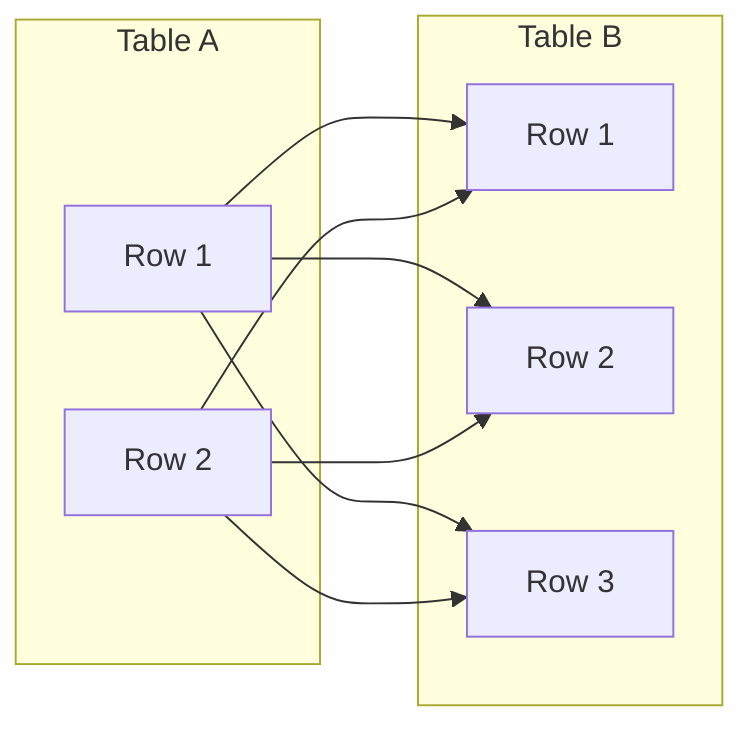

# CROSS JOIN in SQL

## Introduction

When working with relational databases, you'll often need to combine data from multiple tables. SQL provides several join types to accomplish this, and one of the most fundamental (yet potentially powerful) is the **CROSS JOIN**.

A CROSS JOIN, also known as a Cartesian join, combines each row from the first table with every row from the second table. This creates what mathematicians call a **Cartesian product** - a complete combination of all possible row pairings between the tables.

Unlike other join types, a CROSS JOIN doesn't require a joining condition. This makes it conceptually simpler, but it also means you need to be careful when using it, as the result set can grow very large very quickly.

## Basic Syntax

The syntax for a CROSS JOIN is straightforward:

```sql
SELECT columns
FROM table1
CROSS JOIN table2;
```

There's also an alternative syntax using a comma between table names:

```sql
SELECT columns
FROM table1, table2;
```

Both produce the same result - every row in `table1` paired with every row in `table2`.

## How CROSS JOIN Works

Let's visualize how a CROSS JOIN works with a simple diagram:



The resulting table will have 2 × 3 = 6 rows, with every possible combination of rows from Table A and Table B.

## CROSS JOIN Example

Let's look at a simple example using two small tables:

First, let's create our sample tables:

```sql
-- Create products table
CREATE TABLE products (
    product_id INT,
    product_name VARCHAR(50)
);

-- Insert sample data
INSERT INTO products VALUES 
    (1, 'T-shirt'),
    (2, 'Jeans'),
    (3, 'Hat');

-- Create colors table
CREATE TABLE colors (
    color_id INT,
    color_name VARCHAR(20)
);

-- Insert sample data
INSERT INTO colors VALUES 
    (1, 'Red'),
    (2, 'Blue'),
    (3, 'Green'),
    (4, 'Black');
```

Now, let's perform a CROSS JOIN between these tables:

```sql
SELECT 
    p.product_name,
    c.color_name
FROM 
    products p
CROSS JOIN 
    colors c;
```

The result will be:

| product_name | color_name |
|--------------|------------|
| T-shirt      | Red        |
| T-shirt      | Blue       |
| T-shirt      | Green      |
| T-shirt      | Black      |
| Jeans        | Red        |
| Jeans        | Blue       |
| Jeans        | Green      |
| Jeans        | Black      |
| Hat          | Red        |
| Hat          | Blue       |
| Hat          | Green      |
| Hat          | Black      |

As you can see, we now have 12 rows (3 products × 4 colors) representing every possible combination of products and colors.

## Calculating the Size of a CROSS JOIN

The number of rows in a CROSS JOIN result is always:

Number of rows in Table A × Number of rows in Table B

This multiplication is why CROSS JOINs can become problematic with large tables. For example, if Table A has 1,000 rows and Table B has 2,000 rows, the result will contain 2,000,000 rows!

## Real-World Applications

Despite their potential for creating large result sets, CROSS JOINs have several practical applications:

### 1. Generating Combinations for Product Variants

As we saw in our example, CROSS JOINs are perfect for generating all possible combinations of product attributes (like sizes, colors, materials, etc.).

```sql
SELECT 
    p.product_name,
    c.color_name,
    s.size_name
FROM 
    products p
CROSS JOIN 
    colors c
CROSS JOIN 
    sizes s;
```

This query would generate all possible product variants with every combination of color and size.

### 2. Creating Date Ranges

CROSS JOINs can be used to generate date series or time slots:

```sql
-- Generate all time slots for a particular date
SELECT 
    CAST('2023-10-15' AS DATE) AS date,
    t.hour
FROM 
    (VALUES (8), (9), (10), (11), (12), (13), (14), (15), (16), (17)) AS t(hour)
```

This creates time slots for business hours on a specific date.

### 3. Creating Reports with Fixed Categories

When you need reports that must show all categories, even if there's no corresponding data:

```sql
-- Sales report by region and product category
SELECT 
    r.region_name,
    c.category_name,
    COALESCE(SUM(s.amount), 0) as total_sales
FROM 
    regions r
CROSS JOIN 
    categories c
LEFT JOIN 
    sales s ON s.region_id = r.region_id AND s.category_id = c.category_id
GROUP BY 
    r.region_name, c.category_name
ORDER BY 
    r.region_name, c.category_name;
```

This ensures your report includes all region-category combinations, even those with zero sales.

## Performance Considerations

Due to the multiplicative nature of CROSS JOINs, you should be cautious when using them with large tables. Here are some tips:

1. **Limit the inputs**: Apply WHERE clauses before the CROSS JOIN when possible.
2. **Use subqueries**: Generate smaller datasets first, then CROSS JOIN them.
3. **Consider alternatives**: Sometimes a LEFT JOIN with a complete set of values might be more efficient.
4. **Test with small datasets**: Test your query logic with limited data first to ensure it produces the expected results.

## Common Mistakes

### 1. Unintentional CROSS JOINs

The most common mistake is creating an unintentional CROSS JOIN by omitting a join condition:

```sql
-- Unintentional CROSS JOIN (missing WHERE clause)
SELECT 
    customers.name,
    orders.order_date
FROM 
    customers, orders;
```

This query will create a row for every customer-order combination, regardless of whether that customer placed that order!

The correct version would be:

```sql
-- Correct query with proper relationship
SELECT 
    customers.name,
    orders.order_date
FROM 
    customers, orders
WHERE 
    customers.customer_id = orders.customer_id;
```

Or better yet, using explicit join syntax:

```sql
SELECT 
    c.name,
    o.order_date
FROM 
    customers c
INNER JOIN 
    orders o ON c.customer_id = o.customer_id;
```

### 2. Memory Issues with Large Tables

Another common mistake is applying CROSS JOINs to large tables without considering the result size:

```sql
-- This could generate millions of rows!
SELECT * FROM large_table1 CROSS JOIN large_table2;
```

Always calculate the expected result size before executing CROSS JOINs on production databases.

## Summary

A CROSS JOIN creates the Cartesian product between two tables, combining each row from the first table with every row from the second table. While it must be used with caution due to the potentially large result sets, CROSS JOINs are valuable for generating combinations, creating complete reports, and solving certain types of problems.

Key points to remember:
- CROSS JOINs combine each row from one table with every row from another
- The result size is the product of the number of rows in each table
- Use them for generating combinations or ensuring complete category coverage
- Be careful with large tables to avoid performance issues
- Avoid unintentional CROSS JOINs by always using proper join conditions when relationships exist between tables

## Practice Exercises

Try these exercises to strengthen your understanding of CROSS JOINs:

1. Create two small tables of your own and perform a CROSS JOIN between them.
2. Generate a calendar for the current month by combining a date table with a table of activities.
3. Create a query that shows all possible combinations of departments and job titles in a company, along with the count of employees that have each combination.
4. Identify a query in your existing code that might be using an unintentional CROSS JOIN and fix it.

## Additional Resources

- [SQL JOIN Types Explained](https://www.sqlshack.com/sql-join-types-explained-in-simple-language/)
- [Performance Optimization for Queries with JOINs](https://use-the-index-luke.com/)
- [Advanced SQL: JOINs and Subqueries](https://mode.com/sql-tutorial/sql-joins/)