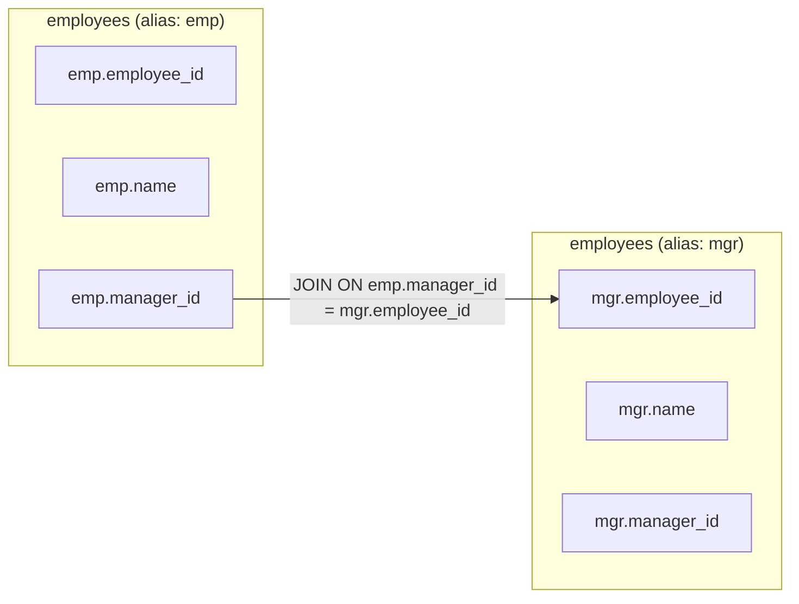

# Self JOIN

## Introduction

A Self JOIN is a special type of JOIN operation where a table is joined with itself. This might sound strange at first—why would you need to join a table with itself? However, Self JOINs are incredibly useful when you want to compare rows within the same table or when your data has hierarchical relationships.

Self JOINs are not a separate type of JOIN in SQL syntax. They use the same JOIN types (INNER, LEFT, RIGHT, FULL) but with the same table referenced twice under different aliases.

## Basic Syntax

The general syntax for a Self JOIN looks like this:

```sql
SELECT a.column_name, b.column_name
FROM table_name AS a
JOIN table_name AS b
ON a.column_name = b.column_name;
```

Key points to understand:
- We use table aliases (`a` and `b` in this example) to distinguish between the two instances of the same table
- Without aliases, SQL wouldn't know which instance of the table you're referring to
- The JOIN condition relates rows from the same table to each other

## Common Use Cases

Self JOINs are particularly useful in several scenarios:

1. **Hierarchical Data**: Finding parent-child relationships within the same table
2. **Comparing Rows**: Comparing different rows in the same table
3. **Finding Pairs**: Identifying pairs of related items
4. **Sequential Analysis**: Analyzing consecutive records or time-based sequences

Let's explore each with practical examples.

## Example 1: Employee Hierarchy

One of the most common use cases for Self JOINs is managing hierarchical data. Consider an `employees` table where each employee has a manager who is also an employee in the same table:

```sql
CREATE TABLE employees (
  employee_id INT PRIMARY KEY,
  name VARCHAR(100),
  manager_id INT
);

INSERT INTO employees VALUES
(1, 'John Smith', NULL),    -- CEO (no manager)
(2, 'Jane Doe', 1),         -- Reports to John
(3, 'Bob Johnson', 1),      -- Reports to John
(4, 'Alice Williams', 2),   -- Reports to Jane
(5, 'Charlie Brown', 2),    -- Reports to Jane
(6, 'David Miller', 3),     -- Reports to Bob
(7, 'Eva Davis', 3);        -- Reports to Bob
```

To find each employee along with their manager's name, we can use a Self JOIN:

```sql
SELECT 
  emp.employee_id,
  emp.name AS employee_name,
  mgr.name AS manager_name
FROM 
  employees emp
LEFT JOIN 
  employees mgr ON emp.manager_id = mgr.employee_id;
```

Result:

```
employee_id | employee_name  | manager_name
------------+----------------+--------------
1           | John Smith     | NULL
2           | Jane Doe       | John Smith
3           | Bob Johnson    | John Smith
4           | Alice Williams | Jane Doe
5           | Charlie Brown  | Jane Doe
6           | David Miller   | Bob Johnson
7           | Eva Davis      | Bob Johnson
```

We use a LEFT JOIN because the CEO has no manager (NULL manager_id).

## Example 2: Finding Pairs

Self JOINs can help find pairs of related items. Let's say we have a table of products and want to find all pairs of products in the same category.

```sql
CREATE TABLE products (
  product_id INT PRIMARY KEY,
  product_name VARCHAR(100),
  category VARCHAR(50),
  price DECIMAL(10, 2)
);

INSERT INTO products VALUES
(1, 'iPhone 13', 'Phones', 799.99),
(2, 'Samsung Galaxy S21', 'Phones', 699.99),
(3, 'Google Pixel 6', 'Phones', 599.99),
(4, 'MacBook Pro', 'Laptops', 1299.99),
(5, 'Dell XPS 13', 'Laptops', 999.99),
(6, 'HP Spectre', 'Laptops', 1099.99);
```

To find all pairs of products in the same category:

```sql
SELECT 
  p1.product_name AS product1,
  p2.product_name AS product2,
  p1.category
FROM 
  products p1
JOIN 
  products p2 ON p1.category = p2.category AND p1.product_id < p2.product_id;
```

Result:

```
product1            | product2            | category
--------------------+---------------------+---------
iPhone 13           | Samsung Galaxy S21  | Phones
iPhone 13           | Google Pixel 6      | Phones
Samsung Galaxy S21  | Google Pixel 6      | Phones
MacBook Pro         | Dell XPS 13         | Laptops
MacBook Pro         | HP Spectre          | Laptops
Dell XPS 13         | HP Spectre          | Laptops
```

Notice the condition `p1.product_id < p2.product_id` - this ensures we don't get duplicate pairs or pairs of the same product. Without this condition, we would get both (iPhone 13, Samsung Galaxy S21) and (Samsung Galaxy S21, iPhone 13).

## Example 3: Consecutive Values

Self JOINs can help analyze sequential or consecutive records. Let's find gaps in a sequence of IDs:

```sql
CREATE TABLE orders (
  order_id INT PRIMARY KEY,
  order_date DATE,
  customer_id INT
);

INSERT INTO orders VALUES
(1, '2023-01-01', 101),
(2, '2023-01-02', 102),
(3, '2023-01-03', 103),
-- Gap here (no order_id 4)
(5, '2023-01-05', 104),
(6, '2023-01-06', 105),
-- Gap here (no order_id 7)
(8, '2023-01-08', 106);
```

To find gaps in the sequence:

```sql
SELECT 
  o1.order_id + 1 AS missing_order_id
FROM 
  orders o1
LEFT JOIN 
  orders o2 ON o1.order_id + 1 = o2.order_id
WHERE 
  o2.order_id IS NULL AND o1.order_id + 1 < (SELECT MAX(order_id) FROM orders);
```

Result:

```
missing_order_id
----------------
4
7
```

This query joins each order with the next order in sequence. When no matching next order exists (and we're not at the end of the sequence), we've found a gap.

## Example 4: Comparing Values Within a Table

Self JOINs are useful for finding records that have related values. Let's find cities that have the same first letter:

```sql
CREATE TABLE cities (
  city_id INT PRIMARY KEY,
  city_name VARCHAR(100),
  population INT
);

INSERT INTO cities VALUES
(1, 'New York', 8804190),
(2, 'Los Angeles', 3898747),
(3, 'Chicago', 2746388),
(4, 'Houston', 2304580),
(5, 'Phoenix', 1608139),
(6, 'Philadelphia', 1603797),
(7, 'San Antonio', 1434625),
(8, 'San Diego', 1386932);
```

To find cities starting with the same letter:

```sql
SELECT 
  c1.city_name AS city1,
  c2.city_name AS city2,
  LEFT(c1.city_name, 1) AS starting_letter
FROM 
  cities c1
JOIN 
  cities c2 ON LEFT(c1.city_name, 1) = LEFT(c2.city_name, 1) AND c1.city_id < c2.city_id
ORDER BY 
  starting_letter, city1, city2;
```

Result:

```
city1         | city2         | starting_letter
--------------+--------------+----------------
Chicago       | Cincinnati   | C
Los Angeles   | Louisville   | L
New York      | Nashville    | N
Philadelphia  | Phoenix      | P
San Antonio   | San Diego    | S
```

## Visual Representation

Here's a diagram showing how a Self JOIN works with the employees example:



## Common Pitfalls and Tips

1. **Infinite Joins**: Be careful with recursive relationships. Without proper conditions, you might create infinite joins or cartesian products.

2. **Alias Consistency**: Always use clear, meaningful aliases that help understand which instance of the table represents what.

3. **Join Conditions**: Double-check your join conditions to ensure you're getting the relationships you want.

4. **Performance**: Self JOINs can be resource-intensive for large tables. Consider indexing the columns used in the join condition.

5. **NULL Handling**: Be mindful of NULL values in the columns you're joining on, especially in hierarchical data.

## Summary

Self JOINs are a powerful SQL technique that allows you to compare rows within the same table. Key points to remember:

- A Self JOIN is when you join a table to itself
- You must use table aliases to distinguish between the two instances of the same table
- Common use cases include hierarchical data, finding pairs, and comparing values
- Self JOINs use the same JOIN syntax (INNER, LEFT, etc.) as regular joins
- Properly crafted join conditions are crucial to avoid unwanted results

## Practice Exercises

1. Create a `friends` table where each person can be friends with other people in the same table. Write a query to show mutual friendships.

2. Using the `employees` table from Example 1, write a query to find all employees along with their direct reports (subordinates).

3. For the `orders` table in Example 3, write a query to find each order along with the next order's date and the number of days between them.

4. Create a `customers` table with customer information including city. Write a Self JOIN query to find all customers who live in the same city.

## Additional Resources

- [SQL Joins Explained](https://www.w3schools.com/sql/sql_join.asp)
- [Advanced SQL Joins](https://mode.com/sql-tutorial/sql-joins/)
- [Hierarchical Queries in SQL](https://www.postgresql.org/docs/current/queries-with.html)