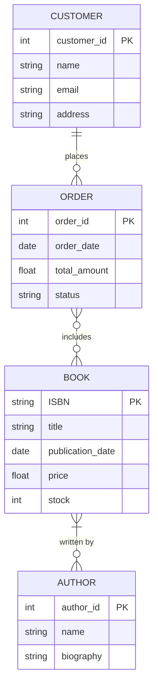
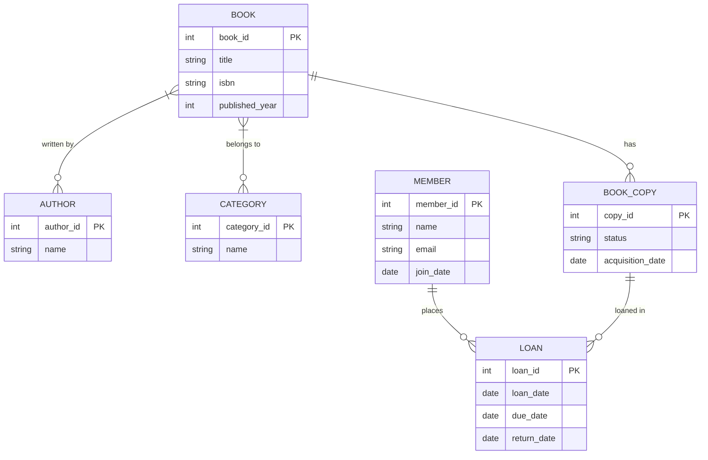

# Database Design Process

## Introduction

The database design process is a methodical approach to creating an efficient, reliable, and secure database system. Whether you're building a simple application to track your personal book collection or designing an enterprise-level system for a multinational corporation, following a structured design process ensures your database will be robust, maintainable, and capable of meeting your needs.

This guide breaks down the database design process into understandable steps for beginners, providing you with a solid foundation for creating effective database solutions.

## The Importance of Good Database Design

Before diving into the process, let's understand why proper database design matters:

- **Data Integrity**: Ensures your data is accurate and consistent
- **Efficiency**: Optimizes performance and storage space
- **Scalability**: Allows your database to grow with your application
- **Maintainability**: Makes updates and changes easier to implement
- **Security**: Protects sensitive data through proper access controls

A well-designed database will save you countless hours of troubleshooting and rework down the line.

## The Database Design Process: Step by Step

### Step 1: Requirements Collection and Analysis

The first step is understanding what your database needs to accomplish. This involves:

#### Identifying Stakeholders
- Who will use the database?
- What are their specific needs?

#### Gathering Functional Requirements
- What information needs to be stored?
- What operations need to be performed on the data?
- What reports or outputs are required?

#### Example: Online Bookstore Requirements

For an online bookstore database, requirements might include:
- Store information about books (title, author, ISBN, price, etc.)
- Track inventory levels
- Record customer information and purchase history
- Process orders and payments
- Generate sales reports

#### Deliverable: Requirements Document

```
Requirements Document Example:
1. System must store book information including title, author(s), ISBN, publisher, publication date, genre, price, and current stock level
2. System must track customer details including name, email, shipping address, and payment methods
3. System must record all sales transactions with timestamps
4. System must support searching books by title, author, or ISBN
5. System must generate monthly sales reports by genre
```

### Step 2: Conceptual Database Design

In this phase, we create a high-level model of the database without worrying about implementation details.

#### Entity Identification
Identify the main entities (objects or concepts) that will be stored in your database.

#### Attribute Definition
For each entity, determine the attributes (properties) that need to be stored.

#### Relationship Mapping
Establish how entities relate to each other.

#### Example: Entity-Relationship Diagram (ERD)

Here's a simple ERD for our bookstore example:



#### Deliverable: Conceptual Schema

The conceptual schema represents your database at a high level, showing entities, attributes, and relationships without implementation specifics.

### Step 3: Logical Database Design

In this phase, we translate the conceptual model into a logical model that can be implemented in a database system.

#### Choose a Database Model
- Relational (most common)
- NoSQL (document, key-value, graph, etc.)
- Object-oriented
- Hierarchical

For this guide, we'll focus on the relational model, which is the most widely used.

#### Normalization
Normalization is the process of organizing data to reduce redundancy and improve data integrity. There are several normal forms (1NF, 2NF, 3NF, etc.), each with specific rules:

- **First Normal Form (1NF)**: Eliminate repeating groups and ensure atomic values
- **Second Normal Form (2NF)**: Meet 1NF requirements and remove partial dependencies
- **Third Normal Form (3NF)**: Meet 2NF requirements and remove transitive dependencies

#### Example: Normalization Process

Let's normalize a simple table storing book information:

**Original Table (Not Normalized):**

| ISBN | Title | Author_Name | Author_Email | Genre | Price |
|------|-------|-------------|--------------|-------|-------|
| 123456 | Database Design | John Smith, Jane Doe | john@example.com, jane@example.com | Technical, Education | 29.99 |

**Problems:**
- Multiple authors (not atomic)
- Multiple genres (not atomic)
- Author email depends on author name, not the book ISBN

**After 1NF:**

Books Table:
| ISBN | Title | Price |
|------|-------|-------|
| 123456 | Database Design | 29.99 |

BookAuthors Table:
| ISBN | Author_Name | Author_Email |
|------|-------------|--------------|
| 123456 | John Smith | john@example.com |
| 123456 | Jane Doe | jane@example.com |

BookGenres Table:
| ISBN | Genre |
|------|-------|
| 123456 | Technical |
| 123456 | Education |

**After 3NF:**

Books Table:
| ISBN | Title | Price |
|------|-------|-------|
| 123456 | Database Design | 29.99 |

Authors Table:
| Author_ID | Author_Name | Author_Email |
|-----------|-------------|--------------|
| 1 | John Smith | john@example.com |
| 2 | Jane Doe | jane@example.com |

BookAuthors Table:
| ISBN | Author_ID |
|------|-----------|
| 123456 | 1 |
| 123456 | 2 |

Genres Table:
| Genre_ID | Genre_Name |
|----------|------------|
| 1 | Technical |
| 2 | Education |

BookGenres Table:
| ISBN | Genre_ID |
|------|----------|
| 123456 | 1 |
| 123456 | 2 |

#### Deliverable: Logical Schema

The logical schema details the tables, columns, primary keys, foreign keys, and constraints that will make up your database.

### Step 4: Physical Database Design

In this phase, we implement the logical design in a specific database management system (DBMS) like MySQL, PostgreSQL, or SQL Server.

#### DBMS Selection
Choose a database system based on:
- Project requirements
- Scalability needs
- Budget constraints
- Team expertise

#### Table Creation
Translate your logical schema into actual database tables.

#### Example: SQL for Table Creation

```sql
-- Create Authors table
CREATE TABLE Authors (
    author_id INT PRIMARY KEY AUTO_INCREMENT,
    name VARCHAR(100) NOT NULL,
    biography TEXT,
    email VARCHAR(100) UNIQUE
);

-- Create Books table
CREATE TABLE Books (
    isbn VARCHAR(13) PRIMARY KEY,
    title VARCHAR(200) NOT NULL,
    publication_date DATE,
    price DECIMAL(10, 2) NOT NULL,
    stock INT NOT NULL DEFAULT 0
);

-- Create the junction table for the many-to-many relationship
CREATE TABLE BookAuthors (
    isbn VARCHAR(13),
    author_id INT,
    PRIMARY KEY (isbn, author_id),
    FOREIGN KEY (isbn) REFERENCES Books(isbn),
    FOREIGN KEY (author_id) REFERENCES Authors(author_id)
);
```

#### Indexing Strategy
Determine which columns need indexes to improve query performance:

```sql
-- Add index to improve search by title
CREATE INDEX idx_books_title ON Books(title);

-- Add index to improve search by author name
CREATE INDEX idx_authors_name ON Authors(name);
```

#### Security Plan
Implement access controls and permissions:

```sql
-- Create a read-only user for reports
CREATE USER 'report_user'@'localhost' IDENTIFIED BY 'password';
GRANT SELECT ON bookstore.* TO 'report_user'@'localhost';

-- Create an administrator user
CREATE USER 'admin_user'@'localhost' IDENTIFIED BY 'password';
GRANT ALL PRIVILEGES ON bookstore.* TO 'admin_user'@'localhost';
```

#### Deliverable: Physical Schema Implementation

The complete database with all tables, relationships, indexes, and access controls implemented in your chosen DBMS.

### Step 5: Data Population and Testing

Once the database is built, it's time to populate it with data and test its functionality.

#### Initial Data Loading
Load the database with test data:

```sql
-- Insert sample authors
INSERT INTO Authors (name, email) VALUES 
('John Smith', 'john@example.com'),
('Jane Doe', 'jane@example.com');

-- Insert sample books
INSERT INTO Books (isbn, title, publication_date, price, stock) VALUES 
('9781234567897', 'Database Design Basics', '2023-01-15', 29.99, 100),
('9789876543210', 'SQL for Beginners', '2023-02-20', 24.99, 75);

-- Connect books with authors
INSERT INTO BookAuthors (isbn, author_id) VALUES 
('9781234567897', 1),
('9781234567897', 2),
('9789876543210', 1);
```

#### Testing
Test your database with various queries to ensure it meets all requirements:

```sql
-- Test query: Find all books by a specific author
SELECT b.title, b.isbn, b.price
FROM Books b
JOIN BookAuthors ba ON b.isbn = ba.isbn
JOIN Authors a ON ba.author_id = a.author_id
WHERE a.name = 'John Smith';

-- Test query: Check inventory levels for books below threshold
SELECT title, isbn, stock
FROM Books
WHERE stock < 50;
```

#### Performance Evaluation
Test the performance of your queries under different loads to identify potential bottlenecks.

#### Deliverable: Functional Database

A fully working database that meets all specified requirements and performs efficiently.

### Step 6: Database Maintenance and Evolution

Database design is not a one-time process. Over time, you'll need to:

#### Regular Maintenance
- Back up the database regularly
- Monitor performance
- Update indexes as needed
- Clean up unused data

#### Schema Evolution
As requirements change, you may need to modify your database schema:

```sql
-- Example: Adding a new column to track book ratings
ALTER TABLE Books ADD COLUMN avg_rating DECIMAL(3,2);

-- Example: Creating a new table for customer reviews
CREATE TABLE Reviews (
    review_id INT PRIMARY KEY AUTO_INCREMENT,
    isbn VARCHAR(13),
    customer_id INT,
    rating INT CHECK (rating BETWEEN 1 AND 5),
    review_text TEXT,
    review_date TIMESTAMP DEFAULT CURRENT_TIMESTAMP,
    FOREIGN KEY (isbn) REFERENCES Books(isbn),
    FOREIGN KEY (customer_id) REFERENCES Customers(customer_id)
);
```

#### Documentation Updates
Keep your database documentation up to date to reflect all changes.

## Common Database Design Challenges and Solutions

### Challenge 1: Balancing Normalization and Performance

While normalization reduces redundancy, it can sometimes lead to more complex queries that impact performance.

**Solution**: Consider selective denormalization for performance-critical operations.

```sql
-- Example of denormalization: Adding a calculated field
ALTER TABLE Books ADD COLUMN author_count INT DEFAULT 0;

-- Update the count when authors are added or removed
CREATE TRIGGER update_author_count AFTER INSERT ON BookAuthors
FOR EACH ROW
BEGIN
    UPDATE Books SET author_count = author_count + 1 WHERE isbn = NEW.isbn;
END;
```

### Challenge 2: Handling Variable Data

Some entities might have a variable number of attributes.

**Solution**: Use the Entity-Attribute-Value (EAV) model or JSON columns for flexible schemas.

```sql
-- Using JSON column in MySQL 5.7+
ALTER TABLE Books ADD COLUMN additional_info JSON;

-- Example usage
UPDATE Books SET additional_info = '{"edition": "2nd", "cover_type": "hardcover", "dimensions": {"height": 9, "width": 6, "thickness": 1}}' WHERE isbn = '9781234567897';
```

### Challenge 3: Versioning and Historical Data

Sometimes you need to track changes to data over time.

**Solution**: Implement temporal tables or audit trails.

```sql
-- Creating a history table
CREATE TABLE BookPriceHistory (
    isbn VARCHAR(13),
    price DECIMAL(10, 2),
    effective_from DATETIME,
    effective_to DATETIME,
    FOREIGN KEY (isbn) REFERENCES Books(isbn)
);

-- Creating a trigger to capture price changes
CREATE TRIGGER track_price_changes AFTER UPDATE ON Books
FOR EACH ROW
BEGIN
    IF OLD.price <> NEW.price THEN
        -- Close the current price period
        UPDATE BookPriceHistory 
        SET effective_to = NOW() 
        WHERE isbn = NEW.isbn AND effective_to IS NULL;
        
        -- Insert the new price
        INSERT INTO BookPriceHistory (isbn, price, effective_from, effective_to)
        VALUES (NEW.isbn, NEW.price, NOW(), NULL);
    END IF;
END;
```

## Real-World Example: Building a Library Management System

Let's walk through designing a simple library management system from start to finish.

### Requirements:
- Track books, members, and loans
- Support book searches by title, author, or category
- Track due dates and late returns
- Generate reports on book availability and popular titles

### Conceptual Design:



### Logical Design:

Books Table:
- book_id (PK)
- title
- isbn
- published_year

Authors Table:
- author_id (PK)
- name

BookAuthors Table:
- book_id (PK, FK)
- author_id (PK, FK)

Categories Table:
- category_id (PK)
- name

BookCategories Table:
- book_id (PK, FK)
- category_id (PK, FK)

Members Table:
- member_id (PK)
- name
- email
- join_date

BookCopies Table:
- copy_id (PK)
- book_id (FK)
- status (available, loaned, lost, etc.)
- acquisition_date

Loans Table:
- loan_id (PK)
- copy_id (FK)
- member_id (FK)
- loan_date
- due_date
- return_date (NULL if not returned)

### Physical Implementation:

```sql
-- Create the Books table
CREATE TABLE Books (
    book_id INT PRIMARY KEY AUTO_INCREMENT,
    title VARCHAR(200) NOT NULL,
    isbn VARCHAR(13) UNIQUE,
    published_year INT
);

-- Create the Authors table
CREATE TABLE Authors (
    author_id INT PRIMARY KEY AUTO_INCREMENT,
    name VARCHAR(100) NOT NULL
);

-- Create the junction table for Books and Authors
CREATE TABLE BookAuthors (
    book_id INT,
    author_id INT,
    PRIMARY KEY (book_id, author_id),
    FOREIGN KEY (book_id) REFERENCES Books(book_id),
    FOREIGN KEY (author_id) REFERENCES Authors(author_id)
);

-- Create the Categories table
CREATE TABLE Categories (
    category_id INT PRIMARY KEY AUTO_INCREMENT,
    name VARCHAR(50) NOT NULL UNIQUE
);

-- Create the junction table for Books and Categories
CREATE TABLE BookCategories (
    book_id INT,
    category_id INT,
    PRIMARY KEY (book_id, category_id),
    FOREIGN KEY (book_id) REFERENCES Books(book_id),
    FOREIGN KEY (category_id) REFERENCES Categories(category_id)
);

-- Create the Members table
CREATE TABLE Members (
    member_id INT PRIMARY KEY AUTO_INCREMENT,
    name VARCHAR(100) NOT NULL,
    email VARCHAR(100) UNIQUE NOT NULL,
    join_date DATE NOT NULL DEFAULT CURRENT_DATE
);

-- Create the BookCopies table
CREATE TABLE BookCopies (
    copy_id INT PRIMARY KEY AUTO_INCREMENT,
    book_id INT NOT NULL,
    status ENUM('available', 'loaned', 'maintenance', 'lost') DEFAULT 'available',
    acquisition_date DATE NOT NULL,
    FOREIGN KEY (book_id) REFERENCES Books(book_id)
);

-- Create the Loans table
CREATE TABLE Loans (
    loan_id INT PRIMARY KEY AUTO_INCREMENT,
    copy_id INT NOT NULL,
    member_id INT NOT NULL,
    loan_date DATE NOT NULL DEFAULT CURRENT_DATE,
    due_date DATE NOT NULL,
    return_date DATE,
    FOREIGN KEY (copy_id) REFERENCES BookCopies(copy_id),
    FOREIGN KEY (member_id) REFERENCES Members(member_id)
);

-- Create indexes to improve performance
CREATE INDEX idx_books_title ON Books(title);
CREATE INDEX idx_loans_due_date ON Loans(due_date);
CREATE INDEX idx_members_name ON Members(name);
```

### Example Queries:

Find all available copies of a particular book:

```sql
SELECT b.title, bc.copy_id, bc.acquisition_date
FROM Books b
JOIN BookCopies bc ON b.book_id = bc.book_id
WHERE b.title LIKE '%Database Design%'
AND bc.status = 'available';
```

Find overdue books:

```sql
SELECT m.name AS member_name, m.email, b.title, l.due_date, 
       DATEDIFF(CURRENT_DATE, l.due_date) AS days_overdue
FROM Loans l
JOIN Members m ON l.member_id = m.member_id
JOIN BookCopies bc ON l.copy_id = bc.copy_id
JOIN Books b ON bc.book_id = b.book_id
WHERE l.return_date IS NULL
AND l.due_date < CURRENT_DATE
ORDER BY days_overdue DESC;
```

## Summary

The database design process is a methodical approach that takes you from gathering requirements to implementing and maintaining a robust database system. By following these steps:

1. Requirements Collection and Analysis
2. Conceptual Database Design
3. Logical Database Design
4. Physical Database Design
5. Data Population and Testing
6. Database Maintenance and Evolution

You can create efficient, scalable, and maintainable databases that meet your application's needs.

Remember that database design is both an art and a science. While following these structured steps is important, you'll also develop intuition over time about what works best for different scenarios.

## Further Learning Resources

### Books
- "Database Design for Mere Mortals" by Michael J. Hernandez
- "SQL Antipatterns" by Bill Karwin
- "Database Systems: The Complete Book" by Hector Garcia-Molina, Jeffrey D. Ullman, and Jennifer Widom

### Online Courses
- SQL and Database Design courses on platforms like Coursera, Udemy, or Khan Academy
- PostgreSQL, MySQL, or SQL Server official documentation tutorials

### Practice Exercises

1. Design a database for a movie streaming service that tracks users, movies, viewing history, and ratings.
2. Take an existing spreadsheet you use and redesign it as a proper relational database.
3. Identify an existing database and suggest improvements to its design.
4. Create a complete database design for a small business of your choice (coffee shop, bookstore, etc.).

Remember that the best way to learn database design is through practice, so don't hesitate to create and refine your own database projects as you continue your learning journey.