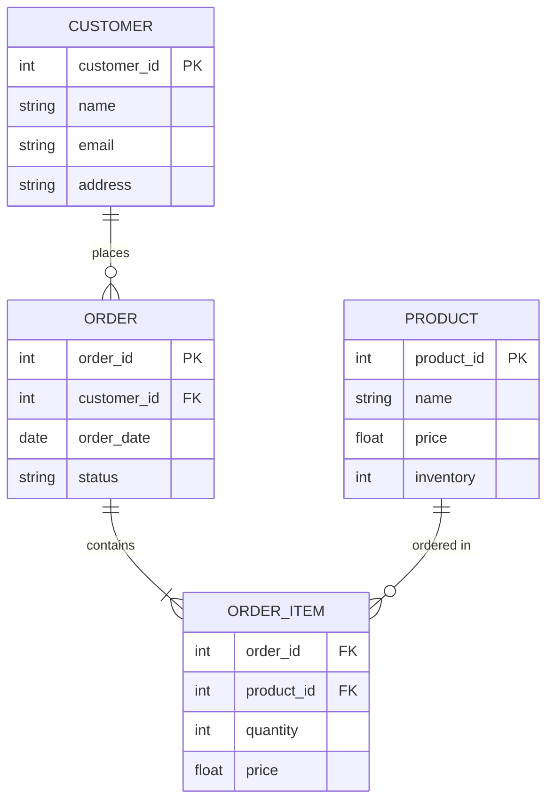
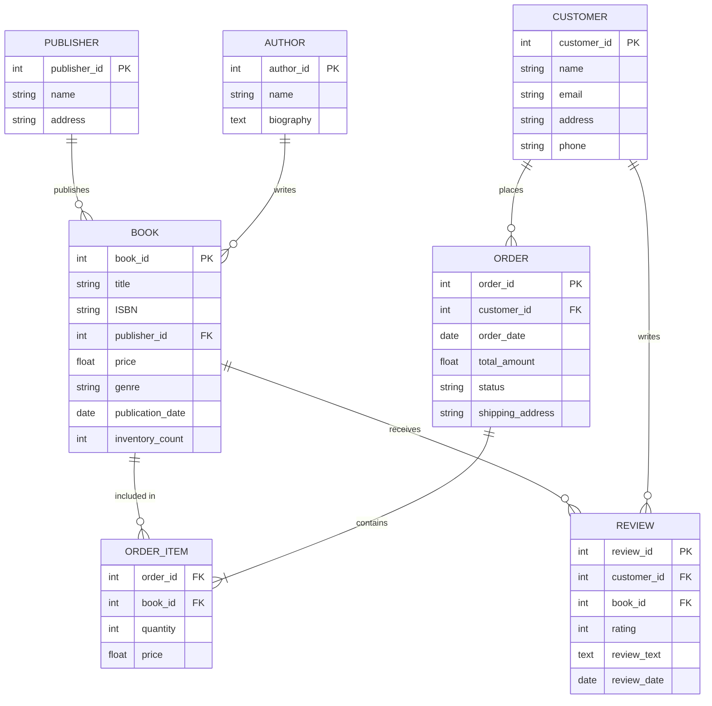

# Requirement Analysis in Database Design

## Introduction

Requirement analysis is the critical first step in database design that determines the eventual success of your database system. It involves systematically capturing, analyzing, and documenting all the necessary requirements for the database you're building. This foundational process helps ensure that the final database will effectively meet user needs and business objectives.

Think of requirement analysis as the blueprint phase before constructing a building. Just as architects need to understand how a building will be used before designing it, database designers need to thoroughly understand what data needs to be stored and how it will be used before creating database structures.

## Why Requirement Analysis Matters

Proper requirement analysis helps you:

- Avoid costly redesigns later in the development process
- Ensure your database meets all user and business needs
- Identify potential problems early
- Create a database that is scalable and maintainable
- Establish clear expectations among all stakeholders

## The Requirement Analysis Process

### 1. Stakeholder Identification

The first step is identifying all stakeholders who will interact with or have an interest in the database system:

- End users who will directly use the database
- Business managers who need specific reports or insights
- IT staff who will maintain the system
- External partners who may need to access data
- Regulatory bodies whose requirements must be met

### 2. Requirement Gathering Techniques

Several techniques can be used to gather database requirements:

<div className="technique-container">

#### Interviews
One-on-one or group discussions with stakeholders to understand their needs, workflow, and expectations.

#### Surveys and Questionnaires
Written questions distributed to a larger audience to collect structured feedback.

#### Observation
Watching users perform their current tasks to understand their workflow and data needs.

#### Document Analysis
Reviewing existing documentation, forms, reports, and databases to understand current data usage.

#### Workshops
Collaborative sessions with stakeholders to brainstorm and define requirements together.

</div>

### 3. Types of Requirements to Gather

When analyzing requirements for a database, focus on collecting:

#### Data Requirements
- What entities (objects, people, concepts) need to be stored?
- What attributes of each entity are important?
- What relationships exist between different entities?
- What volume of data will be stored initially and in the future?
- How long does data need to be retained?

#### Functional Requirements
- What operations will be performed on the data? (Create, Read, Update, Delete)
- Who needs access to what data?
- What business rules apply to the data?
- What calculations or transformations need to be performed?
- What reports or outputs are needed?

#### Non-Functional Requirements
- Performance expectations (response time, throughput)
- Security and privacy requirements
- Availability requirements (uptime, backup frequency)
- Scalability needs (future growth)
- Compliance with regulations (GDPR, HIPAA, etc.)

## Documenting Database Requirements

Documentation is crucial for requirement analysis. Here are common methods for documenting database requirements:

### Entity-Relationship Diagrams (ERD)

ERDs visually represent the main entities in your database and the relationships between them.



### Use Case Scenarios

Document specific scenarios showing how the database will be used:

```
Use Case: Process New Customer Order
Primary Actor: Sales Representative

Main Flow:
1. Sales rep searches for customer in database
2. If customer exists, select customer; otherwise create new customer record
3. Create new order associated with customer
4. Add products to order with quantities
5. System validates product availability
6. System calculates order total
7. Sales rep finalizes order
8. System updates product inventory

Alternative Flows:
- If product is out of stock, system flags item and suggests alternatives
- If customer has special pricing, system applies customer-specific discounts
```

### Data Dictionary

A data dictionary defines each data element that will be stored in your database:

| Data Element | Description | Type | Length | Constraints | Sample Values |
|--------------|-------------|------|--------|-------------|---------------|
| customer_id | Unique identifier for customers | Integer | - | Primary Key, Auto-increment | 1001, 1002 |
| customer_name | Full name of customer | VARCHAR | 100 | Not Null | "Jane Smith" |
| email | Customer email address | VARCHAR | 255 | Unique, Not Null | "jane@example.com" |
| order_date | Date when order was placed | DATE | - | Not Null | "2023-07-15" |
| product_category | Category of product | VARCHAR | 50 | Not Null | "Electronics", "Books" |

## Practical Example: Online Bookstore Database

Let's walk through a requirement analysis for an online bookstore database:

### Step 1: Identify Stakeholders

- Customers browsing and purchasing books
- Warehouse staff managing inventory
- Marketing team analyzing sales trends
- Management requiring financial reports
- IT department maintaining the system

### Step 2: Gather Requirements

Through interviews and observation, we collect these key requirements:

**Data Requirements:**
- Store book information (title, author, ISBN, price, genre, publisher)
- Store customer details (name, address, payment information)
- Track orders and order history
- Manage inventory levels
- Record book reviews and ratings

**Functional Requirements:**
- Allow searching for books by various criteria
- Process customer orders
- Generate sales reports
- Track shipment status
- Manage customer accounts
- Handle returned books

**Non-Functional Requirements:**
- Database must support 10,000+ books and 50,000+ customers
- Order processing must complete in under 3 seconds
- System must be available 99.9% of the time
- Customer payment data must be encrypted

### Step 3: Document the Requirements

Here's a simplified ERD for our bookstore database:



## Requirement Analysis Pitfalls and Best Practices

### Common Pitfalls

- **Incomplete stakeholder involvement**: Missing key perspectives leads to incomplete requirements
- **Ambiguous requirements**: Vague specifications that can be interpreted in multiple ways
- **Scope creep**: Continuously expanding requirements beyond the initial scope
- **Focusing too much on current processes**: Failing to consider future needs and improvements
- **Overlooking non-functional requirements**: Forgetting about performance, security, and scalability

### Best Practices

1. **Involve all stakeholders** throughout the requirement gathering process
2. **Use clear, specific language** when documenting requirements
3. **Prioritize requirements** as "must-have," "should-have," or "nice-to-have"
4. **Validate requirements** by reviewing them with stakeholders
5. **Document assumptions** along with requirements
6. **Consider future growth** and potential changes
7. **Look for conflicting requirements** early and resolve them

## Translating Requirements to Database Design

After gathering requirements, you'll use them to create:

1. **Conceptual model**: A high-level view showing main entities and relationships
2. **Logical model**: A more detailed model specifying attributes, keys, and relationships
3. **Physical model**: The actual database implementation with tables, columns, data types, and constraints

Here's how specific requirements translate to database design decisions:

| Requirement | Design Impact |
|-------------|---------------|
| "Store customer order history for 7 years" | Create archiving strategy; size database accordingly |
| "Generate monthly sales reports by region" | Add region attribute to relevant tables; create indexes for performance |
| "Process 1000+ concurrent orders during sales" | Design for performance; consider denormalization where appropriate |
| "Ensure each product belongs to exactly one category" | Create foreign key constraint from product to category |
| "Allow customers to save multiple shipping addresses" | Create separate address table with one-to-many relationship |

## Summary

Requirement analysis is the critical foundation of successful database design. By thoroughly understanding and documenting what your database needs to accomplish, you can create a design that efficiently meets business needs while avoiding costly redesigns later.

The process involves:
1. Identifying all stakeholders
2. Gathering comprehensive requirements using various techniques
3. Documenting requirements clearly using ERDs, use cases, and data dictionaries
4. Validating requirements with stakeholders
5. Using these requirements to inform your database design decisions

Remember that requirement analysis is not a one-time task but an iterative process. As you move forward with database design, you may discover new requirements or need to refine existing ones.

## Exercises

1. Practice requirement gathering by interviewing a friend about a simple database they might need (e.g., for tracking books, movies, or recipes).

2. Create an ERD for a small database system of your choice (e.g., a library, gym membership system, or inventory management system).

3. Write a complete data dictionary for five key entities in the database system you diagrammed above.

4. Identify potential non-functional requirements for a healthcare database that stores patient records.

5. For the online bookstore example, expand the requirement analysis to include how the system should handle book returns and refunds.

## Further Resources

- "Database Systems: Design, Implementation, & Management" by Carlos Coronel and Steven Morris
- "Requirements Analysis and System Design" by Leszek Maciaszek
- The International Institute of Business Analysis (IIBA) Guide to the Business Analysis Body of Knowledge
- [Database Design Course on Khan Academy](https://www.khanacademy.org/computing/computer-programming/sql)
- [W3Schools SQL Tutorial](https://www.w3schools.com/sql/)