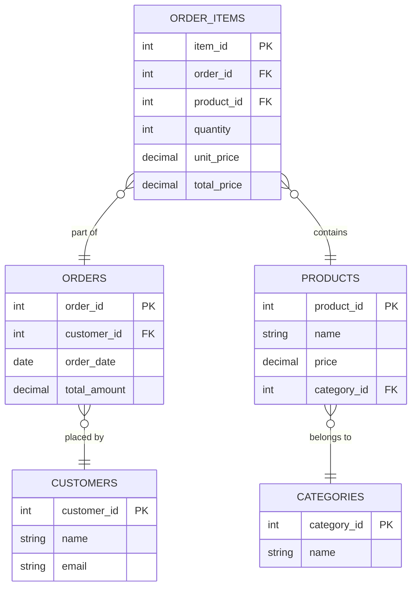
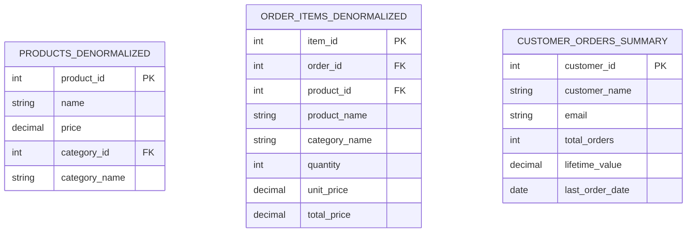

# Denormalization

## Introduction

Denormalization is a database optimization technique where we intentionally add redundant data to one or more tables to improve read performance. This approach runs counter to normalization, which focuses on eliminating redundancy through dividing data into multiple related tables.

While normalization helps maintain data integrity and reduce storage requirements, it can sometimes lead to complex queries involving multiple joins, which may impact performance. Denormalization addresses this performance concern by strategically introducing redundancy.

## Normalization vs. Denormalization

Before diving deeper into denormalization, let's understand the key differences between these two approaches:

| Aspect | Normalization | Denormalization |
|--------|--------------|-----------------|
| Purpose | Eliminate redundancy | Improve read performance |
| Data Integrity | Higher | Requires careful management |
| Query Complexity | Often requires joins | Simpler queries |
| Read Performance | Can be slower | Faster |
| Write Performance | Faster | Slower due to redundancy |
| Storage | Optimized | Higher requirements |

## When to Consider Denormalization

Denormalization isn't always the right choice. Consider it when:

1. **Read-heavy workloads**: Applications that perform many more reads than writes
2. **Performance bottlenecks**: When normalized queries with multiple joins are too slow
3. **Reporting and analytics**: Systems that need to efficiently generate complex reports
4. **Specific query patterns**: When certain queries are performed frequently

## Common Denormalization Techniques

### 1. Duplicate Data

The most straightforward denormalization technique is duplicating data across tables.

Consider these normalized tables:

```sql
CREATE TABLE departments (
  department_id INT PRIMARY KEY,
  department_name VARCHAR(100)
);

CREATE TABLE employees (
  employee_id INT PRIMARY KEY,
  first_name VARCHAR(50),
  last_name VARCHAR(50),
  department_id INT,
  FOREIGN KEY (department_id) REFERENCES departments(department_id)
);
```

A normalized query to get employee names with their departments:

```sql
SELECT e.employee_id, e.first_name, e.last_name, d.department_name
FROM employees e
JOIN departments d ON e.department_id = d.department_id;
```

Denormalized approach by duplicating department name:

```sql
CREATE TABLE employees_denormalized (
  employee_id INT PRIMARY KEY,
  first_name VARCHAR(50),
  last_name VARCHAR(50),
  department_id INT,
  department_name VARCHAR(100),
  FOREIGN KEY (department_id) REFERENCES departments(department_id)
);
```

Now the query becomes simpler and faster:

```sql
SELECT employee_id, first_name, last_name, department_name
FROM employees_denormalized;
```

### 2. Pre-calculated Fields

Another common technique is storing pre-calculated values:

```sql
CREATE TABLE order_items (
  item_id INT PRIMARY KEY,
  order_id INT,
  product_id INT,
  quantity INT,
  unit_price DECIMAL(10,2),
  total_price DECIMAL(10,2),  -- Pre-calculated: quantity * unit_price
  FOREIGN KEY (order_id) REFERENCES orders(order_id),
  FOREIGN KEY (product_id) REFERENCES products(product_id)
);
```

### 3. Summary Tables

Creating tables that store aggregated data:

```sql
CREATE TABLE daily_sales_summary (
  date DATE PRIMARY KEY,
  total_orders INT,
  total_revenue DECIMAL(12,2),
  avg_order_value DECIMAL(10,2)
);
```

### 4. Wide Tables

Combining related tables into a single wide table:

```sql
-- Instead of separate normalized tables:
CREATE TABLE customer_full_data (
  customer_id INT PRIMARY KEY,
  first_name VARCHAR(50),
  last_name VARCHAR(50),
  email VARCHAR(100),
  phone VARCHAR(20),
  street_address VARCHAR(100),
  city VARCHAR(50),
  state VARCHAR(50),
  postal_code VARCHAR(20),
  country VARCHAR(50),
  -- More fields from other related tables
);
```

## Implementing Denormalization with Database Views

A more flexible approach to denormalization is using database views:

```sql
CREATE VIEW employee_department_view AS
SELECT e.employee_id, e.first_name, e.last_name, 
       e.department_id, d.department_name
FROM employees e
JOIN departments d ON e.department_id = d.department_id;
```

Views offer denormalization benefits without physically duplicating data, though they may not provide the same performance improvements as actual denormalized tables.

## Maintaining Data Integrity in Denormalized Databases

Denormalization introduces data redundancy which creates challenges for maintaining data integrity. Here are strategies to address these challenges:

### Triggers

Database triggers can automatically update redundant data when the source data changes:

```sql
CREATE TRIGGER update_department_name
AFTER UPDATE ON departments
FOR EACH ROW
BEGIN
  UPDATE employees_denormalized
  SET department_name = NEW.department_name
  WHERE department_id = NEW.department_id;
END;
```

### Batch Updates

For large-scale systems, scheduled batch processes can synchronize denormalized data:

```sql
-- Example of a scheduled update script
UPDATE employees_denormalized ed
SET ed.department_name = (
  SELECT d.department_name 
  FROM departments d 
  WHERE d.department_id = ed.department_id
)
WHERE EXISTS (
  SELECT 1 FROM departments d
  WHERE d.department_id = ed.department_id
  AND d.department_name != ed.department_name
);
```

## Real-world Example: E-commerce Database

Let's see how denormalization might be applied in an e-commerce database:



Denormalized version for frequently accessed data:



## Performance Impact Example

Consider a query that finds the total revenue by category for a specific time period:

**Normalized approach (multiple joins):**

```sql
SELECT c.category_id, c.name AS category_name, SUM(oi.quantity * oi.unit_price) AS revenue
FROM categories c
JOIN products p ON c.category_id = p.category_id
JOIN order_items oi ON p.product_id = oi.product_id
JOIN orders o ON oi.order_id = o.order_id
WHERE o.order_date BETWEEN '2023-01-01' AND '2023-01-31'
GROUP BY c.category_id, c.name;
```

**Denormalized approach (with pre-calculated fields and redundant data):**

```sql
SELECT category_id, category_name, SUM(total_price) AS revenue
FROM order_items_denormalized oi
JOIN orders o ON oi.order_id = o.order_id
WHERE o.order_date BETWEEN '2023-01-01' AND '2023-01-31'
GROUP BY category_id, category_name;
```

The denormalized approach requires fewer joins and leverages pre-calculated fields, potentially improving query performance significantly.

## Challenges and Considerations

Denormalization isn't without drawbacks:

1. **Data inconsistency risks**: Redundant data can become out of sync
2. **Increased storage requirements**: Duplicated data consumes more space
3. **More complex write operations**: Updates affect multiple records
4. **Maintenance overhead**: Additional code for maintaining data integrity
5. **Design complexity**: More challenging to design and modify the schema

## When to Avoid Denormalization

Denormalization may not be appropriate when:

- Data consistency is critical (e.g., financial systems)
- Write operations are frequent
- Storage space is limited
- The application is still evolving with changing requirements

## Summary

Denormalization is a powerful database optimization technique that improves read performance by strategically introducing data redundancy. While it contradicts normalization principles, it serves a different purpose: maximizing query performance rather than minimizing data redundancy.

Key takeaways:

- Denormalization improves read performance at the cost of data redundancy
- Common techniques include duplicating data, pre-calculated fields, and summary tables
- Maintaining data integrity requires additional mechanisms like triggers or batch updates
- Denormalization is particularly valuable for read-heavy applications and reporting systems
- The decision to denormalize should balance performance gains against increased complexity

## Exercises

1. Identify a normalized database schema from one of your projects and design a denormalized version to improve specific query performance.

2. Implement a trigger that maintains data integrity in a denormalized table when the source data changes.

3. Compare the performance of a complex query against both normalized and denormalized versions of the same data.

4. Design a denormalization strategy for a content management system where articles belong to multiple categories.

5. Create a summary table that stores aggregated data for a specific reporting need in a sample database.

## Additional Resources

- Database Design books
- Online SQL optimization courses
- Database performance tuning documentation for your specific database system
- Practical database design articles