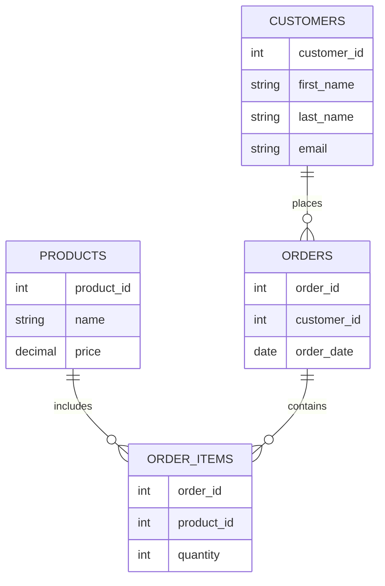

# Data Dictionary

## Introduction

A data dictionary is a centralized repository of information about data, providing a detailed description of all data elements within a database system. It serves as documentation for database administrators, developers, and users, helping them understand the structure, relationships, and constraints of the data they work with.

Think of a data dictionary as an instruction manual for your database—it explains what each field means, what type of data it contains, and how it relates to other data elements in your system.

## Why Data Dictionaries Matter

Data dictionaries are crucial in database design for several reasons:

- **Reduced ambiguity**: They provide clear definitions for each data element
- **Improved communication**: They create a common vocabulary for technical and non-technical stakeholders
- **Better data quality**: They help enforce data standards and consistency
- **Easier maintenance**: They document system changes over time
- **Simplified development**: They guide developers in building applications that interact with the database

## Components of a Data Dictionary

A comprehensive data dictionary typically includes the following information for each data element:

### Essential Components

1. **Element name**: The unique identifier for the data element
2. **Description**: An explanation of what the data element represents
3. **Data type**: The format of the data (integer, varchar, date, etc.)
4. **Length/Size**: The maximum size or precision of the data
5. **Constraints**: Rules that restrict what values can be stored (NOT NULL, UNIQUE, etc.)
6. **Default value**: The value assigned if no value is specified
7. **Primary/Foreign key**: Indicates if the element is a key in a relationship

### Optional Components

1. **Validation rules**: Custom rules for data validation
2. **Source**: Where the data originates from
3. **Usage notes**: Special considerations for using this data
4. **Version information**: Change history for the element
5. **Security classification**: Access control information

## Creating a Data Dictionary

Let's walk through the process of creating a data dictionary for a simple database.

### Step 1: Identify All Data Elements

Begin by listing all tables and their columns in your database. For our example, we'll use a simple e-commerce database with `customers`, `products`, and `orders` tables.

### Step 2: Define Each Element

For each data element, provide detailed information. Here's an example for a few columns in our `customers` table:

```
Table Name: customers
----------------------------------------------------------------------------------
Column Name    | Data Type      | Length | Constraints   | Description
----------------------------------------------------------------------------------
customer_id    | INTEGER        | -      | PK, NOT NULL  | Unique identifier for each customer
first_name     | VARCHAR        | 50     | NOT NULL      | Customer's first name
last_name      | VARCHAR        | 50     | NOT NULL      | Customer's last name
email          | VARCHAR        | 100    | UNIQUE        | Customer's email address
phone_number   | VARCHAR        | 20     | -             | Customer's contact number
date_registered| DATE           | -      | NOT NULL      | Date when customer created account
```

### Step 3: Document Relationships

Document how tables relate to each other:



### Step 4: Add Business Rules and Constraints

Document additional rules that might not be evident from the structure alone:

- Customer emails must be unique and valid format
- Product prices cannot be negative
- Order dates cannot be in the future
- Phone numbers should follow the format XXX-XXX-XXXX

## Practical Example: Building a Data Dictionary

Let's create a data dictionary for a `products` table in SQL Server format:

```sql
CREATE TABLE products (
    product_id INT PRIMARY KEY IDENTITY(1,1),
    product_name VARCHAR(100) NOT NULL,
    category_id INT FOREIGN KEY REFERENCES categories(category_id),
    unit_price DECIMAL(10,2) NOT NULL CHECK (unit_price >= 0),
    units_in_stock INT NOT NULL DEFAULT 0,
    discontinued BIT NOT NULL DEFAULT 0,
    description TEXT
);
```

Here's what the data dictionary entry would look like:

```
Table Name: products
---------------------------------------------------------------------------------------------
Column Name    | Data Type      | Constraints           | Default | Description
---------------------------------------------------------------------------------------------
product_id     | INT            | PK, IDENTITY(1,1)     | -       | Unique identifier for each product
product_name   | VARCHAR(100)   | NOT NULL              | -       | Name of the product
category_id    | INT            | FK -> categories      | -       | Reference to product category
unit_price     | DECIMAL(10,2)  | NOT NULL, CHECK >= 0  | -       | Price per unit
units_in_stock | INT            | NOT NULL              | 0       | Current inventory count
discontinued   | BIT            | NOT NULL              | 0       | Flag indicating if product is discontinued
description    | TEXT           | -                     | NULL    | Detailed product description
```

## Tools for Creating Data Dictionaries

Several tools can help you create and maintain data dictionaries:

1. **Database Management Systems (DBMS)**: Many modern DBMS have built-in data dictionary capabilities
   - MySQL Workbench
   - SQL Server Management Studio
   - Oracle SQL Developer

2. **Data Modeling Tools**:
   - ER/Studio
   - ERwin
   - Lucidchart

3. **Spreadsheet Programs**:
   - Microsoft Excel
   - Google Sheets

4. **Custom Documentation Systems**:
   - Confluence
   - SharePoint

## Best Practices for Data Dictionaries

To make your data dictionary as effective as possible:

1. **Keep it updated**: Revise the data dictionary whenever database changes occur
2. **Use consistent naming**: Follow naming conventions throughout the dictionary
3. **Include examples**: Provide sample values for clarity
4. **Make it accessible**: Store the dictionary where all stakeholders can access it
5. **Assign ownership**: Designate someone responsible for maintaining the dictionary
6. **Get stakeholder input**: Involve business users to ensure definitions are accurate
7. **Include metadata**: Document when entries were last updated and by whom

## Real-World Application: Healthcare Database

To illustrate how data dictionaries work in practice, let's consider a healthcare database:

```
Table: patients
----------------------------------------------------------------------------------
Column Name     | Data Type | Description               | Constraints | Example
----------------------------------------------------------------------------------
patient_id      | INT       | Unique patient identifier | PK         | 12345
mrn             | VARCHAR   | Medical Record Number    | UNIQUE     | MRN78932
last_name       | VARCHAR   | Patient's last name      | NOT NULL   | Smith
first_name      | VARCHAR   | Patient's first name     | NOT NULL   | John
dob             | DATE      | Date of birth            | NOT NULL   | 1985-04-12
gender          | CHAR(1)   | Patient's gender         | M/F/O/U    | M
blood_type      | VARCHAR   | Blood type               | A+/A-/etc. | O+
allergies       | TEXT      | Known allergies          | -          | Penicillin
primary_doctor  | INT       | Reference to doctor      | FK         | 42
```

In this example, the data dictionary helps ensure:

- Patient privacy is protected by documenting which fields contain sensitive information
- Medical staff understand the format and meaning of each data element
- Developers know which fields must be validated (e.g., blood type must be one of the standard types)
- Database administrators can enforce appropriate constraints

## Summary

A data dictionary is an essential component of database design that:

- Documents the structure and meaning of all data elements
- Improves communication between technical and non-technical stakeholders
- Helps maintain data quality and consistency
- Simplifies database maintenance and development
- Provides a single source of truth for data definitions

By creating and maintaining a comprehensive data dictionary, you establish a foundation for effective database design and management. The time invested in building a quality data dictionary will pay dividends through reduced errors, improved communication, and more efficient development.

## Additional Resources

To deepen your understanding of data dictionaries, consider exploring:

- **Database normalization**: Understand how properly structured data makes for better dictionaries
- **Metadata management**: Learn about broader approaches to managing data about data
- **Data governance**: Explore how organizations establish policies for data management
- **Industry-specific standards**: Research data dictionary standards for your industry

## Practice Exercises

1. Create a data dictionary for a simple blog database with users, posts, and comments tables
2. Examine an existing database and document its structure in a data dictionary format
3. Review a data dictionary and identify potential improvements or missing information
4. Create a data dictionary template that your organization can use for future projects