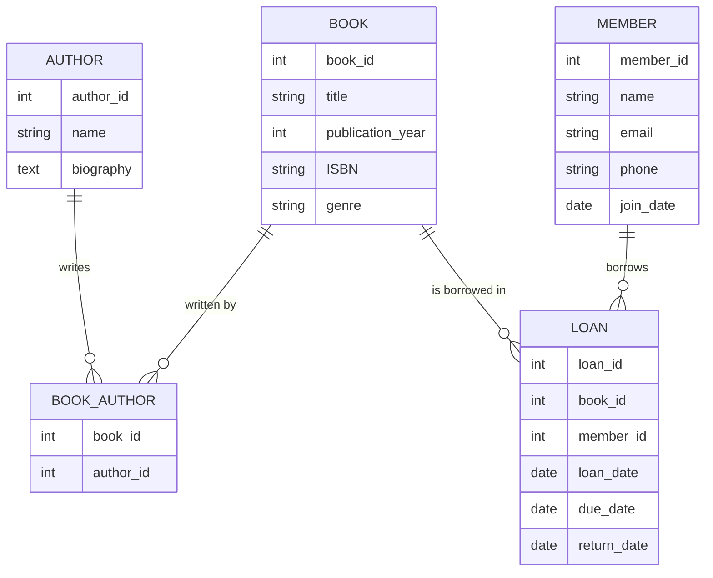
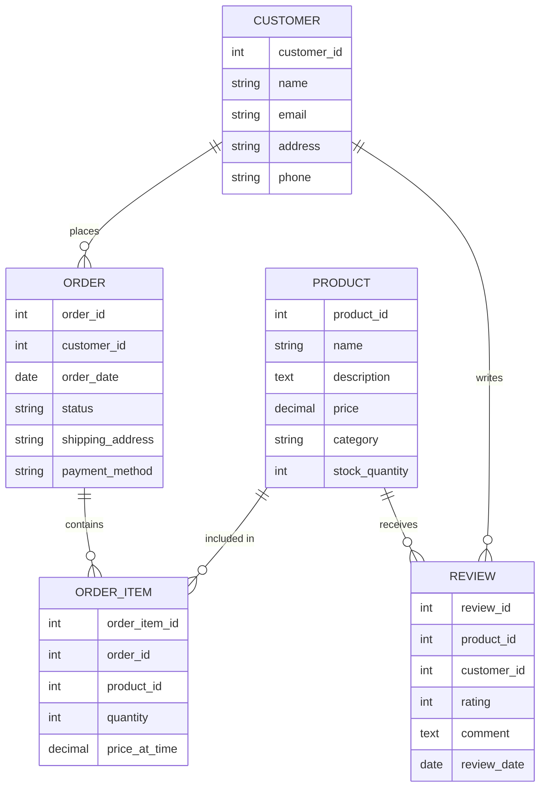

# Conceptual Design

## Introduction

Conceptual design is the first major step in creating a database system. Think of it as sketching out your ideas before building a house. During this phase, we identify what information the database needs to store and how different pieces of information relate to each other. This is done without worrying about technical implementation details—it's all about capturing the essence of the data.

This foundational step creates a blueprint that guides the rest of the database development process. A well-executed conceptual design helps ensure that the final database accurately represents the real-world scenario it's modeling.

## What is Conceptual Design?

Conceptual design focuses on understanding and modeling the data requirements from a high-level, business-oriented perspective. It's platform-independent, meaning we don't yet concern ourselves with specific database systems (like MySQL, PostgreSQL, etc.) or technical constraints.

The key goals of conceptual design are:

1. Identify the important entities (things) in your system
2. Define relationships between these entities
3. Document the properties (attributes) of each entity
4. Establish business rules that govern the data

## Entity-Relationship Diagrams (ERDs)

The most common way to express a conceptual design is through an **Entity-Relationship Diagram (ERD)**. An ERD is a visual representation of entities, their attributes, and how they relate to each other.

### Core Components of an ERD

#### Entities

An entity represents a real-world object, concept, or event about which we want to store data. Examples include:
- Person (student, employee, customer)
- Object (product, book, vehicle)
- Event (sale, enrollment, appointment)
- Concept (account, course, project)

In an ERD, entities are typically represented as rectangles.

#### Attributes

Attributes are properties or characteristics of entities. They describe what we want to know about an entity. For example:
- A `Student` entity might have attributes like: `student_id`, `name`, `email`, and `date_of_birth`
- A `Product` entity might have: `product_id`, `name`, `price`, and `description`

#### Relationships

Relationships describe how entities interact or are associated with each other. For example:
- A student enrolls in courses
- A customer places orders
- An employee works in a department

In an ERD, relationships are represented as lines connecting entity rectangles, often with a diamond or label describing the relationship type.

### Cardinality in Relationships

Cardinality defines how many instances of one entity can be associated with how many instances of another entity. Common cardinality types include:

1. **One-to-One (1:1)**: One instance of Entity A is associated with exactly one instance of Entity B.
   - Example: One person has one passport number

2. **One-to-Many (1:M)**: One instance of Entity A can be associated with multiple instances of Entity B.
   - Example: One department has many employees 

3. **Many-to-Many (M:N)**: Multiple instances of Entity A can be associated with multiple instances of Entity B.
   - Example: Students can enroll in multiple courses, and each course can have multiple students

## Creating a Conceptual Design: Step-by-Step

Let's walk through the process of creating a conceptual design for a simple library management system:

### Step 1: Identify Entities

First, identify the main objects or concepts in your system:
- Book
- Author
- Member
- Loan

### Step 2: Define Attributes for Each Entity

For each entity, determine what information you need to store:

**Book**:
- book_id
- title
- publication_year
- ISBN
- genre

**Author**:
- author_id
- name
- biography

**Member**:
- member_id
- name
- email
- phone
- join_date

**Loan**:
- loan_id
- loan_date
- due_date
- return_date

### Step 3: Establish Relationships

Determine how your entities relate to each other:
- An Author writes many Books (one-to-many)
- A Book can have multiple Authors (many-to-many)
- A Member can borrow multiple Books (many-to-many)
- A Book can be borrowed by many Members over time (many-to-many)

### Step 4: Draw the ERD

Now we can visualize our conceptual design using a Mermaid diagram:

Notice that we've added junction tables (`BOOK_AUTHOR`) to resolve many-to-many relationships. This is a common practice that will make implementation easier in the next phases.

## Real-World Example: Online Retail Store

Let's apply conceptual design to an online retail store:

### Entities and Attributes

**Customer**:
- customer_id
- name
- email
- address
- phone

**Product**:
- product_id
- name
- description
- price
- category
- stock_quantity

**Order**:
- order_id
- order_date
- status
- shipping_address
- payment_method

**Order_Item**:
- order_item_id
- order_id
- product_id
- quantity
- price_at_time

**Review**:
- review_id
- product_id
- customer_id
- rating
- comment
- review_date

### ERD for Online Retail Store

## Common Conceptual Design Principles

### 1. Entity Identification Strategies

A good way to identify entities is to look for nouns in your system requirements. Not all nouns will become entities, but it's a good starting point.

### 2. Derived Attributes

Some attributes can be calculated from other attributes and don't need to be stored separately. For example, if you store a customer's birth date, you don't need to store their age since it can be calculated.

### 3. Weak Entities

A weak entity is one that cannot exist without its parent entity. For example, an "Order Line" cannot exist without an "Order." Weak entities are often represented with double rectangles in ERDs.

### 4. Associative Entities

When a many-to-many relationship has attributes of its own, we create an associative entity (also called a junction table). For example, the relationship between `Student` and `Course` might have attributes like `enrollment_date` and `grade`.

## Best Practices for Conceptual Design

1. **Start simple and refine**: Begin with major entities and gradually add complexity.

2. **Involve stakeholders**: Collaborate with people who understand the business requirements to ensure accuracy.

3. **Be consistent with naming**: Use clear, consistent naming conventions for entities and attributes.

4. **Document assumptions**: Keep track of any business rules or assumptions you make.

5. **Think about the future**: Consider possible changes or expansions to your system.

6. **Avoid premature optimization**: Focus on accuracy and completeness rather than performance at this stage.

## Common Mistakes to Avoid

1. **Over-complicating the model**: Adding unnecessary entities or relationships.

2. **Under-modeling**: Missing important entities or relationships.

3. **Confusing conceptual with logical design**: Adding implementation details too early.

4. **Ignoring business rules**: Not capturing constraints or rules that govern the data.

5. **Inconsistent level of detail**: Having too much detail for some entities and too little for others.

## From Conceptual to Logical Design

The conceptual design serves as the foundation for the next phase: logical design. In logical design, we'll transform our conceptual model into a more technical representation that includes:

- Detailed attributes with data types
- Primary and foreign keys
- Normalization of tables
- Resolution of many-to-many relationships

However, having a solid conceptual design first makes this transition much smoother and helps ensure that the final database accurately represents the business needs.

## Summary

Conceptual design is the crucial first step in database development where we identify:
- Entities (the things we want to store information about)
- Attributes (the specific pieces of information we want to store)
- Relationships (how entities are connected to each other)

This is typically represented using Entity-Relationship Diagrams (ERDs), which provide a visual blueprint of the database structure. A well-executed conceptual design ensures that the database accurately models the real-world scenario and lays the groundwork for subsequent design phases.

By focusing on the business requirements and data needs before diving into technical implementations, conceptual design helps prevent costly redesigns later in the development process.

## Exercises

1. Create a conceptual design (ERD) for a university database that includes students, professors, courses, and departments.

2. Identify the entities, attributes, and relationships for a hospital management system.

3. For the following scenario, draw an ERD: A social media platform where users can create posts, follow other users, and like or comment on posts.

4. Convert the following business rules into a conceptual design:
   - A company has multiple departments
   - Each department has one manager and many employees
   - Employees can work on multiple projects
   - Each project has a budget, start date, and end date

## Additional Resources

- [Database Design - 2nd Edition](https://opentextbc.ca/dbdesign01/) - An open textbook with excellent chapters on conceptual database design
- [ERDPlus](https://erdplus.com/) - A free online tool for creating ERDs
- [Lucidchart](https://www.lucidchart.com/) - A diagramming tool with ERD templates

Remember that conceptual design is just the beginning of the database design process. In the following sections, we'll explore logical design and physical implementation to bring your database to life.