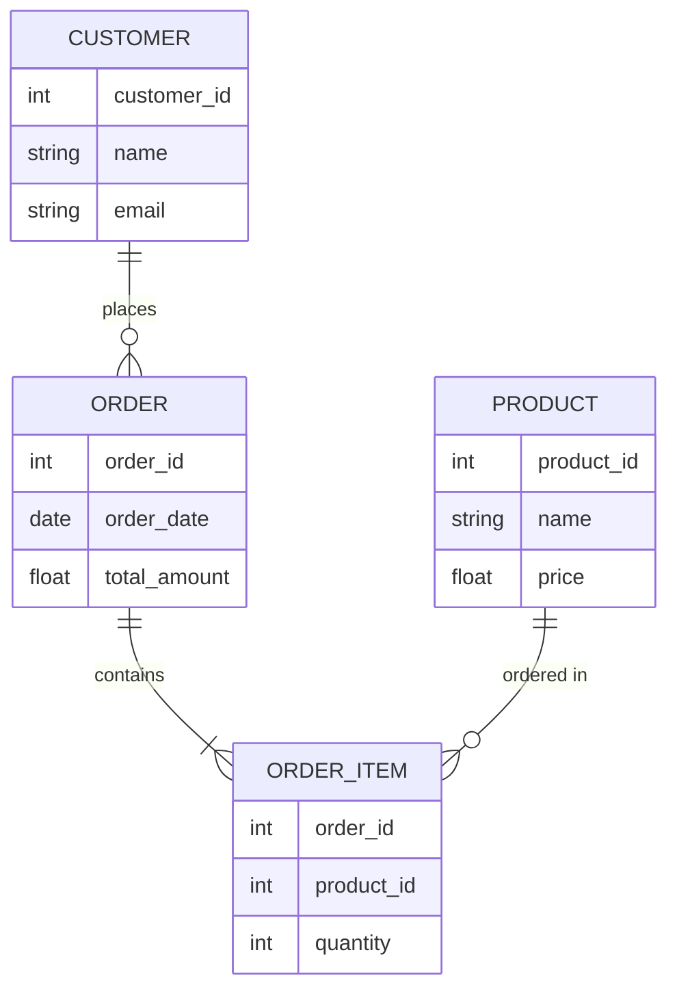
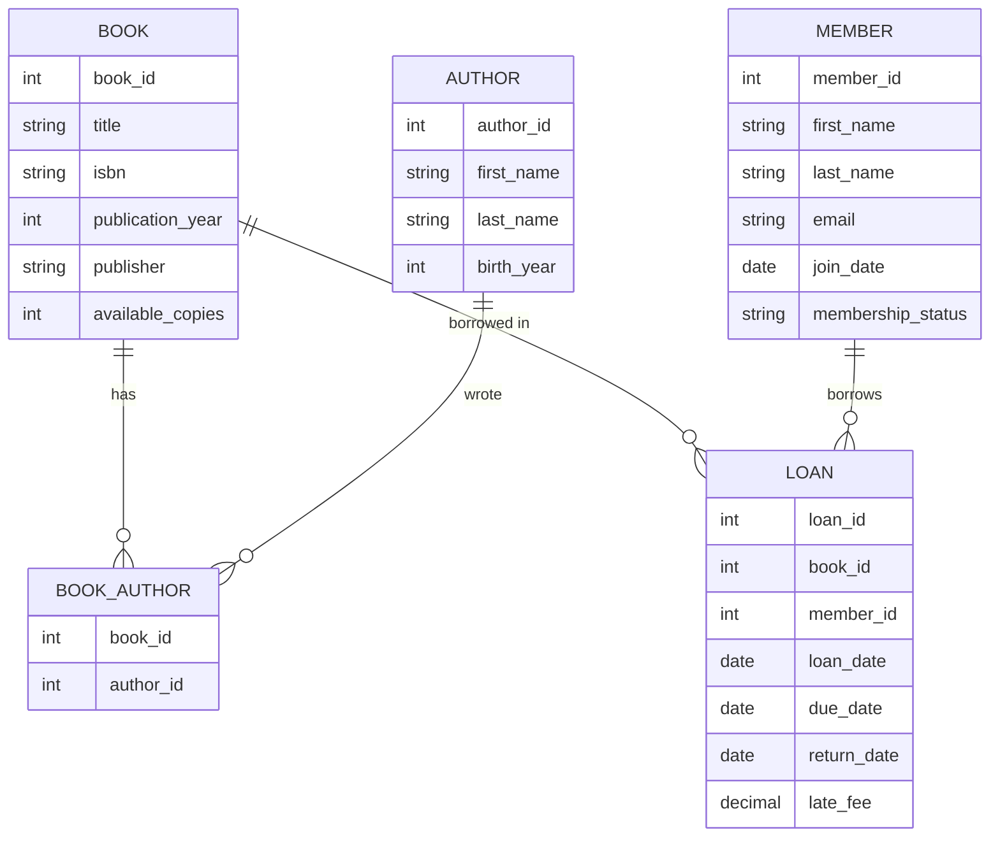

# Logical Design in Database Development

## Introduction

Logical design is a crucial phase in database development that bridges the gap between high-level conceptual models and the physical implementation of a database. It transforms abstract requirements into a structured blueprint that defines how data will be organized, related, and constrained—without yet committing to a specific database management system.

Think of logical design as the architect's detailed blueprint that comes after the initial concept sketches but before actual construction begins. It's where we translate business needs into specific database structures while ensuring data integrity and efficiency.

## What is Logical Design?

Logical design takes the conceptual model (which identifies what data needs to be stored) and transforms it into a detailed logical structure that specifies:

- The tables (entities) that will store your data
- The attributes (columns) each table will contain
- The relationships between different tables
- The constraints that maintain data integrity
- The normalization level to reduce redundancy

Unlike physical design, which deals with implementation details like storage structures, indexing, and access methods, logical design focuses on the logical organization of data independent of any specific database platform.

## The Logical Design Process

### Step 1: Refining Entities from the Conceptual Model

Start by reviewing your conceptual model and refining the entities (which will become tables):

1. Ensure each entity has a clear, singular purpose
2. Identify primary key attributes that uniquely identify each record
3. List all relevant attributes for each entity
4. Remove derived attributes that can be calculated from other data

**Example:**

From a conceptual model identifying "Customer" as an entity, the logical design would refine it as:

```
CUSTOMER(
  customer_id: integer [PK],
  first_name: varchar(50),
  last_name: varchar(50),
  email: varchar(100),
  phone_number: varchar(15),
  registration_date: date
)
```

### Step 2: Defining Relationships

Next, identify and define the relationships between entities:

- One-to-One (1:1)
- One-to-Many (1:N)
- Many-to-Many (M:N)

For each relationship, determine:
- The participating entities
- The cardinality (how many instances can be related)
- Whether participation is mandatory or optional

Many-to-many relationships require special attention as they'll need to be resolved using junction tables.

Let's visualize these relationships using Mermaid:



### Step 3: Applying Normalization

Normalization is a systematic process to organize data to minimize redundancy and dependency issues. The most common normal forms are:

#### First Normal Form (1NF)
- Eliminate repeating groups
- Create separate tables for each set of related data
- Identify each record with a unique key

**Before 1NF:**
```
CUSTOMER(
  customer_id,
  name,
  email,
  phone1, phone2, phone3
)
```

**After 1NF:**
```
CUSTOMER(
  customer_id,
  name,
  email
)

CUSTOMER_PHONE(
  customer_id,
  phone_number
)
```

#### Second Normal Form (2NF)
- Meet all requirements of 1NF
- Remove partial dependencies (attributes that depend on only part of the primary key)

#### Third Normal Form (3NF)
- Meet all requirements of 2NF
- Remove transitive dependencies (non-key attributes that depend on other non-key attributes)

**Before 3NF:**
```
ORDER(
  order_id,
  customer_id,
  customer_name,
  customer_email,
  order_date
)
```

**After 3NF:**
```
ORDER(
  order_id,
  customer_id,
  order_date
)

CUSTOMER(
  customer_id,
  customer_name,
  customer_email
)
```

### Step 4: Defining Constraints

Constraints ensure data integrity by enforcing rules on the database. Common constraints include:

- **Primary Key Constraints**: Ensure unique identification of records
- **Foreign Key Constraints**: Maintain referential integrity between tables
- **Unique Constraints**: Prevent duplicate values in non-key columns
- **Check Constraints**: Ensure data meets specific conditions
- **Not Null Constraints**: Require a column to have a value

Example of constraints in a logical model:

```
PRODUCT(
  product_id: integer [PK],
  name: varchar(100) [NOT NULL],
  category_id: integer [FK to CATEGORY],
  price: decimal(10,2) [CHECK price > 0],
  sku: varchar(20) [UNIQUE]
)
```

## Real-World Example: Library Management System

Let's develop a logical design for a small library management system:

### Step 1: Identify Entities and Attributes

Based on requirements analysis, we identify these core entities:
- Book
- Author
- Member
- Loan

### Step 2: Create Logical Model with Relationships

```
BOOK(
  book_id: integer [PK],
  title: varchar(200) [NOT NULL],
  isbn: varchar(13) [UNIQUE],
  publication_year: integer,
  publisher: varchar(100),
  available_copies: integer [NOT NULL]
)

AUTHOR(
  author_id: integer [PK],
  first_name: varchar(50) [NOT NULL],
  last_name: varchar(50) [NOT NULL],
  birth_year: integer
)

BOOK_AUTHOR(
  book_id: integer [PK, FK to BOOK],
  author_id: integer [PK, FK to AUTHOR]
)

MEMBER(
  member_id: integer [PK],
  first_name: varchar(50) [NOT NULL],
  last_name: varchar(50) [NOT NULL],
  email: varchar(100) [UNIQUE],
  join_date: date [NOT NULL],
  membership_status: varchar(20) [NOT NULL]
)

LOAN(
  loan_id: integer [PK],
  book_id: integer [FK to BOOK],
  member_id: integer [FK to MEMBER],
  loan_date: date [NOT NULL],
  due_date: date [NOT NULL],
  return_date: date,
  late_fee: decimal(5,2)
)
```

Let's visualize this design:



### Step 3: Verify Normalization

This model is already in 3NF because:
- It has no repeating groups (1NF)
- All non-key attributes are fully dependent on their primary key (2NF)
- There are no transitive dependencies (3NF)

Notice how we handled the many-to-many relationship between books and authors by creating a junction table (`BOOK_AUTHOR`).

## From Logical Design to SQL Implementation

Once you've completed your logical design, you can translate it into SQL statements for creating the database structure:

```sql
CREATE TABLE Book (
  book_id INTEGER PRIMARY KEY,
  title VARCHAR(200) NOT NULL,
  isbn VARCHAR(13) UNIQUE,
  publication_year INTEGER,
  publisher VARCHAR(100),
  available_copies INTEGER NOT NULL
);

CREATE TABLE Author (
  author_id INTEGER PRIMARY KEY,
  first_name VARCHAR(50) NOT NULL,
  last_name VARCHAR(50) NOT NULL,
  birth_year INTEGER
);

CREATE TABLE Book_Author (
  book_id INTEGER,
  author_id INTEGER,
  PRIMARY KEY (book_id, author_id),
  FOREIGN KEY (book_id) REFERENCES Book(book_id),
  FOREIGN KEY (author_id) REFERENCES Author(author_id)
);

CREATE TABLE Member (
  member_id INTEGER PRIMARY KEY,
  first_name VARCHAR(50) NOT NULL,
  last_name VARCHAR(50) NOT NULL,
  email VARCHAR(100) UNIQUE,
  join_date DATE NOT NULL,
  membership_status VARCHAR(20) NOT NULL
);

CREATE TABLE Loan (
  loan_id INTEGER PRIMARY KEY,
  book_id INTEGER,
  member_id INTEGER,
  loan_date DATE NOT NULL,
  due_date DATE NOT NULL,
  return_date DATE,
  late_fee DECIMAL(5,2),
  FOREIGN KEY (book_id) REFERENCES Book(book_id),
  FOREIGN KEY (member_id) REFERENCES Member(member_id)
);
```

## Common Challenges in Logical Design

### 1. Resolving Many-to-Many Relationships

Many-to-many relationships cannot be directly implemented in relational databases. They must be broken down using junction tables.

**Example:** Students can take many courses, and courses can have many students.

**Solution:** Create a junction table `ENROLLMENT` with foreign keys to both `STUDENT` and `COURSE`.

### 2. Handling Inheritance/Subtypes

When an entity has subtypes (e.g., `Person` might have subtypes `Employee` and `Customer`), you have several options:

- **Single Table Inheritance:** Put all attributes in one table with a discriminator column
- **Table per Subtype:** Create separate tables for each subtype with common attributes
- **Table per Concrete Class:** Create completely separate tables for each subtype

### 3. Denormalization for Performance

Sometimes, strict normalization can lead to performance issues due to complex joins. In such cases, controlled denormalization might be necessary.

**Example:** Storing a product's current price directly in the `ORDER_ITEM` table (duplicating data) to preserve historical pricing information.

## Summary

Logical database design is the bridge between conceptual modeling and physical implementation. It focuses on transforming business requirements into structured, normalized database blueprints independent of specific database technologies.

Key aspects of logical design include:
- Refining entities and attributes from conceptual models
- Establishing relationships between entities
- Applying normalization techniques
- Defining constraints to maintain data integrity

A well-executed logical design ensures that your database will efficiently store data while minimizing redundancy and maintaining integrity. It forms the foundation for the physical design phase, where you'll implement these structures in a specific database management system.

## Exercises

1. Create a logical design for an online shopping system with customers, products, orders, and reviews.
2. Take an existing database with redundant data and normalize it to 3NF.
3. Identify and resolve all many-to-many relationships in your design from exercise 1.
4. Create the SQL DDL statements to implement your logical design from exercise 1.
5. Identify a scenario where denormalization might be appropriate and explain why.

## Additional Resources

- Books:
  - "Database Systems: The Complete Book" by Hector Garcia-Molina
  - "Database Design for Mere Mortals" by Michael J. Hernandez
- Online Courses:
  - Stanford's Database Course
  - MIT OpenCourseWare Database Systems
- Tools:
  - Draw.io for ER diagrams
  - MySQL Workbench for visual database design