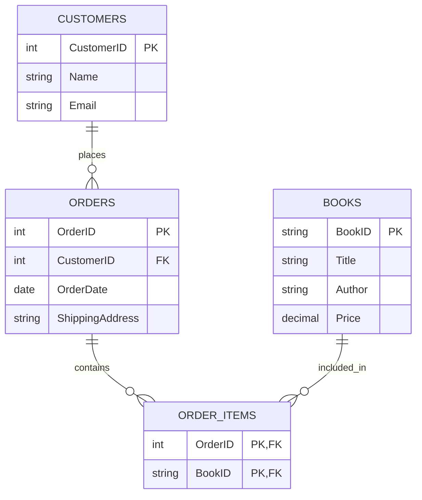
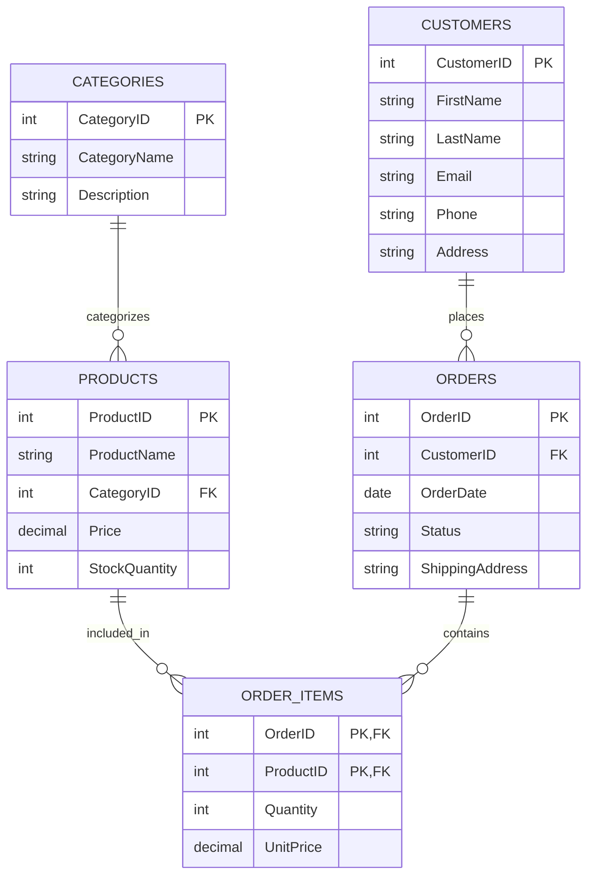

# Normalization Process

## Introduction

Database normalization is a systematic approach to organizing data in a relational database. It's a critical process in database design that reduces data redundancy and improves data integrity. By applying a series of rules (called normal forms), we can create efficient, manageable, and scalable database structures.

Think of normalization as the process of tidying up a messy room. When everything has its proper place, it's easier to find what you need and maintain order. Similarly, a normalized database organizes data efficiently, making it easier to query, update, and maintain.

## Why Normalize Databases?

Before diving into the normalization process, let's understand why it's essential:

1. **Minimize Redundancy**: Reduces duplicate data storage
2. **Prevent Anomalies**: Avoids issues during insert, update, and delete operations
3. **Improve Data Integrity**: Ensures accuracy and consistency of data
4. **Optimize Performance**: Makes queries more efficient (in most cases)
5. **Simplify Maintenance**: Makes the database easier to manage as it grows

## The Normalization Process

Normalization follows a series of steps, with each step representing a "normal form." Let's explore each form:

### First Normal Form (1NF)

A table is in 1NF if:
- It has no repeating groups or arrays
- All column values are atomic (indivisible)
- Each row is unique (has a primary key)

#### Example: Unnormalized Table

```
| StudentID | StudentName | Courses                   |
|-----------|-------------|---------------------------|
| 1         | John Smith  | Math, Physics, Chemistry  |
| 2         | Jane Doe    | Biology, History          |
```

#### Example: After 1NF

```
| StudentID | StudentName | Course     |
|-----------|-------------|------------|
| 1         | John Smith  | Math       |
| 1         | John Smith  | Physics    |
| 1         | John Smith  | Chemistry  |
| 2         | Jane Doe    | Biology    |
| 2         | Jane Doe    | History    |
```

Notice how we eliminated the array of courses and created a separate row for each course.

### Second Normal Form (2NF)

A table is in 2NF if:
- It is already in 1NF
- All non-key attributes are fully dependent on the primary key

#### Example: 1NF Table with Issues

```
| StudentID | CourseID | CourseName | Instructor   | StudentGrade |
|-----------|----------|------------|--------------|--------------|
| 1         | C1       | Math       | Dr. Johnson  | A            |
| 1         | C2       | Physics    | Dr. Smith    | B            |
| 2         | C1       | Math       | Dr. Johnson  | B+           |
| 2         | C3       | Biology    | Dr. Williams | A-           |
```

In this table, the primary key is the combination of `StudentID` and `CourseID`. However, `CourseName` and `Instructor` depend only on `CourseID`, not on the full primary key.

#### Example: After 2NF

**Students_Courses Table:**
```
| StudentID | CourseID | StudentGrade |
|-----------|----------|--------------|
| 1         | C1       | A            |
| 1         | C2       | B            |
| 2         | C1       | B+           |
| 2         | C3       | A-           |
```

**Courses Table:**
```
| CourseID | CourseName | Instructor   |
|----------|------------|--------------|
| C1       | Math       | Dr. Johnson  |
| C2       | Physics    | Dr. Smith    |
| C3       | Biology    | Dr. Williams |
```

We've split the table to ensure that non-key attributes depend on the entire primary key.

### Third Normal Form (3NF)

A table is in 3NF if:
- It is already in 2NF
- All attributes depend directly on the primary key, not on other non-key attributes

#### Example: 2NF Table with Issues

```
| DepartmentID | DepartmentName | DepartmentHead | HeadOffice |
|--------------|----------------|----------------|------------|
| D1           | Computer Sci.  | Dr. Lee        | Building A |
| D2           | Mathematics    | Dr. Chen       | Building B |
| D3           | Physics        | Dr. Wang       | Building A |
```

Here, `HeadOffice` depends on `DepartmentHead`, not directly on `DepartmentID`.

#### Example: After 3NF

**Departments Table:**
```
| DepartmentID | DepartmentName | DepartmentHead |
|--------------|----------------|----------------|
| D1           | Computer Sci.  | Dr. Lee        |
| D2           | Mathematics    | Dr. Chen       |
| D3           | Physics        | Dr. Wang       |
```

**Department Heads Table:**
```
| DepartmentHead | HeadOffice |
|----------------|------------|
| Dr. Lee        | Building A |
| Dr. Chen       | Building B |
| Dr. Wang       | Building A |
```

We've removed the transitive dependency by creating a separate table for department heads.

### Boyce-Codd Normal Form (BCNF)

BCNF is a stricter version of 3NF. A table is in BCNF if:
- It is in 3NF
- For every functional dependency X → Y, X must be a superkey

This is mainly relevant in more complex scenarios where multiple candidate keys exist.

### Fourth Normal Form (4NF)

A table is in 4NF if:
- It is in BCNF
- It has no multi-valued dependencies

### Fifth Normal Form (5NF)

A table is in 5NF if:
- It is in 4NF
- It cannot be decomposed into smaller tables without losing information

## Step-by-Step Normalization Process

Let's walk through a complete normalization process using a practical example:

### Starting with an Unnormalized Table

Imagine we have a table for a small online bookstore:

```
| OrderID | CustomerName | CustomerEmail       | BookTitle          | Author           | Price | OrderDate | ShippingAddress            |
|---------|--------------|---------------------|--------------------|-----------------|---------|-----------|-----------------------------|
| 1       | Alice Smith  | alice@example.com   | Database Design    | John Davis      | 45.99  | 2023-01-15| 123 Main St, City A        |
| 1       | Alice Smith  | alice@example.com   | SQL Fundamentals   | Mary Johnson    | 39.99  | 2023-01-15| 123 Main St, City A        |
| 2       | Bob Jones    | bob@example.com     | Python Programming | Michael Lee     | 55.99  | 2023-01-20| 456 Oak Ave, City B        |
| 3       | Carol Davis  | carol@example.com   | Database Design    | John Davis      | 45.99  | 2023-02-05| 789 Pine Rd, City C        |
```

### Step 1: Apply 1NF

Our table is already atomic (no arrays or repeating groups), so it's in 1NF.

### Step 2: Apply 2NF

The primary key is `OrderID` + `BookTitle`. However, `CustomerName`, `CustomerEmail`, `OrderDate`, and `ShippingAddress` only depend on `OrderID`, not the full key.

**Orders Table:**
```
| OrderID | CustomerName | CustomerEmail       | OrderDate  | ShippingAddress            |
|---------|--------------|---------------------|------------|-----------------------------|
| 1       | Alice Smith  | alice@example.com   | 2023-01-15 | 123 Main St, City A        |
| 2       | Bob Jones    | bob@example.com     | 2023-01-20 | 456 Oak Ave, City B        |
| 3       | Carol Davis  | carol@example.com   | 2023-02-05 | 789 Pine Rd, City C        |
```

**Order_Items Table:**
```
| OrderID | BookTitle          | Price  |
|---------|--------------------|---------
| 1       | Database Design    | 45.99  |
| 1       | SQL Fundamentals   | 39.99  |
| 2       | Python Programming | 55.99  |
| 3       | Database Design    | 45.99  |
```

**Books Table:**
```
| BookTitle          | Author        |
|--------------------|---------------|
| Database Design    | John Davis    |
| SQL Fundamentals   | Mary Johnson  |
| Python Programming | Michael Lee   |
```

### Step 3: Apply 3NF

In our Orders table, all attributes depend directly on the primary key `OrderID`.

But we can improve the Books table. Let's create a more proper Books table with a unique identifier:

**Books Table (Improved):**
```
| BookID | BookTitle          | Author        | Price  |
|--------|--------------------|-----------------|---------
| B1     | Database Design    | John Davis    | 45.99  |
| B2     | SQL Fundamentals   | Mary Johnson  | 39.99  |
| B3     | Python Programming | Michael Lee   | 55.99  |
```

**Order_Items Table (Updated):**
```
| OrderID | BookID |
|---------|--------|
| 1       | B1     |
| 1       | B2     |
| 2       | B3     |
| 3       | B1     |
```

### Final Normalized Schema

After completing the normalization process, we have these tables:



## When to Stop Normalizing

While normalization improves database design, there's a point where further normalization may not be beneficial:

1. **Performance Considerations**: Highly normalized databases may require more joins for queries, potentially affecting performance.
2. **Application Requirements**: Some applications may benefit from limited denormalization for read-heavy operations.
3. **Practical Need**: Most real-world applications typically normalize to 3NF or BCNF, rarely going to 4NF or 5NF.

## Denormalization: The Counterbalance

Sometimes, after normalizing a database, we deliberately introduce redundancy to improve query performance. This is called denormalization and is typically done for:

1. Frequently accessed read-only data
2. Report generation
3. Data warehousing applications

## Practical Example: Online Store Database

Let's apply our knowledge to design a proper database for an online store:

### Step 1: Identify Entities

- Customers
- Products
- Categories
- Orders
- OrderItems

### Step 2: Create Normalized Tables

**Customers Table:**
```
| CustomerID | FirstName | LastName | Email            | Phone        | Address                    |
|------------|-----------|----------|--------------------|--------------|----------------------------|
| 1          | Alice     | Smith    | alice@example.com  | 555-123-4567 | 123 Main St, City A        |
| 2          | Bob       | Jones    | bob@example.com    | 555-234-5678 | 456 Oak Ave, City B        |
```

**Categories Table:**
```
| CategoryID | CategoryName   | Description                     |
|------------|----------------|---------------------------------|
| 1          | Books          | Physical and digital books      |
| 2          | Electronics    | Electronic devices and gadgets  |
```

**Products Table:**
```
| ProductID | ProductName        | CategoryID | Price  | StockQuantity |
|-----------|--------------------|--------------|---------|-----------------
| 101       | Database Design    | 1           | 45.99  | 25            |
| 102       | Wireless Mouse     | 2           | 19.99  | 50            |
```

**Orders Table:**
```
| OrderID | CustomerID | OrderDate  | Status      | ShippingAddress            |
|---------|------------|--------------|--------------|-----------------------------|
| 1001    | 1          | 2023-01-15 | Delivered   | 123 Main St, City A        |
| 1002    | 2          | 2023-01-20 | Processing  | 456 Oak Ave, City B        |
```

**OrderItems Table:**
```
| OrderID | ProductID | Quantity | UnitPrice |
|---------|-----------|---------------------|---------
| 1001    | 101       | 1        | 45.99    |
| 1001    | 102       | 2        | 19.99    |
| 1002    | 101       | 1        | 45.99    |
```

### Database Diagram



## Common Normalization Issues and Solutions

### Common Issues

1. **Duplicate Data**: Same information stored in multiple places
2. **Update Anomalies**: Inconsistencies when updating data
3. **Insert Anomalies**: Inability to add data due to missing related information
4. **Delete Anomalies**: Unintentional loss of data when deleting related information

### Solutions

1. **Identify Dependencies**: Analyze how data relates to understand dependencies
2. **Apply Normal Forms**: Systematically apply each normal form
3. **Create Proper Keys**: Define primary and foreign keys correctly
4. **Review and Test**: Verify your design with sample queries and operations

## SQL Implementation Examples

Let's implement our normalized online store database in SQL:

```sql
-- Create Customers table
CREATE TABLE Customers (
    CustomerID INT PRIMARY KEY,
    FirstName VARCHAR(50),
    LastName VARCHAR(50),
    Email VARCHAR(100) UNIQUE,
    Phone VARCHAR(15),
    Address VARCHAR(255)
);

-- Create Categories table
CREATE TABLE Categories (
    CategoryID INT PRIMARY KEY,
    CategoryName VARCHAR(50),
    Description TEXT
);

-- Create Products table
CREATE TABLE Products (
    ProductID INT PRIMARY KEY,
    ProductName VARCHAR(100),
    CategoryID INT,
    Price DECIMAL(10, 2),
    StockQuantity INT,
    FOREIGN KEY (CategoryID) REFERENCES Categories(CategoryID)
);

-- Create Orders table
CREATE TABLE Orders (
    OrderID INT PRIMARY KEY,
    CustomerID INT,
    OrderDate DATE,
    Status VARCHAR(20),
    ShippingAddress VARCHAR(255),
    FOREIGN KEY (CustomerID) REFERENCES Customers(CustomerID)
);

-- Create OrderItems table
CREATE TABLE OrderItems (
    OrderID INT,
    ProductID INT,
    Quantity INT,
    UnitPrice DECIMAL(10, 2),
    PRIMARY KEY (OrderID, ProductID),
    FOREIGN KEY (OrderID) REFERENCES Orders(OrderID),
    FOREIGN KEY (ProductID) REFERENCES Products(ProductID)
);
```

## Testing Your Normalized Database

After creating your normalized database, test it with various operations:

```sql
-- Insert a new customer
INSERT INTO Customers VALUES (3, 'David', 'Wilson', 'david@example.com', '555-345-6789', '789 Pine Rd, City C');

-- Insert a new order
INSERT INTO Orders VALUES (1003, 3, '2023-03-10', 'Processing', '789 Pine Rd, City C');

-- Add items to the order
INSERT INTO OrderItems VALUES (1003, 101, 1, 45.99);
INSERT INTO OrderItems VALUES (1003, 102, 3, 19.99);

-- Query to retrieve order information with customer details
SELECT o.OrderID, c.FirstName, c.LastName, o.OrderDate, o.Status
FROM Orders o
JOIN Customers c ON o.CustomerID = c.CustomerID
WHERE o.OrderID = 1003;

-- Query to retrieve order details with product information
SELECT oi.OrderID, p.ProductName, oi.Quantity, oi.UnitPrice, (oi.Quantity * oi.UnitPrice) AS Subtotal
FROM OrderItems oi
JOIN Products p ON oi.ProductID = p.ProductID
WHERE oi.OrderID = 1003;
```

## Summary

Database normalization is a structured technique for organizing data in a relational database to minimize redundancy and dependency. The process follows a series of normal forms, each with specific rules:

1. **First Normal Form (1NF)**: Eliminate repeating groups; ensure atomic values
2. **Second Normal Form (2NF)**: Remove partial dependencies
3. **Third Normal Form (3NF)**: Remove transitive dependencies
4. **Boyce-Codd Normal Form (BCNF)**: Address anomalies with multiple candidate keys
5. **Fourth Normal Form (4NF)**: Deal with multi-valued dependencies
6. **Fifth Normal Form (5NF)**: Address join dependencies

Most practical database designs achieve 3NF or BCNF, balancing normalization benefits with performance considerations. Remember that while normalization improves data integrity and reduces redundancy, sometimes strategic denormalization is appropriate for performance optimization.

## Exercises

1. Normalize the following table to 3NF:
   ```
   | StudentID | CourseID | CourseName | Instructor | InstructorOffice | Grade |
   |-----------|----------|------------|------------|------------------|-------|
   | S1        | C1       | Math       | Prof. A    | Room 101         | A     |
   | S1        | C2       | Physics    | Prof. B    | Room 102         | B     |
   | S2        | C1       | Math       | Prof. A    | Room 101         | C     |
   ```

2. Design a normalized database for a library management system with books, authors, borrowers, and loans.

3. Identify potential denormalization strategies for a reporting system that needs to generate monthly sales reports by product category.

## Additional Resources

- **Books**:
  - "Database System Concepts" by Silberschatz, Korth, and Sudarshan
  - "Database Management Systems" by Ramakrishnan and Gehrke

- **Online Resources**:
  - [W3Schools SQL Tutorial](https://www.w3schools.com/sql/)
  - [Database Design for Mere Mortals](https://www.informit.com/store/database-design-for-mere-mortals-a-hands-on-guide-to-9780134449333)

- **Practice Platforms**:
  - [SQLZoo](https://sqlzoo.net/)
  - [HackerRank SQL Challenges](https://www.hackerrank.com/domains/sql)