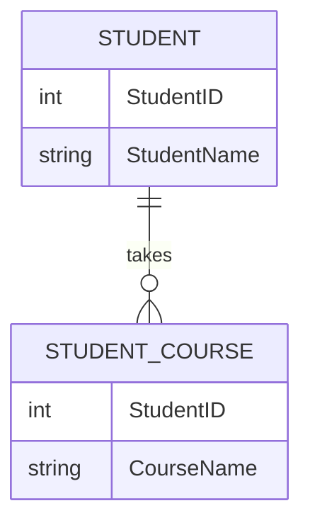
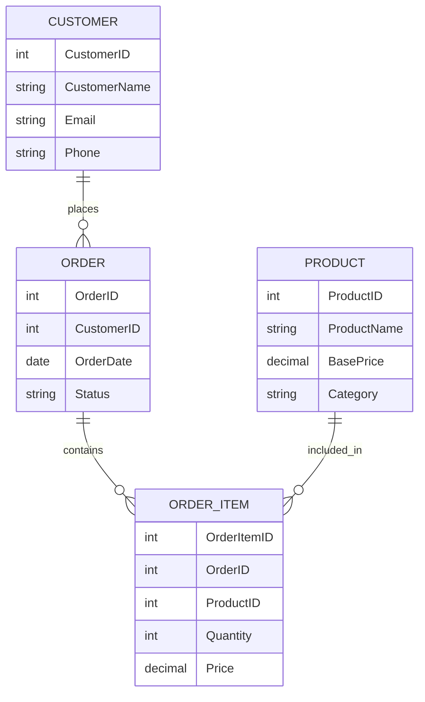

# First Normal Form (1NF)

## Introduction

First Normal Form (1NF) is the initial step in the database normalization process, which helps structure relational databases to reduce data redundancy and improve data integrity. Developed by Edgar F. Codd in 1970, 1NF establishes the basic rules that determine whether a database table is well-formed.

In this tutorial, we'll explore what 1NF is, why it's important, and how to apply it to your database designs with practical examples.

## What is First Normal Form?

First Normal Form (1NF) requires that a database table meet the following criteria:

1. Each table cell must contain only a single (atomic) value
2. Each column must have a unique name
3. All values in a column must be of the same data type
4. The order of rows and columns doesn't matter
5. Each row must be unique (often enforced by a primary key)

The most critical aspect of 1NF is data atomicity - ensuring that each value in your table cannot be broken down further.

## Why is 1NF Important?

Before diving into examples, let's understand why 1NF matters:

- **Eliminates repeating groups**: Makes data easier to query and manipulate
- **Improves data consistency**: Atomic values ensure consistent data retrieval
- **Creates predictable structure**: Allows more efficient indexing and searching
- **Forms the foundation**: Required for higher normal forms (2NF, 3NF, etc.)
- **Reduces data anomalies**: Minimizes update, insertion, and deletion anomalies

## Identifying Violations of 1NF

Let's look at some common violations of 1NF:

### 1. Multiple Values in a Single Cell

This is the most common violation, where a single table cell contains multiple values.


Example data:

| StudentID | StudentName | Courses                 |
|-----------|-------------| ------------------------|
| 1         | Alice       | Math, Science, History  |
| 2         | Bob         | English, Art            |
| 3         | Charlie     | Science, Math           |

In this table, the Courses column violates 1NF because it contains multiple values in a single cell.

### 2. Columns with Mixed Data Types

Another violation occurs when a column contains values of different data types.

| ProductID | ProductName | Attribute             |
|-----------|-------------|-----------------------|
| 1         | Laptop      | 16GB RAM              |
| 2         | Printer     | true                  |
| 3         | Monitor     | 27 inches             |

Here, the Attribute column contains different data types (string, boolean, and numeric with units).

## Converting to 1NF

Let's see how to convert our examples to comply with 1NF:

### Example 1: Fixing Multiple Values in a Cell

To fix the Courses example, we can create a new table with a one-to-many relationship:



The new normalized structure:

**Students Table:**

| StudentID | StudentName |
|-----------|-------------|
| 1         | Alice       |
| 2         | Bob         |
| 3         | Charlie     |

**StudentCourses Table:**

| StudentID | CourseName |
|-----------|------------|
| 1         | Math       |
| 1         | Science    |
| 1         | History    |
| 2         | English    |
| 2         | Art        |
| 3         | Science    |
| 3         | Math       |

Now, each cell contains only atomic (single) values, satisfying the 1NF requirement.

### Example 2: Fixing Mixed Data Types

For the mixed data types example, we need to separate attributes into specific columns:

| ProductID | ProductName | RAM  | HasWireless | ScreenSize |
|-----------|-------------|------|-------------|------------|
| 1         | Laptop      | 16GB | null        | null       |
| 2         | Printer     | null | true        | null       |
| 3         | Monitor     | null | null        | 27 inches  |

While this works, a better approach might be to create separate product category tables:

**Products Table:**

| ProductID | ProductName | ProductCategory |
|-----------|-------------|-----------------|
| 1         | Laptop      | Computer        |
| 2         | Printer     | Peripheral      |
| 3         | Monitor     | Display         |

**Computer Attributes:**

| ProductID | RAM  | ProcessorSpeed | StorageCapacity |
|-----------|------|----------------|-----------------|
| 1         | 16GB | 2.6GHz         | 512GB           |

**Peripheral Attributes:**

| ProductID | HasWireless | PrintSpeed | DuplexPrinting |
|-----------|-------------|------------|----------------|
| 2         | true        | 20ppm      | true           |

**Display Attributes:**

| ProductID | ScreenSize | Resolution  | RefreshRate |
|-----------|------------|-------------|-------------|
| 3         | 27 inches  | 2560x1440   | 144Hz       |

## Real-World Application: Customer Order System

Let's design a customer order system that follows 1NF from the beginning.

Consider a non-1NF table:

| OrderID | CustomerName | Products                          | Prices            | OrderDate  |
|---------|--------------|-----------------------------------|-------------------|------------|
| 1       | John Smith   | Keyboard, Mouse                   | $25.99, $15.50    | 2023-05-10 |
| 2       | Mary Johnson | Monitor, Keyboard, HDMI Cable     | $199.99, $25.99, $8.99 | 2023-05-11 |

This violates 1NF because Products and Prices columns contain multiple values.

Here's the 1NF-compliant design:



**Customers Table:**

| CustomerID | CustomerName | Email              | Phone        |
|------------|--------------|-------------------|--------------|
| 1          | John Smith   | john@example.com  | 555-123-4567 |
| 2          | Mary Johnson | mary@example.com  | 555-987-6543 |

**Orders Table:**

| OrderID | CustomerID | OrderDate  | Status    |
|---------|------------|------------|-----------|
| 1       | 1          | 2023-05-10 | Completed |
| 2       | 2          | 2023-05-11 | Shipped   |

**Products Table:**

| ProductID | ProductName  | BasePrice | Category  |
|-----------|--------------|-----------|-----------|
| 101       | Keyboard     | 25.99     | Accessory |
| 102       | Mouse        | 15.50     | Accessory |
| 103       | Monitor      | 199.99    | Display   |
| 104       | HDMI Cable   | 8.99      | Cable     |

**OrderItems Table:**

| OrderItemID | OrderID | ProductID | Quantity | Price  |
|-------------|---------|-----------|----------|--------|
| 1           | 1       | 101       | 1        | 25.99  |
| 2           | 1       | 102       | 1        | 15.50  |
| 3           | 2       | 103       | 1        | 199.99 |
| 4           | 2       | 101       | 1        | 25.99  |
| 5           | 2       | 104       | 2        | 8.99   |

This design follows 1NF principles by ensuring all column values are atomic. It also provides additional benefits:

1. We can easily add more products to an order
2. We can track individual product quantities
3. We can record the actual price paid (which might differ from the base price due to promotions)
4. We can generate reports on popular products, customer spending, etc.

## Implementing 1NF in SQL

Here's how to create the tables for our order system in SQL:

```sql
CREATE TABLE Customers (
    CustomerID INT PRIMARY KEY,
    CustomerName VARCHAR(100) NOT NULL,
    Email VARCHAR(100) UNIQUE,
    Phone VARCHAR(20)
);

CREATE TABLE Orders (
    OrderID INT PRIMARY KEY,
    CustomerID INT NOT NULL,
    OrderDate DATE NOT NULL,
    Status VARCHAR(20) NOT NULL,
    FOREIGN KEY (CustomerID) REFERENCES Customers(CustomerID)
);

CREATE TABLE Products (
    ProductID INT PRIMARY KEY,
    ProductName VARCHAR(100) NOT NULL,
    BasePrice DECIMAL(10,2) NOT NULL,
    Category VARCHAR(50) NOT NULL
);

CREATE TABLE OrderItems (
    OrderItemID INT PRIMARY KEY,
    OrderID INT NOT NULL,
    ProductID INT NOT NULL,
    Quantity INT NOT NULL DEFAULT 1,
    Price DECIMAL(10,2) NOT NULL,
    FOREIGN KEY (OrderID) REFERENCES Orders(OrderID),
    FOREIGN KEY (ProductID) REFERENCES Products(ProductID)
);
```

## Common Challenges When Applying 1NF

1. **Distinguishing Between Multi-Value and Related Attributes**:
Sometimes it's difficult to determine whether related data should be stored in a separate table or as multiple columns in the same table. For instance, should a person's address be broken down into street, city, state, and zip, or stored as a full address?

2. **Performance Considerations**:
While normalization improves data integrity, it can sometimes lead to more complex queries that join multiple tables, potentially impacting performance. Database designers must balance normalization principles with performance requirements.

3. **Handling Arrays and JSON Data**:
Modern databases often support JSON or array data types, which can technically violate 1NF but offer practical benefits for certain use cases. Deciding when to use these features versus strictly adhering to 1NF requires careful consideration.

4. **Legacy System Migration**:
Converting an existing non-1NF database to 1NF can be challenging, especially for large systems with complex data relationships and dependencies.

## Best Practices for 1NF Implementation

1. **Start with Entity-Relationship Diagrams (ERDs)**:
Before implementing your database, create ERDs to visualize entities and their relationships, making it easier to identify potential 1NF violations.

2. **Identify Multi-Valued Attributes Early**:
During the design phase, identify attributes that might contain multiple values and plan appropriate table structures for them.

3. **Use Junction Tables for Many-to-Many Relationships**:
When two entities have a many-to-many relationship, create a junction table to maintain 1NF compliance.

4. **Enforce Primary Keys**:
Ensure each table has a primary key to enforce row uniqueness, which is a key aspect of 1NF.

5. **Validate Data Types**:
Consistently enforce appropriate data types for each column to avoid mixed-type violations.

## Moving Beyond 1NF

While 1NF is essential, it's often just the first step in database normalization. After achieving 1NF, you might consider:

- **Second Normal Form (2NF)**: Removes partial dependencies by ensuring that non-key attributes depend on the entire primary key.

- **Third Normal Form (3NF)**: Eliminates transitive dependencies by ensuring that non-key attributes depend only on the primary key, not on other non-key attributes.

- **Boyce-Codd Normal Form (BCNF)**: A stronger version of 3NF that addresses certain anomalies not handled by 3NF.

- **Fourth Normal Form (4NF)**: Deals with multi-valued dependencies.

- **Fifth Normal Form (5NF)**: Addresses join dependencies.

## Conclusion

First Normal Form is the foundation of good relational database design. By ensuring that your tables contain only atomic values, have unique rows, and maintain data type consistency, you create a solid base for building reliable, efficient, and maintainable database systems.

Understanding and applying 1NF principles helps you avoid common database design pitfalls and sets the stage for further normalization when needed. While there may be scenarios where strict adherence to 1NF isn't practical, knowing when and how to apply these principles is an essential skill for any database designer or developer.

## Further Reading

- Codd, E.F. (1970). "A Relational Model of Data for Large Shared Data Banks"
- Date, C.J. "An Introduction to Database Systems"
- Connolly, T. & Begg, C. "Database Systems: A Practical Approach to Design, Implementation, and Management"
- Kimball, R. & Ross, M. "The Data Warehouse Toolkit"