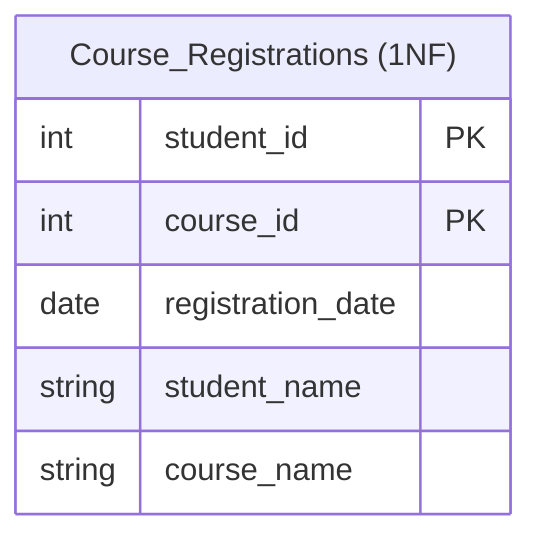
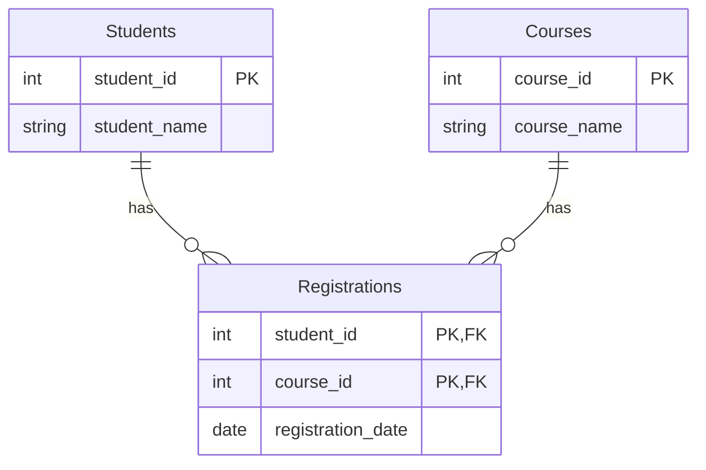

# Second Normal Form (2NF)

## Introduction

Second Normal Form (2NF) is a key concept in database normalization that builds upon the First Normal Form (1NF). While 1NF focuses on eliminating repeating groups and ensuring atomic values, 2NF addresses a more subtle issue: **partial dependencies**.

In this tutorial, you'll learn:
- What 2NF is and why it matters
- How to identify violations of 2NF
- The process of converting a 1NF table to 2NF
- Real-world applications of 2NF

## Prerequisites

Before diving into 2NF, you should be familiar with:
- Basic database concepts
- Primary keys and foreign keys
- First Normal Form (1NF)

## Understanding Second Normal Form

A relation is in Second Normal Form if:
1. It is already in First Normal Form (1NF)
2. All non-key attributes are fully functionally dependent on the primary key

But what does "fully functionally dependent" mean? Let's break it down:

- If a table has a single-column primary key, it automatically satisfies 2NF (as long as it's already in 1NF)
- If a table has a composite primary key (multiple columns), then every non-key column must depend on the entire primary key, not just part of it

## Identifying 2NF Violations

The key sign of a 2NF violation is when a non-key attribute depends on only part of a composite primary key. This is called a **partial dependency**.

Let's look at a classic example:

```sql
CREATE TABLE Course_Registrations (
    student_id INT,
    course_id INT,
    registration_date DATE,
    student_name VARCHAR(100),
    course_name VARCHAR(100),
    PRIMARY KEY (student_id, course_id)
);
```

In this table:
- The primary key is the combination of `student_id` and `course_id`
- `registration_date` depends on both `student_id` and `course_id` (the full primary key)
- `student_name` depends only on `student_id` (partial dependency)
- `course_name` depends only on `course_id` (partial dependency)

The partial dependencies are violations of 2NF. They can lead to:
- Data redundancy
- Update anomalies
- Deletion anomalies

## Converting to 2NF

To convert a table to 2NF, we need to:
1. Identify all partial dependencies
2. Remove these dependencies by creating separate tables
3. Connect the tables using foreign keys

Let's convert our example to 2NF:

```sql
-- Table for students
CREATE TABLE Students (
    student_id INT PRIMARY KEY,
    student_name VARCHAR(100)
);

-- Table for courses
CREATE TABLE Courses (
    course_id INT PRIMARY KEY,
    course_name VARCHAR(100)
);

-- Table for registrations (now in 2NF)
CREATE TABLE Registrations (
    student_id INT,
    course_id INT,
    registration_date DATE,
    PRIMARY KEY (student_id, course_id),
    FOREIGN KEY (student_id) REFERENCES Students(student_id),
    FOREIGN KEY (course_id) REFERENCES Courses(course_id)
);
```

Now each table is in 2NF because:
- All non-key attributes depend on their table's entire primary key
- We've eliminated partial dependencies

## Diagramming the Transformation

Let's visualize the transformation from 1NF to 2NF:



After converting to 2NF:



## A More Complex Example

Let's examine a more complex example. Consider an `Orders` table for an e-commerce system:

```sql
CREATE TABLE Orders (
    order_id INT,
    product_id INT,
    customer_id INT,
    quantity INT,
    price DECIMAL(10,2),
    order_date DATE,
    product_name VARCHAR(100),
    product_category VARCHAR(50),
    customer_name VARCHAR(100),
    customer_email VARCHAR(100),
    PRIMARY KEY (order_id, product_id)
);
```

This table has several 2NF violations:
- `product_name` and `product_category` depend only on `product_id`
- `customer_name` and `customer_email` depend only on `customer_id`
- `order_date` depends only on `order_id`

Let's convert it to 2NF:

```sql
-- Products table
CREATE TABLE Products (
    product_id INT PRIMARY KEY,
    product_name VARCHAR(100),
    product_category VARCHAR(50)
);

-- Customers table
CREATE TABLE Customers (
    customer_id INT PRIMARY KEY,
    customer_name VARCHAR(100),
    customer_email VARCHAR(100)
);

-- Orders table
CREATE TABLE Orders (
    order_id INT PRIMARY KEY,
    customer_id INT,
    order_date DATE,
    FOREIGN KEY (customer_id) REFERENCES Customers(customer_id)
);

-- Order Details table
CREATE TABLE Order_Details (
    order_id INT,
    product_id INT,
    quantity INT,
    price DECIMAL(10,2),
    PRIMARY KEY (order_id, product_id),
    FOREIGN KEY (order_id) REFERENCES Orders(order_id),
    FOREIGN KEY (product_id) REFERENCES Products(product_id)
);
```

Now, all tables are in 2NF, with each non-key attribute fully dependent on its table's primary key.

## Benefits of 2NF

Converting your database to 2NF offers several advantages:

1. **Reduced Data Redundancy**: By eliminating partial dependencies, we store each piece of data in only one place.

2. **Improved Data Integrity**: Updates to data (like a student changing their name) happen in just one row, eliminating the risk of inconsistent data.

3. **Easier Maintenance**: Smaller, focused tables are easier to understand and maintain.

4. **Better Query Performance**: In many cases, properly normalized tables can lead to better query performance, especially for complex joins.

## Common Misconceptions

### "Normalization Always Improves Performance"

While normalization reduces redundancy, it sometimes requires more joins in queries, which can impact performance. Modern database systems are optimized for handling joins efficiently, but extremely high normalization isn't always the best choice for every scenario.

### "We Can Skip 2NF and Go Straight to 3NF"

The normal forms build upon each other. You can't have a table in 3NF without it first being in 2NF. Understanding each step in the normalization process helps build solid database design skills.

## Real-world Application: Library Management System

Consider a library system tracking book loans. A poorly designed table might look like:

```sql
CREATE TABLE BookLoans (
    loan_id INT,
    book_id INT,
    member_id INT,
    loan_date DATE,
    return_date DATE,
    book_title VARCHAR(200),
    book_author VARCHAR(100),
    member_name VARCHAR(100),
    member_phone VARCHAR(15),
    PRIMARY KEY (loan_id, book_id)
);
```

This violates 2NF because:
- `book_title` and `book_author` depend only on `book_id`
- `member_name` and `member_phone` depend only on `member_id`

A better 2NF design would be:

```sql
-- Books table
CREATE TABLE Books (
    book_id INT PRIMARY KEY,
    book_title VARCHAR(200),
    book_author VARCHAR(100)
);

-- Members table
CREATE TABLE Members (
    member_id INT PRIMARY KEY,
    member_name VARCHAR(100),
    member_phone VARCHAR(15)
);

-- Loans table
CREATE TABLE Loans (
    loan_id INT PRIMARY KEY,
    member_id INT,
    loan_date DATE,
    FOREIGN KEY (member_id) REFERENCES Members(member_id)
);

-- Loan Details table
CREATE TABLE LoanDetails (
    loan_id INT,
    book_id INT,
    return_date DATE,
    PRIMARY KEY (loan_id, book_id),
    FOREIGN KEY (loan_id) REFERENCES Loans(loan_id),
    FOREIGN KEY (book_id) REFERENCES Books(book_id)
);
```

This structure eliminates redundancy and makes the database more maintainable.

## Implementation Steps

When implementing 2NF in your database:

1. **Identify Primary Keys**: Determine what constitutes a unique record in each table.

2. **Identify Dependencies**: Map out which attributes depend on which parts of the primary key.

3. **Identify Partial Dependencies**: Find attributes that depend on only part of a composite key.

4. **Create New Tables**: Split the original table to eliminate partial dependencies.

5. **Establish Relationships**: Set up foreign key relationships between the new tables.

6. **Validate**: Ensure all non-key attributes in each table fully depend on that table's primary key.

## Summary

Second Normal Form (2NF) is a critical step in database normalization that addresses partial dependencies in tables with composite primary keys. By moving to 2NF:

- We eliminate redundancy by ensuring non-key attributes depend on the entire primary key
- We create cleaner, more focused tables
- We reduce the risk of update and deletion anomalies

The journey to a well-designed database doesn't end with 2NF, but it's an essential milestone that builds the foundation for further normalization steps.

## Exercises

1. Identify 2NF violations in the following table:
   ```
   ProjectAssignments(employee_id, project_id, hours_worked, employee_name, project_name, project_budget)
   ```

2. Convert the following table to 2NF:
   ```
   Invoices(invoice_id, product_id, quantity, price, invoice_date, customer_id, product_name, customer_name)
   ```

3. For your own project:
   - Examine your database tables
   - Identify any that have composite primary keys
   - Check if they violate 2NF
   - If necessary, redesign them to comply with 2NF

## Additional Resources

- Continue to the next tutorial on Third Normal Form (3NF)
- Review the First Normal Form (1NF) tutorial if needed
- Explore practical case studies in database normalization