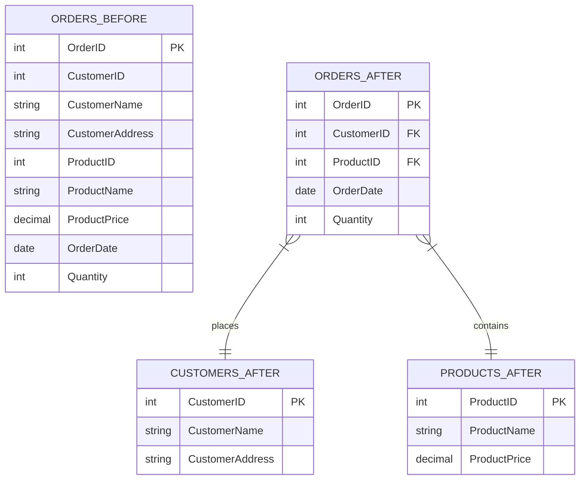

# Third Normal Form (3NF)

## Introduction

Third Normal Form (3NF) is a database normalization technique that builds upon the First Normal Form (1NF) and Second Normal Form (2NF) to further reduce data redundancy and improve data integrity. In simple terms, 3NF ensures that non-key attributes in your tables are dependent only on the primary key and nothing else.

Think of 3NF as a way to organize your data so that when you need to update information, you only need to update it in one place. This helps prevent inconsistencies and makes your database more efficient.

## Prerequisites

Before diving into 3NF, you should understand:
- Basic database concepts
- Primary keys and foreign keys
- First Normal Form (1NF) 
- Second Normal Form (2NF)

## Understanding Third Normal Form

A table is in Third Normal Form if it satisfies all of these conditions:
1. It is already in Second Normal Form (2NF)
2. All non-key attributes are directly dependent on the primary key
3. No transitive dependencies exist

That third condition is the key to 3NF: **eliminating transitive dependencies**.

### What is a Transitive Dependency?

A transitive dependency occurs when a non-key attribute depends on another non-key attribute, which in turn depends on the primary key.

Mathematically, if:
- A → B (A determines B)
- B → C (B determines C)
- Then A → C (A determines C) through B

In database terms, if column C depends on column B, and column B depends on the primary key A, then C has a transitive dependency on A through B.

## Examples of Third Normal Form

### Example 1: A Table Not in 3NF

Let's start with a table that violates 3NF:

```sql
CREATE TABLE Orders (
  OrderID INT PRIMARY KEY,
  CustomerID INT,
  CustomerName VARCHAR(100),
  CustomerAddress VARCHAR(200),
  ProductID INT,
  ProductName VARCHAR(100),
  ProductPrice DECIMAL(10,2),
  OrderDate DATE,
  Quantity INT
);
```

This table has several issues:
- `CustomerName` and `CustomerAddress` depend on `CustomerID`, not directly on `OrderID`
- `ProductName` and `ProductPrice` depend on `ProductID`, not directly on `OrderID`

These are transitive dependencies that violate 3NF.

### Example 2: Converting to 3NF

To convert to 3NF, we need to break this into separate tables:

```sql
CREATE TABLE Customers (
  CustomerID INT PRIMARY KEY,
  CustomerName VARCHAR(100),
  CustomerAddress VARCHAR(200)
);

CREATE TABLE Products (
  ProductID INT PRIMARY KEY,
  ProductName VARCHAR(100),
  ProductPrice DECIMAL(10,2)
);

CREATE TABLE Orders (
  OrderID INT PRIMARY KEY,
  CustomerID INT,
  ProductID INT,
  OrderDate DATE,
  Quantity INT,
  FOREIGN KEY (CustomerID) REFERENCES Customers(CustomerID),
  FOREIGN KEY (ProductID) REFERENCES Products(ProductID)
);
```

Now each table is in 3NF because:
1. All tables have primary keys
2. No partial dependencies exist
3. No non-key attributes depend on other non-key attributes

## Visualizing the Transformation

Let's visualize this transformation using a diagram:



## Benefits of Third Normal Form

Implementing 3NF in your database design offers several advantages:

1. **Reduced Data Redundancy**: Information is stored in only one place, reducing storage requirements.
2. **Improved Data Integrity**: Updates only need to happen in one place, eliminating the risk of inconsistent data.
3. **Better Query Performance**: Smaller, more focused tables often lead to faster queries.
4. **Easier Maintenance**: Schema changes are more straightforward when tables follow normalization principles.
5. **More Flexible Design**: Adding new features or attributes becomes cleaner and less disruptive.

## Real-World Application: Library Management System

Consider a library management system. Without 3NF, you might have:

```sql
CREATE TABLE BookLoans (
  LoanID INT PRIMARY KEY,
  BookID INT,
  BookTitle VARCHAR(200),
  BookAuthor VARCHAR(100),
  PublisherName VARCHAR(100),
  PublisherAddress VARCHAR(200),
  MemberID INT,
  MemberName VARCHAR(100),
  MemberEmail VARCHAR(100),
  BorrowDate DATE,
  ReturnDate DATE
);
```

This design has many transitive dependencies:
- Book information depends on BookID
- Publisher information depends on PublisherName
- Member information depends on MemberID

A 3NF design would split this into:

```sql
CREATE TABLE Publishers (
  PublisherID INT PRIMARY KEY,
  PublisherName VARCHAR(100),
  PublisherAddress VARCHAR(200)
);

CREATE TABLE Books (
  BookID INT PRIMARY KEY,
  BookTitle VARCHAR(200),
  BookAuthor VARCHAR(100),
  PublisherID INT,
  FOREIGN KEY (PublisherID) REFERENCES Publishers(PublisherID)
);

CREATE TABLE Members (
  MemberID INT PRIMARY KEY,
  MemberName VARCHAR(100),
  MemberEmail VARCHAR(100)
);

CREATE TABLE BookLoans (
  LoanID INT PRIMARY KEY,
  BookID INT,
  MemberID INT,
  BorrowDate DATE,
  ReturnDate DATE,
  FOREIGN KEY (BookID) REFERENCES Books(BookID),
  FOREIGN KEY (MemberID) REFERENCES Members(MemberID)
);
```

Now each entity has its own table, and all attributes depend directly on their respective primary keys.

## Common Challenges with 3NF

### Performance Considerations

While 3NF improves data integrity, it can sometimes affect query performance because retrieving data might require joining multiple tables. This is where denormalization (deliberately violating normalization rules) might be considered for performance reasons.

For example, you might add a redundant `TotalOrderValue` column to the Orders table even though it could be calculated by multiplying `Quantity` by `ProductPrice`.

### When to Stop Normalizing

There are higher normal forms beyond 3NF, such as Boyce-Codd Normal Form (BCNF), 4NF, and 5NF. However, for most applications, 3NF provides a good balance between performance and data integrity. Higher normal forms address increasingly specific and rare data anomalies.

## How to Convert a Table to 3NF

Follow these steps to convert a table to 3NF:

1. Ensure the table is in 2NF first
2. Identify all transitive dependencies
3. Create new tables for each dependent group of attributes
4. Move the attributes to their appropriate tables
5. Establish relationships between tables using foreign keys

## Practical Exercise: Converting to 3NF

Consider this table:

```sql
CREATE TABLE EmployeeProjects (
  EmployeeID INT,
  ProjectID INT,
  EmployeeName VARCHAR(100),
  EmployeeDepartment VARCHAR(100),
  DepartmentHead VARCHAR(100),
  ProjectName VARCHAR(100),
  ProjectBudget DECIMAL(15,2),
  HoursWorked INT,
  PRIMARY KEY (EmployeeID, ProjectID)
);
```

Try to identify the transitive dependencies and convert this table to 3NF. The solution would involve creating separate tables for employees, departments, projects, and the many-to-many relationship between employees and projects.

## Summary

Third Normal Form (3NF) is a crucial database design principle that helps reduce redundancy and maintain data integrity by eliminating transitive dependencies. A table in 3NF ensures that all non-key attributes depend only on the primary key.

Key takeaways:
- 3NF builds on 1NF and 2NF principles
- It removes transitive dependencies
- Properly normalized databases are easier to maintain and update
- Real-world applications often require balancing normalization with performance needs

## Additional Resources

- Books:
  - "Database Design for Mere Mortals" by Michael J. Hernandez
  - "SQL Antipatterns" by Bill Karwin

- Practice Exercises:
  1. Identify 3NF violations in existing database schemas
  2. Convert a denormalized table to 3NF
  3. Analyze when denormalization might be appropriate despite 3NF violations

- Next Topics to Explore:
  - Boyce-Codd Normal Form (BCNF)
  - Fourth Normal Form (4NF)
  - Database indexing strategies
  - Query optimization for normalized databases