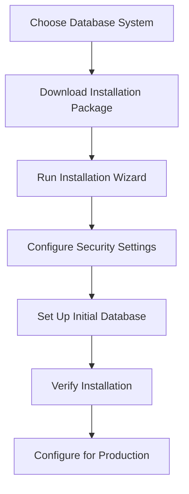

# Database Installation

## Introduction

Database installation is a fundamental skill for any aspiring developer or database administrator. A database management system (DBMS) provides the necessary infrastructure to store, organize, and retrieve data efficiently. Whether you're building a simple web application or a complex enterprise system, understanding how to properly install and configure a database is essential.

This guide will walk you through the installation process for several popular database systems, including MySQL, PostgreSQL, MongoDB, and SQLite. We'll cover common installation methods, basic configuration, and verification steps to ensure your database is running correctly.

## Why Database Installation Matters

Before diving into specific installation procedures, let's understand why proper database installation is crucial:

1. **Performance**: Correct installation and configuration ensure optimal performance for your applications.
2. **Security**: Proper setup helps protect your data from unauthorized access.
3. **Reliability**: A well-installed database reduces the risk of data corruption or loss.
4. **Scalability**: Good initial setup makes future scaling easier.

Let's visualize the typical database installation process:



## Common Database Systems

Let's explore installation procedures for the most popular database systems:

### MySQL Installation

MySQL is one of the world's most popular open-source relational database systems.

#### Installing MySQL on Windows

1. **Download the MySQL Installer**:
   - Visit the [MySQL official website](https://dev.mysql.com/downloads/installer/)
   - Download the MySQL Installer for Windows

2. **Run the Installer**:
   ```bash
   # Launch the downloaded installer and follow the wizard
   # Select "Developer Default" for most development needs
   ```

3. **Configure the MySQL Server**:
   ```bash
   # Set the root password when prompted
   # Select "Use Legacy Authentication Method" for beginners
   # Create any additional user accounts as needed
   ```

4. **Verify the Installation**:
   ```bash
   # Open Command Prompt and type:
   mysql -u root -p
   
   # After entering your password, you should see:
   # Welcome to the MySQL monitor...
   # mysql>
   ```

#### Installing MySQL on macOS

1. **Using Homebrew**:
   ```bash
   # Install Homebrew if not already installed
   /bin/bash -c "$(curl -fsSL https://raw.githubusercontent.com/Homebrew/install/HEAD/install.sh)"
   
   # Install MySQL
   brew install mysql
   
   # Start MySQL Service
   brew services start mysql
   
   # Secure the MySQL installation
   mysql_secure_installation
   ```

2. **Verify the Installation**:
   ```bash
   mysql -u root -p
   ```

#### Installing MySQL on Linux (Ubuntu)

1. **Install MySQL Server**:
   ```bash
   # Update package lists
   sudo apt update
   
   # Install MySQL Server
   sudo apt install mysql-server
   
   # Secure the installation
   sudo mysql_secure_installation
   ```

2. **Verify the Installation**:
   ```bash
   sudo mysql
   ```

### PostgreSQL Installation

PostgreSQL is a powerful, open-source object-relational database system known for reliability and data integrity.

#### Installing PostgreSQL on Windows

1. **Download the Installer**:
   - Visit the [PostgreSQL official website](https://www.postgresql.org/download/windows/)
   - Download the installer for Windows

2. **Run the Installer**:
   ```bash
   # Launch the downloaded installer
   # Select components (typically all are recommended)
   # Choose installation directory
   # Set password for the database superuser (postgres)
   # Set port (default is 5432)
   ```

3. **Verify the Installation**:
   ```bash
   # Using psql command line tool
   psql -U postgres
   
   # You should see:
   # postgres=#
   ```

#### Installing PostgreSQL on macOS

1. **Using Homebrew**:
   ```bash
   # Install PostgreSQL
   brew install postgresql
   
   # Start PostgreSQL Service
   brew services start postgresql
   ```

2. **Verify the Installation**:
   ```bash
   psql postgres
   ```

#### Installing PostgreSQL on Linux (Ubuntu)

1. **Install PostgreSQL**:
   ```bash
   # Update package lists
   sudo apt update
   
   # Install PostgreSQL and client
   sudo apt install postgresql postgresql-contrib
   ```

2. **Verify the Installation**:
   ```bash
   # Switch to postgres user
   sudo -i -u postgres
   
   # Connect to PostgreSQL server
   psql
   ```

### MongoDB Installation

MongoDB is a popular NoSQL database that uses a document-oriented data model.

#### Installing MongoDB on Windows

1. **Download the MongoDB Community Server**:
   - Visit the [MongoDB Download Center](https://www.mongodb.com/try/download/community)
   - Select the Windows version and download the MSI package

2. **Run the Installer**:
   ```bash
   # Launch the downloaded MSI file
   # Choose "Complete" installation
   # Select "Install MongoDB as a Service" option
   ```

3. **Verify the Installation**:
   ```bash
   # Open Command Prompt and navigate to MongoDB bin directory
   cd C:\Program Files\MongoDB\Server\{version}\bin
   
   # Connect to MongoDB
   mongo
   ```

#### Installing MongoDB on macOS

1. **Using Homebrew**:
   ```bash
   # Install MongoDB
   brew tap mongodb/brew
   brew install mongodb-community
   
   # Start MongoDB Service
   brew services start mongodb-community
   ```

2. **Verify the Installation**:
   ```bash
   # Connect to MongoDB
   mongo
   ```

#### Installing MongoDB on Linux (Ubuntu)

1. **Import the MongoDB public GPG key**:
   ```bash
   wget -qO - https://www.mongodb.org/static/pgp/server-6.0.asc | sudo apt-key add -
   ```

2. **Create a list file for MongoDB**:
   ```bash
   echo "deb [ arch=amd64,arm64 ] https://repo.mongodb.org/apt/ubuntu focal/mongodb-org/6.0 multiverse" | sudo tee /etc/apt/sources.list.d/mongodb-org-6.0.list
   ```

3. **Install MongoDB**:
   ```bash
   sudo apt update
   sudo apt install -y mongodb-org
   
   # Start MongoDB
   sudo systemctl start mongod
   
   # Enable MongoDB to start on boot
   sudo systemctl enable mongod
   ```

4. **Verify the Installation**:
   ```bash
   mongo
   ```

### SQLite Installation

SQLite is a self-contained, serverless database engine, popular for embedded systems and small applications.

#### Installing SQLite (All Platforms)

SQLite is so lightweight that it doesn't require a traditional installation process.

1. **Windows**:
   ```bash
   # Download the precompiled binaries from https://www.sqlite.org/download.html
   # Extract the files to a folder
   # Add the folder to your PATH environment variable
   ```

2. **macOS**:
   ```bash
   # SQLite comes pre-installed on macOS
   # Verify with:
   sqlite3 --version
   
   # Or install/update using Homebrew:
   brew install sqlite
   ```

3. **Linux (Ubuntu)**:
   ```bash
   # Install SQLite
   sudo apt update
   sudo apt install sqlite3
   
   # Verify installation
   sqlite3 --version
   ```

4. **Using SQLite**:
   ```bash
   # Create and open a database
   sqlite3 mydatabase.db
   
   # You should see the SQLite prompt:
   # sqlite>
   ```

## Post-Installation Configuration

After installing your database system, several important configuration steps should be considered:

### Security Configuration

1. **Change default passwords**:
   ```bash
   # For MySQL
   ALTER USER 'root'@'localhost' IDENTIFIED BY 'new_password';
   
   # For PostgreSQL
   ALTER USER postgres WITH PASSWORD 'new_password';
   ```

2. **Create dedicated database users** (avoid using root/admin):
   ```bash
   # For MySQL
   CREATE USER 'app_user'@'localhost' IDENTIFIED BY 'user_password';
   GRANT SELECT, INSERT, UPDATE, DELETE ON my_database.* TO 'app_user'@'localhost';
   
   # For PostgreSQL
   CREATE USER app_user WITH PASSWORD 'user_password';
   GRANT CONNECT ON DATABASE my_database TO app_user;
   ```

3. **Configure network access**:
   - For development, limit to localhost
   - For production, use firewalls and VPNs when appropriate

### Performance Tuning

Basic performance tuning involves adjusting memory allocation and query caching:

```bash
# Example MySQL configuration (in my.cnf or my.ini)
[mysqld]
# Memory allocation
innodb_buffer_pool_size = 1G  # Adjust based on available RAM
max_connections = 150

# Query cache settings
query_cache_size = 64M
query_cache_type = 1
```

```bash
# Example PostgreSQL configuration (in postgresql.conf)
# Memory settings
shared_buffers = 1GB  # Typically 25% of RAM
work_mem = 32MB       # For complex queries

# Write settings
wal_buffers = 16MB    # Helps with write performance
```

## Database Management Tools

Installing graphical tools can make database management easier:

1. **MySQL Workbench**: Official GUI tool for MySQL
2. **pgAdmin**: Popular management tool for PostgreSQL
3. **MongoDB Compass**: Official GUI for MongoDB
4. **DB Browser for SQLite**: Lightweight visual tool for SQLite

## Real-World Installation Scenario

Let's walk through a real-world scenario: setting up a database for a small e-commerce website.

### Requirements:
- Store product information
- Maintain customer accounts
- Track orders and inventory
- Support multiple concurrent users

### Solution: PostgreSQL Installation

1. **Install PostgreSQL** using the methods described above

2. **Create a database and schema**:
   ```sql
   -- Connect as postgres user
   psql -U postgres
   
   -- Create a database
   CREATE DATABASE ecommerce;
   
   -- Connect to the database
   \c ecommerce
   
   -- Create schema
   CREATE SCHEMA store;
   ```

3. **Create tables**:
   ```sql
   -- Products table
   CREATE TABLE store.products (
     product_id SERIAL PRIMARY KEY,
     name VARCHAR(100) NOT NULL,
     description TEXT,
     price DECIMAL(10,2) NOT NULL,
     stock_quantity INT NOT NULL
   );
   
   -- Customers table
   CREATE TABLE store.customers (
     customer_id SERIAL PRIMARY KEY,
     email VARCHAR(100) UNIQUE NOT NULL,
     first_name VARCHAR(50) NOT NULL,
     last_name VARCHAR(50) NOT NULL,
     password_hash VARCHAR(100) NOT NULL,
     created_at TIMESTAMP DEFAULT CURRENT_TIMESTAMP
   );
   
   -- Orders table
   CREATE TABLE store.orders (
     order_id SERIAL PRIMARY KEY,
     customer_id INT REFERENCES store.customers(customer_id),
     order_date TIMESTAMP DEFAULT CURRENT_TIMESTAMP,
     total_amount DECIMAL(10,2) NOT NULL
   );
   ```

4. **Create a dedicated user**:
   ```sql
   -- Create application user
   CREATE USER ecommerce_app WITH PASSWORD 'secure_password';
   
   -- Grant privileges
   GRANT USAGE ON SCHEMA store TO ecommerce_app;
   GRANT SELECT, INSERT, UPDATE, DELETE ON ALL TABLES IN SCHEMA store TO ecommerce_app;
   GRANT USAGE ON ALL SEQUENCES IN SCHEMA store TO ecommerce_app;
   ```

5. **Test connection with the new user**:
   ```bash
   psql -U ecommerce_app -d ecommerce
   ```

## Troubleshooting Common Installation Issues

### MySQL Issues

1. **Cannot connect to MySQL server**:
   ```bash
   # Check if MySQL service is running
   # Windows:
   sc query mysql
   
   # macOS:
   brew services list
   
   # Linux:
   sudo systemctl status mysql
   ```

2. **Access denied error**:
   ```bash
   # Reset root password
   # Stop MySQL server
   sudo service mysql stop
   
   # Start in safe mode
   sudo mysqld_safe --skip-grant-tables &
   
   # Connect and reset password
   mysql -u root
   ```

### PostgreSQL Issues

1. **Authentication failure**:
   ```bash
   # Edit pg_hba.conf to change authentication method
   # Find file location with:
   psql -U postgres -c "SHOW hba_file;"
   ```

2. **Service won't start**:
   ```bash
   # Check PostgreSQL logs
   # Windows: Event Viewer
   # macOS: /usr/local/var/log/postgres.log
   # Linux: /var/log/postgresql/
   ```

### MongoDB Issues

1. **MongoDB service fails to start**:
   ```bash
   # Check MongoDB logs
   # Windows: \data\log\mongod.log
   # macOS/Linux: /var/log/mongodb/mongod.log
   ```

2. **Connection refused**:
   ```bash
   # Verify MongoDB is listening on the expected port
   # Windows:
   netstat -an | find "27017"
   
   # macOS/Linux:
   netstat -an | grep 27017
   ```

## Summary

In this guide, we've covered the installation process for several popular database systems across different operating systems. Here's a quick recap:

1. **Choose the right database** for your needs
2. **Follow platform-specific installation steps**
3. **Configure security settings** to protect your data
4. **Verify your installation** works correctly
5. **Perform basic performance tuning** for your environment
6. **Install management tools** to simplify database administration

Remember that proper database installation forms the foundation for successful application development. Taking the time to set up your database correctly will save you from headaches later.

## Practice Exercises

1. **Basic Installation**: Install MySQL on your development machine and create a test database.
2. **User Management**: Create a new database user with limited permissions on a specific database.
3. **Database Design**: Create a simple database schema for a blog (posts, comments, users) using any of the installed database systems.
4. **Backup Configuration**: Set up automated backups for your database using the native backup tools.
5. **Performance Challenge**: Experiment with different configuration settings and measure their impact on performance.

## Additional Resources

- [MySQL Documentation](https://dev.mysql.com/doc/)
- [PostgreSQL Documentation](https://www.postgresql.org/docs/)
- [MongoDB Manual](https://docs.mongodb.com/manual/)
- [SQLite Documentation](https://www.sqlite.org/docs.html)
- [Database Design Fundamentals](https://www.tutorialspoint.com/dbms/index.htm)

Remember that database installation is just the beginning of your journey. As you grow as a developer or administrator, you'll learn more about optimization, scaling, and advanced management techniques.