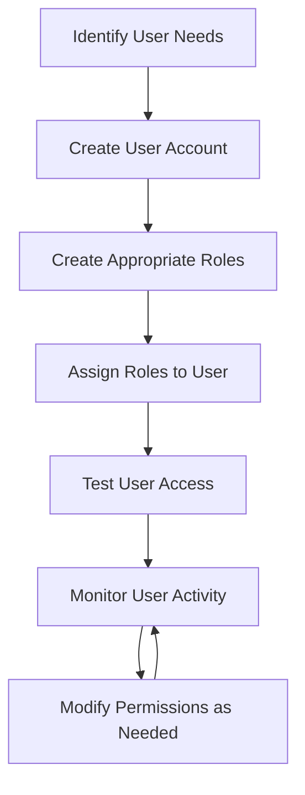

# User Management in Database Administration

## Introduction

Database user management is a critical aspect of database administration that involves creating and maintaining user accounts, assigning appropriate permissions, and ensuring secure access to database resources. Proper user management helps protect your data from unauthorized access while allowing legitimate users to perform their required tasks efficiently.

In this guide, we'll explore the fundamentals of database user management, covering essential concepts like users, roles, privileges, and authentication methods across different database systems.

## Why User Management Matters

Before diving into the technical details, let's understand why user management is crucial:

- **Security**: Prevents unauthorized access to sensitive data
- **Accountability**: Tracks user actions for auditing purposes
- **Resource Control**: Limits resource usage by different users
- **Compliance**: Helps meet regulatory requirements (GDPR, HIPAA, etc.)
- **Operational Efficiency**: Streamlines access control through role-based permissions

## Core Concepts in Database User Management

### 1. Users and Authentication

A database user is an account that can connect to and interact with a database. Each user has:

- A unique username
- Authentication credentials (password, certificate, etc.)
- Associated permissions and roles

Let's look at how to create users in different database systems:

#### MySQL

```sql
-- Create a new user with password authentication
CREATE USER 'newuser'@'localhost' IDENTIFIED BY 'password123';

-- Grant this user connection privileges
GRANT USAGE ON *.* TO 'newuser'@'localhost';
```

#### PostgreSQL

```sql
-- Create a new user with password authentication
CREATE USER newuser WITH PASSWORD 'password123';

-- Create a user that can create databases
CREATE USER dbcreator WITH PASSWORD 'password123' CREATEDB;
```

#### Oracle

```sql
-- Create a new user with password authentication
CREATE USER newuser IDENTIFIED BY password123;

-- Set the default tablespace for the user
ALTER USER newuser DEFAULT TABLESPACE users;

-- Set quota on tablespace
ALTER USER newuser QUOTA 100M ON users;
```

### 2. Privileges and Permissions

Privileges define what actions a user can perform on database objects. Common privileges include:

- **SELECT**: Read data from tables
- **INSERT**: Add new records
- **UPDATE**: Modify existing records
- **DELETE**: Remove records
- **CREATE**: Create new database objects
- **ALTER**: Modify database objects
- **DROP**: Delete database objects
- **EXECUTE**: Run stored procedures or functions

Here's how to grant and revoke privileges:

#### MySQL

```sql
-- Grant specific privileges on a table
GRANT SELECT, INSERT ON database_name.table_name TO 'username'@'localhost';

-- Grant all privileges on all tables in a database
GRANT ALL PRIVILEGES ON database_name.* TO 'username'@'localhost';

-- Revoke privileges
REVOKE INSERT ON database_name.table_name FROM 'username'@'localhost';
```

#### PostgreSQL

```sql
-- Grant specific privileges on a table
GRANT SELECT, INSERT ON table_name TO username;

-- Grant all privileges on all tables in a schema
GRANT ALL PRIVILEGES ON ALL TABLES IN SCHEMA public TO username;

-- Revoke privileges
REVOKE INSERT ON table_name FROM username;
```

### 3. Roles

Roles are collections of privileges that can be assigned to users. They simplify user management by grouping common privileges together.

#### PostgreSQL Roles

```sql
-- Create a role with specific privileges
CREATE ROLE readonly;
GRANT SELECT ON ALL TABLES IN SCHEMA public TO readonly;

-- Assign the role to a user
GRANT readonly TO user1;

-- Create a role that can login (essentially a user)
CREATE ROLE manager WITH LOGIN PASSWORD 'securepass';
```

#### Oracle Roles

```sql
-- Create a role
CREATE ROLE readonly;

-- Grant privileges to the role
GRANT SELECT ON schema.employees TO readonly;
GRANT SELECT ON schema.departments TO readonly;

-- Assign the role to a user
GRANT readonly TO user1;
```

### 4. Schema Permissions

Schemas are containers for database objects. Controlling access at the schema level can provide an additional layer of organization:

```sql
-- PostgreSQL: Grant usage on schema
GRANT USAGE ON SCHEMA analytics TO reporting_user;

-- PostgreSQL: Grant select on all tables in schema
GRANT SELECT ON ALL TABLES IN SCHEMA analytics TO reporting_user;
```

## User Management Workflow

A typical user management workflow involves:



## Best Practices for Database User Management

### Principle of Least Privilege

Grant users only the permissions they need to perform their tasks, nothing more. This minimizes the potential damage from compromised accounts.

```sql
-- Instead of granting all privileges
GRANT ALL ON database.* TO 'user'@'localhost';

-- Grant only what's needed
GRANT SELECT, INSERT ON database.customer_data TO 'user'@'localhost';
GRANT SELECT ON database.product_catalog TO 'user'@'localhost';
```

### Regular Auditing

Regularly review user accounts and their permissions to ensure they're still appropriate.

```sql
-- MySQL: View all users
SELECT User, Host FROM mysql.user;

-- PostgreSQL: View all roles
SELECT rolname, rolsuper, rolinherit FROM pg_roles;

-- Check privileges for a specific user in PostgreSQL
SELECT grantee, privilege_type, table_name 
FROM information_schema.role_table_grants 
WHERE grantee = 'username';
```

### Password Policies

Implement strong password policies:

```sql
-- MySQL 8.0+: Create a user with password expiration
CREATE USER 'username'@'localhost' IDENTIFIED BY 'password123' 
PASSWORD EXPIRE INTERVAL 90 DAY;

-- PostgreSQL: Set password validation
CREATE EXTENSION IF NOT EXISTS passwordcheck;
```

### Use Connection Limits

Prevent denial-of-service attacks by limiting the number of concurrent connections per user:

```sql
-- PostgreSQL: Limit concurrent connections
ALTER ROLE username CONNECTION LIMIT 5;

-- MySQL: Limit concurrent connections
GRANT USAGE ON *.* TO 'username'@'localhost' 
WITH MAX_USER_CONNECTIONS 5;
```

## Practical Example: Setting Up a Multi-Tier Application Access

Let's walk through a complete example of setting up user management for a typical web application with different access tiers.

### Scenario

We have a web application with:
- Application that needs read/write access
- Reporting tools that need read-only access
- Administrators who need full access
- Backup system that needs specific permissions

### Solution in PostgreSQL

```sql
-- Step 1: Create the roles
CREATE ROLE app_read_write;
CREATE ROLE reporting_read_only;
CREATE ROLE db_admin;
CREATE ROLE backup_role;

-- Step 2: Assign appropriate permissions to roles
-- App role
GRANT SELECT, INSERT, UPDATE, DELETE ON ALL TABLES IN SCHEMA public TO app_read_write;
GRANT USAGE, SELECT ON ALL SEQUENCES IN SCHEMA public TO app_read_write;

-- Reporting role
GRANT SELECT ON ALL TABLES IN SCHEMA public TO reporting_read_only;

-- Admin role
GRANT ALL PRIVILEGES ON ALL TABLES IN SCHEMA public TO db_admin;
GRANT ALL PRIVILEGES ON ALL SEQUENCES IN SCHEMA public TO db_admin;
GRANT ALL PRIVILEGES ON DATABASE myapp TO db_admin;

-- Backup role
GRANT SELECT ON ALL TABLES IN SCHEMA public TO backup_role;
GRANT USAGE ON SCHEMA public TO backup_role;

-- Step 3: Create actual user accounts
CREATE USER app_user WITH PASSWORD 'app_password123';
CREATE USER report_user WITH PASSWORD 'report_password123';
CREATE USER admin_user WITH PASSWORD 'admin_password123' CREATEDB CREATEROLE;
CREATE USER backup_user WITH PASSWORD 'backup_password123';

-- Step 4: Assign roles to users
GRANT app_read_write TO app_user;
GRANT reporting_read_only TO report_user;
GRANT db_admin TO admin_user;
GRANT backup_role TO backup_user;
```

### Setting Up Default Privileges

To ensure new tables automatically inherit the desired permissions:

```sql
-- Make future tables accessible to the roles
ALTER DEFAULT PRIVILEGES IN SCHEMA public
GRANT SELECT, INSERT, UPDATE, DELETE ON TABLES TO app_read_write;

ALTER DEFAULT PRIVILEGES IN SCHEMA public
GRANT SELECT ON TABLES TO reporting_read_only;

ALTER DEFAULT PRIVILEGES IN SCHEMA public
GRANT ALL ON TABLES TO db_admin;

ALTER DEFAULT PRIVILEGES IN SCHEMA public
GRANT SELECT ON TABLES TO backup_role;
```

## Troubleshooting User Management Issues

### Common Problems and Solutions

| Problem | Possible Cause | Solution |
|---------|---------------|----------|
| Login failure | Incorrect password or username | Verify credentials and reset if necessary |
| "Permission denied" errors | Missing privileges | Check and grant required permissions |
| Cannot create objects | No schema privileges | Grant CREATE privilege on schema |
| Too many connections | Connection limit reached | Increase connection limit or optimize connection pooling |

### Diagnostic Queries

Here are some useful queries to diagnose permission issues:

#### PostgreSQL

```sql
-- Check what permissions a user has on a specific table
SELECT grantee, privilege_type 
FROM information_schema.table_privileges 
WHERE table_name = 'target_table' AND grantee = 'username';

-- Check role memberships
SELECT r.rolname, m.member, m.grantor, m.admin_option
FROM pg_auth_members m
JOIN pg_roles r ON (m.roleid = r.oid)
JOIN pg_roles m2 ON (m.member = m2.oid)
WHERE m2.rolname = 'username';
```

#### MySQL

```sql
-- Check privileges for a user
SHOW GRANTS FOR 'username'@'localhost';

-- View users with specific privileges
SELECT * FROM information_schema.user_privileges 
WHERE privilege_type = 'SELECT' AND grantee LIKE '%username%';
```

## Summary

Effective database user management is essential for maintaining security, compliance, and operational efficiency. By implementing proper user accounts, roles, and permissions, you can ensure that users have access to the data they need while protecting sensitive information from unauthorized access.

Key takeaways from this guide:

1. Create dedicated user accounts for different applications and purposes
2. Follow the principle of least privilege when granting permissions
3. Use roles to group related permissions for easier management
4. Regularly audit user accounts and permissions
5. Implement strong password policies and connection limits
6. Plan your permission structure before implementation

## Exercises

1. Create a new database user with read-only access to a specific table
2. Create a role for application developers with appropriate permissions
3. Write a script to audit all user permissions in your database
4. Implement a password rotation policy for database users
5. Design a role-based access control system for a multi-tier application

## Additional Resources

- Your database's official documentation on security and user management
- Database security best practices guides
- Regulatory compliance guidelines for your industry (if applicable)
- Books on database administration and security

By implementing proper user management practices, you'll create a more secure, maintainable, and efficient database environment for your applications and users.