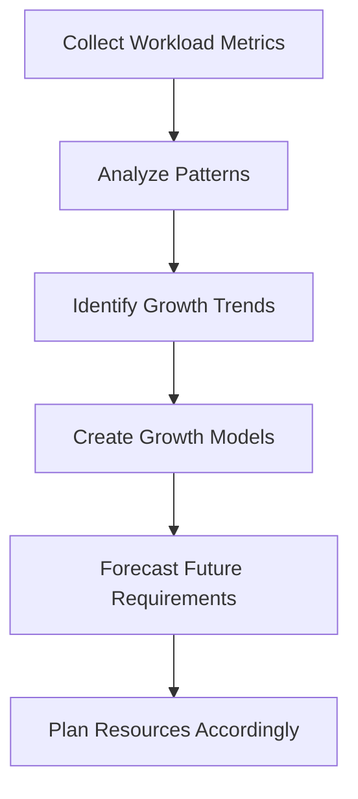

# Capacity Planning

## Introduction

Capacity planning is a critical process in database administration that ensures your database systems have sufficient resources to meet current and future performance requirements. It involves analyzing and forecasting resource needs, monitoring usage patterns, and implementing strategies to optimize database performance as workloads grow.

For beginners in database administration, understanding capacity planning is essential because it helps prevent performance bottlenecks, unplanned downtime, and costly emergency upgrades. This guide will introduce you to the fundamental concepts, methodologies, and best practices of database capacity planning.

## Why Capacity Planning Matters

Imagine you've built a database application that initially serves a small user base. As your application gains popularity, more users start using it, resulting in:

- More concurrent database connections
- Increased query volume
- Larger data volumes
- Higher resource utilization (CPU, memory, disk I/O, network)

Without proper capacity planning, your database might experience:

- Slow query response times
- Timeouts and connection failures
- System crashes under peak loads
- Data loss or corruption in extreme cases

## Key Components of Capacity Planning

### 1. Resource Identification and Monitoring

The first step in capacity planning is identifying the key resources that affect database performance:

- **CPU**: Processing power for query execution
- **Memory**: Buffer pools, query cache, sorting operations
- **Disk I/O**: Read/write operations and throughput
- **Network**: Bandwidth and latency
- **Storage capacity**: Total space needed for data, indexes, logs, and growth

Let's look at how to monitor these resources using SQL commands:

```sql
-- MySQL/MariaDB: Check current connections
SHOW STATUS LIKE 'Threads_connected';

-- PostgreSQL: Check current connections
SELECT count(*) FROM pg_stat_activity;

-- MySQL: Check buffer pool usage
SHOW GLOBAL STATUS LIKE 'Innodb_buffer_pool%';

-- SQL Server: Check CPU usage
SELECT 
    record_time,
    SQLProcessUtilization,
    SystemIdle
FROM (
    SELECT
        record_time,
        record.value('(./Record/@id)[1]', 'int') AS record_id,
        record.value('(./Record/SchedulerMonitorEvent/SystemHealth/SystemIdle)[1]', 'int') AS SystemIdle,
        record.value('(./Record/SchedulerMonitorEvent/SystemHealth/ProcessUtilization)[1]', 'int') AS SQLProcessUtilization
    FROM (
        SELECT
            DATEADD(ms, -1 * (ms_ticks - [timestamp]), GETDATE()) AS record_time,
            CONVERT(xml, record) AS record
        FROM sys.dm_os_ring_buffers
        CROSS JOIN sys.dm_os_sys_info
        WHERE ring_buffer_type = N'RING_BUFFER_SCHEDULER_MONITOR'
    ) AS x
) AS y
ORDER BY record_time DESC;
```

### 2. Workload Analysis and Forecasting

Understanding your current workload and how it might grow is crucial for effective capacity planning:



Workload metrics to track include:

- Query types and frequencies
- Peak vs. average utilization
- Seasonal or time-based patterns
- User growth rate
- Data growth rate

Example of a basic growth forecast calculation:

```sql
-- Projecting data growth based on current trends
WITH historical_growth AS (
    SELECT 
        date_trunc('month', collection_date) AS month,
        MAX(total_space_used_mb) AS space_used_mb
    FROM database_metrics
    GROUP BY date_trunc('month', collection_date)
    ORDER BY month
),
growth_rate AS (
    SELECT
        month,
        space_used_mb,
        LAG(space_used_mb) OVER (ORDER BY month) AS previous_month_size,
        (space_used_mb - LAG(space_used_mb) OVER (ORDER BY month)) / 
            NULLIF(LAG(space_used_mb) OVER (ORDER BY month), 0) * 100 AS growth_percentage
    FROM historical_growth
)
SELECT 
    AVG(growth_percentage) AS avg_monthly_growth_pct,
    space_used_mb * POWER(1 + (AVG(growth_percentage)/100), 12) AS projected_size_in_one_year
FROM growth_rate
WHERE growth_percentage IS NOT NULL AND growth_percentage BETWEEN -50 AND 200; -- Filter outliers
```

### 3. Capacity Planning Strategies

There are several approaches to capacity planning:

#### Scaling Up (Vertical Scaling)

Increasing the resources of your existing server:

- Advantages: Simple, minimal configuration changes
- Disadvantages: Hardware limits, potential downtime during upgrades

Example configuration adjustment for MySQL memory scaling:

```ini
# Before: 2GB buffer pool
innodb_buffer_pool_size = 2G

# After: 8GB buffer pool
innodb_buffer_pool_size = 8G
```

#### Scaling Out (Horizontal Scaling)

Adding more servers to distribute the workload:

- Advantages: Nearly unlimited scaling potential, improved fault tolerance
- Disadvantages: More complex to manage, potential application changes

Example of a read replica configuration in PostgreSQL:

```bash
# On primary server
# Update postgresql.conf
wal_level = replica
max_wal_senders = 10
max_replication_slots = 10

# Create replication user
CREATE ROLE replicator WITH REPLICATION LOGIN PASSWORD 'secure_password';

# Update pg_hba.conf
# Add this line:
host replication replicator 192.168.1.100/32 md5

# On replica server
# Create recovery.conf (or use postgresql.auto.conf in PostgreSQL 12+)
primary_conninfo = 'host=192.168.1.200 port=5432 user=replicator password=secure_password'
```

#### Database Partitioning and Sharding

Dividing large tables or databases into smaller, more manageable pieces:

```sql
-- Example of range partitioning in MySQL
CREATE TABLE orders (
    order_id INT,
    customer_id INT,
    order_date DATE,
    total_amount DECIMAL(10,2),
    PRIMARY KEY(order_id, order_date)
) 
PARTITION BY RANGE (YEAR(order_date)) (
    PARTITION p2020 VALUES LESS THAN (2021),
    PARTITION p2021 VALUES LESS THAN (2022),
    PARTITION p2022 VALUES LESS THAN (2023),
    PARTITION p2023 VALUES LESS THAN (2024),
    PARTITION pOthers VALUES LESS THAN MAXVALUE
);
```

### 4. Performance Testing and Validation

Before implementing capacity changes in production, it's crucial to test them:

#### Load Testing Tools

- pgbench (PostgreSQL)
- sysbench (MySQL/MariaDB)
- JMeter (general purpose)

Example of a basic pgbench test:

```bash
# Initialize the benchmark tables
pgbench -i -s 100 mydb

# Run a 10-minute test with 20 concurrent clients
pgbench -c 20 -T 600 mydb
```

#### Testing Methodology

1. Establish baseline performance metrics
2. Create test scenarios mimicking real workloads
3. Test with current and projected future loads
4. Analyze results and adjust capacity plans

## Real-World Capacity Planning Example

Let's walk through a simplified capacity planning process for an e-commerce database:

### Current State Analysis

```sql
-- Current database size
SELECT pg_size_pretty(pg_database_size('ecommerce_db'));

-- Table sizes
SELECT 
    relname AS table_name,
    pg_size_pretty(pg_total_relation_size(relid)) AS total_size,
    pg_size_pretty(pg_relation_size(relid)) AS data_size,
    pg_size_pretty(pg_total_relation_size(relid) - pg_relation_size(relid)) AS external_size
FROM pg_catalog.pg_statio_user_tables
ORDER BY pg_total_relation_size(relid) DESC;

-- Query performance
SELECT 
    query,
    calls,
    total_time,
    mean_time,
    rows
FROM pg_stat_statements
ORDER BY total_time DESC
LIMIT 10;
```

### Growth Projection

Based on historical data, we determine:
- 15% monthly user growth
- 20% monthly order growth
- 5% monthly growth in product catalog

### Resource Planning

1. **Storage needs**: Current 500GB will grow to approximately 1.2TB in one year
2. **CPU requirements**: Peak utilization currently at 60%, projected to reach capacity in 9 months
3. **Memory**: Buffer hit ratio dropping below 90% during peak hours

### Implementation Plan

1. **Short-term (0-3 months)**:
   - Optimize top 5 most resource-intensive queries
   - Increase buffer pool size from 8GB to 16GB
   - Implement connection pooling

2. **Medium-term (3-6 months)**:
   - Add read replicas for reporting workloads
   - Implement table partitioning for orders and order_items tables
   - Upgrade storage to 2TB

3. **Long-term (6-12 months)**:
   - Evaluate sharding strategy
   - Consider cloud migration for elastic scaling
   - Implement automated scaling based on usage patterns

## Best Practices for Ongoing Capacity Management

1. **Establish monitoring baselines**
   - Set up alerts for when resources exceed 70-80% utilization
   - Track historical trends for better forecasting

2. **Regular performance reviews**
   - Schedule monthly capacity reviews
   - Adjust forecasts based on actual growth

3. **Automate where possible**
   - Use scripts to collect and analyze capacity metrics
   - Implement auto-scaling when feasible

4. **Document everything**
   - Keep records of all capacity changes
   - Document the impact of changes on performance

5. **Plan for the unexpected**
   - Always add a buffer (usually 20-30%) to capacity estimates
   - Have emergency scaling procedures ready

## Summary

Capacity planning is a continuous process that ensures your database can handle both current and future workloads efficiently. By monitoring key resources, analyzing growth patterns, and implementing appropriate scaling strategies, you can avoid performance problems and provide a consistent experience for your users.

Remember these key points:
- Start monitoring early to establish baselines
- Regularly forecast growth based on business metrics
- Test before implementing changes in production
- Consider both short-term and long-term needs
- Document your capacity planning process

## Exercises

1. Set up a monitoring solution for your database and collect baseline metrics for one week.
2. Calculate your database's growth rate based on historical data.
3. Identify the top three resource bottlenecks in your current database setup.
4. Create a capacity plan for the next 12 months, including specific action items.
5. Perform a load test simulating 2x your current peak load and document the results.

## Further Resources

- Database-specific documentation:
  - [MySQL Performance Schema](https://dev.mysql.com/doc/refman/8.0/en/performance-schema.html)
  - [PostgreSQL Monitoring](https://www.postgresql.org/docs/current/monitoring.html)
  - [SQL Server Dynamic Management Views](https://docs.microsoft.com/en-us/sql/relational-databases/system-dynamic-management-views/system-dynamic-management-views)
- Books:
  - "Database Internals" by Alex Petrov
  - "High Performance MySQL" by Baron Schwartz, Peter Zaitsev, and Vadim Tkachenko
- Communities:
  - Database-specific forums and user groups
  - Stack Overflow's database tags