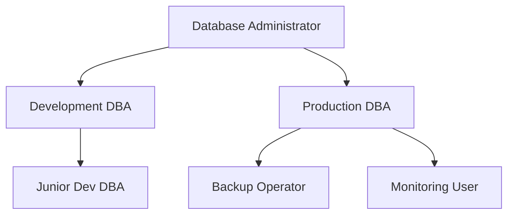
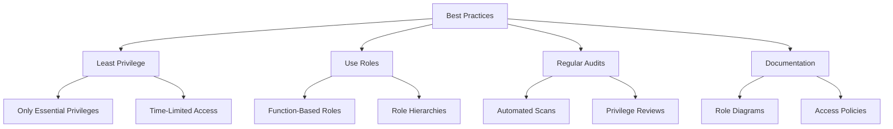

# Privileges and Roles in Database Administration

## Introduction

When managing a database system, one of the most critical aspects is controlling who can access what data and what operations they can perform. This is where **privileges** and **roles** come into play. These concepts form the foundation of database security and are essential for protecting your data from unauthorized access while enabling legitimate users to perform their tasks efficiently.

In this guide, we'll explore:
- What database privileges are and how they work
- How roles simplify privilege management
- How to implement privileges and roles in popular database systems
- Best practices for managing database access control

## Understanding Database Privileges

### What are Privileges?

**Privileges** (sometimes called permissions) are rights granted to users that allow them to perform specific actions on database objects. Think of privileges as the building blocks of database access control.

### Types of Privileges

Database privileges generally fall into several categories:

1. **System Privileges**: Allow users to perform system-level operations
2. **Object Privileges**: Allow users to perform actions on specific database objects
3. **Schema Privileges**: Allow users to create and modify objects within a schema

Here's a table of common database privileges:

| Privilege Type | Description | Examples |
|---------------|-------------|----------|
| Data Manipulation | Allows manipulation of data | SELECT, INSERT, UPDATE, DELETE |
| Data Definition | Allows manipulation of database structures | CREATE, ALTER, DROP, TRUNCATE |
| Transaction Control | Controls transaction behavior | COMMIT, ROLLBACK |
| Administrative | Allows system administration | GRANT, REVOKE, CREATE USER |

### Basic Privilege Operations

The two fundamental operations related to privileges are:

1. **GRANT**: Assigns privileges to users or roles
2. **REVOKE**: Removes privileges from users or roles

Let's look at some examples:

```sql
-- Grant SELECT privilege on the employees table to user 'analyst'
GRANT SELECT ON employees TO analyst;

-- Grant multiple privileges
GRANT SELECT, INSERT, UPDATE ON customers TO sales_team;

-- Revoke a privilege
REVOKE DELETE ON customers FROM temp_user;
```

### The WITH GRANT OPTION

When granting privileges, you can specify `WITH GRANT OPTION`, which allows the recipient to grant the same privilege to others:

```sql
GRANT SELECT ON financial_data TO finance_manager WITH GRANT OPTION;
```

This can be both powerful and dangerous, as it creates a chain of privilege grants that can be difficult to track.

## Understanding Roles

### What are Roles?

**Roles** are collections of privileges that can be assigned to users. Instead of managing individual privileges for each user, administrators can create roles that represent job functions, assign privileges to these roles, and then assign users to the appropriate roles.

### Benefits of Using Roles

Roles offer several advantages:

1. **Simplified Management**: Assign or revoke multiple privileges in a single operation
2. **Standardization**: Ensure users with the same job function have consistent access
3. **Reduced Administrative Overhead**: Update privileges for many users by modifying a role
4. **Better Security**: Easier to audit and enforce least privilege principles

### Role Hierarchy

Many database systems support role hierarchies, where one role can inherit privileges from another:



## Implementing Privileges and Roles in Popular Database Systems

Let's explore how to implement privileges and roles in common database systems.

### MySQL/MariaDB

#### Creating Roles and Assigning Privileges

```sql
-- Create a new role
CREATE ROLE 'app_read_role';

-- Grant privileges to the role
GRANT SELECT ON app_db.* TO 'app_read_role';

-- Create a user
CREATE USER 'app_user'@'localhost' IDENTIFIED BY 'password';

-- Assign the role to the user
GRANT 'app_read_role' TO 'app_user'@'localhost';

-- User needs to activate the role when connecting
SET DEFAULT ROLE 'app_read_role' TO 'app_user'@'localhost';
```

#### Viewing Granted Privileges

```sql
-- View privileges for a user
SHOW GRANTS FOR 'app_user'@'localhost';

-- View privileges for a role
SHOW GRANTS FOR 'app_read_role';
```

### PostgreSQL

#### Creating Roles with Privileges

```sql
-- Create a role
CREATE ROLE read_only;

-- Grant privileges to the role
GRANT CONNECT ON DATABASE company_db TO read_only;
GRANT USAGE ON SCHEMA public TO read_only;
GRANT SELECT ON ALL TABLES IN SCHEMA public TO read_only;

-- Create a user and assign the role
CREATE USER analyst WITH PASSWORD 'secure_password';
GRANT read_only TO analyst;
```

#### Role Inheritance

PostgreSQL supports role inheritance:

```sql
-- Create a parent role
CREATE ROLE employee;
GRANT CONNECT ON DATABASE company_db TO employee;

-- Create roles that inherit from employee
CREATE ROLE marketing INHERIT;
GRANT employee TO marketing;
GRANT SELECT ON marketing_tables TO marketing;

CREATE ROLE finance INHERIT;
GRANT employee TO finance;
GRANT SELECT ON financial_tables TO finance;
```

### Oracle Database

#### Creating Roles and Privileges

```sql
-- Create a role
CREATE ROLE app_user_role;

-- Grant privileges to the role
GRANT CREATE SESSION TO app_user_role;
GRANT SELECT ON hr.employees TO app_user_role;
GRANT SELECT ON hr.departments TO app_user_role;

-- Create a user
CREATE USER app_user IDENTIFIED BY secure_password;

-- Assign the role to the user
GRANT app_user_role TO app_user;
```

#### System vs. Object Privileges

Oracle distinguishes between system privileges and object privileges:

```sql
-- System privilege example
GRANT CREATE TABLE TO developer_role;

-- Object privilege example
GRANT SELECT, INSERT ON hr.employees TO hr_role;
```

### Microsoft SQL Server

#### Creating Roles and Assigning Permissions

```sql
-- Create a database role
USE CompanyDB;
CREATE ROLE SalesRole;

-- Grant permissions to the role
GRANT SELECT ON SCHEMA::Sales TO SalesRole;
GRANT INSERT, UPDATE ON Sales.Customers TO SalesRole;

-- Create a user
CREATE LOGIN SalesUser WITH PASSWORD = 'secure_password';
CREATE USER SalesUser FOR LOGIN SalesUser;

-- Add user to role
ALTER ROLE SalesRole ADD MEMBER SalesUser;
```

## Practical Scenarios and Best Practices

### Scenario 1: Setting Up a Read-Only Reporting User

Let's say you need to create an account for a business analyst who needs to run reports but should not modify data:

```sql
-- PostgreSQL example
CREATE ROLE reporting_role;
GRANT CONNECT ON DATABASE business_db TO reporting_role;
GRANT USAGE ON SCHEMA public TO reporting_role;
GRANT SELECT ON ALL TABLES IN SCHEMA public TO reporting_role;
-- Grant future select permissions on new tables
ALTER DEFAULT PRIVILEGES IN SCHEMA public GRANT SELECT ON TABLES TO reporting_role;

CREATE USER business_analyst WITH PASSWORD 'secure_password';
GRANT reporting_role TO business_analyst;
```

### Scenario 2: Application with Different Access Levels

For a web application with different user roles:

```sql
-- MySQL example
CREATE ROLE 'app_admin_role';
GRANT ALL PRIVILEGES ON app_db.* TO 'app_admin_role';

CREATE ROLE 'app_editor_role';
GRANT SELECT, INSERT, UPDATE ON app_db.* TO 'app_editor_role';
REVOKE INSERT, UPDATE ON app_db.user_logs FROM 'app_editor_role';

CREATE ROLE 'app_viewer_role';
GRANT SELECT ON app_db.* TO 'app_viewer_role';
REVOKE SELECT ON app_db.sensitive_data FROM 'app_viewer_role';

-- Create application database user
CREATE USER 'app_service'@'%' IDENTIFIED BY 'secure_password';
GRANT 'app_admin_role', 'app_editor_role', 'app_viewer_role' TO 'app_service'@'%';
```

The application code would then set the appropriate role based on the user's access level:

```sql
-- When an admin logs in
SET ROLE 'app_admin_role';

-- When an editor logs in
SET ROLE 'app_editor_role';

-- When a viewer logs in
SET ROLE 'app_viewer_role';
```

### Best Practices for Privilege and Role Management

1. **Follow the Principle of Least Privilege**
   - Grant only the privileges users need to perform their jobs
   - Regularly review and remove unnecessary privileges

2. **Use Roles for Privilege Management**
   - Group privileges into roles based on job functions
   - Assign users to roles rather than granting individual privileges

3. **Implement Role Hierarchies Thoughtfully**
   - Keep the hierarchy simple and understandable
   - Document the purpose and scope of each role

4. **Regularly Audit Privileges**
   - Periodically review privilege assignments
   - Use database tools to identify excessive privileges

5. **Manage Administrative Privileges Carefully**
   - Limit the number of users with administrative privileges
   - Consider using separate accounts for administrative tasks

6. **Implement Password Policies**
   - Enforce strong password requirements
   - Implement password rotation policies for sensitive roles

7. **Document Your Security Model**
   - Maintain documentation of your roles and their privileges
   - Include diagrams of role hierarchies



## Common Privilege and Role Management Mistakes

1. **Overgranting Privileges**
   - Granting more access than necessary
   - Using wildcard grants excessively

2. **Neglecting to Revoke Temporary Access**
   - Forgetting to remove temporary privileges
   - Not tracking temporary access grants

3. **Insufficient Testing After Changes**
   - Not verifying that privilege changes work as expected
   - Breaking application functionality with overly restrictive privileges

4. **Using Shared Accounts**
   - Multiple users sharing login credentials
   - Inability to track individual actions

5. **Neglecting Role Maintenance**
   - Allowing "privilege creep" over time
   - Not reviewing and updating role definitions

## Summary

Privileges and roles form the foundation of database security by controlling what actions users can perform on what data. By implementing a well-designed privilege and role system, you can:

- Secure your data from unauthorized access
- Simplify user management with role-based access control
- Meet compliance requirements for data security
- Ensure users have the access they need—but only the access they need

Remember that database security is an ongoing process. Regularly review your privilege and role assignments to ensure they remain appropriate as your organization, applications, and data evolve.

## Further Learning

To deepen your understanding of database privileges and roles, consider exploring:

1. **Advanced Topics**
   - Row-level security
   - Column-level privileges
   - Dynamic data masking

2. **Database-Specific Security Features**
   - Oracle Virtual Private Database (VPD)
   - PostgreSQL Row Security Policies
   - SQL Server Data Security Features

3. **Exercises**
   - Design a role hierarchy for a typical e-commerce application
   - Create a set of roles for a multi-tenant SaaS application
   - Implement a privilege audit system for your database

By mastering privileges and roles, you'll take a significant step toward becoming a proficient database administrator and ensuring your data remains secure and accessible to those who need it.