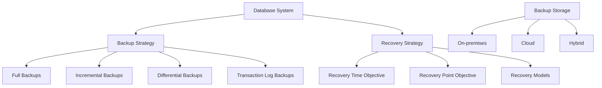
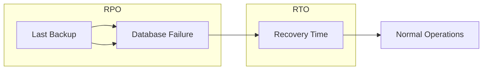

# Backup and Recovery

## Introduction

Database backup and recovery are critical aspects of database administration that ensure data protection, business continuity, and compliance with data retention policies. No matter how reliable your hardware or how robust your software design, unforeseen issues can occur—ranging from hardware failures and software bugs to natural disasters and human errors.

In this guide, we'll explore the fundamentals of database backup and recovery, covering various strategies, techniques, and best practices that will help you protect your valuable data and minimize downtime in case of data loss incidents.

## Why Backup and Recovery Matter

Before diving into the technical details, let's understand why backup and recovery are crucial:

1. **Data Protection**: Prevents permanent loss of critical business information
2. **Business Continuity**: Minimizes downtime and ensures operations can resume quickly
3. **Regulatory Compliance**: Helps meet legal requirements for data retention and protection
4. **Disaster Recovery**: Provides a safety net against catastrophic events
5. **Migration Support**: Facilitates database migrations and upgrades

<br />

Let's visualize the key components of a backup and recovery strategy:



## Types of Database Backups

### Full Backup

A full backup is a complete copy of the entire database at a specific point in time.

**Advantages:**
- Contains all database objects and data
- Simplest to restore from
- Standalone (doesn't depend on other backups)

**Disadvantages:**
- Requires more storage space
- Takes longer to complete
- Higher network load during backup

#### Example (MySQL):

```sql
-- Full backup using mysqldump
mysqldump -u username -p --all-databases > full_backup_2025-03-18.sql

-- Output:
-- Various progress messages showing tables being dumped
-- Backup file will contain SQL statements to recreate the database
```

### Incremental Backup

An incremental backup only stores the changes made since the last backup (full or incremental).

**Advantages:**
- Faster backup process
- Requires less storage space
- Reduces network load

**Disadvantages:**
- More complex restore process
- Depends on previous backups
- Longer restore time

#### Example (PostgreSQL):

```bash
# Set up WAL archiving in postgresql.conf
wal_level = replica
archive_mode = on
archive_command = 'cp %p /archive/%f'

# Take a base backup
pg_basebackup -D /backup/base -Ft -z -P

# Output:
# 24504/24504 kB (100%), 1/1 tablespace
# Base backup completed successfully
```

### Differential Backup

A differential backup captures all changes made since the last full backup.

**Advantages:**
- Faster than full backups
- Simpler restore process than incremental backups
- Requires fewer backups for restoration

**Disadvantages:**
- Larger than incremental backups
- Slower than incremental backups
- Still depends on the full backup

### Transaction Log Backup

Transaction log backups record all the transactions that have occurred since the last log backup, capturing the exact sequence of changes.

**Advantages:**
- Enables point-in-time recovery
- Minimizes data loss
- Supports continuous backup

**Disadvantages:**
- Only useful with the associated full/differential backups
- More complex to manage
- Can consume significant storage for busy databases

#### Example (SQL Server):

```sql
-- Back up the transaction log for the AdventureWorks database
BACKUP LOG AdventureWorks 
TO DISK = 'C:\Backups\AdventureWorks_Log.trn'
WITH DESCRIPTION = 'Transaction log backup for AdventureWorks';

-- Output:
-- Processed 253 pages for database 'AdventureWorks', file 'AdventureWorks_log' on file 1.
-- BACKUP LOG successfully processed 253 pages in 0.123 seconds (16.932 MB/sec).
```

## Recovery Models and Strategies

### Recovery Time Objective (RTO)

RTO represents the maximum acceptable time required to restore normal operations after a failure. It answers the question: "How quickly must we recover?"

### Recovery Point Objective (RPO)

RPO defines the maximum acceptable amount of data loss measured in time. It answers the question: "How much data can we afford to lose?"

Let's visualize these concepts:



### Common Recovery Models

#### Simple Recovery Model

- Minimal logging
- No point-in-time recovery
- Automatically reclaims log space
- Good for development environments

#### Full Recovery Model

- Complete transaction logging
- Point-in-time recovery possible
- Requires log backups to manage log size
- Ideal for production environments

#### Bulk-Logged Recovery Model

- Minimal logging for bulk operations
- Point-in-time recovery with limitations
- Compromise between performance and recoverability

## Implementing a Backup Strategy

### Step 1: Assess Requirements

Start by evaluating your organization's needs:

1. How critical is the data?
2. What's the acceptable downtime?
3. How much data loss can be tolerated?
4. What are the regulatory requirements?

### Step 2: Choose Backup Types and Frequency

Based on your assessment, determine an appropriate backup schedule:

```javascript
// Example backup schedule for a medium-sized business application
const backupSchedule = {
  fullBackup: 'Weekly (Sunday at 1:00 AM)',
  differentialBackup: 'Daily (at 1:00 AM Monday-Saturday)',
  transactionLogBackup: 'Every 15 minutes during business hours',
  verificationProcess: 'Weekly after full backup'
};
```

### Step 3: Implement Automation

Set up automated backup processes to ensure consistency and reliability.

#### Example (PostgreSQL with cron):

```bash
# Add to crontab
# Full backup every Sunday at 1 AM
0 1 * * 0 /usr/local/bin/pg_dump -U postgres -F c -f /backup/full_$(date +\%Y\%m\%d).dump mydatabase

# Transaction log archiving (continuous)
*/15 * * * * /usr/local/bin/pg_archivecleanup /archive/ $(psql -U postgres -c "SELECT pg_walfile_name(pg_current_wal_lsn())" -t -A)
```

### Step 4: Set Up Secure Storage

Store backups in multiple secure locations:

1. **On-premises storage**
2. **Off-site storage**
3. **Cloud storage**

#### Example (Using AWS S3 for off-site storage):

```bash
# Script to upload MySQL backup to S3
#!/bin/bash

# Create backup
mysqldump -u root -pPassword123 --all-databases > /tmp/full_backup_$(date +%Y%m%d).sql

# Compress backup
gzip /tmp/full_backup_$(date +%Y%m%d).sql

# Upload to S3
aws s3 cp /tmp/full_backup_$(date +%Y%m%d).sql.gz s3://my-database-backups/

# Clean up local file
rm /tmp/full_backup_$(date +%Y%m%d).sql.gz

# Output:
# Upload completed: /tmp/full_backup_20250318.sql.gz to s3://my-database-backups/full_backup_20250318.sql.gz
```

### Step 5: Regular Testing

Regularly test your backup and recovery procedures to ensure they work as expected.

```sql
-- Example test restore script (MySQL)
-- Create test database
CREATE DATABASE test_restore;

-- Restore backup to test database
mysql -u root -pPassword123 test_restore < full_backup_2025-03-18.sql

-- Verify data integrity
SELECT COUNT(*) FROM test_restore.customers;
-- Compare with expected count
-- Output: 10573
```

## Recovery Procedures

### Basic Recovery Process

1. **Assess the situation**: Determine the cause and extent of data loss
2. **Select the appropriate backups**: Identify which backups you need
3. **Restore the database**: Apply backups in the correct order
4. **Verify the recovery**: Ensure data integrity and completeness
5. **Resume normal operation**: Bring the system back online

### Point-in-Time Recovery Example (PostgreSQL)

```bash
# 1. Restore the base backup
tar xzf base_backup.tar.gz -C /var/lib/postgresql/14/main/

# 2. Create recovery.conf
echo "restore_command = 'cp /archive/%f %p'" > /var/lib/postgresql/14/main/recovery.conf
echo "recovery_target_time = '2025-03-18 15:30:00'" >> /var/lib/postgresql/14/main/recovery.conf

# 3. Start the server
pg_ctl start

# Output:
# server starting
# LOG:  starting archive recovery
# LOG:  restored log file "000000010000000000000001" from archive
# ...
# LOG:  recovery stopping at 2025-03-18 15:30:00
# LOG:  database system is ready to accept connections
```

### Database Corruption Recovery

When dealing with database corruption, you may need specialized approaches:

```sql
-- SQL Server database consistency check
DBCC CHECKDB (AdventureWorks) WITH NO_INFOMSGS;

-- Output (if corruption is found):
-- Msg 8939, Level 16, State 98, Line 1
-- Table error: Object ID 1977058079, index ID 1, partition ID 72057594038321152...

-- Repair option (use with caution)
DBCC CHECKDB (AdventureWorks, REPAIR_ALLOW_DATA_LOSS) WITH NO_INFOMSGS;
```

## Best Practices

1. **Follow the 3-2-1 rule**: Maintain at least 3 copies of data on 2 different media with 1 copy off-site
2. **Encrypt backups**: Protect sensitive data in backups
3. **Document procedures**: Create comprehensive documentation
4. **Automate where possible**: Reduce human error through automation
5. **Test regularly**: Verify that your backups are usable
6. **Monitor backup jobs**: Set up alerts for backup failures
7. **Maintain backup history**: Keep records of all backup and restore operations

## Real-World Scenario: E-commerce Database Recovery

Let's walk through a practical scenario for an e-commerce database that experienced a hardware failure:

1. **Situation**: The primary storage array failed at 2:30 PM, corrupting the active database
2. **Recovery Goal**: Restore to the most recent state possible with minimal data loss
3. **Available Backups**:
   - Full backup from midnight
   - Transaction logs backed up every 15 minutes until 2:15 PM

### Recovery Process:

```bash
# 1. Restore the full backup
mysql -u admin -p ecommerce < ecommerce_full_00-00.sql

# 2. Apply transaction log backups in sequence
for backup in $(ls -v ecommerce_log_*.sql); do
  mysql -u admin -p ecommerce < $backup
done

# 3. Verify critical tables
mysql -u admin -p -e "SELECT COUNT(*) FROM ecommerce.orders WHERE order_date >= CURDATE();"

# Output: 
# +----------+
# | COUNT(*) |
# +----------+
# | 342      |
# +----------+
```

After recovery, the system was restored to the 2:15 PM state, losing only 15 minutes of transactions.

## Summary

Database backup and recovery are fundamental components of a robust data management strategy. By implementing appropriate backup types, establishing clear recovery objectives, and following best practices, you can significantly reduce the risk of data loss and minimize downtime during recovery operations.

Remember these key points:

- Choose backup strategies based on your RTO and RPO requirements
- Implement a mix of full, differential, and log backups as appropriate
- Store backups securely in multiple locations
- Test your recovery procedures regularly
- Document all processes and keep them updated

## Exercises

1. Set up a weekly full backup and daily differential backup for a PostgreSQL database.
2. Create a script to verify the integrity of MySQL backups by restoring them to a test environment.
3. Design a backup strategy for a mission-critical database with an RPO of 5 minutes and an RTO of 1 hour.
4. Simulate a database failure and perform a point-in-time recovery using transaction logs.
5. Document a complete backup and recovery procedure for your organization's most important database.

## Additional Resources

- Database vendor documentation:
  - [MySQL Backup and Recovery](https://dev.mysql.com/doc/refman/8.0/en/backup-and-recovery.html)
  - [PostgreSQL Backup and Restore](https://www.postgresql.org/docs/current/backup.html)
  - [SQL Server Backup and Restore](https://docs.microsoft.com/en-us/sql/relational-databases/backup-restore/backup-and-restore-of-sql-server-databases)
  - [Oracle Backup and Recovery](https://docs.oracle.com/en/database/oracle/oracle-database/19/bradv/introduction-backup-recovery.html)
- Books:
  - "Database Backup and Recovery Best Practices" by Oracle Press
  - "High Availability MySQL Cookbook" by Packt Publishing