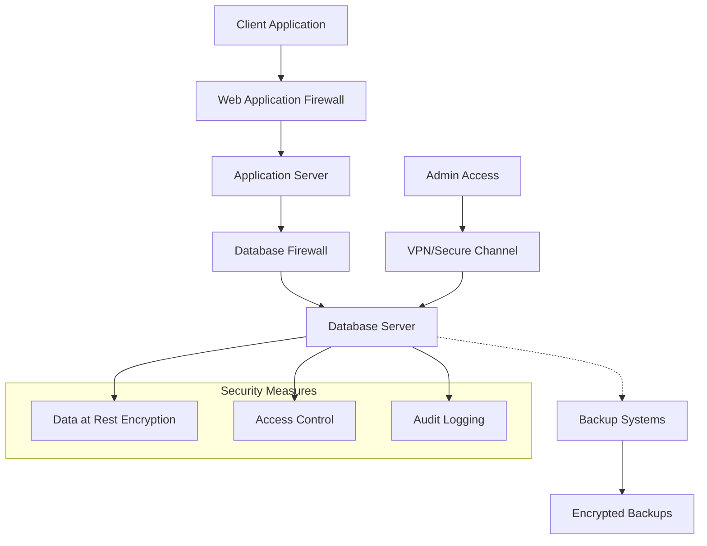

# Database Security

## Introduction

Database security refers to the collective measures used to protect a database from unauthorized access, malicious attacks, and accidental or intentional breaches. As databases often store sensitive information ranging from personal user details to business-critical data, implementing proper security measures is crucial for any organization.

In this guide, we'll explore the fundamental concepts of database security, common vulnerabilities, and practical approaches to safeguard your data. Whether you're setting up a small project database or managing enterprise-level data systems, these principles will help you establish a solid security foundation.

## Why Database Security Matters

Data breaches can have severe consequences:

- Loss of sensitive customer information
- Financial losses and legal liabilities
- Damage to company reputation
- Compliance violations with regulations like GDPR, HIPAA, etc.

Let's examine how to protect your database systems effectively.

## Core Database Security Concepts

### Authentication and Authorization

#### Authentication

Authentication verifies the identity of users attempting to access the database.

```sql
-- Example: Creating a user with authentication
CREATE USER 'appuser'@'localhost' IDENTIFIED BY 'strong_password';
```

Best practices for authentication:
- Implement strong password policies
- Use multi-factor authentication when possible
- Avoid default or shared accounts
- Regularly audit user accounts

#### Authorization

Authorization determines what authenticated users can do within the database.

```sql
-- Example: Granting specific permissions to a user
GRANT SELECT, INSERT ON database_name.table_name TO 'appuser'@'localhost';

-- Restricting to only allow SELECT on specific columns
GRANT SELECT (column1, column2) ON database_name.table_name TO 'appuser'@'localhost';
```

Best practices for authorization:
- Follow the principle of least privilege
- Use role-based access control
- Regularly review and update permissions
- Revoke unused privileges

### Data Encryption

Database encryption protects data from unauthorized viewing, even if someone gains access to the physical storage.

#### Encryption Types

1. **Data-at-rest encryption**: Protects stored data

```sql
-- Example: Creating a table with encrypted columns in MySQL
CREATE TABLE sensitive_data (
    id INT PRIMARY KEY,
    username VARCHAR(50),
    credit_card VARCHAR(255) ENCRYPTED
);
```

2. **Data-in-transit encryption**: Protects data moving between systems

```bash
# Example: Configuring SSL for PostgreSQL in postgresql.conf
ssl = on
ssl_cert_file = 'server.crt'
ssl_key_file = 'server.key'
```

3. **Column-level encryption**: Encrypts specific sensitive columns

```javascript
// Example: Encrypting data before storing (Node.js with crypto)
const crypto = require('crypto');
const algorithm = 'aes-256-cbc';
const key = crypto.randomBytes(32);
const iv = crypto.randomBytes(16);

function encrypt(text) {
  const cipher = crypto.createCipheriv(algorithm, Buffer.from(key), iv);
  let encrypted = cipher.update(text);
  encrypted = Buffer.concat([encrypted, cipher.final()]);
  return { iv: iv.toString('hex'), encryptedData: encrypted.toString('hex') };
}

// Storing encrypted credit card data
const encryptedCCData = encrypt('1234-5678-9012-3456');
// Store encryptedCCData in database
```

### Input Validation and Prepared Statements

One of the most common database attacks is SQL injection, where malicious SQL code is inserted into input fields.

#### SQL Injection Example

Vulnerable code:

```javascript
// DON'T DO THIS - Vulnerable to SQL injection
const username = request.body.username;
const query = `SELECT * FROM users WHERE username = '${username}'`;
db.execute(query);
```

If a user inputs: `admin' OR '1'='1`, the resulting query would be:

```sql
SELECT * FROM users WHERE username = 'admin' OR '1'='1'
```

This would return all users, bypassing authentication.

#### Prepared Statements Solution

```javascript
// DO THIS - Using prepared statements in Node.js
const username = request.body.username;
const query = "SELECT * FROM users WHERE username = ?";
db.execute(query, [username]);
```

```python
# Using prepared statements in Python
cursor = connection.cursor()
username = request.form['username']
cursor.execute("SELECT * FROM users WHERE username = %s", (username,))
```

### Auditing and Monitoring

Maintaining a record of database activities helps detect suspicious behavior.

```sql
-- Example: Enabling audit logging in MySQL
SET GLOBAL general_log = 'ON';
SET GLOBAL general_log_file = '/var/log/mysql/mysql_audit.log';
```

Key auditing practices:
- Log access attempts (successful and failed)
- Track schema changes
- Monitor for unusual query patterns
- Implement automated alerts for suspicious activities

## Database Security Architecture

Let's visualize a comprehensive database security architecture:



## Common Database Vulnerabilities and Solutions

### 1. Excessive Privileges

**Problem**: Users have more access rights than needed for their role.

**Solution**:
```sql
-- Instead of granting ALL privileges
-- GRANT ALL PRIVILEGES ON database.* TO 'user'@'localhost';

-- Grant only specific privileges needed
GRANT SELECT, INSERT ON database.customers TO 'sales_app'@'localhost';
GRANT SELECT ON database.products TO 'sales_app'@'localhost';
```

### 2. Unpatched Database Software

**Problem**: Outdated database systems with known vulnerabilities.

**Solution**:
- Establish a regular patching schedule
- Test patches in non-production environments first
- Maintain an inventory of all database instances and versions

### 3. Default Configurations

**Problem**: Default settings often prioritize convenience over security.

**Solution**:
```sql
-- Change default ports (e.g., MySQL from 3306 to custom)
-- In my.cnf or my.ini:
-- port=3307

-- Disable unnecessary features
-- In my.cnf or my.ini:
-- skip-networking   # Disables TCP/IP connections
```

### 4. Backup Insecurity

**Problem**: Backups contain the same sensitive data as the original database.

**Solution**:
```bash
# Example: Encrypting a MySQL backup
mysqldump -u username -p database_name | gpg -c > database_backup.sql.gpg

# Decrypting for restoration
gpg -d database_backup.sql.gpg | mysql -u username -p database_name
```

## Practical Security Implementation Examples

### Setting Up a Secure Database User

```sql
-- Create a database for the application
CREATE DATABASE secure_app_db;

-- Create application user with strong password
CREATE USER 'app_user'@'192.168.1.%' IDENTIFIED BY 'complex!P@ssw0rd';

-- Grant only necessary privileges
GRANT SELECT, INSERT, UPDATE, DELETE ON secure_app_db.* TO 'app_user'@'192.168.1.%';

-- Don't grant administrative privileges
-- REVOKE SUPER, FILE, PROCESS ON *.* FROM 'app_user'@'192.168.1.%';

-- Force user to connect using SSL
REQUIRE SSL;

-- Apply changes
FLUSH PRIVILEGES;
```

### Implementing Row-Level Security in PostgreSQL

```sql
-- Create a table
CREATE TABLE customer_data (
    id SERIAL PRIMARY KEY,
    customer_id INT NOT NULL,
    data TEXT NOT NULL
);

-- Enable Row-Level Security
ALTER TABLE customer_data ENABLE ROW LEVEL SECURITY;

-- Create policy that users can only see their own data
CREATE POLICY customer_data_policy ON customer_data
    USING (customer_id = current_setting('app.current_customer_id')::INTEGER);

-- In application code, set the current customer context:
-- Before executing queries:
-- SET app.current_customer_id = '123';
```

### Data Masking for Development Environments

```sql
-- Create a view that masks sensitive data
CREATE VIEW masked_customers AS
SELECT 
    id,
    CONCAT(SUBSTRING(first_name, 1, 1), '****') AS first_name,
    CONCAT(SUBSTRING(last_name, 1, 1), '****') AS last_name,
    CONCAT('***-***-', RIGHT(phone, 4)) AS phone,
    CONCAT(SUBSTRING(email, 1, 2), '****', '@', SUBSTRING_INDEX(email, '@', -1)) AS email,
    city,
    state
FROM customers;

-- Grant developers access to the view instead of the base table
GRANT SELECT ON masked_customers TO 'dev_team';
REVOKE SELECT ON customers FROM 'dev_team';
```

## Best Practices Checklist

✅ Implement strong authentication and authorization controls<br />
✅ Use encryption for sensitive data (at rest and in transit)<br />
✅ Always use prepared statements for database queries<br />
✅ Apply the principle of least privilege<br />
✅ Keep database software and patches up to date<br />
✅ Implement comprehensive audit logging<br />
✅ Secure database backups<br />
✅ Regular security testing (penetration testing, vulnerability scanning)<br />
✅ Develop and test a database recovery plan<br />
✅ Implement database firewalls or web application firewalls<br />

## Summary

Database security is not a one-time setup but an ongoing process that requires vigilance and regular updates. By implementing the principles and practices covered in this guide, you can significantly reduce the risk of data breaches and unauthorized access.

Remember that security is a layered approach—no single measure provides complete protection. Combining various security controls creates a robust defense system that addresses different types of threats and vulnerabilities.

## Additional Resources and Exercises

### Exercises

1. **Security Audit**: Perform a security audit on a sample database and identify potential vulnerabilities.
2. **SQL Injection Prevention**: Practice converting vulnerable queries to prepared statements.
3. **Permission Mapping**: Create a mapping of user roles to required database permissions following the principle of least privilege.
4. **Encryption Implementation**: Implement column-level encryption for sensitive data in a test database.

### Further Learning

- Database-specific security documentation (MySQL, PostgreSQL, SQL Server, etc.)
- OWASP Database Security Cheat Sheet
- Data protection regulations (GDPR, HIPAA, etc.)
- Books on database security and secure application development