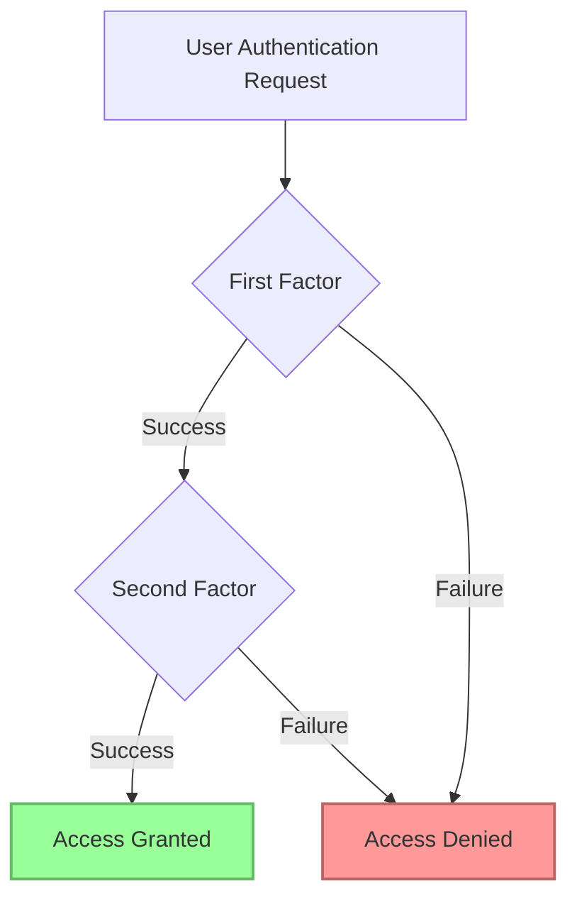

# Authentication Methods in Database Administration

## Introduction

Authentication is a critical aspect of database security that verifies the identity of users, applications, or systems attempting to access a database. Proper authentication mechanisms ensure that only authorized entities can interact with your database, protecting sensitive information from unauthorized access.

In this guide, we'll explore various authentication methods used in modern database systems, their advantages and limitations, and how to implement them effectively.

## Why Authentication Matters

Before diving into specific methods, let's understand why authentication is crucial for database administration:

- **Data Protection**: Prevents unauthorized access to sensitive information
- **Compliance**: Helps meet regulatory requirements like GDPR, HIPAA, or SOX
- **Accountability**: Allows tracking of who accessed what and when
- **System Integrity**: Protects against malicious modifications to database structures

## Common Authentication Methods

### 1. Password Authentication

Password-based authentication is the most common method where users provide a username and password to verify their identity.

#### Implementation Example (PostgreSQL):

```sql
-- Creating a new user with password authentication
CREATE USER app_user WITH PASSWORD 'secure_password123';

-- Granting specific privileges
GRANT SELECT, INSERT ON app_data TO app_user;
```

#### Advantages and Limitations:

✅ **Advantages**:
- Simple to implement and understand
- Universal support across all database systems
- Familiar to users

❌ **Limitations**:
- Vulnerable to brute force attacks
- Password management challenges (sharing, rotation, complexity)
- Susceptible to phishing and social engineering

#### Best Practices:

- Enforce strong password policies (complexity, expiration)
- Store passwords securely using hashing algorithms
- Implement account lockout after multiple failed attempts
- Consider multi-factor authentication for additional security

### 2. Certificate-Based Authentication

Certificate-based authentication uses digital certificates to verify user identities, often leveraging public key infrastructure (PKI).

#### Implementation Example (MySQL):

```sql
-- Configuring MySQL to use SSL/TLS certificates
-- In my.cnf:
-- ssl-ca=/path/to/ca.pem
-- ssl-cert=/path/to/server-cert.pem
-- ssl-key=/path/to/server-key.pem

-- Creating a user that requires SSL with a specific certificate
CREATE USER 'secure_user'@'%' 
IDENTIFIED BY 'password' 
REQUIRE SUBJECT '/CN=client.example.com/O=Example Inc/C=US';

-- Requiring SSL connection without specific certificate
CREATE USER 'ssl_user'@'%' 
IDENTIFIED BY 'password' 
REQUIRE SSL;
```

#### Advantages and Limitations:

✅ **Advantages**:
- Stronger security than passwords alone
- Difficult to forge or compromise
- Can be integrated with enterprise PKI systems

❌ **Limitations**:
- More complex to set up and maintain
- Certificate management overhead
- Requires proper certificate validation

### 3. Role-Based Access Control (RBAC)

RBAC assigns permissions to roles rather than individual users, with users then assigned to appropriate roles.

#### Implementation Example (Oracle):

```sql
-- Creating roles
CREATE ROLE read_only;
CREATE ROLE data_analyst;
CREATE ROLE db_admin;

-- Assigning privileges to roles
GRANT SELECT ON schema.* TO read_only;
GRANT SELECT, INSERT, UPDATE ON schema.* TO data_analyst;
GRANT ALL PRIVILEGES ON schema.* TO db_admin;

-- Assigning roles to users
GRANT read_only TO user1;
GRANT data_analyst TO user2;
GRANT db_admin TO user3;
```

#### Advantages and Limitations:

✅ **Advantages**:
- Simplifies permission management
- Enforces principle of least privilege
- Easier to audit and maintain

❌ **Limitations**:
- Requires careful role design
- Role explosion can occur in complex environments
- Not an authentication method by itself (usually combined with others)

### 4. Kerberos Authentication

Kerberos provides secure authentication using a ticket-based system and symmetric key cryptography.

#### Implementation Example (SQL Server):

```sql
-- Configure SQL Server for Kerberos (Windows Authentication)
-- This is primarily done through Windows and Active Directory

-- Creating a login that uses Windows Authentication
CREATE LOGIN [DOMAIN\user] FROM WINDOWS;

-- Adding the login to a database role
CREATE USER [DOMAIN\user] FOR LOGIN [DOMAIN\user];
ALTER ROLE db_datareader ADD MEMBER [DOMAIN\user];
```

#### Advantages and Limitations:

✅ **Advantages**:
- Single sign-on capability
- Strong security with mutual authentication
- No password transmission over the network

❌ **Limitations**:
- Complex to set up and troubleshoot
- Primarily used in Windows/Active Directory environments
- Time synchronization dependencies

### 5. LDAP Authentication

Lightweight Directory Access Protocol (LDAP) allows database systems to authenticate against a centralized directory service.

#### Implementation Example (PostgreSQL):

```sql
-- In pg_hba.conf:
# TYPE  DATABASE        USER            ADDRESS                 METHOD
host    all             all             0.0.0.0/0               ldap ldapserver=ldap.example.com ldapprefix="uid=" ldapsuffix=",ou=people,dc=example,dc=com"

-- Restart PostgreSQL after configuration
```

#### Advantages and Limitations:

✅ **Advantages**:
- Centralized user management
- Integration with existing directory services
- Consistent authentication across multiple systems

❌ **Limitations**:
- Dependency on external directory service
- Additional configuration complexity
- Potential single point of failure

## Multi-Factor Authentication (MFA)

Multi-factor authentication combines two or more authentication methods for enhanced security.

### Implementation Approaches



#### Common MFA Combinations:

1. **Password + One-Time Password (OTP)**
   - User enters password
   - System sends code via SMS or email
   - User enters the code to complete authentication

2. **Password + Hardware Token**
   - User enters password
   - User provides token-generated code or connects physical device

3. **Certificate + Biometric**
   - System verifies digital certificate
   - User provides fingerprint or face scan

#### Example Implementation (PostgreSQL with SCRAM + OTP):

```sql
-- Enable SCRAM authentication
CREATE USER mfa_user WITH PASSWORD 'primary_password' VALID UNTIL 'infinity';

-- In application code, implement additional verification layer
-- Pseudocode:
function authenticateUser(username, password, otp) {
  // First factor: Database password authentication
  if (dbAuthenticate(username, password)) {
    // Second factor: Verify OTP
    if (verifyOTP(username, otp)) {
      return ACCESS_GRANTED;
    }
  }
  return ACCESS_DENIED;
}
```

## Real-World Authentication Scenarios

### Case Study 1: E-commerce Database

An e-commerce platform might implement:
- Password authentication with strong policies for customer accounts
- Certificate-based authentication for payment processing systems
- Role-based access for internal staff with different responsibilities
- Multi-factor authentication for administrative access

```sql
-- Customer user with limited access
CREATE USER customer1 WITH PASSWORD 'customer_pwd';
GRANT SELECT, INSERT ON orders TO customer1;
GRANT SELECT ON products TO customer1;

-- Customer service representative
CREATE USER cs_rep WITH PASSWORD 'cs_rep_pwd';
GRANT SELECT, UPDATE ON orders TO cs_rep;
GRANT SELECT ON customers TO cs_rep;

-- Database administrator with MFA requirement
-- (MFA implemented at application level)
CREATE USER db_admin WITH PASSWORD 'admin_pwd';
GRANT ALL PRIVILEGES ON DATABASE ecommerce TO db_admin;
```

### Case Study 2: Healthcare Database

A healthcare system might implement:
- Kerberos authentication integrated with hospital Active Directory
- Role-based access control aligned with job functions
- Audit logging for compliance purposes
- Multi-factor authentication for remote access

```sql
-- Doctor role with specific access
CREATE ROLE doctor_role;
GRANT SELECT, UPDATE ON patients TO doctor_role;
GRANT SELECT, INSERT ON medical_records TO doctor_role;

-- Nurse role with different permissions
CREATE ROLE nurse_role;
GRANT SELECT ON patients TO nurse_role;
GRANT SELECT, INSERT ON vital_signs TO nurse_role;

-- Billing department
CREATE ROLE billing_role;
GRANT SELECT ON patients TO billing_role;
GRANT SELECT, INSERT, UPDATE ON billing TO billing_role;
```

## Authentication Method Selection Guide

When choosing authentication methods, consider:

1. **Security Requirements**: What level of protection does your data need?
2. **Usability**: How will authentication impact user experience?
3. **Integration**: How does it fit with existing systems?
4. **Scalability**: Will it support your growth?
5. **Compliance**: Does it meet regulatory requirements?

| Authentication Method | Best For | Consider When |
|-----------------------|----------|---------------|
| Password | Simple applications, Development environments | Basic security needs, User familiarity important |
| Certificates | Production environments, Financial data | High security needed, Infrastructure supports PKI |
| RBAC | Enterprise applications, Multi-user systems | Complex permission structures, Need for clear access boundaries |
| Kerberos | Enterprise Windows environments | Integrated with Active Directory, Single sign-on needed |
| LDAP | Organizations with directory services | Centralized user management, Multiple system integration |
| MFA | Sensitive data, Regulatory requirements | High-security environments, Compliance requirements |

## Common Authentication Challenges and Solutions

### Challenge 1: Password Management

**Problem**: Users create weak passwords or reuse them across systems.

**Solution**:
- Implement password strength requirements
- Use password hashing with salt
- Consider password management tools

```sql
-- PostgreSQL password policy enforcement example (application-level)
CREATE OR REPLACE FUNCTION check_password_strength(username TEXT, password TEXT, password_type TEXT)
RETURNS boolean AS $$
BEGIN
  -- Check minimum length
  IF LENGTH(password) < 10 THEN
    RAISE EXCEPTION 'Password must be at least 10 characters long';
  END IF;
  
  -- Check for complexity (simplified example)
  IF NOT (password ~ '[A-Z]' AND password ~ '[a-z]' AND password ~ '[0-9]' AND password ~ '[^a-zA-Z0-9]') THEN
    RAISE EXCEPTION 'Password must contain uppercase, lowercase, digit, and special character';
  END IF;
  
  -- Additional checks could be implemented here
  
  RETURN true;
END;
$$ LANGUAGE plpgsql;
```

### Challenge 2: Service Account Management

**Problem**: Service accounts often have static, long-lived credentials.

**Solution**:
- Implement rotation policies for service account credentials
- Use certificate-based authentication where possible
- Restrict service account permissions to minimum required

```sql
-- Create a restricted service account
CREATE USER app_service WITH PASSWORD 'service_pwd';
GRANT CONNECT ON DATABASE app_db TO app_service;
GRANT SELECT, INSERT ON app_schema.specific_table TO app_service;
GRANT EXECUTE ON FUNCTION app_schema.specific_function() TO app_service;
```

### Challenge 3: Authentication in Distributed Systems

**Problem**: Multiple database instances need consistent authentication.

**Solution**:
- Centralize authentication with LDAP or similar directory service
- Use federation services for cross-domain authentication
- Implement consistent RBAC across systems

## Summary

Authentication is a fundamental aspect of database security that verifies user identities before granting access. Key takeaways include:

- Different authentication methods offer varying levels of security and complexity
- Password authentication is common but has limitations
- Certificate-based authentication provides stronger security
- Role-based access control simplifies permission management
- Multi-factor authentication significantly enhances security
- Choose authentication methods based on security requirements, usability, and integration needs

## Additional Resources

- **Practice Exercises**:
  1. Set up password authentication in a development database
  2. Implement RBAC with at least three distinct roles
  3. Configure a database to use LDAP authentication
  4. Design an MFA approach for your database environment

- **Further Learning**:
  - Database-specific documentation for authentication options
  - OWASP Authentication best practices
  - PKI and certificate management fundamentals
  - Security compliance standards relevant to your industry