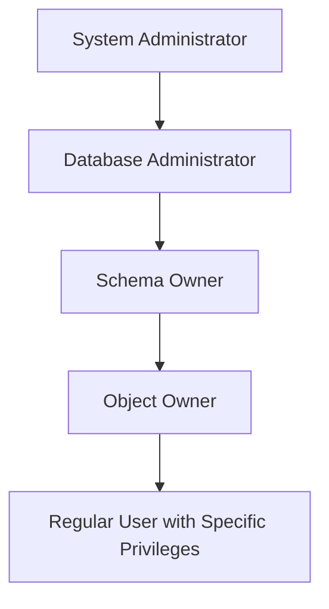

# Authorization Controls

## Introduction

Authorization controls are essential security mechanisms in database administration that determine what actions users can perform on database objects. While authentication verifies who a user is, authorization determines what they're allowed to do once they've been authenticated.

In this guide, we'll explore how database authorization works, examine common implementation approaches, and learn how to configure proper authorization controls to protect your data while enabling legitimate access.

## Core Concepts of Database Authorization

Authorization in database systems revolves around several key concepts:

### Privileges

Privileges are permissions granted to users that allow them to perform specific actions on database objects. Common privileges include:

- `SELECT`: Read data from tables
- `INSERT`: Add new records to tables
- `UPDATE`: Modify existing records
- `DELETE`: Remove records from tables
- `CREATE`: Create new database objects (tables, views, etc.)
- `ALTER`: Modify database object definitions
- `DROP`: Delete database objects
- `EXECUTE`: Run stored procedures or functions

Let's examine how these privileges work in a SQL context:

```sql
-- Grant SELECT privilege on a specific table
GRANT SELECT ON employees TO user_john;

-- Grant multiple privileges
GRANT SELECT, INSERT, UPDATE ON customers TO user_sarah;

-- Revoke a privilege
REVOKE DELETE ON orders FROM user_tom;
```

### Roles

Roles are collections of privileges that can be assigned to users. Instead of assigning individual privileges to each user, administrators can create roles that represent common job functions and assign those roles to users.

```sql
-- Create a new role
CREATE ROLE sales_staff;

-- Assign privileges to the role
GRANT SELECT, INSERT ON customers TO sales_staff;
GRANT SELECT, UPDATE ON products TO sales_staff;

-- Assign the role to users
GRANT sales_staff TO user_emily, user_michael;
```

### Ownership

Database objects typically have an owner who automatically has full privileges on those objects. The owner can grant privileges to other users or roles.

```sql
-- Create a table as the current user (who becomes the owner)
CREATE TABLE project_tasks (
    task_id INT PRIMARY KEY,
    description TEXT,
    due_date DATE,
    assigned_to VARCHAR(50)
);

-- Transfer ownership
ALTER TABLE project_tasks OWNER TO project_manager;
```

## Authorization Models

Different database systems implement authorization controls in various ways, but most fall into one of these models:

### Discretionary Access Control (DAC)

In DAC, the owner of a resource controls access to it and can grant permissions to other users at their discretion.

Most relational database systems like MySQL, PostgreSQL, SQL Server, and Oracle use DAC as their primary authorization model.

### Role-Based Access Control (RBAC)

RBAC assigns permissions to roles rather than directly to users. Users acquire permissions by being assigned to appropriate roles.

```sql
-- Example of RBAC in PostgreSQL
CREATE ROLE readonly;
GRANT SELECT ON ALL TABLES IN SCHEMA public TO readonly;

CREATE ROLE readwrite;
GRANT SELECT, INSERT, UPDATE, DELETE ON ALL TABLES IN SCHEMA public TO readwrite;

-- Assign users to roles
GRANT readonly TO analyst_user;
GRANT readwrite TO developer_user;
```

### Attribute-Based Access Control (ABAC)

ABAC makes authorization decisions based on attributes of the user, the resource, and the environment. This model is more complex but offers finer-grained control.

Some modern database systems support aspects of ABAC through features like row-level security.

```sql
-- Example of row-level security in PostgreSQL
CREATE TABLE customer_data (
    id SERIAL PRIMARY KEY,
    customer_name TEXT,
    region TEXT,
    data TEXT
);

-- Create a policy that only allows users to see data from their assigned region
CREATE POLICY region_access ON customer_data
    USING (region = current_setting('app.user_region'));

-- Enable row-level security
ALTER TABLE customer_data ENABLE ROW LEVEL SECURITY;
```

## Implementing Authorization Controls in Popular Database Systems

Let's look at practical examples of implementing authorization controls in several popular database systems.

### MySQL

```sql
-- Create a new user
CREATE USER 'app_user'@'localhost' IDENTIFIED BY 'secure_password';

-- Grant specific privileges
GRANT SELECT, INSERT ON database_name.table_name TO 'app_user'@'localhost';

-- Create and assign a role (MySQL 8.0+)
CREATE ROLE 'read_only';
GRANT SELECT ON database_name.* TO 'read_only';
GRANT 'read_only' TO 'app_user'@'localhost';
SET DEFAULT ROLE 'read_only' TO 'app_user'@'localhost';
```

### PostgreSQL

```sql
-- Create a user and role
CREATE ROLE app_user WITH LOGIN PASSWORD 'secure_password';
CREATE ROLE reporting;

-- Assign privileges to the role
GRANT SELECT ON ALL TABLES IN SCHEMA public TO reporting;

-- Grant the role to the user
GRANT reporting TO app_user;
```

### SQL Server

```sql
-- Create a login and user
CREATE LOGIN app_login WITH PASSWORD = 'Secure_Password123';
CREATE USER app_user FOR LOGIN app_login;

-- Create a role and add the user
CREATE ROLE data_reader;
ALTER ROLE data_reader ADD MEMBER app_user;

-- Grant permissions to the role
GRANT SELECT ON schema::dbo TO data_reader;
```

## Authorization Hierarchies

Database systems often implement hierarchical privilege structures. For example:



This hierarchy allows for delegation of administrative responsibilities while maintaining control.

## Best Practices for Database Authorization

### 1. Principle of Least Privilege

Grant users only the minimum privileges they need to perform their job functions. This limits potential damage from compromised accounts.

```sql
-- Instead of granting all privileges:
GRANT ALL PRIVILEGES ON database_name.* TO 'user'@'localhost';

-- Grant only what's needed:
GRANT SELECT, INSERT ON database_name.customers TO 'user'@'localhost';
GRANT SELECT ON database_name.products TO 'user'@'localhost';
```

### 2. Use Roles for Scalable Permission Management

Assign privileges to roles rather than directly to users. This makes managing permissions more scalable as your organization grows.

```sql
-- Create roles for common job functions
CREATE ROLE sales_team;
CREATE ROLE marketing_team;
CREATE ROLE it_support;

-- Assign appropriate privileges to each role
GRANT SELECT, INSERT, UPDATE ON sales_data TO sales_team;
GRANT SELECT ON customer_demographics TO marketing_team;
GRANT ALL PRIVILEGES ON *.* TO it_support;

-- Assign roles to users
GRANT sales_team TO 'sales_user1'@'localhost', 'sales_user2'@'localhost';
```

### 3. Regular Privilege Reviews

Periodically review and audit user privileges to ensure they remain appropriate.

```sql
-- MySQL example to review privileges
SELECT * FROM mysql.user WHERE User = 'app_user';
SHOW GRANTS FOR 'app_user'@'localhost';

-- PostgreSQL example
SELECT * FROM information_schema.role_table_grants WHERE grantee = 'app_user';
```

### 4. Object Ownership Management

Carefully manage object ownership, especially in production environments.

```sql
-- Transfer ownership of an object
ALTER TABLE customer_data OWNER TO dba_role;
```

### 5. Implement Row-Level Security When Needed

For fine-grained access control, consider using row-level security features.

```sql
-- PostgreSQL row-level security example
CREATE TABLE financial_data (
    id SERIAL PRIMARY KEY,
    client_id INTEGER,
    financial_info TEXT
);

-- Create policy that only allows users to see their assigned clients
CREATE POLICY client_isolation ON financial_data
    USING (client_id IN (SELECT client_id FROM user_clients WHERE user_id = current_user));

-- Enable row-level security
ALTER TABLE financial_data ENABLE ROW LEVEL SECURITY;
```

## Common Authorization Scenarios and Solutions

### Multi-tenant Database

In a multi-tenant application where multiple clients share the same database:

```sql
-- Create a schema for each tenant
CREATE SCHEMA tenant_a;
CREATE SCHEMA tenant_b;

-- Create identical tables in each schema
CREATE TABLE tenant_a.users (...);
CREATE TABLE tenant_b.users (...);

-- Create application roles with schema-specific access
CREATE ROLE tenant_a_app;
GRANT USAGE ON SCHEMA tenant_a TO tenant_a_app;
GRANT SELECT, INSERT, UPDATE, DELETE ON ALL TABLES IN SCHEMA tenant_a TO tenant_a_app;

CREATE ROLE tenant_b_app;
GRANT USAGE ON SCHEMA tenant_b TO tenant_b_app;
GRANT SELECT, INSERT, UPDATE, DELETE ON ALL TABLES IN SCHEMA tenant_b TO tenant_b_app;
```

### Read-Only Reporting System

For a reporting system that should never modify data:

```sql
-- Create a read-only role
CREATE ROLE reporting_user;

-- Grant SELECT only on necessary tables
GRANT SELECT ON sales_summary TO reporting_user;
GRANT SELECT ON customer_metrics TO reporting_user;

-- Assign the role to report users
GRANT reporting_user TO 'analyst1'@'localhost', 'analyst2'@'localhost';
```

## Auditing Authorization

Monitoring and logging who uses what privileges is crucial for security:

```sql
-- Enable audit logging in MySQL
SET GLOBAL general_log = 'ON';
SET GLOBAL general_log_file = '/var/log/mysql/mysql-general.log';

-- PostgreSQL audit logging with pgAudit extension
CREATE EXTENSION pgaudit;
ALTER SYSTEM SET pgaudit.log = 'write, ddl';
ALTER SYSTEM SET pgaudit.log_catalog = 'on';
```

## Authorization Tools and Management

### Database-Native Tools

Most database systems provide command-line and GUI tools for managing permissions:
- MySQL: MySQL Workbench
- PostgreSQL: pgAdmin
- SQL Server: SQL Server Management Studio (SSMS)
- Oracle: Oracle Enterprise Manager

### Third-Party Tools

Several third-party solutions exist for managing database access:
- Cyral
- Imperva
- IBM Guardium
- Oracle Database Vault

## Summary

Proper authorization controls are critical for database security. In this guide, we've covered:

- The difference between authentication and authorization
- Core concepts like privileges, roles, and ownership
- Different authorization models (DAC, RBAC, ABAC)
- Implementation in popular database systems
- Best practices for secure authorization
- Solutions for common scenarios

By implementing robust authorization controls, you can ensure that users have access to the data they need while protecting sensitive information from unauthorized access.

## Exercises

1. Create a database schema with tables for a simple e-commerce system, then implement roles for different user types (customers, employees, administrators).

2. Implement row-level security in PostgreSQL that restricts users to seeing only data for their department.

3. Audit your existing database's permission structure and identify potential security improvements.

4. Design a role hierarchy for a multi-tenant application that ensures data isolation between tenants.

## Further Reading

- Database-specific documentation:
  - [MySQL Security Guide](https://dev.mysql.com/doc/refman/8.0/en/security.html)
  - [PostgreSQL Access Control](https://www.postgresql.org/docs/current/ddl-priv.html)
  - [SQL Server Security](https://docs.microsoft.com/en-us/sql/relational-databases/security/security-center-for-sql-server-database-engine-and-azure-sql-database)

- Books:
  - "Database Security" by Alfred Basta and Melissa Zgola
  - "SQL Server Security Distilled" by Richard Waymire and Kalen Delaney