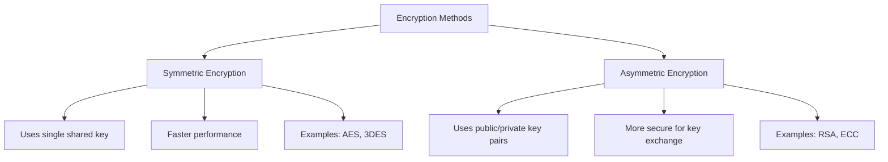
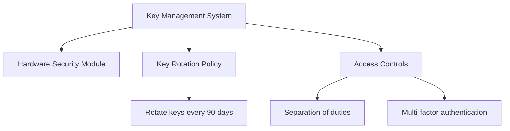

# Encryption Techniques in Database Administration

## Introduction

Data security is a critical concern for any database administrator. One of the most powerful tools in your security arsenal is encryption—the process of converting readable data (plaintext) into an encoded format (ciphertext) that can only be read or processed after it's been decrypted.

In this guide, we'll explore various encryption techniques used in database administration, how they work, and when to implement them. Whether you're storing sensitive customer information, financial data, or intellectual property, understanding these encryption methods will help you protect your data from unauthorized access.

## Why Encrypt Database Data?

Before diving into techniques, let's understand why encryption matters:

- **Confidentiality**: Prevents unauthorized users from reading sensitive data
- **Regulatory compliance**: Helps meet requirements like GDPR, HIPAA, or PCI DSS
- **Data integrity**: Ensures data hasn't been tampered with
- **Breach mitigation**: Minimizes damage if unauthorized access occurs

## Basic Encryption Concepts

### Symmetric vs. Asymmetric Encryption

Database encryption typically uses one of two approaches:



#### Symmetric Encryption

Symmetric encryption uses the same key for both encryption and decryption.

**Advantages**:
- Fast performance
- Efficient for large datasets

**Disadvantages**:
- Key distribution challenges
- If the key is compromised, all data is at risk

**Common algorithms**: AES (Advanced Encryption Standard), 3DES (Triple Data Encryption Standard)

#### Asymmetric Encryption

Asymmetric encryption uses a pair of keys—a public key for encryption and a private key for decryption.

**Advantages**:
- Solves key distribution problems
- Better security for communication

**Disadvantages**:
- Slower than symmetric encryption
- Not practical for large amounts of data

**Common algorithms**: RSA (Rivest-Shamir-Adleman), ECC (Elliptic Curve Cryptography)

### Hashing

While not encryption in the strictest sense, hashing is an important related concept:

- Creates a fixed-length string from input data
- Used for password storage and data integrity
- Cannot be reversed (one-way function)
- Common algorithms: SHA-256, bcrypt, Argon2

## Database Encryption Techniques

### 1. Transparent Data Encryption (TDE)

TDE encrypts database files at the file level, including data files, log files, and backups.

**How it works**:

1. A master key is stored in a secure external location
2. The master key encrypts the database encryption key
3. The database encryption key encrypts the data
4. The entire process is "transparent" to applications

**Code example** (SQL Server implementation):

```sql
-- Create a master key
CREATE MASTER KEY ENCRYPTION BY PASSWORD = 'ComplexPassword123!';

-- Create a certificate protected by the master key
CREATE CERTIFICATE TDECertificate WITH SUBJECT = 'TDE Certificate';

-- Create a database encryption key and protect it using the certificate
USE YourDatabase;
CREATE DATABASE ENCRYPTION KEY
WITH ALGORITHM = AES_256
ENCRYPTION BY SERVER CERTIFICATE TDECertificate;

-- Enable encryption on the database
ALTER DATABASE YourDatabase
SET ENCRYPTION ON;
```

**Advantages**:
- Minimal application changes required
- Protects data at rest
- Automatic encryption/decryption

**Disadvantages**:
- Doesn't protect data in transit or in use
- Performance overhead (typically 3-5%)

### 2. Column-Level Encryption

This approach encrypts specific columns rather than the entire database.

**Example** (Using MySQL AES_ENCRYPT):

```sql
-- Create a table with an encrypted column
CREATE TABLE customers (
    id INT PRIMARY KEY,
    name VARCHAR(100),
    credit_card VARBINARY(255)
);

-- Insert data with encryption
INSERT INTO customers VALUES (
    1, 
    'Jane Doe', 
    AES_ENCRYPT('4111-1111-1111-1111', 'encryption_key')
);

-- Query encrypted data
SELECT id, name, AES_DECRYPT(credit_card, 'encryption_key') 
FROM customers;
```

**Output**:
```
id | name     | AES_DECRYPT(credit_card, 'encryption_key')
-------------------------------------------
1  | Jane Doe | 4111-1111-1111-1111
```

**Advantages**:
- Granular protection for sensitive fields
- Can maintain indexing on non-encrypted columns
- Allows different encryption schemes for different types of data

**Disadvantages**:
- Requires application changes
- May complicate queries and updates
- Can impact indexing on encrypted columns

### 3. Application-Level Encryption

Application-level encryption occurs before data reaches the database.

**Example** (Node.js with crypto module):

```javascript
const crypto = require('crypto');

// Encryption function
function encryptData(text, key) {
  const algorithm = 'aes-256-cbc';
  const iv = crypto.randomBytes(16);
  const cipher = crypto.createCipheriv(algorithm, Buffer.from(key), iv);
  
  let encrypted = cipher.update(text, 'utf8', 'hex');
  encrypted += cipher.final('hex');
  
  // Return IV and encrypted data
  return iv.toString('hex') + ':' + encrypted;
}

// Decryption function
function decryptData(text, key) {
  const algorithm = 'aes-256-cbc';
  const textParts = text.split(':');
  
  const iv = Buffer.from(textParts[0], 'hex');
  const encryptedText = textParts[1];
  
  const decipher = crypto.createDecipheriv(algorithm, Buffer.from(key), iv);
  
  let decrypted = decipher.update(encryptedText, 'hex', 'utf8');
  decrypted += decipher.final('utf8');
  
  return decrypted;
}

// Example usage
const key = crypto.randomBytes(32).toString('hex'); // 256-bit key
const sensitiveData = "customer@example.com";

// Encrypt before storing in database
const encryptedData = encryptData(sensitiveData, key);
console.log('Encrypted:', encryptedData);

// Decrypt after retrieving from database
const decryptedData = decryptData(encryptedData, key);
console.log('Decrypted:', decryptedData);
```

**Output**:
```
Encrypted: 1a2b3c4d...[encrypted string]
Decrypted: customer@example.com
```

**Advantages**:
- Database never sees unencrypted data
- Works with any database system
- More control over encryption process

**Disadvantages**:
- Requires significant application changes
- Key management responsibility falls on application
- Performance impact on application

### 4. Homomorphic Encryption

A newer technique that allows operations on encrypted data without decryption.

**Example concept**:

```javascript
// Simplified pseudo-code to illustrate the concept
// Actual implementation would use specialized libraries

// Regular encryption
let data = 5;
let encryptedData = encrypt(data); // Can't perform operations

// Homomorphic encryption
let homoEncryptedData = homoEncrypt(data);
let homoEncryptedDataPlusOne = homoAdd(homoEncryptedData, 1);

// When decrypted:
// decrypt(homoEncryptedDataPlusOne) == 6
```

**Advantages**:
- Enables computations on encrypted data
- Provides privacy while allowing analysis
- Could revolutionize cloud database security

**Disadvantages**:
- Still emerging technology
- Significant performance overhead
- Limited practical implementations

## Practical Implementation: Database Encryption Strategy

Let's walk through a comprehensive encryption strategy for a fictional healthcare application:

### Step 1: Data Classification

First, classify your data based on sensitivity:

| Data Type | Sensitivity | Encryption Approach |
| --- | --- | --- |
| Patient names | Medium | Column-level encryption |
| Medical records | High | Column-level encryption + access controls |
| Billing information | High | Column-level encryption |
| Appointment dates | Low | No encryption (indexed fields) |
| System logs | Medium | TDE |

### Step 2: Implementation Example

```sql
-- Create a table with different encryption strategies
CREATE TABLE patients (
    id INT PRIMARY KEY,
    name_encrypted VARBINARY(255),           -- Column encrypted
    dob_encrypted VARBINARY(255),            -- Column encrypted
    appointment_date DATETIME,               -- Not encrypted (for indexing)
    medical_record_encrypted VARBINARY(4000) -- Column encrypted
);

-- Insert procedure with encryption
DELIMITER //
CREATE PROCEDURE add_patient(
    p_name VARCHAR(100),
    p_dob DATE,
    p_appointment DATETIME,
    p_medical_record TEXT,
    p_key VARCHAR(100)
)
BEGIN
    INSERT INTO patients VALUES (
        NULL,
        AES_ENCRYPT(p_name, p_key),
        AES_ENCRYPT(p_dob, p_key),
        p_appointment,
        AES_ENCRYPT(p_medical_record, p_key)
    );
END //
DELIMITER ;

-- View procedure with decryption
DELIMITER //
CREATE PROCEDURE view_patient(
    p_id INT,
    p_key VARCHAR(100)
)
BEGIN
    SELECT 
        id,
        AES_DECRYPT(name_encrypted, p_key) AS name,
        AES_DECRYPT(dob_encrypted, p_key) AS dob,
        appointment_date,
        AES_DECRYPT(medical_record_encrypted, p_key) AS medical_record
    FROM patients
    WHERE id = p_id;
END //
DELIMITER ;
```

### Step 3: Key Management

For production systems, implement proper key management:



## Best Practices for Database Encryption

1. **Layer your security**: Encryption is just one part of a defense-in-depth strategy
2. **Use strong algorithms**: Implement AES-256 or similar strong encryption standards
3. **Protect your keys**: Keys must be properly secured and rotated regularly
4. **Performance tuning**: Optimize your encryption strategy based on performance needs
5. **Encrypt backups**: Ensure that database backups are also encrypted
6. **Test thoroughly**: Validate both security and performance impacts
7. **Document your approach**: Maintain clear documentation of your encryption strategy

## Common Mistakes to Avoid

- **Weak keys**: Using predictable or short encryption keys
- **Hard-coded keys**: Embedding keys directly in application code
- **Neglecting key rotation**: Never changing encryption keys
- **Over-encryption**: Encrypting everything, impacting performance unnecessarily
- **Under-encryption**: Not encrypting truly sensitive data
- **Ignoring data in transit**: Focusing only on data at rest

## Summary

Database encryption is an essential tool for protecting sensitive information. By understanding the various encryption techniques available—from TDE to column-level encryption to application-level approaches—you can implement a tailored solution that balances security needs with performance requirements.

Remember that encryption is just one part of a comprehensive security strategy. For maximum protection, combine encryption with proper access controls, network security, regular updates, and security monitoring.

## Exercises

1. Set up a test database with TDE and measure the performance impact
2. Implement column-level encryption for a table with sensitive information
3. Create a key rotation procedure for your encrypted database
4. Design an encryption strategy for a hypothetical financial application
5. Research and compare the encryption options available in different database systems

## Additional Resources

- Database vendor documentation (Oracle, SQL Server, MySQL, PostgreSQL)
- NIST encryption guidelines
- OWASP database security cheat sheet
- Books on cryptography and database security